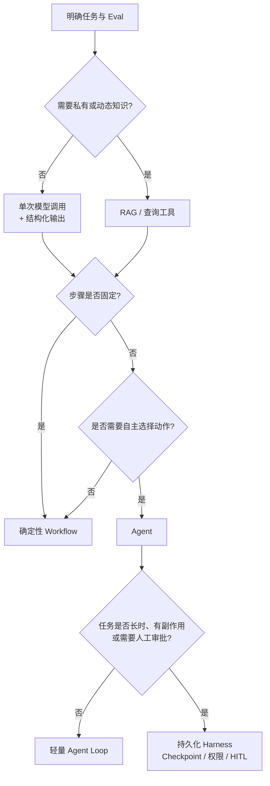
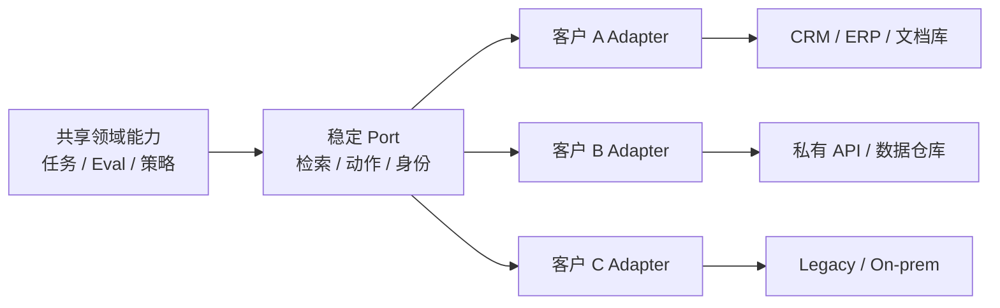
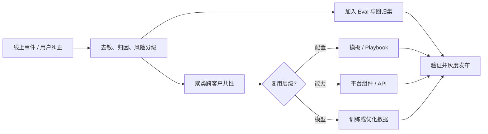

# 第一章：Forward Deployed Engineering：从业务问题到可复用生产系统

## 1.1 FDE 是什么

Forward Deployed Engineer（FDE，前线部署工程师）通常指**直接进入客户或业务现场，并对技术方案从问题定义到生产结果承担端到端责任的工程师**。

这个名称最早因 Palantir 的 Forward Deployed Software Engineer（内部称 Delta）而广为人知。Palantir 曾用一句话区分平台工程与前线部署：

- 平台工程师关注“一个能力服务多个客户”；
- FDE 关注“一个客户需要组合哪些能力”。

OpenAI 等 AI 公司后来沿用了 FDE 名称，但具体职责、组织归属和客户类型并不相同。因此，**FDE 不是具有统一认证和固定职责的行业标准岗位**。本章把它作为一种工程方法来讨论：

> 在高不确定性的真实环境中，用代码、数据和产品判断把通用 AI 能力转化为可验证的业务结果，并把现场经验沉淀回可复用平台。

FDE 的关键不在“离客户近”，而在同时具备三种责任：

1. **结果责任**：成功标准是业务或任务结果，而不是完成一份方案；
2. **工程责任**：必要时直接修改和交付生产代码，而不是只提出建议；
3. **产品化责任**：把一次交付中验证过的模式提炼为平台能力、模板或工具。

## 1.2 FDE 与相邻岗位的区别

岗位名称会因公司而变化。下表描述的是常见重心，不代表所有组织都严格如此。

| 维度 | FDE | 解决方案架构师 | ML Engineer | 产品工程师 |
|---|---|---|---|---|
| 主要目标 | 让特定客户获得可衡量结果 | 设计可行架构并推动采用 | 训练、评估或部署模型能力 | 为一类用户建设通用产品 |
| 主要产物 | 客户环境中的生产系统 | 架构方案、参考实现、集成建议 | 数据/训练流水线、模型与推理系统 | 可复用产品功能和平台 |
| 编码深度 | 通常直接写和维护交付代码 | 因组织而异，常偏设计和验证 | 深入模型与数据工程 | 深入核心产品代码 |
| 客户接触 | 持续嵌入发现、交付和迭代 | 多集中于售前、设计和关键评审 | 通常间接接触 | 通常通过 PM、研究和支持团队获得反馈 |
| 所有权周期 | 从问题定义到稳定生产 | 常在方案确认或交接后减弱 | 模型生命周期 | 产品路线图生命周期 |
| 成功指标 | 业务结果、采用率、生产可靠性和复用率 | 方案被接受、项目推进和平台采用 | 模型质量、效率和稳定性 | 多客户采用、留存和产品指标 |

真正的区别不是“谁更懂技术”，而是**默认优化目标不同**：

- FDE 优先缩短特定场景从问题到结果的距离；
- 解决方案架构师优先保证整体方案正确、可集成；
- ML Engineer 优先提高模型和数据系统的能力边界；
- 产品工程师优先建设可以被多个客户稳定复用的能力。

成熟团队不会让这些岗位互相替代。FDE 发现并验证模式，产品与平台团队决定哪些模式进入主干产品；ML Engineer 解决模型或数据瓶颈；解决方案架构师维护跨系统架构与长期演进边界。

## 1.3 需求发现与问题建模

FDE 最危险的起点是客户已经给出了方案，例如“我们需要一个多 Agent 平台”。这只是方案假设，不是问题定义。

### 1.3.1 从业务目标还原任务

需求发现应至少回答六个问题：

| 问题 | 需要获得的证据 |
|---|---|
| 谁在什么流程中遇到问题 | 用户访谈、流程观察、工单和操作日志 |
| 当前流程为什么失败或昂贵 | 基线耗时、错误率、人力成本和等待时间 |
| AI 需要完成哪个可观察任务 | 输入、输出、允许动作和停止条件 |
| 哪些错误不可接受 | 风险分级、人工复核和回滚要求 |
| 系统受哪些现实约束 | 数据权限、时延、成本、部署位置和法规 |
| 价值如何被确认 | 业务 KPI、任务指标和采用指标 |

问题陈述可以统一成：

> 对于某类用户，在给定输入、权限和时间预算内，系统需要完成某项可观察任务，使某个业务指标从基线改善到目标，同时把特定高风险错误控制在阈值内。

### 1.3.2 建立现状基线

没有基线就无法证明 AI 创造了价值。PoC 之前至少记录：

- 人工流程的完成时间、返工率和一致性；
- 现有自动化规则的准确率、覆盖率和维护成本；
- 典型样本、边界样本与历史事故；
- 不同用户群和业务环境之间的分布差异。

Palantir 所称的 technical decomposition，本质上就是把高层业务问题持续拆解到数据、决策、动作和代码边界。拆解的终点不是“调用一个模型”，而是可以被测量和验收的系统行为。

## 1.4 用 Eval 定义验收标准

FDE 应在大规模实现之前与领域专家共同建立 Eval。Eval 不是项目完成后的展示报表，而是需求合同的可执行版本。

### 1.4.1 四层验收指标

| 层次 | 示例 | 作用 |
|---|---|---|
| 任务质量 | 正确率、召回率、引用准确性、工具调用成功率 | 判断系统是否完成任务 |
| 风险约束 | 越权操作率、敏感数据泄漏率、高风险漏检率 | 定义不能被平均分掩盖的底线 |
| 系统性能 | P95 时延、可用性、单任务成本 | 判断能否进入真实工作流 |
| 业务结果 | 处理时间、采用率、返工率、转化率 | 判断是否值得继续投入 |

一次发布只有同时满足质量、风险、性能和价值门槛才应通过。可以抽象为：

$$
A =
\mathbb{1}[Q \ge Q_{\min}]
\cdot
\mathbb{1}[R \le R_{\max}]
\cdot
\mathbb{1}[L \le L_{\max}]
\cdot
\mathbb{1}[C \le C_{\max}]
$$

其中 $Q$ 是任务质量，$R$ 是风险指标，$L$ 是时延，$C$ 是成本。只有 $A=1$ 时验收通过。实际系统还应按高风险场景设置硬门禁，而不是简单求平均分。

### 1.4.2 Eval 数据集来自现场

Eval 集应包括：

1. 高频正常任务；
2. 价值最高的关键任务；
3. 历史错误和事故样本；
4. 权限、注入、模糊输入等对抗样本；
5. 新用户、新地区和新数据源导致的分布变化。

数据集必须持续扩充。上线后出现的新边界条件应进入回归集，形成“现场事件 → 标注样本 → 回归测试 → 发布门禁”的闭环。通用方法详见 [AI Engineering 第七章](../../engineering/04-evaluation-observability/07-offline-eval-eval-driven-development.md)。

## 1.5 Agent、RAG 与 Harness 方案选型

FDE 的目标不是使用最多的 AI 组件，而是选择**满足验收条件的最小系统**。

| 方案 | 适用条件 | 不应使用的信号 |
|---|---|---|
| 单次模型调用 | 输入输出明确，知识可放入上下文 | 为展示“智能”而增加循环 |
| RAG | 答案依赖私有、动态或可引用知识 | 问题其实是权限或数据质量不足 |
| Workflow | 步骤和分支可以预先定义 | 强行让 Agent 重新发现固定流程 |
| Agent | 子任务和工具选择无法完全预定义 | 错误代价高但没有审批与回滚 |
| Durable Harness | 长任务、有副作用、需恢复/审批/审计 | 短请求却引入复杂状态基础设施 |

先做单次调用或 Workflow 基线，再证明 Agent 的额外质量收益足以覆盖时延、成本和风险。Harness 不是 Agent 框架的同义词，其运行时边界详见 [Agent Harness 第十六章](../../agent/02-runtime-harness/16-harness-definition-and-boundaries.md)。

## 1.6 客户数据、权限和既有系统集成

真实交付中，模型通常不是最困难的部分。难点往往是数据含义不一致、权限无法传递、旧系统缺乏稳定接口，以及生产责任边界不清晰。

### 1.6.1 数据先治理，再进入模型

FDE 需要明确：

- 数据由谁控制，供应商和模型提供方分别扮演什么角色；
- 哪些字段可以进入模型上下文，保留多长时间；
- 数据是否跨区域、跨租户或用于训练；
- 删除、更正、审计和事故响应如何执行；
- 检索结果是否继承原始对象的访问控制。

“拿到 API Key 就算完成集成”是典型错误。身份应从用户、Agent、工具一直传播到目标资源，授权在数据与动作执行点再次校验。MCP/A2A 等协议层风险见 [Tool Protocol 安全](../../tools/02-mcp/15-tool-protocol-security.md)，跨系统身份治理见 [AI 安全第七章](../../safety/04-agent-execution-isolation/07-agent-tool-mcp-a2a-least-privilege-identity.md)。

### 1.6.2 用适配层隔离客户差异

共享核心只依赖稳定契约，客户特有字段、认证、网络和旧系统行为收敛在 Adapter 中。这样既能快速适配现场，又不会把客户差异散落进核心业务逻辑。

## 1.7 从 PoC 到生产的交付过程

PoC 证明“某些样本上可以工作”；生产系统必须证明“在权限、规模、异常和持续变化下仍可运营”。

| 阶段 | 核心产物 | 退出条件 |
|---|---|---|
| Discover | 问题陈述、现状基线、风险清单 | 业务负责人和一线用户确认问题值得解决 |
| Prototype | 最小方案、初始 Eval、失败案例 | 在代表性样本上超过基线 |
| Pilot | 真实用户、影子流量、人工复核 | 达到质量和风险门槛，确认实际采用 |
| Production | SLO、观测、回滚、权限和运行手册 | 值班团队能够独立运营 |
| Scale | 模板化部署、容量和成本模型 | 新客户/业务线无需复制整套代码 |

从 Pilot 进入 Production 前必须补齐：

- 数据和权限评审；
- 离线回归与在线观测；
- 限流、超时、重试、回退和人工接管；
- Prompt、模型、数据和 Eval 版本绑定；
- 灰度发布、回滚和事故响应；
- 明确客户、FDE、平台团队和供应商的责任边界。

生产化方法详见 [AI Engineering](../../engineering/README.md)。FDE 不应长期成为人工运维代理；交付完成的标志之一，是客户和平台团队能够通过文档、自动化和观测独立运营系统。

## 1.8 现场反馈如何进入数据飞轮

现场反馈只有经过结构化处理才能成为产品和模型改进信号。

每条反馈至少应带有：

- 场景、输入分布和客户环境；
- 期望行为、实际行为与业务影响；
- 根因分类：模型、检索、工具、权限、数据还是流程；
- 是否可跨客户复现；
- 对应的 Eval、修复版本与发布结果。

OpenAI 将这一循环概括为 **build → prove → generalize**：在现场构建，用结果证明，再沉淀成产品能力。Palantir 的前线部署实践同样强调让团队共享已经配置和验证过的工作流，从更成熟的基线开始下一次交付。

## 1.9 避免“一客一套、无法复用”

FDE 模式的结构性风险是：短期为了交付速度不断加入客户特例，最终形成没有人敢升级的定制系统。

### 1.9.1 建立复用阶梯

现场成果应被归入明确层级：

| 层级 | 适合内容 | 管理方式 |
|---|---|---|
| 客户配置 | 字段映射、阈值、品牌文案 | 配置文件和管理界面 |
| Adapter | 客户系统 API、身份和数据转换 | 独立包、稳定接口、契约测试 |
| 模板/Playbook | 可重复的行业流程和 Eval | 版本化模板，可按客户参数化 |
| 平台能力 | 多客户重复出现的基础能力 | 产品团队接管，进入主干路线图 |
| 临时特例 | 尚未验证的单客户需求 | 标明到期时间和移除条件 |

可以持续观察复用率：

$$
U = \frac{H_r}{H_t}
$$

其中 $H_r$ 是交付中用于复用组件和配置的工程时间，$H_t$ 是总工程时间。这个指标不应追求机械地达到 100%，但如果随着交付次数增加仍长期不升，说明团队没有形成产品化飞轮。

### 1.9.2 设立产品化门槛

满足以下条件时，现场能力才应进入共享平台：

1. 至少在多个独立场景中重复出现；
2. 需求差异可以通过稳定参数或 Adapter 表达；
3. 已有跨客户 Eval 和兼容性测试；
4. 有明确的平台 owner、版本策略和弃用机制；
5. 不会把某个客户的数据或业务规则泄漏到共享层。

FDE 与产品团队需要定期评审现场模式，而不是让 FDE 直接把所有客户代码合入核心产品。详见 [框架锁定与可移植架构](../../frameworks/06-selection-portability/23-lockin-and-portable-architecture.md)。

## 1.10 大公司与一线工程师的真实实践

公开案例天然存在选择性披露：公司倾向于发布成功项目，个人分享也可能服务于招聘。这里仅采用能够访问原文、确认发布方的材料；厂商自报的目标和收益仍按自报数据处理，不能直接当作行业基准。

### 1.10.1 Palantir：价值不只来自模型，而来自受治理的执行系统

Palantir 产品安全团队公开介绍了内部的 Security Forge：团队用一年以上时间，将多 Agent 安全分析与 AIP 编排、Foundry/Ontology 的组织上下文以及 Apollo 发布流程连接起来，随后把内部能力产品化。

从工程实现看，Security Forge 暴露了三个容易被模型能力掩盖的问题：

- **Agent 必须运行在有边界的 Harness 中。** 代码访问、任务范围、证据保留和结果流转都由系统控制，不能只依赖 Prompt；
- **组织上下文需要治理。** 代码、资产、历史决策和数据血缘决定了发现是否可操作，同时必须满足数据主权要求；
- **瓶颈会迁移。** 当 Agent 能快速发现大量问题后，修复、验证和发布反而成为新瓶颈，因此检测流水线必须接入正常的工程工作流。

Palantir 给出的实践顺序是：资产盘点 → 有界任务 → 受控 Harness → 多模型/多次运行评测 → 保留证据与决策血缘 → 接入修复、发布和回滚。成功指标应是**经过验证的风险降低**，而不是生成了多少条发现。这段内容是 Palantir 对自有产品的官方工程叙述，没有公开可独立验证的效率数字，能确认的是这三个工程判断本身，不是量化收益。

### 1.10.2 Anthropic、Descript 与 Bolt：Eval 必须随产品成熟

Anthropic 在 Agent Eval 实践文章中总结了两个客户案例：

| 团队 | 实际做法 | 可复用经验 |
|---|---|---|
| Descript | 将视频编辑 Agent 拆成“不破坏已有内容、完成用户要求、完成质量足够好”三个维度；从人工评分逐步发展到 LLM Grader，并保留周期性人工校准 | 先让产品和领域专家定义“好”的含义，再自动化评分；质量评测与回归保护应分开 |
| Bolt | 产品已有真实用户后，用三个月建立 Eval 系统；结合静态分析、浏览器 Agent 和 LLM Judge 验证生成应用 | 不同失败类型需要不同 Grader；能用确定性检查的地方不要只依赖 LLM Judge |

Anthropic 进一步区分：

- **能力 Eval**：初始通过率可以较低，用于寻找系统还能提升多少；
- **回归 Eval**：通过率应接近稳定上限，用于阻止已经解决的问题重新出现。

当某项能力成熟后，其代表性样本应从能力 Eval “毕业”进入回归集。这比维护一个不断膨胀、目标混杂的总分更容易定位退化。这两个案例由 Anthropic 官方转述，Descript 和 Bolt 并未联合署名；文中“三个月”只是 Bolt 这一个项目的周期，不能当作建立 Eval 系统的通用工期估算。

### 1.10.3 Microsoft：不要让专家评价长篇输出，要让专家核验原子事实

Microsoft 工程师分享过一个客户现场案例：团队用 Agent 为约 150 个 COBOL 模块中的一个生成逆向分析文档。最初把约 2,500 字输出直接交给领域专家并询问“是否符合预期”，得到的反馈只有“看起来不错”。

问题不在专家不负责，而在评审任务不可执行：长篇文本混合了大量正确、错误和无法确认的陈述，专家很难给出稳定标签。

改进方式是：

1. 从输出中提取离散的业务规则和事实声明；
2. 每条声明只表达一个可证伪判断；
3. 让专家逐条确认、纠正或标记证据不足；
4. 把确认结果写入 Eval，而不是只保留评审意见；
5. 用同一批原子检查比较不同模型、Prompt 和 Harness 版本。

检查必须产出明确结果，否则无法进入 Eval。FDE 应负责把专家隐性的判断过程转成可执行验收，而不是持续消耗专家阅读模型长文。这段经验来自 Microsoft 工程师的第一人称记述，客户方始终匿名，具体准确率提升等项目细节无法独立核实，能借鉴的是评审方法，而不是它暗示的效果。

### 1.10.4 OpenAI：Build、Prove、Generalize

OpenAI Deployment Company 将现场循环概括为 **build → prove → generalize**：

1. **Build**：围绕真实工作流构建可以使用的系统，而不是孤立 Demo；
2. **Prove**：通过 Eval、业务指标和生产行为证明价值；
3. **Generalize**：把重复模式沉淀为 SDK、评测工具、可靠性组件和产品能力。

OpenAI 的 FDE 职位描述也把职责写成：映射客户问题、组织交付、必要时直接写代码，并把可复用模式和现场信号反馈给 Product 与 Research。

这说明“把项目做完”和“完成 FDE 闭环”并不相同。如果经验没有进入平台、Eval 或产品路线图，现场交付仍然是一次性工程。这套说法来自 OpenAI 对自身部署组织的公开定位，没有配套公布跨项目复用率或第三方对照数据，读作团队的目标设定比读作已验证效果更合适。

### 1.10.5 Baseten：让 FDE 留在 Engineering，并跟踪产品回流

Baseten 在官方博客和 X 账号中公开了其 FDE 团队设计：

- FDE 放在 Engineering，而不是 GTM，目的是保留技术深度、代码所有权和工程自主性；
- 招聘优先考察软件工程基础和跨栈能力，ML 领域知识与客户沟通方式可以在工作中补齐；
- 尽量移除会议协调等非工程负担，让 FDE 保持构建能力；
- 将“FDE 构建内容有多少进入核心产品”作为 North Star。

Baseten 给出的目标是 **70% 的 FDE 工作最终进入产品**，但这是团队自报的目标，不是审计后的实际达成率，发布这篇文章的同时也在招人。这个数字能证明的是“复用率需要被显式管理”，不能被机械复制为行业基准——不同公司所处阶段、产品成熟度和客户集中度不同，合理比例也会不同。

更通用的做法是同时记录：

- 现场代码进入共享产品、Adapter 或模板的比例；
- 重复问题从首次发现到平台解决的时间；
- 后续项目复用已有能力节省的交付时间；
- 临时特例的数量、生命周期和移除率。

### 1.10.6 AWS 与 INRIX：先对齐多角色工作流，再组合 RAG 和生成模型

AWS 与 INRIX 工程师共同撰写的案例介绍了交通规划 PoC：系统使用 RAG 生成规划建议，并使用图像生成模型展示道路安全改造的概念效果。

该案例首先描述原流程涉及交通工程、城市规划、景观设计、CAD、安全分析和公共工程等多类角色，需要多轮评审，而不是从“应该使用哪个模型”开始。可复用经验包括：

1. 先画清跨角色工作流和审批节点；
2. 文本建议与视觉概念图解决的是不同子任务，应分别建立 Eval；
3. 生成结果用于加速讨论，不等于替代工程验证和正式设计；
4. 让客户工程师共同撰写案例，有助于暴露实际流程，而不只是供应商视角。

文章称设计周期“可能从数周降到数天”，但使用的是潜在效果表述，没有公开对照实验。因此它适合作为方案模式参考，不应作为已证实 ROI。

### 1.10.7 X 上的一线实践：Audit → Evals → Deployment

Varick Agents 从业者 [@vasuman](https://x.com/vasuman) 在一篇可直接访问的 [X 长文](https://x.com/vasuman/article/2057177266984226892) 中给出三阶段方法：

**Audit**

- 进入一线团队观察真实流程，而不是只访谈管理者；
- 将候选任务分为确定性代码、适合 Agent 的任务，以及仍应保留人工判断的任务；
- 先确认任务频率和价值，避免自动化一个几乎不会发生的流程。

**Evals**

- 追踪专家完成任务的真实步骤；
- 建立小规模、高质量的 Golden Set；
- 不只评价最终答案，还评价检索、决策、工具调用等关键 checkpoint。

**Deployment**

- 优先通过 API 适配既有数据层，避免为了 AI 项目先进行大规模数据迁移；
- 在客户环境内建立受控沙箱；
- 从最小自治单元开始，例如先让 Agent 调查问题并起草工单，再逐步开放写代码或提交 PR。

这套做法把确定性步骤留给代码，只把需要判断的步骤交给模型，并根据 Eval 证据逐级开放自治权限。这是具名从业者的第一人称 X 内容，Varick 官方招聘页面确认了该公司确实有前线部署岗位，但具体项目和成效没有量化数据支撑，文章末尾还带着招聘宣传，因此只能作为从业者观点参考。

### 1.10.8 从案例中提炼的 Best Practices

| Best Practice | 真实案例信号 | 落地动作 |
|---|---|---|
| 从工作流而不是模型开始 | Microsoft、AWS/INRIX、X 从业者 | 现场观察用户、画出现状流程、记录基线和审批点 |
| 把专家判断变成原子 Eval | Microsoft、Descript | 提取可证伪声明，逐项确认并沉淀为回归数据 |
| 分离能力 Eval 和回归 Eval | Anthropic、Bolt | 新能力用低通过率数据找提升空间，成熟样本进入高通过率回归集 |
| 选择最小自治单元 | X 从业者、Anthropic | 先只读、建议或草稿，再按 Eval 证据开放写入和执行 |
| 把 Agent 放进受治理 Harness | Palantir | 限定上下文、工具、权限和证据链，并接入发布与回滚 |
| 显式衡量产品回流 | Baseten、OpenAI | 跟踪复用率、平台化周期、临时代码数量和后续交付节省 |
| 预期瓶颈迁移 | Palantir | 自动化检测后同步扩展验证、修复和运营能力 |
| 对厂商 ROI 数字保持克制 | AWS/INRIX、Baseten | 区分目标、潜在效果和实测结果，保留基线与对照 |

## 1.11 常见错误

- **把客户给出的方案当成需求。** “做一个 Agent”不等于已经定义问题，应先建立任务、基线和验收标准。
- **把 FDE 当成高级售前。** 如果没有生产代码和结果所有权，就缺少 Forward Deployed Engineering 的关键闭环。
- **先做 Demo，最后才补 Eval。** 没有初始 Eval，团队只能凭演示效果争论，无法判断改动是否退化。
- **默认选择最复杂的 Agent 架构。** 应从最小可行方案开始，用 Eval 证明复杂度的收益。
- **将管理员 Token 交给 Agent。** 身份和权限必须沿调用链传播，并在数据与动作边界重新校验。
- **把 PoC 指标直接当生产指标。** 生产验收还包括时延、成本、SLO、安全、采用率与可运营性。
- **所有现场需求都进入核心产品。** 未经跨客户验证的特例会把平台变成难以升级的定制代码集合。
- **交付后 FDE 永久承担运维。** 应通过自动化、文档和责任移交让系统由正式运行团队接管。

## 1.12 本章总结

1. FDE 是一种贴近现场、对生产结果负责的工程模式，但不是统一标准岗位；
2. 需求发现应从业务基线、真实任务、失败代价和环境约束出发；
3. Eval 是可执行的验收合同，需要同时覆盖质量、风险、性能和业务价值；
4. Agent、RAG 与 Harness 不是默认答案，应选择满足 Eval 的最小系统；
5. 数据、身份、权限和旧系统集成通常比模型调用更决定项目成败；
6. PoC 到生产需要补齐运营、安全、发布、回滚和责任边界；
7. 现场反馈必须转化成回归数据、模板、平台能力或模型改进；
8. 通过 Adapter、模板、产品化门槛和明确 owner，避免陷入“一客一套”。

## 1.13 一手参考资料

- [Palantir：Dev versus Delta——工程角色的区别](https://medium.com/palantir/dev-versus-delta-demystifying-engineering-roles-at-palantir-ad44c2a6e87)
- [Palantir：A Day in the Life of a Forward Deployed Software Engineer](https://medium.com/palantir/a-day-in-the-life-of-a-palantir-forward-deployed-software-engineer-45ef2de257b1)
- [Palantir：Purpose-Based Access Controls](https://www.palantir.com/purpose-based-access-controls/)
- [Palantir Ontology](https://www.palantir.com/platforms/ontology/)
- [OpenAI Deployment Company：Build, Prove, Generalize](https://deploy.co/)
- [OpenAI：Forward Deployed Engineer, Gov](https://jobs.ashbyhq.com/openai/db5a708d-1d7a-4aa3-8dd3-0d0423b6b69f)
- [OpenAI：Evaluation best practices](https://platform.openai.com/docs/guides/evaluation-best-practices)
- [OpenAI：Production best practices](https://platform.openai.com/docs/guides/production-best-practices)
- [OpenAI：Data controls](https://platform.openai.com/docs/guides/your-data)
- [Anthropic：Building Effective AI Agents](https://www.anthropic.com/engineering/building-effective-agents)
- [Palantir：Securing Software at the Speed of AI（官方工程案例，2026）](https://blog.palantir.com/securing-software-at-the-speed-of-ai-0b1d7ddd2bf0)
- [Anthropic：Demystifying evals for AI agents（官方工程文章）](https://www.anthropic.com/engineering/demystifying-evals-for-ai-agents)
- [Microsoft：Only Believe What You Can Validate（客户现场工程分享，2026）](https://devblogs.microsoft.com/all-things-azure/only-believe-what-you-can-validate/)
- [Baseten：Forward Deployed Engineering on the Frontier of AI（官方团队实践，2025）](https://www.baseten.co/blog/forward-deployed-engineering/)
- [Baseten 官方 X：FDE 实践文章发布](https://x.com/baseten/status/1932549196126593527)
- [AWS 与 INRIX：交通规划 PoC 实践（客户与厂商共同撰写，2025）](https://aws.amazon.com/blogs/machine-learning/how-inrix-accelerates-transportation-planning-with-amazon-bedrock/)
- [@vasuman：Forward Deployed Engineering 101（X 一线从业者长文）](https://x.com/vasuman/article/2057177266984226892)

返回 [FDE 模块目录](README.md)。
