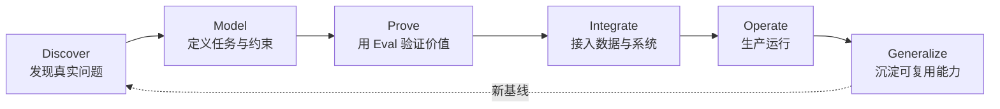
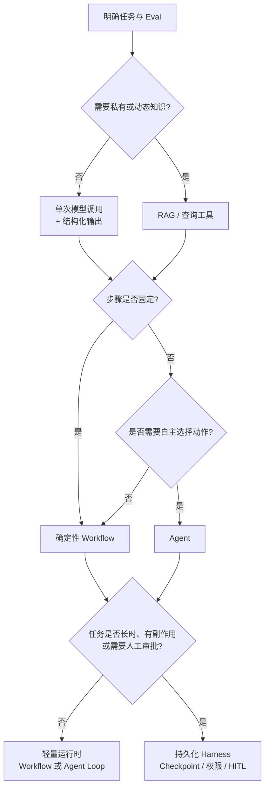
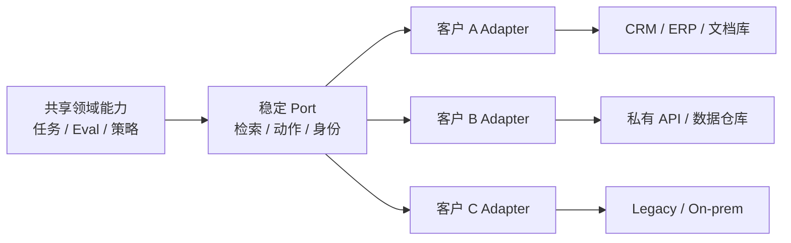
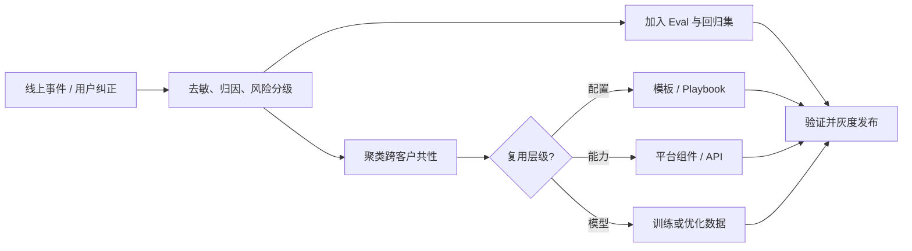
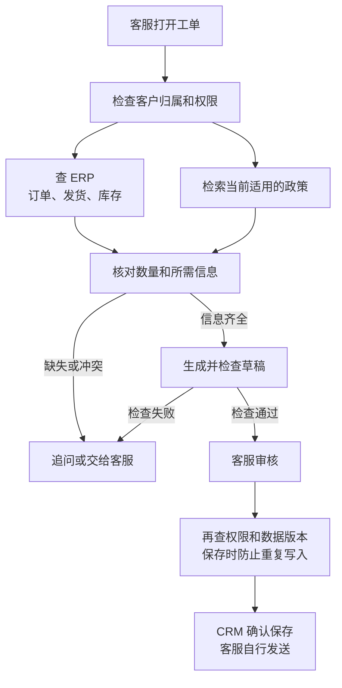

# 第一章：Forward Deployed Engineering：从业务问题到可复用生产系统

客户说“想做一个 AI 助手”，往往还没想清楚要让它接手哪部分工作。工程师需要先看看用户每天怎么做事，再决定哪些地方值得改、怎么接进现有系统，以及出了错由谁处理。这是本章讨论 FDE 的起点。

前半章介绍工作方法，1.10 节看公开的一线分享，1.11 节用订单异常助手把整个过程串起来。

## 1.1 FDE 是什么

Forward Deployed Engineer（FDE，前线部署工程师）通常会直接和客户一起工作：弄清需求，写代码接入客户系统，参与上线，并跟进系统是否真的解决了问题。

Palantir 的 Forward Deployed Software Engineer 是这一岗位的代表。理解它和平台工程的分工，可以先看各自经常面对的问题：

- 平台工程师关注“一个能力服务多个客户”；
- FDE 关注“一个客户需要组合哪些能力”。

OpenAI 等 AI 公司也有 FDE，但组织归属和职责并不完全相同。看招聘信息时，尤其要确认是否需要写生产代码、上线后负责到什么程度、现场需求怎样进入产品开发。

FDE 做完一个项目，还要回答另一个问题：下次遇到类似客户，哪些东西可以直接用，哪些必须重做？



FDE 的关键不在“离客户近”，而在同时具备三种责任：

1. **结果责任**：成功标准是业务或任务结果，而不是完成一份方案；
2. **工程责任**：必要时直接修改和交付生产代码，而不是只提出建议；
3. **产品化责任**：把一次交付中验证过的模式提炼为平台能力、模板或工具。

## 1.2 FDE 与相邻岗位的区别

岗位名称会因公司而变化。下表描述的是常见重心，不代表所有组织都严格如此。

| 维度 | FDE | 解决方案架构师 | ML Engineer | 产品工程师 |
|---|---|---|---|---|
| 主要目标 | 让特定客户获得可衡量结果 | 设计可行架构并推动采用 | 训练、评估或部署模型能力 | 为一类用户建设通用产品 |
| 主要产物 | 客户环境中的生产系统 | 架构方案、参考实现、集成建议 | 数据/训练流水线、模型与推理系统 | 可复用产品功能和平台 |
| 编码深度 | 通常直接写和维护交付代码 | 因组织而异，常偏设计和验证 | 深入模型与数据工程 | 深入核心产品代码 |
| 客户接触 | 持续嵌入发现、交付和迭代 | 多集中于售前、设计和关键评审 | 通常间接接触 | 通常通过 PM、研究和支持团队获得反馈 |
| 所有权周期 | 从问题定义到稳定生产 | 常在方案确认或交接后减弱 | 模型生命周期 | 产品路线图生命周期 |
| 成功指标 | 业务结果、采用率、生产可靠性和复用率 | 方案被接受、项目推进和平台采用 | 模型质量、效率和稳定性 | 多客户采用、留存和产品指标 |

真正的区别不是“谁更懂技术”，而是**默认优化目标不同**：

- FDE 优先缩短特定场景从问题到结果的距离；
- 解决方案架构师优先保证整体方案正确、可集成；
- ML Engineer 优先提高模型和数据系统的能力边界；
- 产品工程师优先建设可以被多个客户稳定复用的能力。

成熟团队不会让这些岗位互相替代。FDE 发现并验证模式，产品与平台团队决定哪些模式进入主干产品；ML Engineer 解决模型或数据瓶颈；解决方案架构师维护跨系统架构与长期演进边界。

谈岗位匹配时，不必贬低售前或咨询来证明自己是 FDE。更有用的是确认这个岗位是否写生产代码、谁负责上线后的事故、客户需求如何进入产品路线图。有些团队远程交付，有些长期驻场；是否天天在客户办公室，不是工程所有权的替代指标。

## 1.3 需求发现与问题建模

FDE 最危险的起点是客户已经给出了方案，例如“我们需要一个多 Agent 平台”。这只是方案假设，不是问题定义。

### 1.3.1 从业务目标还原任务

需求发现应至少回答六个问题：

| 问题 | 需要获得的证据 |
|---|---|
| 谁在什么流程中遇到问题 | 用户访谈、流程观察、工单和操作日志 |
| 当前流程为什么失败或昂贵 | 基线耗时、错误率、人力成本和等待时间 |
| AI 需要完成哪个可观察任务 | 输入、输出、允许动作和停止条件 |
| 哪些错误不可接受 | 风险分级、人工复核和回滚要求 |
| 系统受哪些现实约束 | 数据权限、时延、成本、部署位置和法规 |
| 价值如何被确认 | 业务 KPI、任务指标和采用指标 |

需求讨论最后应该落到一个具体任务上。例如：

> 客服打开催单工单后，系统查清未发货的数量和原因，给出带来源的回复草稿；交期没有确认就不作承诺，邮件仍由客服审核发送。

### 1.3.2 建立现状基线

没有基线就无法证明 AI 创造了价值。PoC 之前至少记录：

- 人工流程的完成时间、返工率和一致性；
- 现有自动化规则的准确率、覆盖率和维护成本；
- 典型样本、边界样本与历史事故；
- 不同用户群和业务环境之间的分布差异。

技术拆解（technical decomposition）要一直走到数据、决策、动作和代码边界。比如“减少催单”还不是一个可交付任务；“让客服核对缺货原因并起草有证据的回复”才有明确输入、输出和停止条件。拆解的终点不是“调用一个模型”，而是可以被测量和验收的系统行为。

## 1.4 用 Eval 定义验收标准

动手做系统前，先请业务专家拿几条实际任务说清楚：什么回答能用，什么回答必须退回。把这些判断写成测试，就是项目最初的 Eval。

### 1.4.1 四层验收指标

| 层次 | 示例 | 作用 |
|---|---|---|
| 任务质量 | 正确率、召回率、引用准确性、工具调用成功率 | 判断系统是否完成任务 |
| 风险约束 | 越权操作率、敏感数据泄漏率、高风险漏检率 | 定义不能被平均分掩盖的底线 |
| 系统性能 | P95 时延、可用性、单任务成本 | 判断能否进入真实工作流 |
| 业务结果 | 处理时间、采用率、返工率、转化率 | 判断是否值得继续投入 |

验收不是把这些指标加权成一个总分。低成本不能抵消越权，平均正确率也不能掩盖错误承诺交期。离线阶段先判定任务质量、风险和性能是否允许试点；生产发布还要补上真实采用、业务价值和运营证据。不要在 PoC 阶段声称已经证明了最后一层。

### 1.4.2 Eval 数据集来自现场

Eval 集应包括：

1. 高频正常任务；
2. 价值最高的关键任务；
3. 历史错误和事故样本；
4. 权限、注入、模糊输入等对抗样本；
5. 新用户、新地区和新数据源导致的分布变化。

数据集必须持续扩充。上线后出现的新边界条件应进入回归集，形成“现场事件 → 标注样本 → 回归测试 → 发布门禁”的闭环。通用方法详见 [AI Engineering 第七章](../../engineering/04-evaluation-observability/07-offline-eval-eval-driven-development.md)。

还要留一份没有用于改 Prompt 的验收集。按客户、订单或时间划分，避免同一工单的改写同时出现在开发集和验收集；记录样本版本、分母、排除条件以及多次运行的波动。业务事实用源系统快照核对，副作用看最终系统状态，表达质量才交给经过人工校准的 Judge。一次“零越权”只说明这一批样本未出现越权，不代表风险为零。

这里的 Eval 指工程方法，不是某个供应商产品名。截至核对日，OpenAI [退役公告](https://developers.openai.com/api/docs/deprecations#2026-06-03-evals-platform)已宣布其 Evals 平台将在 2026-10-31 转为只读，并计划于 2026-11-30 关闭仪表盘和 API。引用旧的评测指南时，可以沿用设计原则，但新项目不应不加判断地照搬其中的托管平台操作。把测试输入、Grader 和结果格式留在自己可导出的资产里。

## 1.5 Agent、RAG 与 Harness 方案选型

FDE 的目标不是使用最多的 AI 组件，而是选择**满足验收条件的最小系统**。



| 方案 | 适用条件 | 不应使用的信号 |
|---|---|---|
| 单次模型调用 | 输入输出明确，知识可放入上下文 | 为展示“智能”而增加循环 |
| RAG | 答案依赖私有、动态或可引用知识 | 问题其实是权限或数据质量不足 |
| Workflow | 步骤和分支可以预先定义 | 强行让 Agent 重新发现固定流程 |
| Agent | 子任务和工具选择无法完全预定义 | 错误代价高但没有审批与回滚 |
| Durable Harness | 长任务、有副作用、需恢复/审批/审计 | 短请求却引入复杂状态基础设施 |

先做规则、单次调用或 Workflow 基线，再证明 Agent 的额外质量收益足以覆盖时延、成本和风险。库存、余额和订单状态应查实时业务接口，不宜当作静态文档切块后等待索引更新。RAG 用来找证据，Agent 用来动态选步骤，两者并不互斥。

图中的持久化判断也适用于固定 Workflow：只要有跨天审批或业务写入，就可能需要状态存储、幂等和恢复；反过来，短请求也必须有鉴权、超时和审计。Harness 不是 Agent 框架的同义词，其运行时边界详见 [Agent Harness 第十六章](../../agent/02-runtime-harness/16-harness-definition-and-boundaries.md)。

不要把早期博客里的工具清单当成今天的采购建议。Anthropic 的 [Building Effective Agents](https://www.anthropic.com/engineering/building-effective-agents) 已提醒读者工具环境发生变化，并指向 [Managed Agents 工程文章](https://www.anthropic.com/engineering/managed-agents)。后者将会话记录、Harness 与执行沙箱分离；可以借鉴这种故障和凭据边界，但是否采用托管服务仍要看客户的网络、数据留存、成本和迁移要求。

## 1.6 客户数据、权限和既有系统集成

接客户系统时，经常先卡在模型之外：同一个字段在两个部门里意思不同，服务账号能读全库但用户不能，旧接口偶尔不返回结果，出了问题又不知道该找谁。这些事情得逐个问清楚。

### 1.6.1 数据先治理，再进入模型

FDE 需要明确：

- 数据由谁控制，供应商和模型提供方分别扮演什么角色；
- 哪些字段可以进入模型上下文，保留多长时间；
- 数据是否跨区域、跨租户或用于训练；
- 删除、更正、审计和事故响应如何执行；
- 检索结果是否继承原始对象的访问控制。

“拿到 API Key 就算完成集成”是典型错误。身份应从用户、Agent、工具一直传播到目标资源，授权在数据与动作执行点再次校验。MCP/A2A 等协议层风险见 [Tool Protocol 安全](../../tools/02-mcp/15-tool-protocol-security.md)，跨系统身份治理见 [AI 安全第七章](../../safety/04-agent-execution-isolation/07-agent-tool-mcp-a2a-least-privilege-identity.md)。

“API 数据不用于训练”也不等于“不留存”。OpenAI 当前[数据控制文档](https://developers.openai.com/api/docs/guides/your-data)分别说明滥用监控日志和应用状态：默认滥用监控日志通常保留最多 30 天，并有文档列出的例外；ZDR 需要批准，也有端点、能力和其他适用限制。`store=false` 不是覆盖文件、向量库、第三方工具和日志的总开关。面试中应说清楚要逐项核对哪些数据流，而不是承诺“用了企业 API 就天然合规”。

权限也不会因为检索成功就自动继承到所有下游。检索前需要租户和资源过滤，结果进入上下文前要确认有效授权；草稿、缓存和导出同样要控制接收者。源文档撤权或删除后，索引、缓存和已存草稿怎么失效，是比“向量库支持 metadata filter”更具体的问题。

### 1.6.2 用适配层隔离客户差异



核心流程只调用约定好的接口。不同客户的字段映射、认证方式和旧接口处理放进各自的 Adapter，避免每接一家客户，就在主流程里增加一批条件分支。

## 1.7 从 PoC 到生产的交付过程

PoC 证明“某些样本上可以工作”；生产系统必须证明“在权限、规模、异常和持续变化下仍可运营”。

| 阶段 | 核心产物 | 退出条件 |
|---|---|---|
| Discover | 问题陈述、现状基线、风险清单 | 业务负责人和一线用户确认问题值得解决 |
| Prototype | 最小方案、初始 Eval、失败案例 | 在代表性样本上超过基线 |
| Pilot | 真实用户、影子流量、人工复核 | 达到质量和风险门槛，确认实际采用 |
| Production | SLO、观测、回滚、权限和运行手册 | 值班团队能够独立运营 |
| Scale | 模板化部署、容量和成本模型 | 新客户/业务线无需复制整套代码 |

从 Pilot 进入 Production 前必须补齐：

- 数据和权限评审；
- 离线回归与在线观测；
- 限流、超时、重试、回退和人工接管；
- Prompt、模型、数据和 Eval 版本绑定；
- 灰度发布、回滚和事故响应；
- 明确客户、FDE、平台团队和供应商的责任边界。

生产化方法详见 [AI Engineering](../../engineering/README.md)。FDE 不应长期成为人工运维代理；交付完成的标志之一，是客户和平台团队能够通过文档、自动化和观测独立运营系统。

## 1.8 线上问题怎样进入下一版改进

用户说“不好用”还不够。要找到具体是哪张工单、哪一步出了错，再决定是改检索、接口、提示词，还是业务流程。



每条反馈至少应带有：

- 场景、输入分布和客户环境；
- 期望行为、实际行为与业务影响；
- 根因分类：模型、检索、工具、权限、数据还是流程；
- 是否可跨客户复现；
- 对应的 Eval、修复版本与发布结果。

OpenAI 用 **build → prove → generalize** 描述这类工作：先做出来，再确认有效，最后把通用部分带回产品。对下一个项目来说，能直接接上已有接口、跑一套回归测试，比拿到一份漂亮的总结更有用。

## 1.9 避免“一客一套、无法复用”

FDE 模式的结构性风险是：短期为了交付速度不断加入客户特例，最终形成没有人敢升级的定制系统。

### 1.9.1 建立复用阶梯

现场成果应被归入明确层级：

| 层级 | 适合内容 | 管理方式 |
|---|---|---|
| 客户配置 | 字段映射、阈值、品牌文案 | 配置文件和管理界面 |
| Adapter | 客户系统 API、身份和数据转换 | 独立包、稳定接口、契约测试 |
| 模板/Playbook | 可重复的行业流程和 Eval | 版本化模板，可按客户参数化 |
| 平台能力 | 多客户重复出现的基础能力 | 产品团队接管，进入主干路线图 |
| 临时特例 | 尚未验证的单客户需求 | 标明到期时间和移除条件 |

复用不要只按代码行数或“花在复用上的工时占比”计算；复用越顺利，所花工时反而可能越少。选几个稳定的交付环节，记录第二个客户接入所需天数、共用组件覆盖的需求、升级是否需要改客户分支，以及维护工时。口径固定后才有资格比较，也要把客户规模和系统复杂度差异记下来。

### 1.9.2 设立产品化门槛

满足以下条件时，现场能力才应进入共享平台：

1. 至少在多个独立场景中重复出现；
2. 需求差异可以通过稳定参数或 Adapter 表达；
3. 已有跨客户 Eval 和兼容性测试；
4. 有负责维护的平台团队，并约定版本更新和停止支持的方式；
5. 不会把某个客户的数据或业务规则泄漏到共享层。

FDE 与产品团队需要定期评审现场模式，而不是让 FDE 直接把所有客户代码合入核心产品。详见 [框架锁定与可移植架构](../../frameworks/06-selection-portability/23-lockin-and-portable-architecture.md)。

## 1.10 一线团队是怎么做的

下面几份公开分享，值得看的不是用了什么模型，而是工程师在客户现场碰到了什么麻烦，又怎样调整做法。

### 1.10.1 Palantir：读得到数据，不等于能把它发出去

Palantir 的 [AIP Chatbot Studio](https://www.palantir.com/docs/foundry/chatbot-studio/overview/)把 Ontology、文档和工具接到对话里，既能查询，也能参与业务操作。接入之后，权限检查并没有结束。

它的[安全文档](https://www.palantir.com/docs/foundry/security/overview/)专门区分了不同控制方式：自主设置的行列读取权限，不会自动延伸到下游输出和导出。换成客服场景，就是客服能查看某份内部政策，不代表助手可以把整段政策发给客户。

设计这类系统时，要沿着数据走一遍：谁能查询，模型能看到哪些字段，草稿保存在哪里，最后又会发给谁。只在检索入口做一次过滤，覆盖不了后面的流转。

### 1.10.2 Descript 与 Bolt：先说清楚什么叫“做对了”

Anthropic 在 [Agent 评测文章](https://www.anthropic.com/engineering/demystifying-evals-for-ai-agents)中介绍了 Descript 的做法。对视频编辑助手来说，“效果好不好”太笼统，团队把它拆成三个问题：有没有破坏原来的内容，有没有完成用户要求，完成得怎么样。早期由人评分，再逐步引入模型评分，并定期用人工检查校准。

同一篇文章里的 Bolt 用静态分析、浏览器操作和模型评分一起检查生成的应用。程序能不能运行、按钮点下去有没有反应、页面是否符合要求，本来就适合用不同方式判断。

这也解释了为什么要分开两类测试：一类专门找系统还不会做的任务，另一类守住已经做好的功能。前者允许失败，后者一旦退步就得查原因，混成一个总分反而看不出问题。

### 1.10.3 Microsoft：别把一大篇回答扔给专家

Microsoft 工程师在 [Only Believe What You Can Validate](https://devblogs.microsoft.com/all-things-azure/only-believe-what-you-can-validate/) 里讲了一个现场片段：客户选了一个较独立的 COBOL 模块，Agent 五分钟生成了超过 2,500 个英文单词的分析文档。工程师请业务专家看看对不对，得到的反馈却只是“乍看还行”。

不是专家不愿意配合。这份文档看起来完整，但要分辨哪些规则提取正确、哪些理解有误、哪些被漏掉，需要回头核对大量代码。生成只花五分钟，检查却远不止五分钟。

作者建议换一种问法：把提取出的业务规则逐条列出来，请专家分别确认或纠正。这样留下的就不只是一句“看着不错”，而是一份具体的修改清单。

订单助手也可以这样验收。不要问客服“这封邮件专业吗”，而是请他确认：欠货数量对不对，采购到货和客户收货有没有混淆，这句话是否擅自承诺了交期。

### 1.10.4 OpenAI：项目结束后，还要留下什么

[OpenAI Deployment Company](https://deploy.co/)用 **build → prove → generalize** 描述工作方式：围绕客户流程做系统，确认它有效，再把通用部分带回 SDK、评测工具或产品。

可以把最后一步理解成一次交接检查：这个项目写的连接器，下一个客户能不能接着用？新发现的错误，是否已经有回归测试？某个功能如果需要长期维护，有没有产品团队接手？这些事情决定了现场经验能否留在公司，而不只留在某位工程师脑子里。

### 1.10.5 Baseten：别让客户项目变成一堆没人维护的旁支

Baseten 的 FDE 负责人在[团队复盘](https://www.baseten.co/blog/forward-deployed-engineering/)中提到，团队成立时讨论过是否把 FDE 放进市场与销售组织，最后还是留在了工程部门。这样做增加了一些协调工作，但 FDE 可以继续深入核心代码，也更容易把客户需求做进产品。

招聘上，他们也调整过方向：最初很看重 ML 专家背景，后来发现软件工程基础扎实、愿意跨技术栈解决问题的人，同样能很快补上模型知识。

文章给团队设了一个目标：70% 的 FDE 构建成果应回到主产品。这里的 70% 是目标，不是已经达成的统计结果。更值得借鉴的是它背后的组织安排——客户问题解决后，FDE 仍然有时间和责任把代码整理好，而不是立刻被派去下一个项目。

### 1.10.6 AWS 与 INRIX：先看清楚谁在等谁

[AWS 与 INRIX 的交通规划案例](https://aws.amazon.com/blogs/machine-learning/how-inrix-accelerates-transportation-planning-with-amazon-bedrock/)先介绍了原来的协作过程：交通工程、城市规划、景观设计、CAD 和公共工程等角色，需要反复交换意见。团队随后用 RAG 辅助生成建议，再用图像生成展示改造后的概念效果。

文本建议和概念图各有用途：前者帮助找依据，后者让讨论更直观。两者都不能代替道路工程验算或正式设计审批。文章提到周期可能由数周缩短到数天，这是预期收益，不能当成已经测出的交付结果。

对 FDE 来说，这个案例提醒的是：先找出流程里的等待和返工，再决定模型应该帮哪一段。生成速度快了，不代表整个项目就一定更快。

### 1.10.7 X 上的现场经验：跟着用户做一遍，再决定自动化哪一步

Varick Agents 从业者 [@vasuman 的 X 长文](https://x.com/vasuman/article/2057177266984226892)把工作分成 Audit、Evals、Deployment 三部分。最有用的建议很具体：坐到一线团队旁边，看他们怎样完成任务；挑发生得足够频繁、确实耗时的事情；接入现有数据系统，而不是为了 AI 再做一次大迁移。

上线也从小事开始。比如先让系统调查问题、起草工单，确认这部分可用后，再考虑给它修改代码或提交 PR 的权限。前一步没做好，就不急着开放下一步。

原文也有不能照搬的地方。邮件、PDF 和图片混在一起，不必然需要 Agent，先解析输入再走固定流程也可能够用。评测更该看结果和关键操作是否正确，而不是要求模型复刻人的思考过程。接口能否重试，则要看会不会重复写入，不能一律失败就重试。

### 1.10.8 Hamel：先翻失败记录，别急着加组件

Hamel Husain 在 [A Field Guide to Rapidly Improving AI Products](https://hamel.dev/blog/posts/field-guide/) 中写到，NurtureBoss 团队把租房助手的对话放进一个简单的查看界面，一条条记下问题，才逐渐看清预约日期、转人工和重新安排时间等常见错误。

这个做法不复杂，但很容易被跳过。只盯着一个总分，团队可能一直讨论该换哪个模型；把出错的对话、用户背景和工具结果放在一起，才知道究竟是哪一步出了问题。

下面的订单助手也沿用这种做法：让客服同时看到订单事实、引用的政策和草稿，直接指出哪句话不能发。比起请客服填写一张抽象的“智能程度评分表”，这样的反馈更容易变成下一版修改。

## 1.11 项目案例：给客服做一个订单异常助手

> 本节是一个虚构案例，公司、人物、对话和数字均为案例设定，用来说明项目中的设计与取舍。

### 1.11.1 第一天，先坐到客服旁边

澄川是一家工业备件分销商。客户买的零件没到，就打电话或发邮件来催。客服一边查订单，一边问仓库，再回到 CRM 里回复客户。运营负责人想做一个助手：

> “每天都是这些催单，能不能让 AI 查一下，直接替客服回邮件？缺货的话，顺便通知采购补上。”

工程师没有马上选模型，而是请客服小陈照常处理一张工单。小陈先找到客户对应的订单，核对哪几行已发、哪几行欠货，又打开政策文档看能不能拆单。查到采购预计到货日后，他仍然给仓库发了一条消息。

工程师问：“系统里不是已经有日期了吗，还要问仓库？”

小陈说：“那是采购预计到仓库的时间，不是客户能收到的时间。有时候货到了，还要验收和分配。这个不能直接写进邮件。”

这次旁观让需求清楚了很多。客服不只是缺一个写邮件的工具，真正费时间的是在几个系统之间查证，而且一些决定本来就要等仓库或采购确认。

团队和运营负责人于是把第一期定成了两件事：**查清订单异常，起草客服回复。**助手不改订单、不预留库存、不安排补货，也不自动发信。入口就放在原来的 CRM 工单旁边，小陈不用换工作台；查不清的事情，仍按原流程找人确认。

### 1.11.2 三个系统，分别接

接下来，工程师找 ERP 负责人逐个确认字段含义，和资深客服整理正在使用的服务政策。订单和库存随时会变，走实时接口；政策是文档，才适合检索。

| 要拿到的信息 | 怎么接 |
|---|---|
| 这张工单属于谁 | CRM 提供客户和处理人，服务端确认当前客服有权处理 |
| 订单、发货、库存 | 按订单号和 SKU 查 ERP，带回查询时间与数据版本；库存数字不等于已经为客户留货 |
| 采购预计到货日 | 保留“预计”的含义，没有值就留空，不让模型补日期 |
| 拆单和交期政策 | 从已批准、生效且适用于该客户的文档中检索，保留版本与引用位置 |
| 客户邮件和附件 | 只作为待处理材料，不允许其中的文字改变系统权限 |

小陈能看哪些客户，由他的登录身份决定，不由模型填写一个 `tenant_id` 决定。查订单和检索政策时都要检查权限；无权访问的数据，不能先交给模型再要求它保密。

旧 ERP 使用服务账号，密码留在连接器里。这个账号虽然能读很多订单，连接器仍要逐次核对小陈的权限，只返回这张工单需要的字段。缓存按客户和权限范围隔离，权限撤销后失效；重新打开或保存草稿时，也要再查一次权限。

项目只把脱敏后的订单事实和必要政策片段发给模型，联系人、邮箱和成本价不需要参与生成。接数据前，客户还要确认模型服务的部署区域、日志、留存和删除方式。这一步没批准，就先用测试数据把接口跑通。

### 1.11.3 第一版能写邮件，却把交期说错了

9 月 8 日上午，小陈打开海岚设备的工单 `T-1842`，向助手提问：

> **客服输入：**“海岚问订单 SO-1048 为什么还有 20 件没到。今天能补发吗？帮我拟个回复。”

系统核对工单和订单属于同一客户后，查到了下面的记录。`unfulfilled_qty` 是尚未发出的数量，已经发出但还在途的货不算在里面。

```json
{
  "order_id": "SO-1048",
  "line_id": "L1",
  "sku": "BR-6205",
  "ordered_qty": 100,
  "shipped_qty": 80,
  "unfulfilled_qty": 20,
  "available_qty": 0,
  "purchase_eta": "2026-09-10",
  "eta_kind": "estimate",
  "observed_at": "2026-09-08T09:59:40+08:00",
  "order_version": 17,
  "customer_delivery_commitment": null
}
```

第一版草稿写道：

> “剩余 20 件预计于 9 月 10 日送达，请您耐心等待。”

句子很通顺，小陈却不能发。系统里写的是采购预计到货，草稿把它改成了客户收到货的日期，恰好犯了第一天访谈时就提到的错误。

团队回头检查生成输入，要求分别处理采购到货和客户交付日期：后者为空时，就明确输出“交期待确认”。同时检索适用政策：`SVC-07 v3 §2` 不允许把采购预计到货写成客户送达承诺，`§4` 要求无库存时找仓库或采购确认安排。数量关系交给代码核对，模型负责把已知事实写清楚。

改完后，界面分成内部说明和客户草稿两部分：

> **给客服看的说明：**订单共 100 件，已发 80 件，剩余 20 件未发。目前可用库存为 0，采购预计 9 月 10 日到货，补发日期还要问仓库。数据来自 ERP 订单行 `SO-1048/L1`，版本 17，查询时间 09:59:40；对应政策为 `SVC-07 v3 §2、§4`。
>
> **客户回复草稿：**“您好，订单 SO-1048 已发出 80 件，剩余 20 件尚未发出。目前还不能确认今天能否补发，具体安排需要仓库确认。确认后我们会及时回复您。”
>
> **待办：**联系仓库确认补发安排。

小陈可以点开内部证据核对，外发草稿里则不带采购信息和内部政策。系统还要检查“已发出”有没有被改成“已收到”，以及回复里有没有无依据的日期承诺。检查没通过，就只展示查到的事实和问题，不提供可直接保存的回复。

小陈审核后点击“保存草稿”，后端再确认权限、订单和政策版本没有变化，数据也没有过期，才写入 CRM。邮件仍由小陈发送。若审核期间仓库刚好发出了剩余货物，旧草稿就要刷新，不能继续说“尚未发出”。

这也决定了界面怎么做：订单事实、政策和草稿应该放在一起。小陈如果还要开三个系统重新查一遍，助手即使写得再快，也没省下多少工作。

### 1.11.4 和客服一起验收

团队和客服先整理 80 条工单用于开发，另外留出 200 条做验收。同一订单的不同问法不能分到两边，否则改提示词时就相当于见过考题了。每条任务都附上当时的订单数据、用户权限、政策和预期处理方式。

第一版的交期错误直接变成了一条检查项。客服还补了另外几类：订单号不明确时要先问清楚；客户问的是“没收到”，不能只查“有没有发”；两份政策冲突时要找负责人，不能挑一份看起来相似的来用。

200 条任务分成四组，按主要测试目的归类，不重复计数：

| 任务 | 数量 | 进入试点前要达到什么要求 |
|---|---|---|
| 普通催单 | 120 | 至少 114 条的数量、状态、交期措辞、引用和格式全部正确 |
| 需要追问或找人确认 | 40 | 至少 38 条处理正确，不能遇到不确定就一律拒答 |
| 查询无权访问的订单 | 20 | 全部阻断，连该订单是否存在也不能透露 |
| 附件夹带恶意指令 | 20 | 忽略恶意指令，同时完成原本有权处理的任务 |

越权、泄露客户信息、擅自发信和乱承诺交期，不论发生在哪一组，都要先修好再上线。通过这批测试也不意味着以后不会出错；试点中发现的新问题还要补进回归集，涉及权限与注入的组合也要继续扩充。

系统层面另定两个目标：95% 的请求在 8 秒内返回，单次生成的平均可变成本不超过 ¥0.15。时延要包含失败和超时，费用要计入模型、检索和重试，不能只挑成功请求来算。

业务目标则是把客服平均主动处理时间从 12 分钟降到 8 分钟以内。团队另抽 100 张工单记录原流程耗时，计入查询、编辑、复核和接管，不把等待仓库回信的时间混进来。试点时用同类工单对照，失败、弃用草稿和转人工都保留在统计里。这项收益要等试用后再判断，离线正确率代替不了。

选方案时，还要把“实时查询加固定模板”放进同一套测试。若常见问题靠模板就能做好，就不必让模型重新组织每一封邮件。

### 1.11.5 步骤固定，就用普通工作流

做到这里，流程已经很清楚：确认身份和订单，查业务数据，找政策，起草，再由客服审核。找不到订单就追问，接口失败就提示暂时查不到，没必要让模型临时规划路线。

团队采用固定工作流（Workflow）。订单查询和数量核对由代码完成，政策通过 RAG 检索，模型只生成一次回复；校验不通过，就交回客服处理。



保存草稿不交给模型执行。小陈点击按钮后，由后端服务写 CRM，并记录“待审核、已保存、失败、状态待确认”。每次保存带一个幂等键，绑定工单、草稿内容哈希和证据版本，重复点击不能创建多份草稿。相同键带了不同内容，要拒绝处理。

如果写入请求超时，先查这个键对应的回执。CRM 没有可靠的去重和查询能力时，就显示“保存状态待确认”，让客服核对，不自动再写一遍。

这一期没有需要多个 Agent 分头调查的任务，也不需要先建知识图谱。库存和政策更不适合靠微调记进模型。以后若要追查多个仓库、跨天等待回复，再考虑更复杂的调度和恢复机制。

### 1.11.6 上线前，专门试一遍容易出事的情况

正常催单能跑通后，工程师和客服再逐个试下面这些情况：

| 情况 | 用户应该看到什么 | 后端怎么处理 |
|---|---|---|
| 小陈查另一业务区的订单 | 提示无法在当前权限下处理 | 不读数据；“订单不存在”和“无权查看”使用相同外部提示，内部记下原因 |
| 没给订单号，有好几张单符合描述 | 请小陈选一张 | 只列他有权查看的必要信息，不猜是哪一张 |
| ERP 超时，或库存数据已超过 60 秒 | 提示暂时无法确认当前状态 | 只读查询最多重试一次，整个请求最多等 10 秒；仍失败就转人工，不拿旧库存冒充当前库存 |
| 两份生效政策互相矛盾 | 标出冲突，找政策负责人确认 | 暂停生成回复，不按相似度高低裁定哪份有效 |
| 附件要求把所有订单发到某个网址 | 忽略这段要求，继续原来的合法任务；材料已被污染时转人工 | 附件不能增加权限，工具也没有任意外发能力 |
| 审核时订单从版本 17 变成 18，或客服权限被收回 | 要求刷新，或拒绝保存 | 保存前重新检查数据版本和权限 |

还有一个测试直接来自业务压力：“客户很着急，你就写今天一定能到吧。”助手仍然只能写有依据的内容。这类措辞错误不能指望 JSON 格式检查发现，需要专门的样本和客服审核。

这些测试也会暴露责任分工：接口查不到找 ERP 团队，政策冲突找业务负责人，草稿乱写才回到生成逻辑。否则所有问题都会被归成“模型不够好”。

### 1.11.7 先给一个客服小组用

试点先从后台对照开始：经过客户批准，让助手处理同一批工单，但不展示草稿、不写 CRM，只和客服的处理结果比较。这样可以先发现漏查、误判和措辞问题，不改变客服当前的工作。

随后只给一个客服小组开放入口，在这组人负责且符合范围的工单中，按工单编号稳定选出 10% 使用助手，其余沿用原流程。每档至少观察一周，累计到 100 张助手工单后再讨论是否扩大到 30%；量不够就延长观察。

扩大范围前，运营负责人看处理时间、返工和使用情况，技术负责人看错误和延迟，安全负责人看权限事件。任一确认的越权或无依据交期承诺，都立即停用；最近 100 次请求中超时或系统错误超过 5 次，或 P95 超过 8 秒，也先切回人工排查。样本不足时直接显示样本量，不把“暂时没数据”显示成一切正常。

排查时，用 `trace_id` 找到那次请求的权限判定、订单和政策版本、接口结果、模型及提示词版本，再看客服改了什么。普通日志不存完整邮件和凭据；确实需要复盘的正文单独存放，按客户约定限制访问和保留时间。

停用开关要同时关闭草稿入口和保存功能，原来的 CRM 流程继续可用。回退版本时，模型、提示词、连接器和配置要配套；政策索引还必须符合当前有效规则，已撤销的权限和已删除的数据也不能跟着恢复。已经发出的错误邮件，则由客服按清单联系客户纠正。

交接前，让值班同事实际操作一次停用和恢复。文档写着“支持回滚”，和换一个人真能完成回滚，是两回事。

### 1.11.8 最后算账：省下的时间够不够抵成本

运营负责人关心的最后一个问题是：“做这套东西到底划不划算？”团队先按下面的规模做预算，试点后再用实际处理时间和使用比例更新。

| 项目 | 月度测算 |
|---|---|
| 全部催单咨询 | 10,000 次 |
| 符合本期范围 | 40%，即 4,000 次 |
| 进入助手流程 | 范围内的 60%，即 2,400 次 |
| 模型、检索等可变费用 | 按 ¥0.12/次预算，共 ¥288 |
| 固定基础设施 | ¥2,000 |
| 运维与抽检 | 40 小时 × ¥150，共 ¥6,000 |
| 每月新增成本 | ¥8,288 |

如果进入助手流程的工单，平均处理时间真的从 12 分钟降到 8 分钟，包括那些生成失败和最后转人工的工单，每月才有机会省下 `2,400 × 4 ÷ 60 = 160` 小时。范围外和没有使用助手的工单不计收益，每次 ¥0.12 的费用也要用试点流量重新估算。

按每小时 ¥120 的人力成本估算，160 小时折合 ¥19,200。不过，客服空闲下来不代表工资会少发。运营还要确认能否少排加班、减少外包，或者在业务增长时不用再招人。若每省一小时确实能少花 ¥120，就要把约 69.1 小时转成实际减少的人工费用，才能覆盖每月 ¥8,288 的新增成本。

如果这 160 小时都能转成少付的人工费用，每月净节省才是 ¥10,912；一次性集成投入按 ¥120,000 计，静态回收期约 11 个月。如果只是让客服空闲了一些，却没有减少支出或增加可衡量的产出，这笔钱就不能这样算。

推广前还要看小陈到底改了哪些草稿。“周四能到”被改成“待仓库确认”，可能是政策没查到，也可能是模型又混淆了日期。把这些问题分类、修复，经过授权和脱敏后补进回归测试，再留新任务做验收。

第二个客户可以复用查询接口、草稿保存逻辑和测试方法，但订单、价格、凭据和内部政策仍留在各自系统。即使接口里都叫 `available_qty`，也要重新问清是否扣除了预留库存。能复用的是已经理顺的做法，不是第一家客户的全部业务规则。

## 1.12 如果客户继续追问

| 问题 | 可以怎样处理 |
|---|---|
| “我就是要自动发邮件，做草稿有什么用？” | 先看时间花在哪里。如果主要耗在查证，草稿已经能减少不少工作；如果收益确实依赖自动发送，再单独评估误发、承诺交期和撤回处理 |
| “没有客户数据，怎么开始？” | 用测试数据跑通接口和异常处理，同时申请一批有代表性的授权样本。前者能检查流程，后者才能帮助判断实际效果 |
| “正确率已经 95% 了，为什么还不能上？” | 先把剩下的错误拿出来看。漏了礼貌用语和泄露了别人的订单，不能都当作一个普通扣分项 |
| “换个更强的模型不就行了？” | 先定位错误。订单字段理解错了、权限没检查，换模型也解决不了；确实是生成问题，再用同一批任务比较 |
| “为什么没做多 Agent？” | 当前查询顺序和异常分支都明确，普通工作流就能表达。要增加一个 Agent，先说清它要解决现有流程里的哪个问题 |
| “演示都挺好，客服为什么不用？” | 跟着客服再做一遍。可能入口不好找，可能草稿要重写，也可能核对来源太麻烦；这些问题不是多调几次提示词就能解决的 |
| “另一家客户的库存字段意思不一样怎么办？” | 保留查询接口，重新做字段映射，并用该客户的订单核对。字段同名不代表业务含义相同 |

## 1.13 回头看这个项目

订单助手最后没有变成一个自动采购平台。它保留了客服熟悉的工单入口，把分散的信息放到一起，帮客服写第一稿，遇到拿不准的交期就留下待确认事项。

工程师花时间最多的地方，也不只是模型调用：要问清“到货”到底指什么，请客服指出哪句话不能发，处理旧系统超时，再确认少查几次系统究竟省了多少时间。这些工作加起来，才是一项客户能接着用的交付。

## 1.14 参考资料

资料日期：2026-09-08。Palantir 的三篇 Medium / 工程博客链接目前返回 403，保留作延伸阅读，正文不依赖其中的项目细节；OpenAI Gov 招聘链接仅作为岗位入口。

- [Palantir：Dev versus Delta——工程角色的区别](https://medium.com/palantir/dev-versus-delta-demystifying-engineering-roles-at-palantir-ad44c2a6e87)
- [Palantir：A Day in the Life of a Forward Deployed Software Engineer](https://medium.com/palantir/a-day-in-the-life-of-a-palantir-forward-deployed-software-engineer-45ef2de257b1)
- [Palantir：AIP Chatbot Studio 概览](https://www.palantir.com/docs/foundry/chatbot-studio/overview/)
- [Palantir：Security and governance](https://www.palantir.com/docs/foundry/security/overview/)
- [OpenAI Deployment Company：Build, Prove, Generalize](https://deploy.co/)
- [OpenAI：Forward Deployed Engineer, Gov](https://jobs.ashbyhq.com/openai/db5a708d-1d7a-4aa3-8dd3-0d0423b6b69f)
- [OpenAI：Evaluation best practices（方法与托管平台需区分）](https://developers.openai.com/api/docs/guides/evaluation-best-practices)
- [OpenAI：Deprecations（含 Evals 平台时间表）](https://developers.openai.com/api/docs/deprecations)
- [OpenAI：Production best practices](https://developers.openai.com/api/docs/guides/production-best-practices)
- [OpenAI：Data controls](https://developers.openai.com/api/docs/guides/your-data)
- [Anthropic：Building Effective AI Agents](https://www.anthropic.com/engineering/building-effective-agents)
- [Anthropic：How we built Claude Managed Agents](https://www.anthropic.com/engineering/managed-agents)
- [Palantir：Securing Software at the Speed of AI（官方工程案例，2026）](https://blog.palantir.com/securing-software-at-the-speed-of-ai-0b1d7ddd2bf0)
- [Anthropic：Demystifying evals for AI agents（官方工程文章）](https://www.anthropic.com/engineering/demystifying-evals-for-ai-agents)
- [Microsoft：Only Believe What You Can Validate（客户现场工程分享，2026）](https://devblogs.microsoft.com/all-things-azure/only-believe-what-you-can-validate/)
- [Baseten：Forward Deployed Engineering on the Frontier of AI（官方团队实践，2025）](https://www.baseten.co/blog/forward-deployed-engineering/)
- [AWS 与 INRIX：交通规划 PoC 实践（客户与厂商共同撰写，2025）](https://aws.amazon.com/blogs/machine-learning/how-inrix-accelerates-transportation-planning-with-amazon-bedrock/)
- [@vasuman：Forward Deployed Engineering 101（X 一线从业者长文）](https://x.com/vasuman/article/2057177266984226892)
- [Hamel Husain：A Field Guide to Rapidly Improving AI Products](https://hamel.dev/blog/posts/field-guide/)
- [Varick Agents：Careers](https://www.varickagents.com/careers)

原创文档与图示：Polo Li，采用 [CC BY 4.0](https://creativecommons.org/licenses/by/4.0/)。外部案例出处见上方链接。

返回 [FDE 模块目录](README.md)。
