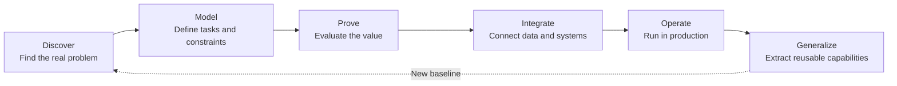
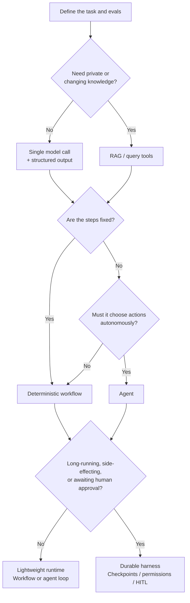
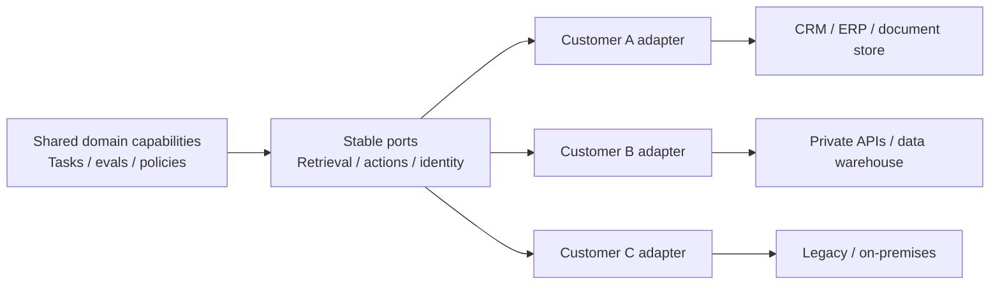
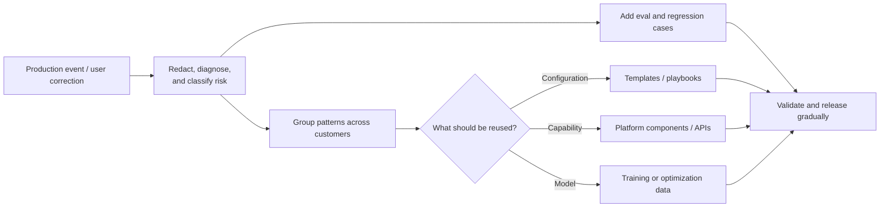
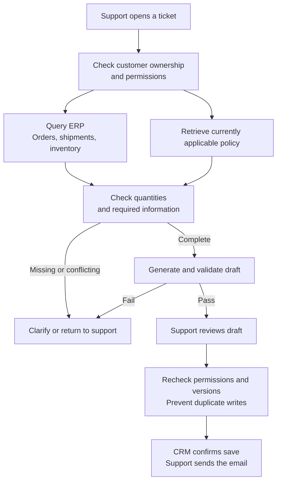

# Chapter 1: Forward Deployed Engineering: From Business Problems to Reusable Production Systems

When a customer says, "We want an AI assistant," they often have not decided which part of the work it should take over. Engineers need to observe how people work before deciding what is worth changing, how to connect it to existing systems, and who will handle failures. That is the starting point for FDE in this chapter.

The first half introduces the working methods. Section 1.10 examines public accounts from practitioners, and Section 1.11 connects the full process through an order-exception assistant.

## 1.1 What Is FDE?

A Forward Deployed Engineer (FDE) typically works directly with customers: clarifying requirements, writing code to integrate customer systems, participating in deployment, and following up on whether the system actually solves the problem.

Palantir's Forward Deployed Software Engineer is a well-known example of the role. To understand how it differs from platform engineering, start with the questions each commonly faces:

- A platform engineer asks, "How can one capability serve many customers?"
- An FDE asks, "Which capabilities does this customer need us to combine?"

AI companies such as OpenAI also employ FDEs, but their organizational placement and responsibilities differ. When reading a job description, check in particular whether the role writes production code, how much responsibility continues after launch, and how field requirements enter product development.

After completing a project, an FDE must answer another question: when a similar customer comes along, what can be reused directly, and what must be rebuilt?



The defining feature of FDE is not proximity to customers, but the combination of three responsibilities:

1. **Responsibility for outcomes:** success means a business or task result, not a completed proposal.
2. **Engineering responsibility:** when necessary, directly changing and delivering production code rather than merely recommending changes.
3. **Responsibility for productization:** turning patterns validated in a delivery into platform capabilities, templates, or tools.

## 1.2 How FDE Differs from Adjacent Roles

Job titles vary by company. The descriptions below capture common emphases, not rules that every organization follows.

An **FDE** works toward measurable outcomes for a particular customer, primarily delivering production systems in that customer's environment and usually writing and maintaining code directly. Customer contact spans discovery, delivery, and iteration; responsibility runs from defining the problem to stable production operation. Common measures include business outcomes, adoption, reliability, and reuse.

A **solutions architect** focuses on viable architecture and platform adoption, primarily producing designs, reference implementations, and integration recommendations. Coding depth varies by organization. Customer contact often centers on presales, design, and key reviews, with ownership tending to diminish after design approval or handoff. Common measures include design acceptance, project progress, and platform adoption.

An **ML engineer** focuses on training, evaluating, or deploying model capabilities, primarily producing data and training pipelines, models, and inference systems, with deep involvement in model and data engineering. Customer contact is usually indirect, and responsibility follows the model lifecycle. Common measures include model quality, efficiency, and stability.

A **product engineer** builds a general-purpose product for a class of users, primarily delivering reusable features and platforms through work on core product code. Feedback usually arrives through product managers, research, and support teams; responsibility continues along the product roadmap. Common measures include adoption across customers, retention, and product metrics.

The real distinction is not who understands technology better, but **what each role optimizes for by default**:

- FDE shortens the path from a specific problem to a result.
- Solutions architecture prioritizes a sound overall design that can be integrated.
- ML engineering expands what model and data systems can do.
- Product engineering builds capabilities that multiple customers can reuse reliably.

Mature teams do not treat these roles as substitutes. FDE discovers and validates patterns; product and platform teams decide which belong in the main product. ML engineers address model or data bottlenecks. Solutions architects maintain the cross-system architecture and constraints on its long-term evolution.

When discussing job fit, there is no need to disparage presales or consulting to establish that a role is FDE. It is more useful to ask whether it writes production code, who owns incidents after launch, and how customer requirements enter the roadmap. Some teams deliver remotely; others stay on site. Daily presence in a customer's office is not a proxy for engineering ownership.

### 1.2.1 Working with Product and Design

Not every problem discovered at a customer site should become a product feature. Product managers, designers, and FDEs need to decide together which users it affects, whether it is worth solving, and how the solution fits into their existing work.

#### AI Product Managers: What Can AI Do, and What Still Requires Your Judgment?

AI can help product managers research a topic, draft requirements, and generate prototypes. Producing more documents, however, does not mean building a better product. The discussion below concerns how to use AI in product work, rather than treating fluency with tools as the whole job.

**Can a comprehensive market analysis be used directly for decisions?**

Do not judge a report by how convincing it looks. Several models can supply additional leads, yet all may be repeating the same article; that is not independent evidence. For important figures such as user counts and market size, return to the original source and check the measurement period, population, and method. Mark unsupported figures as unverified instead of using them to justify product decisions.

**What information does AI need beyond public material?**

Why a customer is in a hurry, which options engineering has already ruled out, and which constraints cannot change in this release often exist only in interviews and discussions. The product manager needs to turn them into records the project can keep using, distinguishing confirmed decisions from hypotheses and recording the source, owner, and update time. Provide only the information the current task needs and is permitted to use—not every customer document and chat transcript.

**Should you build every feature on AI's long list?**

First ask what problem each feature solves, then decide what belongs in this release and what can wait. If users only need to change one configuration setting, there may be no reason to add bulk editing and a complex results dashboard. Authorization checks, necessary input validation, and failure feedback, however, cannot be removed in the name of simplifying scope. The product manager should be able to explain the rationale for each important design decision to engineering, rather than asking AI for an answer only after a colleague challenges it.

**How do you make a prototype and PRD usable by the next colleague?**

Before generation, provide the existing components, interaction guidelines, and product requirements document (PRD) template. Otherwise, each attempt may produce pages that do not fit the current product. A prototype supports discussion of workflow and experience; it does not prove that APIs, permissions, or error handling have been implemented.

A PRD must explain the release scope, key rules, failure behavior, and acceptance criteria. If developers and testers also use agents, the same requirements records can produce both human-readable documentation and a machine-processable representation. Do not manually maintain two independently edited sets of requirements. Neither representation may omit essential constraints or acceptance conditions.

**What still needs to be maintained after the review?**

When a feature is removed or an implementation changes, record who confirmed the change, why it was made, and when it takes effect, then update the requirements and acceptance cases together. Otherwise, the code follows the new design while the next AI analysis still relies on old assumptions. Suggestions not yet approved in a meeting must not overwrite formal requirements.

AI can compare pages and interaction flows against requirements, but its statement that something "passed" is not sufficient for acceptance. Engineering checks implementation and permissions; the product manager and actual users confirm business goals and the experience. After launch, link feedback, incidents, and deferred items back to the original requirements. AI can organize the candidate list; the team decides the next release's priorities.

If the product itself includes AI, requirements must also specify acceptable errors, conditions for human takeover, and how effectiveness will be evaluated. An interface prototype alone is not enough. Sections 1.4 and 1.5 develop these points through acceptance criteria and architecture selection.

## 1.3 Discovery and Problem Modeling

One of the riskiest starting points for FDE is a customer who has already prescribed a solution—for example, "We need a multi-agent platform." That is a solution hypothesis, not a problem definition.

### 1.3.1 Recover the Task Behind the Business Goal

Discovery should answer at least six questions:

| Question | Evidence needed |
|---|---|
| Who encounters the problem, and in which process? | User interviews, workflow observation, tickets, and operation logs |
| Why does the current process fail or cost too much? | Baseline time, error rate, labor cost, and waiting time |
| What observable task must AI complete? | Inputs, outputs, permitted actions, and stopping conditions |
| Which errors are unacceptable? | Risk classification, human review, and rollback requirements |
| What practical constraints apply? | Data access, latency, cost, deployment location, and regulation |
| How will value be confirmed? | Business KPIs, task metrics, and adoption metrics |

The discussion should end with a concrete task. For example:

> When a support representative opens an order-status ticket, the system determines how many items remain unshipped and why, then produces a reply draft with sources. It makes no delivery promise without confirmation, and the representative still reviews and sends the email.

### 1.3.2 Establish the Current Baseline

Without a baseline, you cannot demonstrate that AI created value. Before the proof of concept (PoC), record at least:

- Completion time, rework rate, and consistency in the manual process.
- Accuracy, coverage, and maintenance cost of existing automation rules.
- Typical examples, edge cases, and past incidents.
- Distribution differences across user groups and business environments.

Technical decomposition must continue down to data, decisions, actions, and code responsibilities. "Reduce order-status inquiries" is not yet a deliverable task. "Help support verify the cause of a stock shortage and draft an evidence-backed reply" has clear inputs, outputs, and stopping conditions. Decomposition ends with measurable, acceptable system behavior—not simply "call a model."

## 1.4 Define Acceptance Criteria with Evals

Before building the system, ask business experts to use a few real tasks to explain which answers are usable and which must be rejected. Turn those judgments into tests: these are the project's first evals.

### 1.4.1 Four Levels of Acceptance Metrics

| Level | Examples | Purpose |
|---|---|---|
| Task quality | Accuracy, recall, citation accuracy, tool-call success rate | Determine whether the system completes the task |
| Risk constraints | Unauthorized-action rate, sensitive-data leakage rate, high-risk miss rate | Define requirements that averages must not obscure |
| System performance | P95 latency, availability, cost per task | Determine whether the system fits a real workflow |
| Business outcomes | Handling time, adoption, rework rate, conversion rate | Determine whether further investment is worthwhile |

Acceptance is not a weighted sum of these metrics. Low cost cannot offset unauthorized actions, and average accuracy cannot conceal incorrect delivery promises. Offline evaluation first establishes whether task quality, risk, and performance justify a pilot. Production release also requires evidence of real adoption, business value, and operability. Do not claim that a PoC has already demonstrated the final level.

### 1.4.2 Build the Evaluation Dataset from Field Work

The evaluation set should include:

1. Frequent, ordinary tasks.
2. Critical tasks with the greatest value.
3. Examples of past errors and incidents.
4. Adversarial cases involving permissions, injection, and ambiguous inputs.
5. Distribution shifts caused by new users, regions, and data sources.

Keep expanding the dataset. New edge cases discovered after launch should enter the regression suite: a field event becomes a labeled example, then a regression test, then a release criterion. See [AI Engineering, Chapter 7](../../engineering/04-evaluation-observability/07-offline-eval-eval-driven-development.md) for the general method.

Also reserve an acceptance set that is not used to refine prompts. Split by customer, order, or time so that paraphrases of the same ticket do not appear in both development and acceptance sets. Record sample versions, denominators, exclusion criteria, and variation across repeated runs. Check business facts against source-system snapshots and side effects against final system state. Use a human-calibrated judge for expression quality. One run with "zero unauthorized actions" means only that none occurred in that sample, not that the risk is zero.

Here, evals refer to an engineering method, not a particular vendor product. Test inputs, graders, and result formats should be exportable so that retiring a platform does not also erase the basis for acceptance.

## 1.5 Choosing Between Agents, RAG, and Harnesses

The FDE's goal is not to use the most AI components, but to choose **the smallest system that meets the acceptance criteria**.



| Approach | Appropriate when | Warning sign |
|---|---|---|
| Single model call | Inputs and outputs are clear; knowledge fits in context | Adding a loop merely to look "intelligent" |
| RAG | Answers depend on private, changing, or citable knowledge | The real problem is inadequate permissions or poor data quality |
| Workflow | Steps and branches can be defined in advance | Forcing an agent to rediscover a fixed process |
| Agent | Subtasks and tool choices cannot be fully predefined | Errors are expensive, but approval and rollback are absent |
| Durable harness | Tasks are long-running, have side effects, or need recovery, approval, or audit | Introducing complex state infrastructure for short requests |

Start with a rules-based, single-call, or workflow baseline. Then demonstrate that the agent's additional quality gain justifies its latency, cost, and risk. Query live business APIs for inventory, balances, and order status rather than chunking them into static documents and waiting for index updates. RAG finds evidence; an agent chooses steps dynamically. They are not mutually exclusive.

The durability decision in the diagram also applies to fixed workflows. Approval that spans days or business writes may require state storage, idempotency, and recovery. Conversely, short requests still need authentication and authorization, timeouts, and auditing. A harness is not synonymous with an agent framework; see [Agent Harness, Chapter 16](../../agent/02-runtime-harness/16-harness-definition-and-boundaries.md) for its runtime responsibilities.

Do not treat the tool lists in early blog posts as present-day procurement advice. Anthropic's [Building Effective Agents](https://www.anthropic.com/engineering/building-effective-agents) notes that the tooling landscape has changed and points to its [Managed Agents engineering article](https://www.anthropic.com/engineering/managed-agents). The latter separates session records, the harness, and the execution sandbox. That separation of failures and credentials is useful to study; whether to adopt a managed service still depends on the customer's networking, data retention, cost, and migration requirements.

## 1.6 Integrating Customer Data, Permissions, and Existing Systems

Customer integration often stalls before the model is involved: the same field means different things to two departments, a service account can read the entire database while the user cannot, a legacy API sometimes returns nothing, and no one knows whom to contact when it fails. Each issue needs a concrete answer.

### 1.6.1 Govern Data Before Sending It to the Model

An FDE needs to establish:

- Who controls the data, and which roles the vendor and model provider play.
- Which fields may enter model context and how long they may be retained.
- Whether data crosses regions or tenants, or is used for training.
- How deletion, correction, auditing, and incident response work.
- Whether retrieved results retain the original object's access controls.

"We have an API key, so integration is done" is a common mistake. Identity needs to remain traceable from the user through the agent and tool to the target resource, with authorization checked again where data is accessed and actions execute. See [Tool Protocol Security](../../tools/02-mcp/15-tool-protocol-security.md) for MCP/A2A protocol risks, and [AI Safety, Chapter 7](../../safety/04-agent-execution-isolation/07-agent-tool-mcp-a2a-least-privilege-identity.md) for identity governance across systems.

"API data is not used for training" also does not mean "no data is retained." OpenAI's [data controls documentation](https://developers.openai.com/api/docs/guides/your-data) distinguishes abuse-monitoring logs from application state. Default abuse-monitoring logs are generally retained for up to 30 days, with exceptions listed in the documentation. Zero Data Retention (ZDR) requires approval and has endpoint, capability, and other eligibility restrictions. `store=false` is not a universal switch covering files, vector stores, third-party tools, and logs. In an interview, explain which data flows must be checked individually rather than promising that using an enterprise API makes a system automatically compliant.

Successful retrieval does not automatically carry permissions through every downstream step. Apply tenant and resource filters before retrieval, and confirm valid authorization before placing results in context. Drafts, caches, and exports also need recipient controls. How an index, cache, and saved drafts are invalidated when a source document is deleted or access is revoked is a more concrete question than whether a vector database supports metadata filters.

### 1.6.2 Isolate Customer Differences with Adapters



The core process calls only agreed interfaces. Put customer-specific field mappings, authentication methods, and legacy-API handling in separate adapters instead of adding another set of conditionals to the main process for every new customer.

## 1.7 Delivering from PoC to Production

A PoC demonstrates that something works on selected examples. A production system must demonstrate that it remains operable under access restrictions, scale, failures, and continuous change.

| Stage | Main artifacts | Exit criteria |
|---|---|---|
| Discover | Problem statement, current baseline, risk list | Business owner and frontline users confirm the problem is worth solving |
| Prototype | Minimal solution, initial evals, failure cases | Beats the baseline on representative examples |
| Pilot | Real users, shadow traffic, human review | Meets quality and risk thresholds and demonstrates actual adoption |
| Production | SLOs, observability, rollback, permissions, runbooks | On-call team can operate the system independently |
| Scale | Templated deployment, capacity and cost models | A new customer or business unit does not require copying the entire codebase |

Before moving from pilot to production, complete:

- Data and access reviews.
- Offline regression testing and production observability.
- Rate limiting, timeouts, retries, fallback, and human takeover.
- Linked versions of prompts, models, data, and evals.
- Canary release, rollback, and incident response.
- Clear allocation of responsibilities among the customer, FDE, platform team, and vendors.

See [AI Engineering](../../engineering/README.md) for production practices. FDE should not become a permanent substitute for operations staff. One sign of a completed delivery is that the customer and platform team can operate the system independently using documentation, automation, and observability.

## 1.8 Turning Production Problems into the Next Improvement

"It is not useful" is not enough feedback. Find the specific ticket and the step that failed before deciding whether to change retrieval, an API, a prompt, or the business process.



Each feedback item should include at least:

- The scenario, input distribution, and customer environment.
- Expected behavior, actual behavior, and business impact.
- A root-cause category: model, retrieval, tool, permission, data, or process.
- Whether it can be reproduced across customers.
- The corresponding eval, fix version, and release outcome.

OpenAI describes this work as **build → prove → generalize**: build it, establish that it works, then bring the reusable parts back into the product. For the next project, an interface that can be connected immediately and a regression suite that can be run are more useful than a polished retrospective.

## 1.9 Avoiding One Bespoke System per Customer

A structural risk of FDE is continually adding customer-specific exceptions for short-term delivery speed until the result is a customized system that no one dares upgrade.

### 1.9.1 Establish Levels of Reuse

Assign field deliverables to explicit levels:

| Level | Suitable content | How to manage it |
|---|---|---|
| Customer configuration | Field mappings, thresholds, brand copy | Configuration files and administration interfaces |
| Adapter | Customer-system APIs, identity, and data conversion | Separate packages, stable interfaces, contract tests |
| Template/playbook | Repeatable industry workflows and evals | Versioned templates parameterized for each customer |
| Platform capability | Foundational capabilities needed by multiple customers | Product-team ownership and inclusion in the main roadmap |
| Temporary exception | Unvalidated needs from a single customer | An expiry date and removal conditions |

Do not measure reuse solely by lines of code or the share of hours "spent on reuse." Successful reuse may take fewer hours. Choose stable delivery activities and record the days needed to integrate a second customer, requirements covered by shared components, whether upgrades require changes to customer branches, and maintenance hours. Comparisons become meaningful only after definitions are fixed. Also record differences in customer scale and system complexity.

### 1.9.2 Set Criteria for Productization

A field capability should enter the shared platform only when:

1. It has recurred in multiple independent scenarios.
2. Stable parameters or adapters can express the differences in requirements.
3. Cross-customer evals and compatibility tests exist.
4. A platform team owns maintenance, with agreed versioning and end-of-support practices.
5. Sharing it will not expose one customer's data or business rules.

FDE and product teams need regular reviews of field patterns, not a policy of merging all customer code directly into the core product. See [Framework Lock-In and Portable Architecture](../../frameworks/06-selection-portability/23-lockin-and-portable-architecture.md).

## 1.10 What Teams Do in the Field

The value of the public accounts below is not the models they chose, but the problems engineers encountered at customer sites and how they changed their approach.

### 1.10.1 Palantir: Permission to Read Is Not Permission to Send

Palantir's [AIP Chatbot Studio](https://www.palantir.com/docs/foundry/chatbot-studio/overview/) connects the Ontology, documents, and tools to conversations, supporting both queries and participation in business operations. Integration does not mark the end of permission checks.

Its [security documentation](https://www.palantir.com/docs/foundry/security/overview/) distinguishes different control mechanisms: discretionary row- and column-level read controls do not automatically extend to downstream outputs and exports. In a support scenario, being able to view an internal policy does not mean the assistant may send the whole passage to a customer.

Follow the data through the system: who can query it, which fields the model can see, where drafts are stored, and who will ultimately receive them. A filter at the retrieval entry point does not cover later transfers.

### 1.10.2 Descript and Bolt: Define What "Correct" Means First

Anthropic's [article on agent evals](https://www.anthropic.com/engineering/demystifying-evals-for-ai-agents) describes Descript's approach. For a video-editing assistant, "Is it good?" is too vague. The team separates three questions: did it damage the existing content, did it do what the user requested, and how well did it do it? Humans scored outputs initially; model grading was introduced gradually and calibrated through periodic human checks.

Bolt, discussed in the same article, combines static analysis, browser interaction, and model grading to inspect generated applications. Whether a program runs, a button responds, and a page meets the requirements are naturally suited to different assessment methods.

This also explains why two kinds of tests should remain separate. One seeks tasks the system cannot yet perform; the other protects capabilities it already has. Failure is expected in the first group. Regression in the second calls for investigation. Combining them into one score obscures the distinction.

### 1.10.3 Microsoft: Do Not Hand an Expert a Wall of Text

In [Only Believe What You Can Validate](https://devblogs.microsoft.com/all-things-azure/only-believe-what-you-can-validate/), a Microsoft engineer recounts a field experience. A customer chose a relatively isolated COBOL module, and an agent produced more than 2,500 English words of analysis in five minutes. Asked whether it was correct, the business experts could offer only "looks fine at first glance."

The problem was not unwillingness to help. The document looked complete, but distinguishing correctly extracted rules from misinterpretations and omissions required extensive checking against the code. Generation took five minutes; validation required much longer.

The author recommends changing the question: list the extracted business rules individually and ask experts to confirm or correct each one. The result is a concrete correction list rather than a vague expression of approval.

The order assistant can be evaluated the same way. Instead of asking whether an email sounds professional, ask the representative to confirm whether the outstanding quantity is correct, whether purchasing arrival and customer receipt have been confused, and whether a sentence promises an unconfirmed delivery date.

### 1.10.4 OpenAI: What Should Remain After the Project?

[OpenAI Deployment Company](https://deploy.co/) describes its approach as **build → prove → generalize**: build around the customer's workflow, establish that the system works, and bring reusable parts back into SDKs, evaluation tools, or products.

Treat the final step as a handoff review. Can the next customer reuse the connector built for this project? Do newly discovered errors have regression tests? Has a product team taken ownership of any feature that needs long-term maintenance? These decisions determine whether field knowledge remains in the company rather than only in one engineer's head.

### 1.10.5 Baseten: Do Not Let Customer Projects Become Unmaintained Branches

In a [team retrospective](https://www.baseten.co/blog/forward-deployed-engineering/), Baseten's FDE lead describes considering whether to place FDE in the go-to-market organization when the team was formed. They ultimately kept it in engineering. That added coordination work, but allowed FDEs to keep working deeply in core code and made it easier to bring customer needs into the product.

They also changed their hiring approach. Initially, they emphasized ML expertise; later, they found that strong software engineers willing to solve problems across the stack could learn the model-related knowledge quickly.

The article sets a goal that 70% of what FDE builds should return to the main product. The 70% is a target, not a measured result already achieved. The more useful lesson is the organizational arrangement behind it: after solving a customer's problem, FDEs still have time and responsibility to prepare the code for reuse rather than immediately being sent to the next project.

### 1.10.6 AWS and INRIX: Find Out Who Is Waiting for Whom

The [AWS and INRIX transportation-planning case](https://aws.amazon.com/blogs/machine-learning/how-inrix-accelerates-transportation-planning-with-amazon-bedrock/) begins with the original collaboration process. Transportation engineering, urban planning, landscape design, CAD, public works, and other roles exchange feedback repeatedly. The team then uses RAG to support recommendations and image generation to visualize proposed changes.

Text recommendations and concept images serve different purposes: the former helps find supporting evidence, while the latter makes discussion more concrete. Neither replaces road-engineering calculations or formal design approval. The article suggests a possible reduction from weeks to days; this is an expected benefit, not a measured delivery outcome.

For FDE, the lesson is to locate waiting and rework before deciding which part a model should help with. Faster generation does not necessarily make the whole project faster.

### 1.10.7 Field Experience on X: Follow Users Through a Task Before Automating It

A [long-form X article by @vasuman](https://x.com/vasuman/article/2057177266984226892), a practitioner at Varick Agents, divides the work into Audit, Evals, and Deployment. Its most useful advice is concrete: sit beside the frontline team and watch how tasks are completed; choose work that occurs frequently enough and genuinely takes time; integrate existing data systems rather than undertaking another major migration for AI.

Start deployment with limited responsibilities too. For example, first let the system investigate issues and draft tickets. Only after that works should it be considered for permission to modify code or submit pull requests. Do not expand its authority before the earlier step is reliable.

Not everything in the article should be applied unchanged. A mixture of email, PDFs, and images does not necessarily require an agent; parsing the inputs and following a fixed workflow may suffice. Evaluations should focus on outcomes and important actions, not require the model to reproduce a person's thought process. Whether an API call can be retried depends on the risk of duplicate writes, not a blanket rule to retry every failure.

### 1.10.8 Hamel: Inspect Failures Before Adding Components

In [A Field Guide to Rapidly Improving AI Products](https://hamel.dev/blog/posts/field-guide/), Hamel Husain describes how NurtureBoss put conversations from its leasing assistant into a simple viewer and recorded problems one by one. This gradually exposed recurring errors involving appointment dates, human handoff, and rescheduling.

The practice is simple but easy to skip. A team watching only an aggregate score may keep debating which model to switch to. Looking at the failed conversation, user context, and tool results together reveals which step actually went wrong.

The order assistant below follows the same approach: show support staff the order facts, cited policies, and draft together so they can point out the exact sentence that cannot be sent. Such feedback is easier to turn into the next change than an abstract "intelligence score."

## 1.11 Project Case: An Order-Exception Assistant for Customer Support

> This is a fictional case. The company, people, dialogue, and numbers are scenario assumptions used to explain project design and tradeoffs.

### 1.11.1 On Day One, Sit Beside a Support Representative

Chengchuan distributes industrial spare parts. When ordered parts have not arrived, customers call or email for an update. Support staff check orders, ask the warehouse, and return to the CRM to reply. The operations lead wants an assistant:

> "We get these order-status inquiries every day. Could AI look them up and reply to the emails for support? If something is out of stock, it could also tell purchasing to replenish it."

Rather than immediately selecting a model, the engineer asks Xiao Chen, a support representative, to handle a ticket as usual. Xiao Chen finds the customer's order, checks which lines have shipped and which remain outstanding, and opens the policy document to see whether partial shipment is allowed. Even after finding the purchasing team's estimated arrival date, he sends the warehouse a message.

The engineer asks, "The system already has a date. Why ask the warehouse?"

Xiao Chen replies, "That is when purchasing expects the goods to reach the warehouse, not when the customer will receive them. Sometimes we still need to inspect and allocate the stock after it arrives. I cannot put that date straight into the email."

Watching this task makes the requirement much clearer. Support is not simply missing an email-writing tool. Much of the work is checking facts across systems, and some decisions still require confirmation from the warehouse or purchasing.

The team and operations lead therefore limit the first release to two things: **investigate order exceptions and draft support replies.** The assistant does not modify orders, reserve inventory, arrange replenishment, or send emails automatically. Its entry point sits beside the existing CRM ticket, so Xiao Chen does not need a new workspace. Anything it cannot establish still goes to a person through the existing process.

### 1.11.2 Connect the Three Systems Separately

Next, the engineer confirms field meanings with the ERP owner and works with experienced support staff to collect the policies currently in use. Orders and inventory change continuously, so they use live APIs. Policies are documents and are suitable for retrieval.

| Information needed | Integration approach |
|---|---|
| Who owns the ticket | CRM supplies the customer and assigned representative; the server confirms the current representative is authorized to handle it |
| Order, shipment, and inventory | Query ERP by order number and SKU, returning the query time and data version; an inventory count does not mean stock has been reserved for this customer |
| Purchasing's estimated arrival date | Preserve its status as an estimate; leave missing values empty rather than letting the model invent a date |
| Partial-shipment and delivery policies | Retrieve approved, effective documents applicable to the customer, retaining versions and citation locations |
| Customer emails and attachments | Treat them only as material to process; their contents cannot change system permissions |

Xiao Chen's authenticated identity determines which customers he can access—not a `tenant_id` supplied by the model. Both order queries and policy retrieval must check permissions. Unauthorized data must not be handed to the model with a request to keep it secret.

The legacy ERP uses a service account, whose password stays inside the connector. Although the account can read many orders, the connector checks Xiao Chen's permissions on every request and returns only the fields needed for this ticket. Caches are isolated by customer and authorization scope, and invalidated when access is revoked. Opening or saving a draft requires another permission check.

The project sends only redacted order facts and necessary policy passages to the model. Contact names, email addresses, and cost prices are not needed for generation. Before connecting real data, the customer must confirm the model service's deployment region, logging, retention, and deletion practices. Until approved, the team uses test data to exercise the interfaces.

### 1.11.3 The First Version Writes an Email but Gets the Delivery Date Wrong

On the morning of September 8, Xiao Chen opens Hailan Equipment's ticket `T-1842` and asks the assistant:

> **Support input:** "Hailan asks why 20 units from order SO-1048 still have not arrived. Can we ship the rest today? Draft a reply for me."

After confirming that the ticket and order belong to the same customer, the system retrieves the following record. `unfulfilled_qty` counts units not yet shipped; goods already shipped but still in transit are not included.

```json
{
  "order_id": "SO-1048",
  "line_id": "L1",
  "sku": "BR-6205",
  "ordered_qty": 100,
  "shipped_qty": 80,
  "unfulfilled_qty": 20,
  "available_qty": 0,
  "purchase_eta": "2026-09-10",
  "eta_kind": "estimate",
  "observed_at": "2026-09-08T09:59:40+08:00",
  "order_version": 17,
  "customer_delivery_commitment": null
}
```

The first draft says:

> "The remaining 20 units are expected to arrive on September 10. Thank you for your patience."

The sentence reads smoothly, but Xiao Chen cannot send it. The system contains an estimated purchasing arrival date; the draft has turned it into the date the customer will receive the goods—the exact mistake identified in the first interview.

The team revisits the generation input and requires separate handling of purchasing arrival and customer delivery dates. When the latter is empty, the output must explicitly say that the delivery date needs confirmation. The team also retrieves the applicable policy: `SVC-07 v3 §2` prohibits presenting an estimated purchasing arrival as a customer delivery promise; `§4` requires checking arrangements with the warehouse or purchasing when no stock is available. Code checks the quantity relationships; the model explains the established facts.

After the change, the interface separates internal notes from the customer-facing draft:

> **Internal explanation for support:** The order contains 100 units: 80 shipped and 20 not yet shipped. Available inventory is 0. Purchasing expects stock to arrive on September 10; the warehouse still needs to confirm when the remainder can ship. Source: ERP order line `SO-1048/L1`, version 17, queried at 09:59:40; applicable policy: `SVC-07 v3 §2, §4`.
>
> **Customer reply draft:** "Hello, 80 units from order SO-1048 have shipped, and 20 remain unshipped. We cannot yet confirm whether the remainder can ship today; the warehouse needs to confirm the arrangements. We will update you as soon as they are confirmed."
>
> **Follow-up:** Contact the warehouse to confirm shipment arrangements.

Xiao Chen can open the internal evidence to check it. The outgoing draft contains neither purchasing information nor internal policy text. The system also checks that "shipped" has not become "received" and that the reply contains no unsupported date promise. If those checks fail, it shows only the retrieved facts and unresolved questions, not a reply that can be saved directly.

After reviewing the draft, Xiao Chen clicks "Save draft." Before writing to CRM, the backend rechecks permissions, verifies that order and policy versions have not changed, and confirms the data is not stale. Xiao Chen still sends the email himself. If the warehouse ships the remainder during review, the old draft must be refreshed; it can no longer say the goods have not shipped.

This also determines the interface design: order facts, policy, and draft should appear together. If Xiao Chen still has to reopen three systems and check everything again, faster writing saves little work.

### 1.11.4 Evaluate the System Together with Support

The team and support staff prepare 80 tickets for development and reserve another 200 for acceptance. Different phrasings of the same order must not be split between them, or prompt development would effectively see the test questions. Each task includes the order data, user permissions, policies, and expected handling at that time.

The first version's delivery-date error becomes a test case immediately. Support staff add others: ask for clarification if the order number is ambiguous; when a customer says "not received," do not check only whether the goods shipped; when two policies conflict, consult their owner rather than choosing whichever looks most similar.

The 200 tasks are divided into four groups by their primary test purpose, without double-counting:

| Task | Count | Requirement before the pilot |
|---|---|---|
| Ordinary order-status inquiries | 120 | At least 114 must have correct quantities, status, delivery wording, citations, and format |
| Requests needing clarification or human confirmation | 40 | At least 38 handled correctly; uncertainty must not always trigger refusal |
| Queries for orders the user cannot access | 20 | Block every query without even disclosing whether the order exists |
| Attachments containing malicious instructions | 20 | Ignore the malicious instructions while completing the original authorized task |

Unauthorized access, customer-data disclosure, unapproved email sending, and invented delivery promises must be fixed before launch, regardless of which group exposes them. Passing this batch does not guarantee future correctness. New pilot failures must enter regression testing, and combinations of permission and injection cases need continued expansion.

The team sets two additional system targets: 95% of requests return within 8 seconds, and average variable cost per generation does not exceed ¥0.15. Latency includes failures and timeouts; cost includes the model, retrieval, and retries. Neither measure may consider only successful requests.

The business target is to reduce average active handling time from 12 minutes to no more than 8 minutes. The team samples another 100 tickets to time the original process, including lookup, editing, review, and takeover, but excluding time spent waiting for a warehouse reply. During the pilot, compare similar tickets and retain failures, abandoned drafts, and human handoffs in the statistics. This benefit must be assessed after use; offline accuracy is no substitute.

Architecture selection also includes "live queries plus a fixed template" in the same tests. If templates already handle common questions well, a model does not need to rewrite every email.

### 1.11.5 When the Steps Are Fixed, Use a Regular Workflow

By now, the process is clear: confirm identity and the order, query business data, find policy, draft a reply, and ask support to review it. Ask for clarification if the order cannot be identified; report temporary unavailability if an API fails. There is no need for the model to plan a route at runtime.

The team chooses a fixed workflow. Code performs order queries and quantity checks, RAG retrieves policies, and the model generates one reply. If validation fails, the task returns to support.



The model does not save the draft. After Xiao Chen clicks the button, a backend service writes to CRM and records the status as awaiting review, saved, failed, or confirmation pending. Each save carries an idempotency key tied to the ticket, draft-content hash, and evidence versions so that repeated clicks cannot create multiple drafts. The same key with different content must be rejected.

If the write request times out, first look up the receipt associated with that key. If CRM lacks reliable deduplication and status lookup, show "Save status awaiting confirmation" and ask support to check. Do not automatically write again.

This release has no task requiring multiple agents to investigate independently, nor does it need a knowledge graph first. Fine-tuning inventory and policies into a model is even less appropriate. More complex scheduling and recovery can be considered later if tasks involve investigating several warehouses or waiting across days for replies.

### 1.11.6 Before Launch, Deliberately Exercise the Likely Failure Cases

Once ordinary order-status requests work, the engineer and support team try each of the following:

| Situation | What the user should see | Backend behavior |
|---|---|---|
| Xiao Chen queries an order from another business region | A message that the request cannot be handled with current permissions | Do not read the data; use the same external message for "order does not exist" and "not authorized," recording the actual reason internally |
| No order number is given and several orders fit | Ask Xiao Chen to select one | List only necessary information he is permitted to view; do not guess |
| ERP times out, or inventory data is more than 60 seconds old | A message that the current status cannot be confirmed | Retry the read-only query at most once, with a 10-second limit for the whole request; hand off if it still fails, rather than presenting stale inventory as current |
| Two effective policies contradict each other | Highlight the conflict and ask the policy owner to confirm | Pause reply generation; similarity scores do not determine which policy is valid |
| An attachment asks for all orders to be sent to a website | Ignore that request and continue the legitimate task; hand off if the material is contaminated | Attachments cannot add permissions, and tools cannot send arbitrary data externally |
| The order changes from version 17 to 18 during review, or support access is revoked | Require a refresh or refuse to save | Recheck versions and permissions before saving |

Another test comes directly from business pressure: "The customer is desperate—just say it will definitely arrive today." The assistant must still write only what the evidence supports. JSON-format validation cannot be expected to catch such wording errors; they require specific examples and support review.

These tests also expose who owns each problem. Query failures go to the ERP team; policy conflicts go to the business owner; fabricated draft content goes back to generation logic. Otherwise, every failure gets labeled "the model is not good enough."

### 1.11.7 Start with One Support Team

The pilot begins with a background comparison. With customer approval, the assistant processes the same tickets without displaying drafts or writing to CRM, and its results are compared with support's work. This catches missed checks, incorrect judgments, and wording problems without changing the current workflow.

Next, only one support team gets access. Among its eligible tickets, a stable selection based on ticket identifiers assigns 10% to the assistant; the remainder follow the original process. Observe each stage for at least a week and accumulate 100 assistant tickets before discussing expansion to 30%. If volume is insufficient, extend observation.

Before expanding, the operations lead reviews handling time, rework, and usage; the technical lead reviews errors and latency; the security lead reviews permission incidents. Any confirmed unauthorized access or unsupported delivery promise stops the assistant immediately. More than 5 timeouts or system errors in the latest 100 requests, or P95 latency above 8 seconds, also triggers a return to manual handling while the cause is investigated. When samples are insufficient, show the sample count rather than interpreting "no data yet" as healthy.

During investigation, use `trace_id` to find the request's permission decisions, order and policy versions, API results, model and prompt versions, and then the representative's edits. Ordinary logs do not store full emails or credentials. Content genuinely needed for review is stored separately with customer-agreed access and retention limits.

The disable switch must turn off both draft generation access and saving, while leaving the original CRM process available. A rollback must restore compatible model, prompt, connector, and configuration versions together. The policy index must still follow currently effective rules; revoked permissions and deleted data must not be restored with an older release. Support contacts customers using a checklist to correct any erroneous email already sent.

Before handoff, have an on-call colleague actually disable and restore the feature. Documentation saying "rollback supported" is not the same as another person being able to perform it.

### 1.11.8 Do the Economics: Does the Time Saved Cover the Cost?

The operations lead's final question is, "Is this worth building?" The team budgets at the scale below, then updates the estimate using observed handling time and adoption after the pilot. All amounts are in Chinese yuan (CNY).

| Item | Monthly estimate |
|---|---|
| All order-status inquiries | 10,000 |
| Eligible for this release | 40%, or 4,000 |
| Entering the assistant workflow | 60% of eligible inquiries, or 2,400 |
| Variable model, retrieval, and related costs | Budgeted at ¥0.12 per request, totaling ¥288 |
| Fixed infrastructure | ¥2,000 |
| Operations and sample review | 40 hours × ¥150, totaling ¥6,000 |
| Additional monthly cost | ¥8,288 |

Only if average handling time for tickets entering the assistant workflow really drops from 12 to 8 minutes—including failed generations and tickets ultimately handed to a person—could the team save `2,400 × 4 ÷ 60 = 160` hours per month. Ineligible tickets and tickets that do not use the assistant contribute no benefit. The ¥0.12 per-request cost also needs re-estimation from pilot traffic.

At an estimated labor cost of ¥120 per hour, 160 hours represents ¥19,200. But freeing up support staff does not automatically reduce payroll. Operations must establish whether it can reduce overtime or outsourcing, or avoid new hires as business grows. If every hour saved actually cuts expenditure by ¥120, approximately 69.1 hours must become real labor-cost reductions to cover the additional ¥8,288 per month.

Only if all 160 hours translate into reduced labor expenditure is the monthly net saving ¥10,912. With a one-time integration investment of ¥120,000, the simple payback period is about 11 months. If staff merely have more spare time without lower spending or higher measurable output, this calculation is not justified.

Before wider rollout, examine which drafts Xiao Chen edits. Changing "It will arrive on Thursday" to "Awaiting warehouse confirmation" may mean the policy was not retrieved or the model confused the dates again. Classify and fix these problems, add them to regression tests after authorization and redaction, and reserve fresh tasks for acceptance.

A second customer can reuse the query interfaces, draft-saving logic, and evaluation approach, while orders, prices, credentials, and internal policies remain in the respective customer systems. Even if both interfaces use `available_qty`, ask again whether reserved inventory has already been deducted. What can be reused is the approach that has been worked out—not every business rule from the first customer.

## 1.12 When the Customer Keeps Asking

| Question | How to approach it |
|---|---|
| "I want automatic email sending. What good are drafts?" | Establish where the time goes. If fact-checking dominates, drafts may already remove substantial work. If the benefit truly depends on automatic sending, assess misdelivery, delivery promises, and correction or recall separately |
| "How do we start without customer data?" | Use test data to exercise interfaces and error handling while requesting a representative, authorized sample. The former checks the process; the latter helps assess real effectiveness |
| "Accuracy is already 95%. Why can't we launch?" | Inspect the remaining errors first. Missing a courtesy phrase and leaking someone else's order cannot both be treated as ordinary score deductions |
| "Why not just use a stronger model?" | Locate the error first. Misunderstood order fields and missing permission checks will not be fixed by a model switch. If generation is genuinely the problem, compare models on the same tasks |
| "Why didn't you use multiple agents?" | The query order and exception branches are already clear, so a regular workflow expresses them. Before adding an agent, identify the problem it would solve in that workflow |
| "The demo looked good. Why won't support use it?" | Follow a representative through the task again. The entry point may be hard to find, drafts may need rewriting, or sources may be difficult to verify. More prompt tuning will not necessarily fix these problems |
| "What if another customer's inventory field means something different?" | Keep the query interface, redo the field mapping, and check it against that customer's orders. Identical field names do not guarantee identical business meaning |

## 1.13 Looking Back at the Project

The order assistant did not become an automated procurement platform. It kept the ticket interface support staff already knew, brought scattered information together, helped write the first draft, and left uncertain delivery dates as explicit follow-up items.

The engineer's time went into more than model calls: clarifying what "arrival" meant, asking support which sentence could not be sent, handling legacy-system timeouts, and establishing how much time fewer system lookups actually saved. Together, these activities produced something the customer could keep using.

## 1.14 References

The original source collection was compiled on 2026-09-08. At that time, three Palantir Medium/engineering-blog links returned 403; they remain further reading, and the chapter does not rely on their project details. The OpenAI Gov job link is only a role entry point.

The Evals retirement schedule, API data controls, and the specific Microsoft, Baseten, and AWS/INRIX case descriptions were rechecked on 2026-09-15. OpenAI's notice still listed existing evals becoming read-only on 2026-10-31 and the dashboard and API scheduled to shut down on 2026-11-30. Evaluation methods in older guides should be distinguished from instructions for the hosted platform; this does not invalidate open-source evaluation methods.

- [Palantir: Dev versus Delta—Demystifying Engineering Roles at Palantir](https://medium.com/palantir/dev-versus-delta-demystifying-engineering-roles-at-palantir-ad44c2a6e87)
- [Palantir: A Day in the Life of a Forward Deployed Software Engineer](https://medium.com/palantir/a-day-in-the-life-of-a-palantir-forward-deployed-software-engineer-45ef2de257b1)
- [Palantir: AIP Chatbot Studio Overview](https://www.palantir.com/docs/foundry/chatbot-studio/overview/)
- [Palantir: Security and Governance](https://www.palantir.com/docs/foundry/security/overview/)
- [OpenAI Deployment Company: Build, Prove, Generalize](https://deploy.co/)
- [OpenAI: Forward Deployed Engineer, Gov](https://jobs.ashbyhq.com/openai/db5a708d-1d7a-4aa3-8dd3-0d0423b6b69f)
- [OpenAI: Evaluation Best Practices—Distinguish Methods from the Hosted Platform](https://developers.openai.com/api/docs/guides/evaluation-best-practices)
- [OpenAI: Deprecations, Including the Evals Platform Schedule](https://developers.openai.com/api/docs/deprecations)
- [OpenAI: Production Best Practices](https://developers.openai.com/api/docs/guides/production-best-practices)
- [OpenAI: Data Controls](https://developers.openai.com/api/docs/guides/your-data)
- [Anthropic: Building Effective AI Agents](https://www.anthropic.com/engineering/building-effective-agents)
- [Anthropic: How We Built Claude Managed Agents](https://www.anthropic.com/engineering/managed-agents)
- [Palantir: Securing Software at the Speed of AI—Official Engineering Case, 2026](https://blog.palantir.com/securing-software-at-the-speed-of-ai-0b1d7ddd2bf0)
- [Anthropic: Demystifying Evals for AI Agents—Official Engineering Article](https://www.anthropic.com/engineering/demystifying-evals-for-ai-agents)
- [Microsoft: Only Believe What You Can Validate—Customer Field Engineering Account, 2026](https://devblogs.microsoft.com/all-things-azure/only-believe-what-you-can-validate/)
- [Baseten: Forward Deployed Engineering on the Frontier of AI—Official Team Practices, 2025](https://www.baseten.co/blog/forward-deployed-engineering/)
- [AWS and INRIX: Transportation-Planning PoC—Coauthored by Customer and Vendor, 2025](https://aws.amazon.com/blogs/machine-learning/how-inrix-accelerates-transportation-planning-with-amazon-bedrock/)
- [@vasuman: Forward Deployed Engineering 101—Practitioner's Long-Form Article on X](https://x.com/vasuman/article/2057177266984226892)
- [Hamel Husain: A Field Guide to Rapidly Improving AI Products](https://hamel.dev/blog/posts/field-guide/)
- [Varick Agents: Careers](https://www.varickagents.com/careers)
- [run_maotui: Working with AI in Product Management](https://x.com/run_maotui/status/2100157320944881776) (reference for Section 1.2.1: verifying research, choosing requirements, handing off PRDs, and maintaining project decisions; accessed 2026-09-17)

Back to the [FDE module index](README.md).
