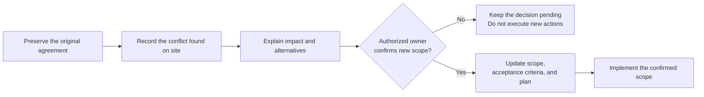

# Chapter 2: FDE Delivery Pitfalls and Lessons

Some customer projects are not especially difficult to code, yet remain difficult to deliver. The customer believes they bought automatic processing; the engineer builds assisted review. Tests pass, but the business owner says the system is not usable. The original developer leaves, and the next person cannot even discover why a feature was disabled.

This chapter draws useful practices from four public projects: FDEOps, FDEstack, OpenFDE, and Applied AI Field Guide. It continues the order-assistant case from [Chapter 1](../01-foundations/01-forward-deployed-engineering.md), focusing on how to handle the work rather than requiring installation of those tools.

## 2.1 On Site, You Discover the Original Requirement Cannot Be Followed

Applied AI Field Guide's [invoice-exception teaching case](https://github.com/davidahmann/applied-ai-field-guide/blob/6b557eb74ae1cc8dd82ab8048991c8fa54ce6a02/examples/invoice-exception/engagement/field-evidence.md) begins with a conflict: the original promise was automatic resolution and posting, but the observed process and policy require approval by a designated person first. The project therefore changes to preparing recommendations and staged corrections, leaving approval and posting to authorized people.

The lesson is not simply "add human review when there is risk." It is **how to reach a new agreement with the customer when the original requirement cannot be delivered**. Do not silently change the requirement, or assume that the person funding the project has authority to relax business policy.

In the order-assistant case, the operations lead originally requested automatic email replies. After observing support, the engineer proposes starting with drafts. The customer may reasonably ask:

> "I wanted to reduce manual work. If someone still has to read every email, what does this release actually solve?"

The answer must return to the real work: determine whether most time goes into checking orders and finding policies, or editing and sending. If fact-checking dominates, drafts may still be worthwhile. If review itself is the main cost, reassess the design rather than disguising the issue with a new feature name.

Leave a short record of this discussion:

| What needs to be explicit | Example from the order assistant |
|---|---|
| Original agreement | Investigate exceptions and automatically reply to customers |
| Reason for the change | Purchasing arrival is not customer delivery; the warehouse still needs to confirm delivery arrangements |
| Scope of this release | Assemble order facts, provide sources, and draft a reply that support sends |
| Effect on expected benefits | Measure whether lookup and editing save time; do not pretend human review time disappears |
| Who confirms it, and when | The person authorized to change project scope; obtain separate policy-owner approval for policy-related matters |

Mark the decision as pending, agreed, rejected, or deferred. A completed meeting does not imply customer acceptance. A scope change also requires reviewing acceptance criteria, the delivery plan, and commercial terms.

Another common problem is "just one more small thing." FDEOps's [hold-scope](https://github.com/suboss87/fdeops/blob/cc96340955b8a1de1aac8d5f971f794c4f8e6d6c/skills/fde/references/hold-scope.md) recommends recording who requested an addition, its impact, and the decision, then discussing whether it belongs in this release, a later release, or a separate project.

For example, if the customer asks the assistant to reserve inventory as well, the engineer needs to explain that this introduces write permissions, concurrent allocation, and reconciliation after failures. It is reasonable to discuss implementation, but not to promise to "just add it" and explain the work only after the schedule slips.

## 2.2 "Waiting for Customer Confirmation" Cannot Stay on the Board Forever

"ERP access is not enabled yet," "the inventory field needs confirmation," and "business will review it when they have time" sound like progress updates, but do not say who must do what.

FDEstack keeps unresolved questions in [`unknowns.md`](https://github.com/Dan-Cleary/fdestack/blob/552446066986969c789d3f44beb42b0cc4d6ad66/templates/unknowns.md), repeatedly surfacing them through customer-context, triage, and retrospective processes. The useful principle is simple: **when an important question has no answer, do not let it disappear into chat history.**

Write something more specific than "pending confirmation":

| Question | Who can confirm it | What remains blocked | Agreed next step |
|---|---|---|---|
| Does available inventory already deduct reserved quantities? | ERP API owner | We cannot determine how much stock remains allocatable | Check the API result against an order with an existing reservation |
| Can purchasing's estimated arrival date be shown externally? | Support policy owner | The customer draft does not display that date for now | Supply the current policy or an explicit approval record |
| Who can accept delivery of the first release? | Project owner | Formal acceptance cannot be scheduled | Confirm the business acceptance owner and their authority before the demo |

Agree on a date for each item. If it is unresolved by then, ask whom to escalate to, which alternative to use, or whether to pause the affected work—not simply whether to move the deadline again.

Also distinguish **not knowing** from **knowing what to do but not having done it yet**. Not knowing which orders a service account can access requires investigation. Knowing that the connector must filter by the representative's permissions, but not having implemented it, is a development task. Mix them together and the team may keep discussing without anyone starting the work.

Separate customer statements from interpretations too. "The system is too slow" is observed feedback from the owner. "They are really worried about their quarterly performance review" is the engineer's hypothesis. It may suggest a follow-up question, but must not become a fact in the customer record.

## 2.3 A Successful PoC Should Leave More Than Code

At the end of a PoC, the easiest artifact to retain is a directory that supports a demo. The easiest thing to lose is what the engineer discovered while making it work.

FDEstack's [`/poc`](https://github.com/Dan-Cleary/fdestack/blob/552446066986969c789d3f44beb42b0cc4d6ad66/skills/poc/SKILL.md) requires technical findings, design decisions, and reusable lessons to be written back separately into project records. Its [`/integrate`](https://github.com/Dan-Cleary/fdestack/blob/552446066986969c789d3f44beb42b0cc4d6ad66/skills/integrate/SKILL.md) goes further: it specifies rebuilding the production version from those records without reading the PoC directory.

You do not need to adopt "rewrite every PoC," but you should preserve the conclusions. After the order-assistant experiment, the next engineer should at least be able to understand:

| What happened in the PoC | What should remain |
|---|---|
| Some orders lacked a purchasing arrival estimate | Whether null is normal or a data problem, an authorized sample reference, and the environment used to check |
| The model described purchasing arrival as customer delivery | The incorrect output, correct handling, and a regression test |
| The demo used fixed JSON for inventory | Which API is still unconnected, and why this result does not validate live inventory |
| A CRM draft-save request timed out even though the write might have completed | Whether receipt lookup and deduplication are available; no automatic write retry until confirmed |

Preserve the conditions under which conclusions were established. A successful query in a test environment does not prove that the production service account has access. One correct order does not prove support for every order type. Record the environment, sample scope, and unresolved issues so the next engineer can decide which findings remain applicable.

Decide whether to retain code component by component. Tested pure computation and interface adapters may be reusable after review. Fixed data, temporary credential handling, and demo branches that bypass authorization must be removed or reimplemented. **Reusing what has been established is more useful than arguing about keeping or discarding everything.**

FDEstack's "do not read the PoC" rule is also a behavioral instruction for a skill, not operating-system isolation. It reminds the assistant how to work; actual file-access restrictions must come from the execution environment.

## 2.4 Project Memory Is Not Every Meeting Note Stuffed into a Model

When taking over a project, people often do not want to know everything said in the last meeting. They want to ask:

> "Why can the system only generate drafts? Who decided that? Does the restriction still apply?"

OpenFDE's [design](https://github.com/memovai/openfde/blob/e2dec1608f7cdebd8cfe587cd94fc0c346bff6bb/ARCHITECTURE.md) stores source material, facts, and tasks separately. Interviews and documents are sources. Extracted goals, constraints, and decisions enter project memory, and tasks use the relevant context. Facts retain their origins; new records supersede old ones rather than erasing history.

You can use this approach without first building a knowledge graph. A useful project record should answer:

| Field | Example |
|---|---|
| Current agreement | This release only saves reply drafts; it does not send automatically |
| Source | The meeting, policy, or confirmation record from an authorized owner |
| Reason | Delivery dates need human confirmation; automatic sending is not yet approved |
| Applicability | The current customer, current pilot, and specified ticket types |
| Status | When it takes effect and whether a later decision has superseded it |
| Affected components | Email-tool permissions, workflow configuration, acceptance cases, and operating instructions |

If the owner later approves automatic sending for one type of notification, do not simply edit the old record to say "automatic sending allowed." Retain the new decision's scope and effective time, and check whether tool permissions, approval handling, and tests must change. **Updating one sentence in memory does not automatically change system authorization.**

Nor does every agent task need the complete historical record. To fix order lookup, provide the current permission constraints, API documentation, confirmed field meanings, and relevant failures. Keep expired designs in history and retrieve them when tracing an earlier decision.

Sources help with traceability, but do not prove correctness by themselves. A sales promise and a business policy may both have sources; resolving a conflict still requires someone with authority to decide.

## 2.5 The Tests Passed—Who Says Delivery Is Complete?

"It is deployed," "it works well," and "the customer accepted it" often appear in the same status report, but answer different questions.

FDEOps's [handoff process](https://github.com/suboss87/fdeops/blob/cc96340955b8a1de1aac8d5f971f794c4f8e6d6c/skills/fde/references/close.md) distinguishes promises, measured results, and results accepted by the customer. Use that distinction directly in project communication:

| What can now be established | Evidence needed | What cannot also be claimed |
|---|---|---|
| Implementation meets technical requirements | Tests, API behavior, and failure-handling records for the relevant version | Support staff necessarily saved time |
| Pilot met the agreed targets | Results for tickets in the same scope, measurement definitions, and confirmation by the business acceptance owner | It applies to every customer and ticket |
| Receiving team can maintain the system | The receiving staff actually completed operating exercises | The original developer no longer owes support that has not been handed over |

In the order-assistant case, the engineer can demonstrate correct draft generation while support still spends more time checking the draft. Even if the pilot appears to save time, explain which tickets were counted, whether failed generations and human handoffs were excluded, and whether the business acceptance owner agrees with the measurement definition.

If the customer says, "Let's try it in production and look at the benefits next month," record a conditional trial decision, specifying what will be reviewed next and who decides whether to continue. Do not label it "project value accepted." A project owner's approval of a trial also does not replace approvals required for data, permissions, or business policy.

Tool status can cause confusion too. The OpenFDE version cited here already has an [`eval` command](https://github.com/memovai/openfde/blob/e2dec1608f7cdebd8cfe587cd94fc0c346bff6bb/apps/cli/src/commands/eval.ts) that records judgments. However, its [task transitions](https://github.com/memovai/openfde/blob/e2dec1608f7cdebd8cfe587cd94fc0c346bff6bb/packages/core/src/dispatch/tasks.ts) do not make a passing evaluation a mandatory condition for entering `accepted`. Even when a task is marked accepted, you still need to know who confirmed it and on what evidence.

## 2.6 During Handoff, Let Someone Else Handle the Failure

Clear documentation and a smooth demonstration by the original developer do not prove that the receiving team can operate the system.

Applied AI Field Guide's [handoff case](https://github.com/davidahmann/applied-ai-field-guide/blob/6b557eb74ae1cc8dd82ab8048991c8fa54ce6a02/examples/invoice-exception/engagement/adoption-and-handoff.md) explicitly lists what the receiving team must do: add evaluation cases, release and roll back, handle exceptions, and support users. FDEOps likewise emphasizes instructions that help the person responding to an alert solve the problem, not merely describe the architecture.

For the order assistant, arrange three exercises in a test environment. The receiving colleague operates the system; the original engineer only observes.

**First, make ERP temporarily unavailable.** Can the colleague understand the alert, locate the failed request, disable the affected feature, and let support continue with the original process? If they still need to call the original engineer to ask where the switch is, add that step to the runbook and repeat the exercise.

**Second, change a policy.** Ask the colleague to update a test policy, confirm retrieval uses the new version, and add a regression case prohibiting an unconfirmed delivery promise. This shows whether they understand the relationship among policy, index, prompt, and tests—not just how to restart a service.

**Third, handle an unknown save status.** Simulate CRM receiving a request but returning a timeout. Have the colleague look up the receipt, check for duplicate drafts, and decide how to recover. "Keep clicking retry until it succeeds" is not an incident-response method.

For each exercise, record only three things: who performed it, where they got stuck, and what would remove dependence on the original engineer next time. If the receiving team lacks production accounts, permissions, or support time, both parties must agree how to supply them. More pages of documentation cannot solve those problems.

By formal handoff, the records should identify the day-to-day maintainer, backup contact, escalation path, and obligations still owned by the original delivery team. The customer knows whom to contact, and the receiving team knows what it is responsible for.

## 2.7 A Second Customer Does Not Need a Copy of Everything from the First

FDEstack's cross-customer lesson records and FDEOps's [pattern capture](https://github.com/suboss87/fdeops/blob/cc96340955b8a1de1aac8d5f971f794c4f8e6d6c/skills/fde/references/encode-pattern.md) both aim to avoid starting each project from scratch. The useful assets are investigation methods, interface designs, and testing approaches—not raw customer material.

For example, "Inventory fields with the same name may have different meanings" is a reusable lesson. The first customer's orders, prices, and internal policies must not enter a shared knowledge store. Phrase the lesson as "Before connecting an inventory API, check whether reserved quantities have been deducted"; the next customer still needs to confirm it using its own data.

Do not turn one observation into an industry rule. "This authentication method is unavailable under customer A's current gateway configuration" has a clear scope. "This ERP never supports that authentication method" overstates the evidence. Preserve the environment, source, and conditions still needing validation so reuse does not spread old misunderstandings.

Where project records are stored must also follow customer requirements. FDEstack uses private Git repositories, FDEOps defaults to local files, and OpenFDE uses a local database. None of those choices automatically means data stays on the machine. A coding assistant may send files it reads to a model service, and the computer may have cloud synchronization enabled.

OpenFDE's [Claude extraction implementation](https://github.com/memovai/openfde/blob/e2dec1608f7cdebd8cfe587cd94fc0c346bff6bb/packages/core/src/extraction/anthropic.ts) sends the text or attachments to be extracted. FDEOps's [privacy notes](https://github.com/suboss87/fdeops/blob/cc96340955b8a1de1aac8d5f971f794c4f8e6d6c/PRIVACY.md) likewise distinguish the local CLI from data transmission to model services. Seeing "local-first" is not sufficient reason to import customer meeting notes.

At the start, a scope agreement, a table of unresolved questions, a record of decisions and experiments, and acceptance and handoff notes are usually enough to connect the work. Consider automatic extraction, graphs, and task workspaces when the volume becomes difficult to navigate—not by filling every template merely to adopt a tool.

## 2.8 Sources and Further Reading

Sources were compiled on **2026-09-10**. On 2026-09-15, OpenFDE's evaluation records, task-acceptance conditions, and Claude extraction data flow were additionally checked at the cited commit. This chapter adapts working methods to the order scenario; it does not treat any project's complete process as a universal standard. Links are pinned to the commits read so readers can compare them.

| Project | Suggested starting point | Cited version |
|---|---|---|
| [Applied AI Field Guide](https://github.com/davidahmann/applied-ai-field-guide) | [Five-minute introduction](https://github.com/davidahmann/applied-ai-field-guide/blob/6b557eb74ae1cc8dd82ab8048991c8fa54ce6a02/guide/field-guide-in-five-minutes.md), scope changes and handoff exercises in the invoice case | `6b557eb` |
| [FDEstack](https://github.com/Dan-Cleary/fdestack) | [Overview of eight skills](https://github.com/Dan-Cleary/fdestack/blob/552446066986969c789d3f44beb42b0cc4d6ad66/README.md), especially the connection between unresolved questions, PoC findings, and production implementation | `5524460` |
| [OpenFDE](https://github.com/memovai/openfde) | [Architecture](https://github.com/memovai/openfde/blob/e2dec1608f7cdebd8cfe587cd94fc0c346bff6bb/ARCHITECTURE.md): how sources, facts, tasks, and context connect | `e2dec16` |
| [FDEOps](https://github.com/suboss87/fdeops) | [Project overview](https://github.com/suboss87/fdeops/blob/cc96340955b8a1de1aac8d5f971f794c4f8e6d6c/README.md), requirement-change and handoff skills | `cc96340` |

For technical implementation, continue with [Retries and Idempotency](../../engineering/02-request-reliability/04-retry-timeout-idempotency-circuit-breaker.md), [Versioning](../../engineering/05-release-pipeline/09-prompt-model-data-versioning.md), and [Feedback Data Processing](../../engineering/06-performance-operations/13-feedback-loop-data-flywheel.md).

Back to the [field practice module](README.md).
