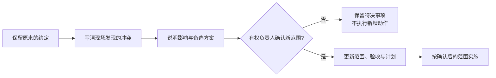

# 第二章：FDE 项目踩坑与交付经验

有些客户项目，代码并没有特别难写，却迟迟交不出去。客户以为买的是自动处理，工程师做的是辅助审核；测试已经通过，业务负责人却说还不能用；原开发者一走，接手的人连为什么禁用某个功能都不知道。

本章从 FDEOps、FDEstack、OpenFDE 和 Applied AI Field Guide 四个公开项目中，整理值得借鉴的做法。下面沿用[第一章](../01-foundations/01-forward-deployed-engineering.zh.md)的订单助手，重点看事情怎么处理，不要求安装这些工具。

## 2.1 到了现场才发现，原来的需求不能照做

Applied AI Field Guide 的[发票异常教学案例](https://github.com/davidahmann/applied-ai-field-guide/blob/6b557eb74ae1cc8dd82ab8048991c8fa54ce6a02/examples/invoice-exception/engagement/field-evidence.md)从一个冲突开始：原来的承诺是自动处理并入账，现场流程和政策却要求指定人员先审批。项目因此改成准备建议和待审内容，把审批、入账留给有权操作的人。

值得学的不是“遇到风险就加个人工审核”，而是**发现原需求做不了以后，怎样和客户重新约定**。不能把原来的要求悄悄改掉，也不能以为给项目出钱的人就一定有权放宽业务政策。

换到订单助手里，运营负责人原本要自动回邮件。工程师观察客服工作后，提出先做草稿。此时客户很可能问：

> “我原来想减少人工处理，现在每封还要人看，这一期到底解决了什么？”

回答需要回到实际工作：先确认时间主要花在查订单、找政策，还是编辑和发送。若查证占了大部分，草稿仍可能值得做；若主要成本就在审核，方案就要重新评估，不能靠换个功能名称把这件事带过去。

这次讨论最好留下一份短记录：

| 要说清楚的事 | 订单助手里的例子 |
|---|---|
| 原来约定什么 | 查询异常并自动回复客户 |
| 为什么需要调整 | 采购到货不是客户送达，交期仍需仓库确认 |
| 本期准备做到哪里 | 汇总订单事实、给出来源、起草回复，由客服发送 |
| 对收益有什么影响 | 先测查证和编辑是否省时，不把人工审核时间算没 |
| 谁确认，什么时候确认 | 有权调整项目范围的负责人；涉及政策的部分另请政策负责人确认 |

记录要标明“待确认、同意、拒绝或延期”，而不是开完会就默认客户接受了。改范围后，验收条件、交付计划和费用约定也要一起看。

另一个常见问题是“顺手再做一点”。FDEOps 的 [hold-scope](https://github.com/suboss87/fdeops/blob/cc96340955b8a1de1aac8d5f971f794c4f8e6d6c/skills/fde/references/hold-scope.md)建议把新增要求的提出人、影响和处理决定记下来，再讨论放在本期、下一期，还是另开项目。

比如客户要求助手顺便预留库存，工程师要说明这已经涉及写入权限、并发占用和失败后的核对。可以讨论怎么做，但不能先答应“顺手加上”，到延期时才解释工作量。

## 2.2 “等客户确认”不能永远挂在任务栏

“ERP 权限还没开”“库存字段需要确认”“业务有空再看”都像是在跟进，实际却看不出谁应该做什么。

FDEstack 把待确认问题放进 [`unknowns.md`](https://github.com/Dan-Cleary/fdestack/blob/552446066986969c789d3f44beb42b0cc4d6ad66/templates/unknowns.md)，再由客户上下文、任务分诊和复盘流程反复带出来。值得借鉴的是：**重要问题没有答案时，不让它随着聊天记录沉下去。**

问题可以写得比“待确认”再具体一点：

| 问题 | 找谁确认 | 没有答案会挡住什么 | 约定下一步 |
|---|---|---|---|
| 可用库存是否扣除了已预留数量 | ERP 接口负责人 | 不能判断还有多少货可分配 | 对照一张有预留记录的订单，核对接口结果 |
| 采购预计到货能否对外展示 | 客服政策负责人 | 客户草稿暂不显示这个日期 | 提供当前政策或明确的审批记录 |
| 谁能签收第一期交付 | 项目负责人 | 无法安排正式验收 | 在演示前确认业务验收人及其权限 |

再给每项约定一个时间。到期没解决，要问的是“该升级找谁、换什么方案，还是先停下受影响的部分”，不是机械地把截止日期往后挪。

也要分清**不知道**和**知道但还没做好**。不知道服务账号能访问哪些订单，需要调查；已经确认要按客服权限过滤，只是连接器还没实现，那是开发任务。两者混在一起，团队会一直讨论，却没人开始做。

客户的话同样要分开记录。负责人说“系统太慢”，这是已知反馈；工程师猜测“他其实担心季度考核”，只是推测。推测可以提醒你下次怎么问，不能直接变成客户档案里的事实。

## 2.3 PoC 跑通以后，别只留下代码

PoC 结束时，最容易留下的是一个能演示的目录。最容易丢掉的，是为了跑通它，工程师到底发现了什么。

FDEstack 的 [`/poc`](https://github.com/Dan-Cleary/fdestack/blob/552446066986969c789d3f44beb42b0cc4d6ad66/skills/poc/SKILL.md)要求把技术发现、设计决定和可复用经验分别写回项目记录。它的 [`/integrate`](https://github.com/Dan-Cleary/fdestack/blob/552446066986969c789d3f44beb42b0cc4d6ad66/skills/integrate/SKILL.md)更进一步，约定不读取 PoC 目录，而是根据这些记录重新实现生产版本。

不必照搬“所有 PoC 都重写”，但应该把结论留下。订单助手的试验结束后，接手的人至少要能看懂下面几类事情：

| PoC 中发生了什么 | 应该留下什么 |
|---|---|
| 发现某些订单没有采购预计到货日 | 确认空值是正常情况还是数据问题，留下授权可用的样本引用和核对环境 |
| 模型把采购到货写成客户送达 | 错误输出、正确处理方式，以及防止再次出现的测试 |
| 为了演示，库存用的是固定 JSON | 哪个接口尚未接通，不能把这次结果当成实时库存验证 |
| 旧 CRM 保存草稿超时后，可能已经写入 | 是否能查回执、是否支持去重；没确认前不自动重试写入 |

这里要保留验证条件。在测试环境能查询，不等于生产服务账号也有权限；一张订单没有出错，不等于全部订单类型都支持。把环境、样本范围和仍未解决的部分写清楚，下一位工程师才能决定哪些结论可以沿用。

代码是否保留，可以按部分判断。已经有测试的纯计算函数和接口适配逻辑，审查后可以复用；固定数据、临时凭据处理、绕过鉴权的演示分支，则要移除或重新实现。**复用经过确认的东西，比争论“全留还是全扔”更有用。**

FDEstack 的“不读 PoC”也是 Skill 的行为约定，不是操作系统权限隔离。它能提醒助手按规定工作，真正的文件访问限制还得由运行环境提供。

## 2.4 项目记忆不是把会议纪要全塞给模型

接手一个项目时，人经常想问的不是“上次会议说了哪些话”，而是：

> “为什么现在只能生成草稿？当时是谁决定的？这个限制还有效吗？”

OpenFDE 的[设计](https://github.com/memovai/openfde/blob/e2dec1608f7cdebd8cfe587cd94fc0c346bff6bb/ARCHITECTURE.md)把材料、事实和任务分开保存。访谈和文档是来源，从中提取出的目标、约束、决定等进入项目记忆，任务再取用相关上下文。事实保留出处，变化通过新记录替代旧记录，而不是直接抹去过去。

不用先搭知识图谱，也能采用这个思路。一条有用的项目记录应能回答：

| 字段 | 例子 |
|---|---|
| 当前约定 | 本期只保存回复草稿，不自动外发 |
| 来源 | 哪次会议、哪份政策、哪位有权负责人的确认记录 |
| 原因 | 交期需要人工确认，自动发送尚未获准 |
| 适用范围 | 当前客户、当前试点和指定工单类型 |
| 状态 | 何时生效，是否已被后续决定替代 |
| 影响到哪里 | 发信工具权限、工作流配置、验收用例和操作说明 |

后来负责人同意对某类通知开放自动发送，也不该把旧记录简单改成“允许自动发送”。要留下新决定的适用范围和生效时间，并检查原来的工具权限、审批方式和测试是否需要跟着调整。**记忆里更新了一句话，不会自动改变系统授权。**

给 Agent 分任务时，也不必把全部历史资料都带上。让它修订单查询，就给它当前权限约束、接口说明、已确认的字段含义和相关失败样本；过期方案放在历史记录里，需要追溯时再读。

出处能帮助追查，但不能单独证明内容正确。一个销售承诺和一条业务政策都可能有来源，发生冲突时仍要找有权决定的人处理。

## 2.5 测试过了，谁说这次交付完成了

“已经上线”“效果不错”“客户接受了”经常出现在同一份周报里，但它们回答的是不同问题。

FDEOps 的[交接流程](https://github.com/suboss87/fdeops/blob/cc96340955b8a1de1aac8d5f971f794c4f8e6d6c/skills/fde/references/close.md)要求区分承诺、测到的结果和客户接受的结果。这个区别可以直接放进项目沟通里：

| 现在能确认什么 | 需要什么依据 | 还不能顺便宣布什么 |
|---|---|---|
| 实现满足技术要求 | 对应版本的测试、接口行为和故障处理记录 | 客服一定省了时间 |
| 试点达到了约定目标 | 同范围工单的结果、统计方法和业务验收人的确认 | 所有客户和所有工单都适用 |
| 接手团队能够维护 | 接手人员实际完成操作演练 | 原开发者可以不再承担尚未交清的支持责任 |

在订单助手里，工程师可以演示草稿生成正确，但客服还可能花更多时间检查它。即使试点看起来省时，也要说明哪些工单算进来了，生成失败和转人工有没有被排除，以及业务验收人是否接受这个口径。

如果客户说“先上线试试，收益下个月再看”，就把它记成带条件的试用决定，写明下次看什么、由谁决定继续。不要把它写成“项目价值已验收”。项目负责人同意试用，也不能代替数据、权限或业务政策要求的审批。

工具中的状态也容易造成误会。OpenFDE 在本章引用版本中已有 [`eval` 命令](https://github.com/memovai/openfde/blob/e2dec1608f7cdebd8cfe587cd94fc0c346bff6bb/apps/cli/src/commands/eval.ts)，会记录评判结果；但[任务状态转换](https://github.com/memovai/openfde/blob/e2dec1608f7cdebd8cfe587cd94fc0c346bff6bb/packages/core/src/dispatch/tasks.ts)没有把评测通过设为进入 `accepted` 的硬条件。因此，即使任务显示“已接受”，还得知道是谁确认、依据是什么。

## 2.6 交接时，换一个人处理故障

文档讲得很清楚，原开发者演示也很顺，不代表接手团队真的会用。

Applied AI Field Guide 的[交接案例](https://github.com/davidahmann/applied-ai-field-guide/blob/6b557eb74ae1cc8dd82ab8048991c8fa54ce6a02/examples/invoice-exception/engagement/adoption-and-handoff.md)把接手方需要完成的事情单独列出来：添加评测样本、发布和回滚、处理异常、支持用户。FDEOps 则强调，交接说明要能帮接到告警的人解决问题，而不只是介绍架构。

订单助手交接时，可以在测试环境安排三次操作，由接手同事动手，原工程师只观察：

**第一次，让 ERP 暂时不可用。**接手的人能否看懂告警，找到失败请求，停用受影响的功能，并让客服继续按原流程处理？如果还得打电话问原工程师“这个开关在哪”，就把这一步补进操作说明，再做一次。

**第二次，调整一条政策。**请接手同事更新测试政策、确认检索取到了新版本，再加入一条“不允许承诺交期”的回归样本。这样能看到他是否理解政策、索引、提示词和测试之间的关系，而不只是会重启服务。

**第三次，处理一次保存状态未知。**模拟 CRM 已收到请求但返回超时，让他查回执、核对有没有重复草稿，再决定怎样恢复。不要把“点重试直到成功”当成故障处理方法。

每次演练只记三件事：谁操作、哪里卡住、下一次怎样才能不再依赖原工程师。若接手团队缺少生产账号、权限或支持时间，要由双方明确补齐安排；多写几页文档解决不了这些问题。

到正式交接时，至少能找到日常维护人、备用联系人、故障升级路径，以及仍由原交付团队承担的事项。客户知道出了事该找谁，接手的人也知道自己需要负责到哪里。

## 2.7 第二个客户来了，不要复制第一个客户的全部做法

FDEstack 的跨客户经验记录，以及 FDEOps 的[模式整理](https://github.com/suboss87/fdeops/blob/cc96340955b8a1de1aac8d5f971f794c4f8e6d6c/skills/fde/references/encode-pattern.md)，都希望下一次项目不用从零开始。真正值得带走的是排查方法、接口设计和测试思路，不是客户的原始材料。

比如“库存字段名相同，含义也可能不同”是一条值得复用的提醒；第一家客户的订单、价格和内部政策，则不能直接进入共享经验库。把经验写成“接库存接口前，核对是否扣除了预留数量”，下一家仍然要用自己的数据确认。

也不要把一次观察变成行业规则。“在客户 A 的当前网关配置下，某种鉴权方式不可用”有明确范围；“这种 ERP 都不支持该鉴权方式”就说过头了。保留环境、来源和待验证条件，复用才不会变成传播旧误会。

项目记录放在哪里，同样要按客户要求决定。FDEstack 使用私有 Git 仓库，FDEOps 默认使用本地文件，OpenFDE 使用本地数据库，但这些选择都不自动等于“数据不会离开机器”。编程助手读取文件后可能发送给模型服务，电脑也可能启用了云同步。

OpenFDE 的[Claude 抽取实现](https://github.com/memovai/openfde/blob/e2dec1608f7cdebd8cfe587cd94fc0c346bff6bb/packages/core/src/extraction/anthropic.ts)会发送待抽取的文本或附件；FDEOps 的[隐私说明](https://github.com/suboss87/fdeops/blob/cc96340955b8a1de1aac8d5f971f794c4f8e6d6c/PRIVACY.md)也区分了本地 CLI 和模型服务的数据传输。不能只看见 local-first，就直接导入客户会议纪要。

开始时，一份范围约定、一张待确认问题表、一份决策与试验记录，再加验收和交接说明，通常已经能把工作接起来。等资料多到难以查找，再考虑自动提取、图谱和任务工作台，不必为了采用一个工具先填写它的全部模板。

## 2.8 来源与继续阅读

资料整理日期：**2026-09-10**；2026-09-15 另按所引提交复核了 OpenFDE 的评测记录、任务接受条件与 Claude 抽取数据流。本章借鉴工作方法并用订单场景重新组织，不把原项目的全部流程当作通用标准。链接固定到阅读时的提交，方便对照。

| 项目 | 建议先看哪里 | 引用版本 |
|---|---|---|
| [Applied AI Field Guide](https://github.com/davidahmann/applied-ai-field-guide) | [五分钟导读](https://github.com/davidahmann/applied-ai-field-guide/blob/6b557eb74ae1cc8dd82ab8048991c8fa54ce6a02/guide/field-guide-in-five-minutes.md)、发票案例中的范围调整和接手演练 | `6b557eb` |
| [FDEstack](https://github.com/Dan-Cleary/fdestack) | [八个 Skills 的总览](https://github.com/Dan-Cleary/fdestack/blob/552446066986969c789d3f44beb42b0cc4d6ad66/README.md)，尤其是待确认问题、PoC 结论和生产实现之间的衔接 | `5524460` |
| [OpenFDE](https://github.com/memovai/openfde) | [架构说明](https://github.com/memovai/openfde/blob/e2dec1608f7cdebd8cfe587cd94fc0c346bff6bb/ARCHITECTURE.md)，看来源、事实、任务和上下文怎样连接 | `e2dec16` |
| [FDEOps](https://github.com/suboss87/fdeops) | [项目总览](https://github.com/suboss87/fdeops/blob/cc96340955b8a1de1aac8d5f971f794c4f8e6d6c/README.md)、需求变更和交接技能 | `cc96340` |

需要补技术实现时，可以继续读[重试与幂等](../../engineering/02-request-reliability/04-retry-timeout-idempotency-circuit-breaker.zh.md)、[版本管理](../../engineering/05-release-pipeline/09-prompt-model-data-versioning.zh.md)和[反馈数据处理](../../engineering/06-performance-operations/13-feedback-loop-data-flywheel.zh.md)。

返回 [现场经验模块](README.zh.md)。
