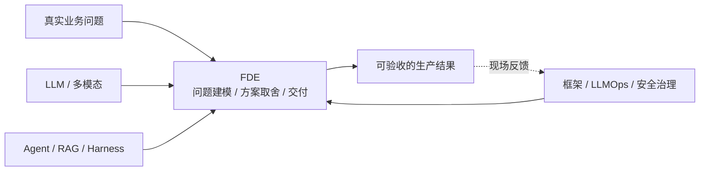

# FDE 相关知识点

本主题讨论 **Forward Deployed Engineering（前线部署工程）**：工程师如何进入真实业务现场，把模型能力、客户数据和既有系统组合成可验收、可运营、可复用的生产系统。

FDE 不是某套框架，也不只是一个岗位名称。Palantir、OpenAI 等公司的具体组织方式各不相同，本主题关注其中可迁移的工程方法：问题建模、Eval 验收、方案选型、系统集成、生产交付与现场反馈产品化。

## 子模块

1. [FDE 基础与交付方法（第 1 章）](01-foundations/README.md)

## 主题定位

## 与其他主题的边界

| 主题 | 负责回答的问题 | FDE 如何使用 |
|---|---|---|
| LLM / 多模态 AI | 模型具备什么能力 | 判断能力边界和模型选择 |
| Agent / RAG / Tools | 应用系统如何构建 | 选择最小可行架构 |
| 框架与编排 | 用什么抽象实现 | 控制交付速度与框架锁定 |
| AI Engineering | 如何稳定上线和运营 | 建立 Eval、发布、观测和 SLO |
| AI 安全与治理 | 如何控制跨层风险 | 满足客户数据、权限、审计和合规要求 |
| FDE | 如何把上述能力转化成客户结果 | 对问题、交付和现场反馈闭环负责 |

返回[文档主题索引](../README.md)。
