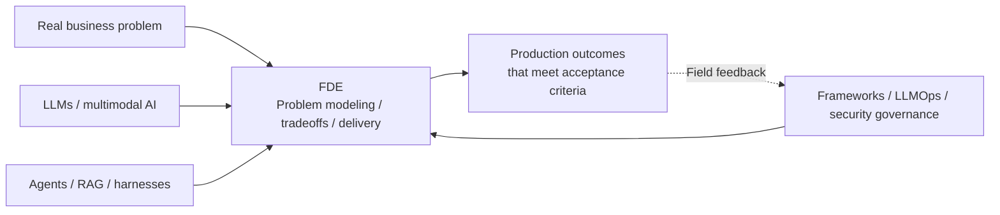

# Forward Deployed Engineering

**Forward Deployed Engineering (FDE)** asks how an engineer takes a customer's problem, understands it, and delivers a system people want to use and can maintain when things go wrong.

Palantir, OpenAI, and Baseten organize the role differently. This topic starts with the work they share: observing business processes, integrating customer systems, evaluating with users, and reusing what worked in one project in the next.

You can start with the field accounts in Section 1.10 of the foundations chapter, then read the order-exception assistant in Section 1.11: why support could not use the first draft, how the team corrected the delivery-date error, and why it ultimately did not use multiple agents. Section 1.12 continues with customer requests for automatic sending, model upgrades, and wider adoption.

Chapter 2 focuses on delivery lessons: who confirms changed requirements, what must remain after a PoC, how a project continues when people change, and how customer acceptance differs from technical completion. Its practices come from four open-source projects; applying them does not require installing those tools.

Supplementary reading on related roles appears in [Chapter 1](01-foundations/01-forward-deployed-engineering.md), Section 1.2.1, "Working with Product and Design." The AI product manager discussion covers verifying research, choosing requirements, prototypes and PRDs, implementation changes, and post-launch feedback.

## Modules

1. [FDE Foundations and Delivery Methods (Chapter 1)](01-foundations/README.md)
2. [Field Practice and Delivery Pitfalls (Chapter 2)](02-field-practice/README.md)

## Where This Topic Fits

## How It Relates to Other Topics

| Topic | Question it answers | How FDE uses it |
|---|---|---|
| LLMs / multimodal AI | What can models do? | Understand capability limits and select models |
| Agents / RAG / tools | How are application systems built? | Choose the smallest viable architecture |
| Frameworks and orchestration | Which abstractions should implement the system? | Balance delivery speed against framework lock-in |
| AI Engineering | How can systems be launched and operated reliably? | Establish evals, releases, observability, and SLOs |
| AI Safety and Governance | How are risks controlled across layers? | Meet customer requirements for data, permissions, audit, and compliance |
| FDE | How do these capabilities become customer outcomes? | Own problem definition, delivery, and action on field feedback |

Back to the [documentation topic index](../README.md).
