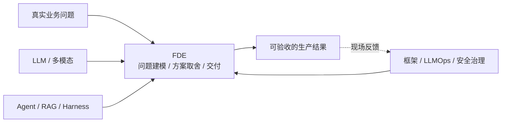

# FDE 相关知识点

**Forward Deployed Engineering（前线部署工程）**关心的是：客户有一个问题，工程师怎样把它弄清楚，再交付一个有人愿意用、出了问题也能维护的系统。

Palantir、OpenAI、Baseten 对这个岗位的安排不完全一样。这里先讲共同的工作：看业务流程、接客户系统、和用户一起验收，以及把一个项目里做好的东西用到下一个项目。

可以先看基础章 1.10 节的一线分享，再读 1.11 节的订单异常助手：客服为什么不敢用第一版草稿，团队怎样修正交期错误，为什么最后没有做多 Agent。1.12 节接着讨论客户要求自动发信、模型升级和推广使用时会遇到的问题。

第二章单独整理现场经验：需求改了谁确认，PoC 之后要留下什么，项目换人后怎样继续，以及客户验收和技术完成有什么区别。做法来自四个开源项目，不需要先安装工具才能使用。

## 子模块

1. [FDE 基础与交付方法（第 1 章）](01-foundations/README.md)
2. [现场经验与踩坑（第 2 章）](02-field-practice/README.md)

## 主题定位

## 与其他主题的边界

| 主题 | 负责回答的问题 | FDE 如何使用 |
|---|---|---|
| LLM / 多模态 AI | 模型具备什么能力 | 判断能力边界和模型选择 |
| Agent / RAG / Tools | 应用系统如何构建 | 选择最小可行架构 |
| 框架与编排 | 用什么抽象实现 | 控制交付速度与框架锁定 |
| AI Engineering | 如何稳定上线和运营 | 建立 Eval、发布、观测和 SLO |
| AI 安全与治理 | 如何控制跨层风险 | 满足客户数据、权限、审计和合规要求 |
| FDE | 如何把上述能力转化成客户结果 | 对问题、交付和现场反馈闭环负责 |

返回[文档主题索引](../README.md)。
