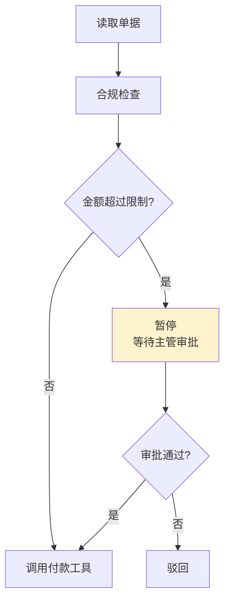
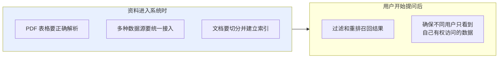
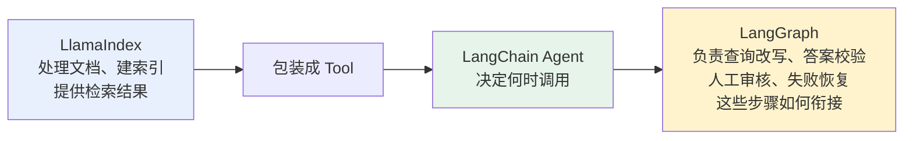
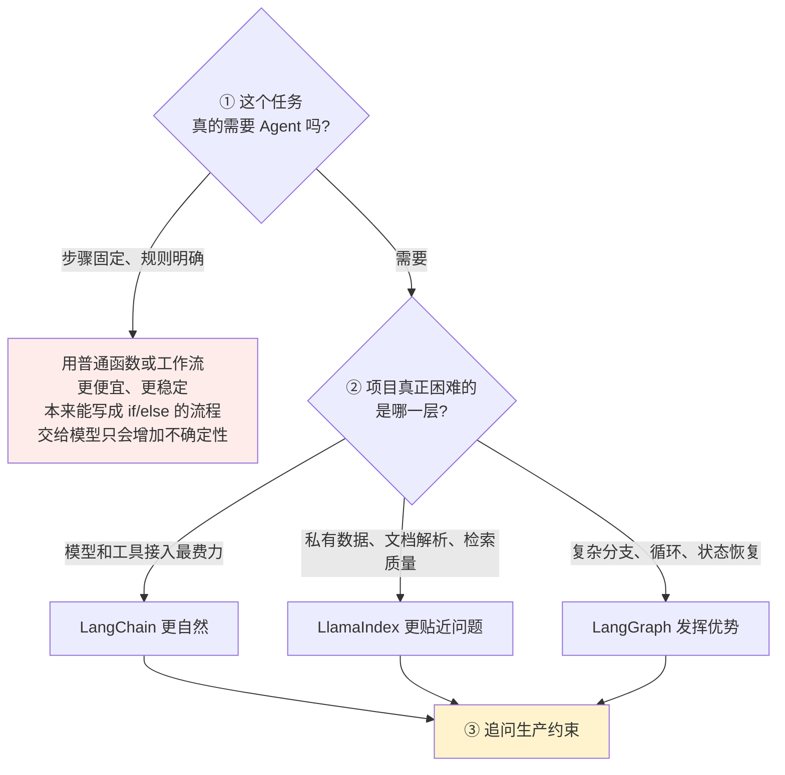

# 第一章：主流 AI Agent 开发框架概览

## 1.1 Agent 框架到底解决了什么

假设不用任何框架，自己实现一个能查资料、调接口、记上下文的 Agent，需要做多少事？

**基础部分**：接入模型、定义工具协议、实现 Agent 循环、把工具结果重新交回模型。

**工程部分**：状态管理、重试、超时、流式输出、人工确认、运行追踪。

> **完成一次演示并不难，真正困难的是：系统执行十几步之后能否恢复，以及出错时能否快速定位问题。**

Agent 框架就是把这些重复工程抽象成可复用组件。**但不同框架选择的重点并不相同**：

| 框架 | 重点 |
|---|---|
| **LangChain** | 通用组件和快速集成 |
| **LangGraph** | 状态与流程控制 |
| **LlamaIndex** | 数据与检索 |

> **所以回答这类问题时不要只比较谁更强，而要说清楚：在什么业务约束下，哪个框架更合适。**

## 1.2 LangChain 的定位

LangChain 已经不只是早期那个「把多个 Prompt 串成 Chain」的库。它提供**模型、消息、Prompt、工具、结构化输出、中间件和 Agent** 等通用抽象，并集成了大量模型供应商、向量数据库和外部工具。

### 1.2.1 最大的价值：集成范围广、开发速度快

需要切换不同模型，接入搜索、数据库或 MCP 工具，快速实现 RAG Agent、SQL Agent 或客服助手时，**LangChain 能省掉大量协议适配和样板代码**。

### 1.2.2 边界

**高层抽象更适合常见 Agent 模式。** 当业务出现**复杂循环、精细分支、长时间暂停和断点恢复**时，就需要下沉到 LangGraph 控制执行流程。

## 1.3 LangGraph 与 LangChain 是什么关系

LangGraph 用 **State + Node + Edge** 表达 Agent 工作流：

| 概念 | 职责 |
|---|---|
| **State** | 保存共享状态 |
| **Node** | 执行模型或工具 |
| **Edge** | 决定下一步运行哪个节点 |

**它重点解决**：循环、条件分支、并行执行、持久化、暂停恢复、人工介入。

### 1.3.1 一个具体例子

> **这类流程用图结构表达，会比把所有逻辑塞进一个 Agent 循环更加清晰。**

### 1.3.2 正确的表述方式

**LangChain 的 Agent 高层接口现在运行在 LangGraph 之上。**

> **可以把 LangChain 理解为常用组件和预制路线，把 LangGraph 理解为支撑这些路线的道路系统。**
>
> 简单 Agent 优先用 LangChain；需要精细控制时，再下沉到 LangGraph。

**不要把两者说成互相替代的框架**——它们既有职责差异，也经常组合使用。

## 1.4 LlamaIndex 强在哪里

很多人把它简单理解成「另一个 LangChain」，**这会忽略它最有辨识度的能力**。

**LlamaIndex 更强调在私有数据之上构建 AI 应用**：数据连接、文档解析、切分、索引、检索、重排、Query Engine、结构化数据访问，也可以把 RAG Pipeline 封装成 Agent 使用的工具。

### 1.4.1 为什么「让 Agent 查企业知识库」的难点不在工具调用

> **问题是沿着整条数据链路逐步出现的，不是多注册一个搜索工具就能解决的。**

**这些正是 LlamaIndex 更擅长的方向**——企业知识库、文档 Agent、研究助手、复杂 RAG 系统。

### 1.4.2 但它也不只是 RAG 工具

LlamaIndex 同样提供 Agent、Memory、多 Agent Pattern 和 Workflow。

**从选型角度看**：LangChain 的入口更偏**通用 Agent 组装**，LlamaIndex 的优势更集中在**数据密集型应用**。

## 1.5 三个框架怎么配合

**它们不一定三选一。**

**三者分别解决数据、Agent 组装和流程控制问题，而不是在同一层重复造轮子。**

> **但是否需要同时引入三者，取决于项目复杂度。** 只是简单工具调用，不必为了技术栈完整而引入 LlamaIndex；只是普通知识库问答，也不一定需要复杂的 LangGraph 工作流。

## 1.6 其他框架要了解到什么程度

| 框架 | 定位 | 适合 |
|---|---|---|
| **OpenAI Agents SDK** | 围绕 Agent、Runner、Tools、Handoffs、Guardrails、Sessions、Tracing 的**轻量开发方式** | 以 OpenAI 模型和接口为主，快速实现客服分流、语音助手、工具 Agent |
| **CrewAI** | 用**角色、目标、任务、团队**表达多 Agent 协作，通过 Flow 管理状态、条件和事件 | 研究报告、内容生产、多角色审核等**容易映射为团队分工**的场景。**但角色越多，调用成本和协作不确定性也越高** |
| **AutoGen / Semantic Kernel / Microsoft Agent Framework** | 更偏微软生态或存量项目 | 知道定位即可 |
| **Dify** | **更接近低代码 AI 应用开发平台** | **不宜和 Python Agent 框架放在同一层面比较** |

## 1.7 到底该怎么选：从外到内收窄

### 1.7.1 第三步：Demo 能跑和系统能上线是两回事

**流程越长，越要继续追问**：

- 中断后能否恢复？
- 敏感动作是否需要审批？
- 重复执行会不会产生副作用？
- 不同用户的数据能否隔离？
- 出错后是否留有完整轨迹？

> **真正决定框架是否合适的，往往正是这些原型阶段看不见的生产约束。**

### 1.7.2 掌握程度建议

| 框架 | 核心定位 | 更适合的场景 | 掌握程度 |
|---|---|---|---|
| **LangChain** | 通用模型、工具和 Agent 抽象 | 工具型 Agent、RAG Agent、SQL Agent | **重点掌握** |
| **LangGraph** | 有状态的图式流程编排 | 循环分支、暂停恢复、人工审批 | **重点掌握** |
| **LlamaIndex** | 数据接入、索引和检索 | 企业知识库、文档 Agent、复杂 RAG | **重点掌握** |
| **OpenAI Agents SDK** | OpenAI 技术栈下的轻量 SDK | 客服分流、语音助手、工具 Agent | 了解并按需深入 |
| **CrewAI** | 角色化多 Agent 协作 | 研究、内容生产、多角色审核 | 了解并按需深入 |

## 1.8 常见错误

### 1.8.1 一口气罗列十几个框架

**说得越多，越容易被追问到自己只是听过名字的那个。** 围绕三个主力框架展开更稳。

### 1.8.2 把 LangChain 和 LangGraph 说成互相替代

**LangChain 的 Agent 高层接口就跑在 LangGraph 之上**，两者是分层关系。

### 1.8.3 把 LlamaIndex 当成「另一个 LangChain」

它的辨识度在整条数据链路：解析、切分、索引、重排、权限过滤。

### 1.8.4 跳过「这个任务真的需要 Agent 吗」这一步

**步骤固定、规则明确的流程用普通函数更便宜更稳定。**

### 1.8.5 只比功能数量不看业务约束

要问的是「项目真正困难的是哪一层」。

### 1.8.6 只看 Demo 能不能跑

中断恢复、审批、幂等、数据隔离、可追溯这些生产约束才是决定项。

### 1.8.7 把 Dify 和 Python Agent 框架平级比较

它是低代码平台，不在同一层面。

## 1.9 本章总结

1. **框架解决的是重复工程**：模型接入、工具协议、Agent 循环，以及状态、重试、超时、流式、审批、追踪；
2. **难的不是跑通一次演示，是十几步之后能否恢复、出错能否定位**；
3. **三个主力框架各有侧重**：LangChain 偏通用组件与集成，LangGraph 偏有状态流程编排，LlamaIndex 偏数据与检索；
4. **LangChain 的价值是集成广、开发快**，边界是复杂循环、精细分支、暂停恢复；
5. **LangGraph 用 State + Node + Edge 表达工作流**，解决循环、分支、并行、持久化、人工介入；
6. **两者是分层关系不是替代关系**——LangChain 是预制路线，LangGraph 是道路系统；
7. **LlamaIndex 的辨识度在整条数据链路**，而不是工具调用循环；
8. **三者可以组合**：LlamaIndex 供检索能力 → 包装成 Tool → LangChain Agent 决定调用 → LangGraph 编排外围流程；
9. **但不要为了技术栈完整而堆框架**；
10. **选型顺序是从外到内**：先问是否真的需要 Agent，再找项目最难的那一层，最后用生产约束做最终判断。

> **一句话概括：选框架的核心问题从来不是「谁功能多」，而是「我这个项目最难的那一层是模型接入、数据链路，还是流程控制」——答案决定了从哪个框架切入。**

## 参考资料

- [LangChain 官方文档](https://docs.langchain.com/oss/python/langchain/overview)
- [LangGraph 官方文档](https://docs.langchain.com/oss/python/langgraph/overview)
- [LlamaIndex 官方文档](https://docs.llamaindex.ai/)
- [OpenAI Agents SDK](https://openai.github.io/openai-agents-python/)
- [CrewAI 官方文档](https://docs.crewai.com/)
- [AutoGen 仓库](https://github.com/microsoft/autogen)
- [Anthropic: Building effective agents](https://www.anthropic.com/engineering/building-effective-agents)
