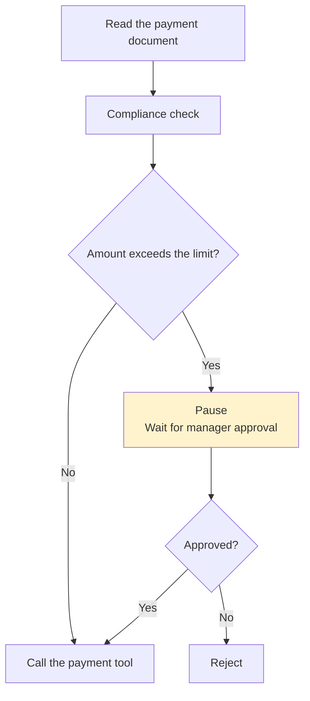
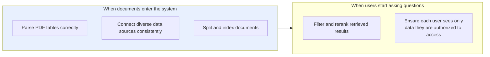
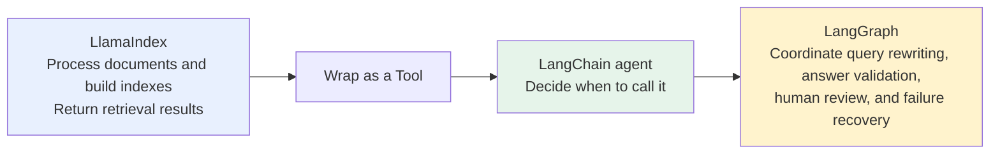
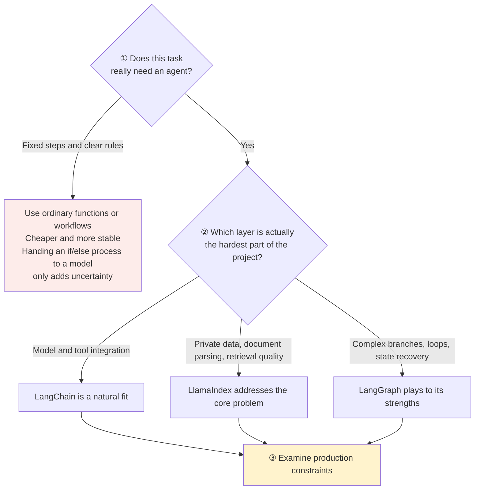

# Chapter 1: An Overview of Major AI Agent Development Frameworks

## 1.1 What problems do agent frameworks solve?

Without a framework, building an agent that can look up information, call APIs, and retain context usually requires at least two kinds of work:

- Basic integration: connect to a model, define the tool protocol, implement the agent loop, and return tool results to the model.
- Engineering capabilities: state management, retries, timeouts, streaming output, human confirmation, and execution tracing.

Getting a demo to work once is not particularly difficult. The harder part is recovering after a dozen or so steps and quickly identifying what went wrong.

Agent frameworks turn this recurring engineering work into reusable components. **Different frameworks, however, emphasize different things**:

| Framework | Focus |
|---|---|
| **LangChain** | General-purpose components and rapid integration |
| **LangGraph** | State and flow control |
| **LlamaIndex** | Data and retrieval |

A more useful question when comparing frameworks is: given the business constraints, which framework best addresses the project's main difficulty?

## 1.2 Where LangChain fits

LangChain is no longer just the early library for "connecting several prompts into a chain." It provides general-purpose abstractions for **models, messages, prompts, tools, structured output, middleware, and agents**, with integrations for many model providers, vector databases, and external tools.

### 1.2.1 Main value: broad integrations and faster development

When you need to switch models, connect search, databases, or MCP tools, or quickly build a RAG agent, SQL agent, or customer-support assistant, **LangChain can eliminate much of the protocol adaptation and boilerplate**.

### 1.2.2 Boundaries

**High-level abstractions work best for common agent patterns.** A standard agent can be configured with a checkpointer and human-approval middleware; pausing and resuming alone do not require rewriting it as a graph. Move down to LangGraph only when the business topology, state fields, or recovery boundaries exceed what the standard loop and middleware can express.

## 1.3 How are LangGraph and LangChain related?

LangGraph expresses agent workflows through **State + Node + Edge**:

| Concept | Responsibility |
|---|---|
| **State** | Hold shared state |
| **Node** | Execute a model or tool |
| **Edge** | Determine which node runs next |

LangGraph primarily handles loops, conditional branches, parallel execution, persistence, pausing and resuming, and human intervention.

### 1.3.1 A concrete example

This kind of process is usually easier to express as a graph than to squeeze into a single agent loop.

### 1.3.2 A more precise relationship

**LangChain's high-level agent interface now runs on LangGraph.**

LangChain provides common components and a high-level entry point; LangGraph supplies the underlying execution, state management, and recovery capabilities. Start with LangChain for a simple agent, then move down to LangGraph when finer control is necessary.

**Do not describe them as mutually exclusive alternatives**: they have different responsibilities and are often used together.

## 1.4 Where does LlamaIndex excel?

Treating LlamaIndex as "another LangChain" obscures its emphasis on private-data pipelines. **LlamaIndex focuses on building AI applications over private data**: data connectors, document parsing, splitting, indexing, retrieval, reranking, Query Engines, and structured-data access. It can also package a RAG pipeline as a tool for an agent.

### 1.4.1 Enterprise knowledge bases involve more than tool calls

Problems in enterprise knowledge bases arise throughout the data pipeline. Registering one more search tool does not solve them.

These requirements make LlamaIndex a common candidate for enterprise knowledge bases, document agents, research assistants, and complex RAG systems. Metadata filtering, however, is only a way to apply access rules: the framework does not authenticate the signed-in user or automatically enforce tenant authorization for the application.

### 1.4.2 It is not limited to RAG

LlamaIndex also provides agents, memory, multi-agent patterns, and workflows.

**For framework selection**, LangChain offers an entry point oriented toward **general-purpose agent assembly**, while LlamaIndex's strengths are concentrated in **data-intensive applications**.

## 1.5 How can the three frameworks work together?

**You do not necessarily have to choose just one.**

**This is one possible division of work, not a set of nonoverlapping capabilities.** LlamaIndex also has workflows, and LangChain also has retrieval components. If you introduce all three, avoid having duplicate memory, retry, and tracing mechanisms manage the same request.

> **Whether all three are needed depends on the project's complexity.** Simple tool calling does not justify adding LlamaIndex merely to complete a technology stack; ordinary knowledge-base question answering does not necessarily need a complex LangGraph workflow either.

## 1.6 How much should you know about other frameworks?

| Framework | Positioning | Suitable uses |
|---|---|---|
| **OpenAI Agents SDK** | A **lightweight development approach** built around Agent, Runner, Tools, Handoffs, Guardrails, Sessions, and Tracing | Quickly building customer-support routing, voice assistants, and tool-using agents, primarily with OpenAI models and APIs |
| **CrewAI** | Expresses multi-agent collaboration through **roles, goals, tasks, and crews**, with Flows managing state, conditions, and events | Research reports, content production, and multi-role reviews that **map naturally to a division of work within a team**. **More roles also mean higher call costs and greater uncertainty in coordination** |
| **AutoGen / Semantic Kernel / Microsoft Agent Framework** | Different generations and abstractions in the Microsoft ecosystem; they are not one product | For existing systems, review migration guides and support status; see [Chapter 19](../../04-semantic-kernel/19-process-and-agent-framework.md) and [Chapter 20](../../05-lightweight-agent-frameworks/20-autogen-and-crewai.md) |
| **Dify** | **Closer to a low-code AI application development platform** | **Should not be compared with Python agent frameworks as if they operated at the same level** |

## 1.7 A selection process: narrow the question step by step

### 1.7.1 Step three: a working demo is not a production-ready system

The longer the workflow, the more important these production constraints become:

- Can execution resume after an interruption?
- Do sensitive actions require approval?
- Could repeated execution produce side effects?
- Can different users' data be isolated?
- Is a complete trace available when something goes wrong?

Many decisive factors lie in these constraints and are not yet visible during prototyping.

To compare two designs, give them the same set of tasks and deliberately introduce a timeout **after an external write succeeds but before its result is returned**. The more useful questions are whether a business-level idempotency key can confirm the outcome, which steps will repeat after recovery, and where extra costs arise. Parallelism usually reduces waiting along the critical path, but every branch still incurs charges. Adding another agent layer also adds context handoffs and model calls. Do not choose a framework solely on the response time of one demo.

### 1.7.2 Recommended depth of knowledge

| Framework | Core focus | Better-suited scenarios | Depth of knowledge |
|---|---|---|---|
| **LangChain** | General-purpose model, tool, and agent abstractions | Tool-using agents, RAG agents, SQL agents | **Study in depth** |
| **LangGraph** | Stateful graph-based orchestration | Loops and branches, pausing and resuming, human approval | **Study in depth** |
| **LlamaIndex** | Data ingestion, indexing, and retrieval | Enterprise knowledge bases, document agents, complex RAG | **Study in depth** |
| **OpenAI Agents SDK** | Lightweight SDK for the OpenAI stack | Customer-support routing, voice assistants, tool-using agents | Understand the basics; go deeper as needed |
| **CrewAI** | Role-based multi-agent collaboration | Research, content production, multi-role review | Understand the basics; go deeper as needed |

## 1.8 Common mistakes

### 1.8.1 Listing a dozen frameworks at once

Listing a dozen frameworks can easily reduce the discussion to name recognition. A stronger approach is to center it on the three main frameworks.

### 1.8.2 Describing LangChain and LangGraph as alternatives

**LangChain's high-level agent interface runs on LangGraph.** Their relationship is layered.

### 1.8.3 Treating LlamaIndex as "another LangChain"

Its distinguishing emphasis is the whole data pipeline: parsing, splitting, indexing, reranking, and permission-based filtering.

### 1.8.4 Skipping the question "Does this task really need an agent?"

**Ordinary functions are cheaper and more stable for processes with fixed steps and clear rules.**

### 1.8.5 Counting features instead of examining business constraints

The more important question is: "Which layer is actually the hardest part of the project?"

### 1.8.6 Looking only at whether the demo works

Recovery from interruptions, approvals, idempotency, data isolation, and traceability are the production constraints that determine the choice.

### 1.8.7 Comparing Dify directly with Python agent frameworks

It is a low-code platform, operating at a different level.

## 1.9 Chapter summary

1. **Frameworks address recurring engineering work**: model integration, tool protocols, agent loops, and state, retries, timeouts, streaming, approvals, and tracing.
2. **The hard part is not making a demo work once, but recovering after a dozen or so steps and diagnosing failures.**
3. **The three main frameworks have different priorities**: LangChain emphasizes general-purpose components and integrations; LangGraph, stateful orchestration; and LlamaIndex, data and retrieval.
4. **LangChain's value lies in its integrations and high-level entry point**. Standard pause-and-resume behavior can be configured directly; complex business topologies call for explicit graph orchestration.
5. **LangGraph models workflows through State + Node + Edge**, handling loops, branches, parallelism, persistence, and human intervention.
6. **Their relationship is layered, not substitutive**: LangChain supplies high-level components and entry points; LangGraph supplies underlying execution and state capabilities.
7. **LlamaIndex stands out for its end-to-end data pipeline**, not its tool-calling loop.
8. **The three can be combined**: LlamaIndex supplies retrieval → wrap it as a Tool → a LangChain agent decides when to call it → LangGraph orchestrates the surrounding workflow.
9. **Do not pile up frameworks just to complete a technology stack.**
10. **Narrow the choice step by step**: first ask whether an agent is necessary, then identify the project's hardest layer, and finally judge the options against production constraints.

The key to choosing a framework is to establish whether the project's main difficulty lies in model integration, the data pipeline, or flow control, and choose your starting point accordingly.

## References

- [LangChain documentation](https://docs.langchain.com/oss/python/langchain/overview)
- [LangGraph documentation](https://docs.langchain.com/oss/python/langgraph/overview)
- [LlamaIndex documentation](https://docs.llamaindex.ai/)
- [OpenAI Agents SDK](https://openai.github.io/openai-agents-python/)
- [CrewAI documentation](https://docs.crewai.com/)
- [AutoGen repository](https://github.com/microsoft/autogen)
- [Anthropic: Building effective agents](https://www.anthropic.com/engineering/building-effective-agents)
