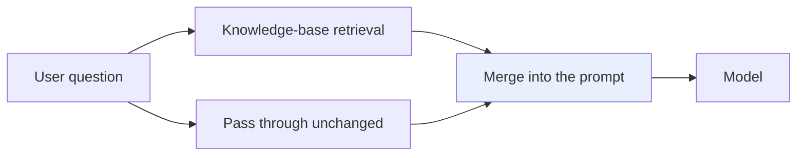
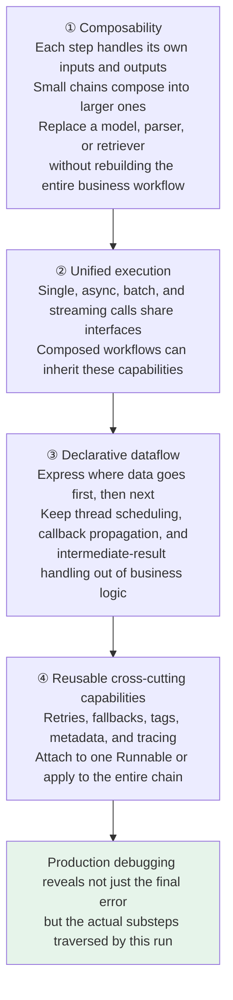
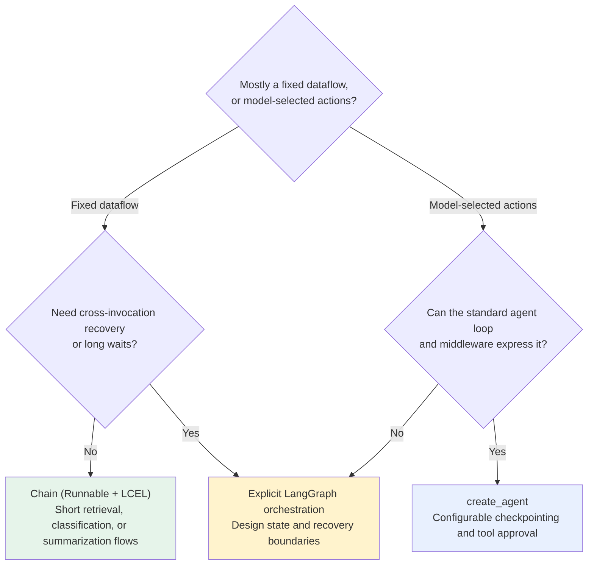

# Chapter 2: Chain Design and LCEL

## 2.1 What problem does a Chain solve?

Consider a simple product-review classifier. The full process **is not just a single model call**:

```
Clean user input → Fill prompt variables → Call the model → Parse the returned message into the string the application needs
```

### 2.1.1 What happens if you write everything by hand?

- One function returns a string, but the next expects a message object: **glue code accumulates**.
- Synchronous and asynchronous calls need separate implementations.
- Adding streaming, batching, retries, and tracing means **adapting each step separately again**.

With only three steps, manual maintenance is manageable. Once the process becomes "rewrite the question → retrieve → organize documents → prompt → model → structured parsing," interface conversions, intermediate-result handling, and error handling quickly spread across the individual steps.

### 2.1.2 Two views of a Chain

| Perspective | What is a Chain? |
|---|---|
| **Business perspective** | Several processing steps connected into a complete task |
| **Software-design perspective** | **Dataflow orchestration and component composition** |

**It first brings the components under a common invocation protocol, then connects them into a complete task according to the dataflow.** Callers do not have to drive each internal step: they supply input to the whole chain and receive its output.

## 2.2 Must a Chain execute linearly?

A Chain is often imagined as a straight line running from left to right. The simplest Chain does work that way:

```
User input → Prompt template → Chat Model → Output parser → String answer
```

**Real applications can also have parallel and conditional branches**:



### 2.2.1 A more precise description

> **A Chain describes a predefined dataflow graph.** Nodes process data, and connections determine where that data goes.
>
> **Even when a node calls an LLM whose output is uncertain, the flow's topology is still defined in advance by the developer.**

### 2.2.2 The boundary between Chains and agents

| | Who decides the next step? |
|---|---|
| **Chain** | The **developer** decides "what to call next": primarily **deterministic orchestration** |
| **Agent** | The **model** uses the current state to decide dynamically "which tool to use next and whether to keep looping": primarily **runtime decision-making** |

## 2.3 What does Runnable solve?

Prompts, models, retrievers, and parsers can connect because they all implement Runnable. Runnable is LangChain's common invocation protocol: components may have different internals, but following the protocol allows them to be invoked consistently and composed with other components.

### 2.3.1 A unified execution interface

| Scenario | Interface |
|---|---|
| Process one input | `invoke` / `ainvoke` |
| Process a batch of inputs | `batch` / `abatch` |
| Display output as it is generated | `stream` / `astream` (**provided the underlying components actually support streaming**) |

With a unified execution interface, `with_config`, `with_retry`, and `with_fallbacks` can attach configuration, retries, and fallback behavior to the same abstraction.

### 2.3.2 The composed result is still a Runnable

Once two components form a small chain, that chain can be connected into a larger one. You can therefore encapsulate part of a process first and then insert it into a larger dataflow.

Runnable also exposes **input, output, and configuration schemas**, and allows tags and metadata to be passed through config. These capabilities make it easier for the framework to inspect data contracts and for tracing systems such as LangSmith to identify **parent–child run relationships** throughout an invocation.

### 2.3.3 Runnable is not magic

**Each step must be able to accept the type produced by the preceding step.**

| Component | Typical input |
|---|---|
| `ChatPromptTemplate` | A dictionary |
| Chat Model | A formatted Prompt Value or messages |
| `StrOutputParser` | A model message; produces a string |

**If the types do not match, the chain can still fail at runtime.**

## 2.4 LCEL is more than syntactic sugar

LCEL stands for **LangChain Expression Language**. Its most recognizable syntax uses `|` to connect Runnables.

Here, `|` is not a general-purpose Python pipe:

> `prompt | model | parser` **declares the composition of three Runnables**, from which LangChain constructs a `RunnableSequence`. In that sequence, each step's output becomes the next step's input.

### 2.4.1 A complete chain

```python
from langchain.chat_models import init_chat_model
from langchain_core.output_parsers import StrOutputParser
from langchain_core.prompts import ChatPromptTemplate

# The prompt is itself a Runnable, taking a dictionary with product and review.
prompt = ChatPromptTemplate.from_messages([
    ("system", "你是商品评价分类助手，只回答 positive、neutral 或 negative。"),
    ("human", "商品：{product}\n评价：{review}"),
])

# Unified model initialization; install the provider package and configure its key first.
model = init_chat_model("<provider>:<your-model-id>", temperature=0)

# LCEL combines the three steps into a RunnableSequence.
chain = prompt | model | StrOutputParser()

# The entire chain is still a Runnable.
result = chain.invoke({
    "product": "机械键盘",
    "review": "手感不错，但空格键声音有点大。",
})
print(result)
```

The Chinese prompt and test data are retained as runnable example inputs. The system message asks a product-review classifier to answer only `positive`, `neutral`, or `negative`; the human template labels the product and review. The product is a mechanical keyboard, and the review says, "It feels good to type on, but the space bar is a little loud."

Here, `chain` is not an execution result but an assembled **executable workflow**. Data only starts flowing from left to right when `invoke` is called.

**Asynchronous execution does not require rewriting the internal flow**: use `await chain.ainvoke(...)`. For batches, use `chain.batch([...])`; for streaming, iterate over `chain.stream(...)`.

LCEL's value is that you assemble the workflow once and then use the same interfaces for synchronous, asynchronous, batch, and streaming calls.

### 2.4.2 Limits of streaming

`RunnableSequence` **tries** to preserve its components' streaming capabilities. **If an intermediate component does not support streaming transformation, however, output cannot continue flowing until that component finishes.**

For example, an ordinary `RunnableLambda` does not implement streaming transformation by default. **Putting it in the wrong place can delay the first output chunk.**

## 2.5 Parallel execution and joining results

**Runnables support parallel as well as sequential execution.**

Suppose you need both a summary and a title for the same article. The two tasks are independent, so there is no need for one to wait for the other:

```python
from langchain_core.runnables import RunnableParallel

parser = StrOutputParser()

summary_chain = (
    ChatPromptTemplate.from_template("用两句话总结这篇文章：\n{article}")
    | model | parser
)
title_chain = (
    ChatPromptTemplate.from_template("为这篇文章起一个简洁标题：\n{article}")
    | model | parser
)

# Both branches receive the same input dictionary and perform different tasks.
chain = RunnableParallel(summary=summary_chain, title=title_chain)

result = chain.invoke({"article": "这里放待处理的文章正文"})
print(result["title"], result["summary"])
```

The retained Chinese templates ask for a two-sentence summary and a concise title, respectively. The `article` value is a placeholder meaning "put the article text to process here."

| Primitive | Purpose |
|---|---|
| `RunnableSequence` | **Do A, then B** |
| `RunnableParallel` | **Pass the same input to A and B concurrently** |

In LCEL, a dictionary can also be automatically converted to a `RunnableParallel` in a composition context. Writing the class name explicitly makes the execution model easier to see.

Parallelism is not free acceleration: sequential execution takes approximately the sum of the two branches' durations, while ideal parallel execution takes roughly the slower branch's duration plus scheduling overhead. Token usage and call costs still add up. Using `config={"max_concurrency": 4}` to control concurrency for applicable Runnables is only a local limit; model-service quotas and retries must also be coordinated. The default `batch` behavior usually means client-side concurrency, not the provider's offline Batch API, and promises no batch discount.

Retry scope also changes cost and semantics. Applying `with_retry` to the entire chain may repeat retrieval or external writes that already succeeded. If only the model call should be retried, attach the retry to the model Runnable. The business must explicitly decide whether a failed branch may fall back to reduced functionality; an empty string must not disguise a failure as success.

## 2.6 Why does a common protocol support continued extension?

A common protocol does more than make components easy to connect. It also lets the workflow grow incrementally:



Keep the limitation in view as well: a shared interface only guarantees a consistent way to invoke components. **The actual behavior still depends on whether each component truly supports the corresponding execution mode.**

## 2.7 Why were legacy Chains deprecated?

This is one of the most common points of confusion during version migrations.

### 2.7.1 Problems with legacy Chains

Early LangChain provided many **scenario-specific classes**: `LLMChain` wrapped a prompt and model, while `SequentialChain` connected multiple legacy Chains in sequence. These are common in older projects and tutorials, **which can make them look like today's standard approach**.

The problem was:

> As specialized Chain classes multiplied, **their input fields, return structures, and extension mechanisms were not fully consistent**. Developers had to remember many class names, yet still struggled to compose them freely.

### 2.7.2 A change in direction

**The approach shifted from "build a dedicated class for each scenario" to "provide a small set of common primitives that developers can compose."**

What `LLMChain(prompt=prompt, llm=model)` did is now usually written directly as `prompt | model | parser`: **the dataflow is clearer, and composition is more consistent**.

### 2.7.3 Current status

The LangChain v1 migration guide explicitly moves legacy chains into **`langchain-classic`**, including older APIs such as `LLMChain`, `ConversationChain`, and `SequentialChain`.

> **They have not suddenly stopped working.** You can still install the compatibility package to maintain an existing system. **New projects should not adopt them as the default simply because they appear in an old tutorial.**

**The practical approach**: understand what `LLMChain` solved when you encounter it in old code; prefer Runnable and LCEL when writing new code.

## 2.8 How do you choose among three orchestration approaches?

Chains are suitable for fixed dataflows, not for forcing every process into one enormous LCEL expression.



For a short, fixed dataflow, start with a Chain. Consider an agent when the model must decide the next step at runtime. Having known steps does not rule out LangGraph in the diagram: a long deterministic workflow may also need persistence, waits for human input, and recovery boundaries. In that case, choosing LangGraph directly is appropriate.

LangGraph is not intended to replace every simple Chain. It handles long-running, stateful workflows that Chains cannot express clearly.

## 2.9 Common mistakes

### 2.9.1 Reducing a Chain to "one LLM call"

**A single model call is only one node in the workflow.**

### 2.9.2 Equating a Chain with the specific `LLMChain` class

The old class is just an early implementation. Discussions of Chains today should focus on **organizing complete dataflows with Runnables**.

### 2.9.3 Assuming Chains can only execute linearly

A Chain describes a **predefined dataflow graph**, which can include parallel and conditional branches.

### 2.9.4 Treating `|` as magic that fixes everything

**LCEL composes components; it does not infer business semantics.** When adjacent steps have incompatible types, you still need `RunnableLambda`, `RunnablePassthrough`, `itemgetter`, or an explicit conversion function to prepare the data.

### 2.9.5 Assuming a common interface means identical native capabilities

**A step without streaming transformation delays the chain's first output. If a model lacks server-side batching, calling `batch` does not magically deliver optimal performance.**

### 2.9.6 Confusing Chains with agents

**A Chain's connections are predefined in code; an agent's action path is selected by the model during execution.** The two can be combined, but using models does not make them the same.

### 2.9.7 Ignoring versions

`LLMChain` and `SequentialChain` are legacy APIs moved to `langchain-classic`. **Do not copy old tutorials blindly into new projects.**

### 2.9.8 Using dictionary shorthand without knowing what it creates

A dictionary in a composition context becomes a `RunnableParallel`. **Be able to name the explicit class.**

## 2.10 Chapter summary

1. **Chains address the growth of glue code**: incompatible types, separate synchronous and asynchronous implementations, and step-by-step retrofitting of cross-cutting capabilities.
2. **A Chain is deterministic dataflow orchestration**: a predefined dataflow graph in which nodes process data and connections determine its route.
3. **The boundary between a Chain and an agent is who decides the next step**: the developer or the model.
4. **Runnable provides a common invocation protocol**, covering invoke / batch / stream and their asynchronous counterparts.
5. **The composed result is still a Runnable**, so small chains can be embedded in larger ones.
6. **Types must still be compatible**; Runnable is not magic.
7. **LCEL's `|` declares composition** and creates a `RunnableSequence`; `chain` is a workflow, not its result.
8. **Streaming capabilities propagate where possible, but intermediate components without streaming support block the flow.**
9. **`RunnableParallel` distributes the same input to multiple branches**. Combined with Sequence, it can express many fixed workflows.
10. **The benefits of a common protocol build on one another**: composability → unified execution → declarative dataflow → reusable cross-cutting capabilities → observability.
11. **Legacy Chains moved to `langchain-classic`**, reflecting the shift from specialized classes to freely composing a few common primitives.
12. **Three levels of selection**: Chain for fixed dataflows, `create_agent` for dynamic tool decisions, and LangGraph for long-running stateful workflows.

Runnable is the common invocation protocol; a Chain is the dataflow assembled from those components; and LCEL is one way to declare their composition. Distinguishing these concepts helps you decide where retries, streaming, and tracing belong.

## References

- [LangChain documentation](https://docs.langchain.com/oss/python/langchain/overview)
- [RunnableSequence: LCEL composition, batching, and streaming semantics](https://reference.langchain.com/python/langchain-core/runnables/base/RunnableSequence)
- [Runnable API](https://reference.langchain.com/python/langchain-core/runnables/base/Runnable)
- [langchain-core Runnables API reference](https://reference.langchain.com/python/langchain-core/runnables/)
- [LangChain v1 migration guide](https://docs.langchain.com/oss/python/migrate/langchain-v1)
- [LangGraph documentation](https://docs.langchain.com/oss/python/langgraph/overview)
