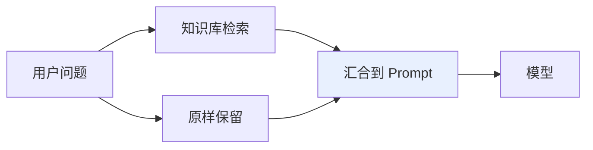
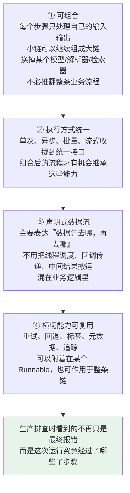
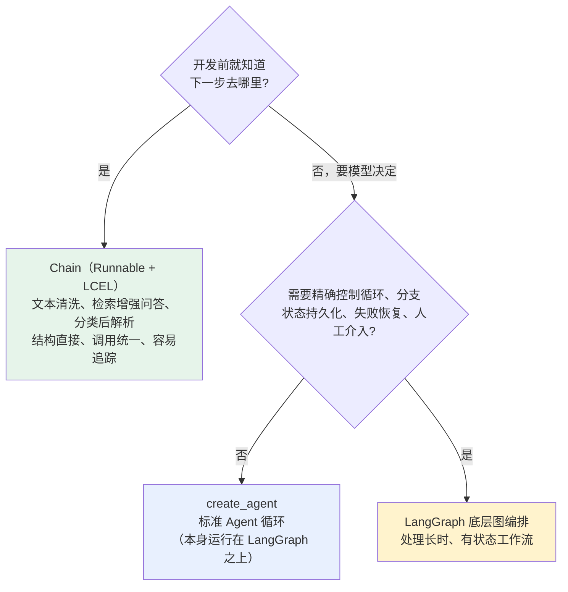

# 第二章：Chain 的设计理念与 LCEL

## 2.1 为什么需要 Chain

假设做一个最简单的商品评价分类功能。完整过程**不是只调用一次模型**，而是：

```
清洗用户输入 → 把变量填进 Prompt → 调用模型 → 把返回的消息解析成业务需要的字符串
```

### 2.1.1 全部手写会遇到什么

- 这个函数返回字符串，下一个函数却要消息对象——**一堆胶水逻辑**；
- 同步调用写一套，异步调用再写一套；
- 想加流式输出、批处理、重试和链路追踪，**又得分别改造每一步**。

**步骤只有三个时还能忍**，等流程变成「问题改写 → 检索 → 文档整理 → Prompt → 模型 → 结构化解析」：

> **维护起来就像拿很多根散落的电线临时接出一台机器——每加一个零件，都要重新确认接口能不能接上。**

### 2.1.2 Chain 的两个视角

| 视角 | Chain 是什么 |
|---|---|
| **业务视角** | 把多个处理步骤串成一个完整任务 |
| **软件设计视角** | **数据流编排和组件组合** |

**它先让每个零件暴露相对统一的插口，再把它们按数据流接成一台完整机器。** 调用方不用逐个驱动内部步骤，只需要给整条链输入、从整条链拿输出。

## 2.2 Chain 只能线性执行吗

看到 Chain 这个词，很自然会把它理解成从左到右的一根直线。**这个直觉只对了一半。**

最简单的 Chain 确实是线性的：

```
用户输入 → Prompt 模板 → Chat Model → 输出解析器 → 字符串答案
```

**但真实应用还可能出现并行分支和条件分支**：



### 2.2.1 更准确的理解

> **Chain 描述了一张事先确定好的数据流图。** 节点负责处理数据，连接关系决定数据往哪里走。
>
> **即使某个节点内部调用了结果不确定的 LLM，流程拓扑本身仍然是开发者提前写好的。**

### 2.2.2 这也解释了 Chain 和 Agent 最容易混淆的地方

| | 谁决定下一步 |
|---|---|
| **Chain** | **开发者**决定「下一步调用谁」——偏**确定性编排** |
| **Agent** | **模型**根据当前状态动态决定「下一步做什么工具、是否继续循环」——偏**运行时决策** |

## 2.3 Runnable 解决了什么

**关键问题**：Prompt、模型、检索器和解析器明明不是同一种东西，为什么能接在一起？

**答案是 Runnable。**

> **可以把 Runnable 想成 LangChain 给不同组件定的一份「电器插头标准」。** 组件内部怎么工作可以不同，但只要遵守这份标准，就能被统一调用，也能继续和其他组件组合。

### 2.3.1 统一的执行接口

| 场景 | 接口 |
|---|---|
| 处理单个输入 | `invoke` / `ainvoke` |
| 输入变成一批 | `batch` / `abatch` |
| 边生成边展示 | `stream` / `astream`（**前提是内部组件真正支持流式**） |

执行方式统一之后，`with_config`、`with_retry`、`with_fallbacks` 才能在同一抽象上附加配置、重试和降级能力。

### 2.3.2 最巧妙的一点：组合后的结果仍然是 Runnable

> **两个组件接成一条小链后，这条小链又可以作为一个普通步骤接到更大的链里。**
>
> 就像乐高——两个小块拼成一辆小车，小车还可以继续成为整座城市的一部分。

Runnable 还暴露**输入、输出和配置的 schema**，并允许通过 config 携带标签、元数据。这些能力让框架更容易检查数据契约，也方便 LangSmith 之类的追踪系统识别整条调用链里的**父子运行关系**。

### 2.3.3 但别把 Runnable 理解成魔法

**前一个步骤输出什么类型，后一个步骤就必须能够接住什么类型。**

| 组件 | 通常接收 |
|---|---|
| `ChatPromptTemplate` | 字典 |
| Chat Model | 格式化后的 Prompt Value 或消息 |
| `StrOutputParser` | 模型消息，输出字符串 |

**类型接不上，链照样会在运行时报错。**

## 2.4 LCEL 不只是语法糖

LCEL 全称 **LangChain Expression Language**，最显眼的写法是用 `|` 把 Runnable 接起来。

**为什么一个符号值得单独起名字？** 因为这不是普通的 Python 管道：

> `prompt | model | parser` **声明的是三个 Runnable 的组合关系**，LangChain 会据此构造一个 `RunnableSequence`。在这个序列里，前一步的输出会作为后一步的输入。

### 2.4.1 一条完整的链

```python
from langchain.chat_models import init_chat_model
from langchain_core.output_parsers import StrOutputParser
from langchain_core.prompts import ChatPromptTemplate

# Prompt 本身就是 Runnable，输入是包含 product 和 review 的字典
prompt = ChatPromptTemplate.from_messages([
    ("system", "你是商品评价分类助手，只回答 positive、neutral 或 negative。"),
    ("human", "商品：{product}\n评价：{review}"),
])

# 统一的模型初始化入口，运行前需安装对应 Provider 包并配好密钥
model = init_chat_model("<provider>:<your-model-id>", temperature=0)

# LCEL 把三个步骤组合为 RunnableSequence
chain = prompt | model | StrOutputParser()

# 整条 chain 仍然是 Runnable
result = chain.invoke({
    "product": "机械键盘",
    "review": "手感不错，但空格键声音有点大。",
})
print(result)
```

> **关键：`chain` 不是执行结果，而是一份已经组装好的「可执行流程」。** 只有调用 `invoke` 时，数据才真正从左向右流动。

**要异步不用重写内部流程**，改成 `await chain.ainvoke(...)`；批量用 `chain.batch([...])`；流式遍历 `chain.stream(...)`。

> **这种统一执行方式，才是 LCEL 比手写函数嵌套更有价值的地方。**

### 2.4.2 一个容易说得太满的细节

`RunnableSequence` 会**尽量**保留各组件的流式能力，**但如果中间某个组件不支持流式转换，输出就要等它完成后才能继续流出**。

例如普通 `RunnableLambda` 默认不实现流式转换，**放错位置就可能推迟首个输出块**。

## 2.5 并行与汇合

**Runnable 不只支持串行，还支持并行。**

比如同一篇文章，既要生成摘要又要给出标题——两个任务互不依赖，没必要先后等待：

```python
from langchain_core.runnables import RunnableParallel

summary_chain = (
    ChatPromptTemplate.from_template("用两句话总结这篇文章：\n{article}")
    | model | parser
)
title_chain = (
    ChatPromptTemplate.from_template("为这篇文章起一个简洁标题：\n{article}")
    | model | parser
)

# 两个分支接收相同的输入字典，分别执行不同任务
chain = RunnableParallel(summary=summary_chain, title=title_chain)

result = chain.invoke({"article": "这里放待处理的文章正文"})
print(result["title"], result["summary"])
```

| 原语 | 解决 |
|---|---|
| `RunnableSequence` | **先做 A，再做 B** |
| `RunnableParallel` | **把相同输入同时交给 A 和 B** |

> **在 LCEL 里字典也可以在组合上下文中被自动转换为 `RunnableParallel`。** 但讲原理时建议**先说清楚显式类名，再补充字典简写**——这样才能证明你知道背后真正生成了什么，而不是只记住了一个看起来很酷的写法。

## 2.6 为什么统一协议能不断扩展

只说「方便串起来」还不够。**真正值得理解的是：一套统一协议如何让小流程逐渐长成大流程。**



> **注意第二步的 caveat**：接口统一只代表调用方式一致，**最终效果仍取决于内部组件是否真正支持对应模式**。

## 2.7 为什么弃用旧式 Chain

**这是版本坑最集中的地方。**

### 2.7.1 旧式 Chain 的问题

早期 LangChain 提供大量**面向具体场景的类**：`LLMChain` 封装 Prompt 加模型，`SequentialChain` 把多条旧式 Chain 顺序连接。它们在老项目和老教程里非常常见，**所以很多人会误以为这就是今天的标准答案**。

**框架后来遇到的问题是**：

> 专用 Chain 类越来越多，**每个类的输入字段、返回结构和扩展方式不完全一致**。开发者既要记住大量类名，又很难把它们自由拼装。

### 2.7.2 方向的转变

**从「为每个场景造一个专用类」转向「提供少量统一原语，让开发者自己组合」。**

`LLMChain(prompt=prompt, llm=model)` 能做的事，现在通常直接写成 `prompt | model | parser`——**数据流更清楚，组合能力也更一致**。

### 2.7.3 现状

LangChain v1 的迁移指南已经把旧式 chains 明确移到 **`langchain-classic`**，其中包括 `LLMChain`、`ConversationChain`、`SequentialChain` 等旧 API。

> **它们不是突然不能运行了。** 维护旧系统时仍可以安装兼容包，**但新项目不应该因为看到旧教程就继续把这些当成首选**。

**正确的态度**：看到老代码里的 `LLMChain` 要能读懂它过去解决了什么问题；写新代码时优先用 Runnable 与 LCEL。

## 2.8 三种编排方式怎么选

**Chain 好用，是不是所有流程都该塞进一条超长 LCEL？当然不是。**



> **一个简洁的判断方法**：开发前就知道下一步去哪，优先 Chain；运行时要由模型决定下一步，考虑 Agent；流程需要显式状态图和恢复能力，考虑 LangGraph。
>
> **LangGraph 不是为了取代每一条简单 Chain**，而是处理 Chain 难以清楚表达的长时、有状态工作流。

## 2.9 常见错误

### 2.9.1 把 Chain 缩小成「一次 LLM 调用」

**一次模型调用只能算流程中的一个节点。**

### 2.9.2 把 Chain 等同于 `LLMChain` 这个具体类

旧类只是早期实现。今天谈 Chain 重点应放在**如何用 Runnable 组织完整数据流**。

### 2.9.3 认为 Chain 只能线性执行

它描述的是一张**事先确定好的数据流图**，可以有并行分支和条件分支。

### 2.9.4 把 `|` 当成能自动修好一切的魔法

**LCEL 负责组合，不会猜测业务语义。** 上下步类型不匹配时仍要用 `RunnableLambda`、`RunnablePassthrough`、`itemgetter` 或显式转换函数整理数据。

### 2.9.5 认为统一接口意味着组件天然具备相同能力

**某一步不支持流式转换，整条链的首个输出就会被推迟；模型没有服务端批处理能力，调用 `batch` 也不会凭空获得最优性能。**

### 2.9.6 把 Chain 和 Agent 混为一谈

**Chain 的连接关系由代码预先确定，Agent 的动作路径由模型在运行中选择。** 二者可以组合，但不能因为都调用了模型就混同。

### 2.9.7 没有版本意识

`LLMChain`、`SequentialChain` 已是 legacy，被移入 `langchain-classic`。**新项目不要照抄旧教程。**

### 2.9.8 只写字典简写不知道背后生成了什么

字典在组合上下文里会被转成 `RunnableParallel`，**要能说出显式类名**。

## 2.10 本章总结

1. **Chain 解决的是胶水逻辑爆炸**：类型不匹配、同步异步各写一套、横切能力要逐步改造；
2. **它是确定性的数据流编排**——事先确定好的数据流图，节点处理数据、连接决定走向；
3. **Chain 与 Agent 的分界是「谁决定下一步」**：开发者 vs 模型；
4. **Runnable 是组件的统一插头标准**，收拢了 invoke / batch / stream 及其异步版本；
5. **组合后的结果仍是 Runnable**，所以小链能继续嵌进大链；
6. **但类型必须接得上**，Runnable 不是魔法；
7. **LCEL 的 `|` 声明的是组合关系**，生成 `RunnableSequence`，`chain` 是流程不是结果；
8. **流式能力会尽量传播，但被不支持流式的中间组件卡住**；
9. **`RunnableParallel` 解决同一输入分发到多个分支**，与 Sequence 组合可表达大量固定流程；
10. **统一协议的价值链条**：可组合 → 执行方式统一 → 声明式数据流 → 横切能力复用 → 可观测；
11. **旧式 Chain 被移入 `langchain-classic`**，方向是从「专用类」转向「少量统一原语自由组合」；
12. **三层选型**：固定数据流用 Chain，动态工具决策用 `create_agent`，有状态长流程用 LangGraph。

> **一句话概括：Chain 的本质不是「把 Prompt 和模型串起来」，而是给所有组件定一份统一插头标准，让固定数据流可以被声明、被组合、被统一执行，并顺带继承重试、流式和追踪这些横切能力。**

## 参考资料

- [LangChain 官方文档](https://docs.langchain.com/oss/python/langchain/overview)
- [LangChain Expression Language（LCEL）](https://python.langchain.com/docs/concepts/lcel/)
- [Runnable 接口概念文档](https://python.langchain.com/docs/concepts/runnables/)
- [langchain-core Runnables API 参考](https://reference.langchain.com/python/langchain-core/runnables/)
- [LangChain v1 迁移指南](https://docs.langchain.com/oss/python/migrate/langchain-v1)
- [LangGraph 官方文档](https://docs.langchain.com/oss/python/langgraph/overview)
