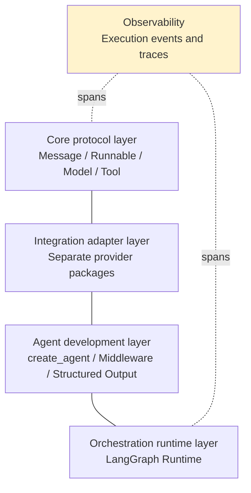
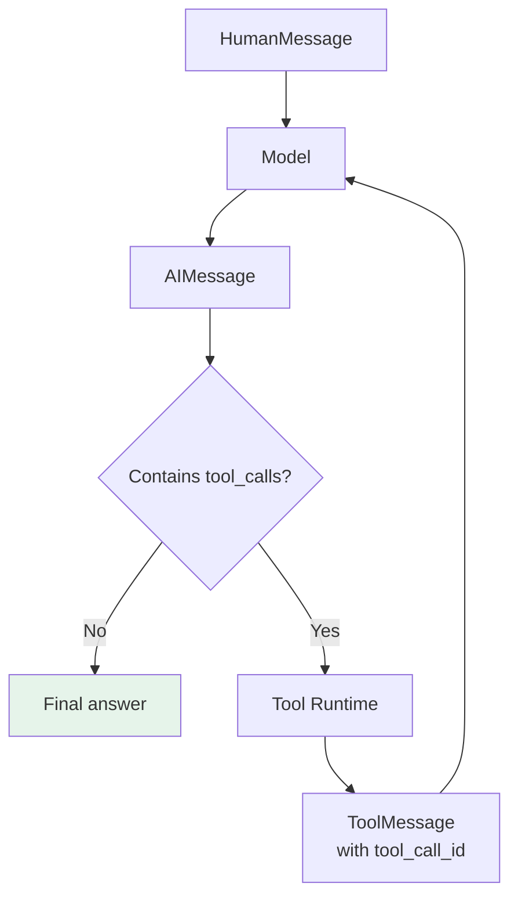
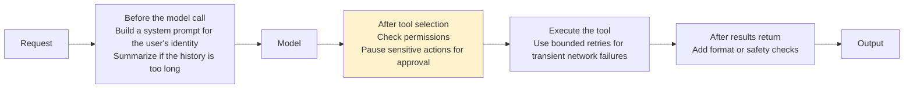

# Chapter 3: The Underlying Architecture of LangChain v1

## 3.1 What problems does LangChain solve?

**Calling a single model provider's SDK directly is not difficult.** As an application becomes more complex, the main problems arise elsewhere:

- Providers use **different message formats, tool-call structures, and streaming responses**.
- The application also needs prompts, tools, state, retries, and tracing.
- **By the time you switch models, provider-specific fields may already be scattered throughout the business code.**

LangChain defines stable interfaces over these differences. Provider integrations handle adaptation, while applications depend on shared protocols, allowing models, tools, and runtimes to evolve relatively independently.

## 3.2 Four architectural layers

| Layer | Main responsibility | Typical objects |
|---|---|---|
| **Core protocol layer** | Standardize component data structures and invocation interfaces | Message, Runnable, Model, Tool |
| **Integration adapter layer** | Abstract differences between models, vector stores, and external services | Separate integration packages such as `langchain-openai` |
| **Agent development layer** | Provide high-level agent assembly and extension capabilities | `create_agent`, Middleware, Structured Output |
| **Orchestration runtime layer** | Manage state, loops, routing, persistence, and recovery | LangGraph Runtime |

**Observability spans every layer**, recording model calls, tool calls, durations, and exceptions through execution events and traces.



The diagram shows responsibility boundaries, not a strict one-way call sequence. For example, models and compiled agents both follow the Runnable invocation interface, but they serve different architectural roles.

## 3.3 How do protocols unify data and execution?

Rather than memorize class names, follow a piece of data from the user to the model and then into the business system.

### 3.3.1 First: standardize what is passed

| Message type | Represents |
|---|---|
| `HumanMessage` | User input |
| `AIMessage` | Model output |
| `ToolMessage` | Tool execution results |

**Each provider starts with its own message format.** Once those formats are adapted into Messages, higher-level code does not have to keep changing for each SDK.

### 3.3.2 Second: Tools establish the boundary

This section discusses custom tools supplied by the application and executed client-side. Provider-hosted built-in tools may instead execute on the provider's servers.

**The model sees only a tool's name, description, and parameter schema.** It can only propose which tool to call and with what arguments.

The application still executes the Python function or calls the external service. Authorization checks and control over side effects must remain there as well.

### 3.3.3 Third: Runnable standardizes execution

Runnable provides invocation semantics such as `invoke`, asynchronous calls, batching, and streaming. Workflows with predefined steps can be composed directly with LCEL (see [Chapter 2](02-chain-and-lcel.md)):

```python
# All three components follow the Runnable protocol and compose sequentially with |.
chain = prompt | model | output_parser

# The composed workflow still runs through the common invoke interface.
result = chain.invoke({"question": "什么是 Agent？"})
```

The Chinese question is preserved as example input; it asks, "What is an agent?"

> **Message standardizes data representation, Tool separates model decisions from business actions, and Runnable standardizes execution.** Together, they make LangChain more than a thin wrapper around model SDKs.

## 3.4 How does the agent loop run?

Unlike an ordinary single call, an agent may execute multiple rounds between the model and tools.



### 3.4.1 Why does `tool_call_id` matter?

**A model may request several tools in one round.** Each result must be **matched to its original request by call ID**, so the model knows which result belongs to which call.

### 3.4.2 What does `create_agent` return?

`create_agent` constructs this loop from a model, tools, system prompt, and middleware.

> **It returns a compiled LangGraph graph, not an ordinary function.** That graph can stream progress and select the next execution edge. Saving and restoring state across invocations additionally requires a configured checkpointer and a supplied `thread_id`; compiling a graph does not, by itself, enable persistence.

## 3.5 Where should data live?

**Not all agent data belongs in messages or prompts.** The runtime distinguishes three categories:

| Data | Purpose | Examples |
|---|---|---|
| **State** | Data that **changes during execution** | Messages, current step, tool results |
| **Context** | **Trusted dependencies that remain unchanged** during one invocation | User ID, tenant, permissions |
| **Store** | Data retained **across threads** | User preferences, long-term facts |

This separation keeps the model from having to generate a trusted user identity and keeps database connections out of the conversation context. Tools can access these values through the runtime, **while exposing only the arguments the model actually needs to supply in the tool schema**.

Context is trusted because of the application's authentication boundary, not because of a dataclass or type annotation. Tool results in State may still contain untrusted external content. When resuming after a long pause, recheck current permissions rather than skipping authorization because an old checkpoint recorded an identity. A Store namespace is a lookup mechanism, not a replacement for server-side access control.

## 3.6 What does middleware do?

Real applications commonly need **dynamic prompts, model switching, tool filtering, retries, conversation summarization, sensitive-information handling, and human approval**.

**Putting all of this logic into prompts or tools quickly tangles the code.**



> **Middleware is not a separate runtime.** It runs inside the LangGraph graph compiled by `create_agent`, providing **composable extensions** to execution behavior.

## 3.7 What role does LangGraph play?

**If an agent is implemented with only a `while` loop**, intermediate state is easily lost when the process exits. Pausing for several hours before a sensitive tool call and then resuming is also difficult.

LangGraph models the workflow as **State + Node + Edge**:

| Concept | Responsibility |
|---|---|
| State | Hold state |
| Node | Execute a model or tool |
| Edge | Determine the next step |

**Checkpoints save state snapshots at super-step boundaries.** Pending writes from successful nodes in the same step can help with failure recovery; persistence does not happen after every line of code. These mechanisms support interruption recovery, human intervention, and long-running execution, but external writes and checkpoints do not automatically share a transaction.

### 3.7.1 The two are not an either-or choice

LangChain supplies high-level components and a standard agent architecture, while LangGraph supplies the underlying execution capabilities. Use `create_agent` directly for a standard agent, with middleware for tool approval. Write LangGraph directly when business branches, parallel joins, or recovery boundaries exceed what the standard loop can express.

## 3.8 Can legacy Chains still be used?

`LLMChain`, `ConversationChain`, and some legacy agent executors commonly seen in early tutorials have moved to **`langchain-classic`**.

**They can be used to maintain existing projects, but no longer represent the main v1 architecture.**

| Scenario | Better-suited approach |
|---|---|
| Fixed Prompt, Model, Parser flow | **Runnable + LCEL** |
| Standard model–tool loop | **`create_agent`** |
| Business branches, parallel joins, or approval processes beyond the standard loop | **Use LangGraph directly** |
| Maintaining a legacy Chain project | Use `langchain-classic`, then migrate incrementally |

## 3.9 Common mistakes

### 3.9.1 Calling LangChain "a thin wrapper around model SDKs"

**Message standardizes data, Tool establishes boundaries, and Runnable standardizes execution.** Their combination is what provides the value.

### 3.9.2 Assuming the model executes these custom tools

For these custom tools, **the model can only propose a call.** Actual execution, authorization checks, and side effects belong to the application.

### 3.9.3 Ignoring `tool_call_id`

A single round may request multiple tools. **Without matching IDs, the model cannot tell which result belongs to which call.**

### 3.9.4 Assuming `create_agent` returns an ordinary function

**It returns a compiled LangGraph graph** that can stream progress. Saving and restoring state across invocations still requires a checkpointer and `thread_id`.

### 3.9.5 Putting all data in messages or prompts

**Separate State / Context / Store**: the model should not generate trusted identities, and database connections should not appear in conversation context.

### 3.9.6 Treating middleware as another runtime

**It runs inside the graph compiled by `create_agent`**, providing composable extension points.

### 3.9.7 Treating LangChain and LangGraph as an either-or choice

The former provides high-level components and a standard architecture; the latter provides underlying execution capabilities.

### 3.9.8 Copying `LLMChain` usage from an old tutorial

It has moved to `langchain-classic` and should not be the first choice for a new project.

## 3.10 Chapter summary

1. **LangChain defines stable interfaces over provider differences**, allowing models, tools, and runtimes to evolve independently.
2. **Four architectural layers**: core protocols, integration adapters, agent development, and orchestration runtime, with observability spanning all four.
3. **Message standardizes what is passed**: Human / AI / Tool messages abstract the differences between SDK formats.
4. **Tool standardizes who executes what**: the model proposes an action; execution and authorization remain in the application.
5. **Runnable standardizes how execution happens**: invoke, asynchronous calls, batching, and streaming.
6. **The agent loop can run for multiple rounds between model and tools**; `tool_call_id` matches results from multiple tools to their original requests.
7. **`create_agent` returns a compiled LangGraph graph**, which can stream progress and control execution edges; cross-invocation recovery also requires a checkpointer and `thread_id`.
8. **Three data categories**: State (mutable), Context (unchanging trusted dependencies), and Store (persistence across threads).
9. **Middleware supplies extension points around model and tool calls**, covering dynamic prompts, permissions, approvals, retries, summarization, and validation.
10. **LangGraph models workflows as State + Node + Edge**, with checkpoints supporting interruption recovery and human intervention.
11. **The main v1 architecture is "standard protocols + create_agent + LangGraph Runtime."** LCEL remains suitable for deterministic flows, while legacy Chains primarily serve existing systems.

Follow a single request to understand LangChain v1: the protocol layer standardizes what to pass and how to execute it; the agent layer assembles the model–tool loop; LangGraph gives that loop state, checkpoints, and recovery capabilities; and middleware supplies extension points at key positions.

## References

- [LangChain documentation](https://docs.langchain.com/oss/python/langchain/overview)
- [LangChain: Agents concepts](https://docs.langchain.com/oss/python/langchain/agents)
- [LangChain: Messages concepts](https://docs.langchain.com/oss/python/langchain/messages)
- [LangChain: Tools concepts](https://docs.langchain.com/oss/python/langchain/tools)
- [LangChain: Middleware concepts](https://docs.langchain.com/oss/python/langchain/middleware)
- [LangChain v1 migration guide](https://docs.langchain.com/oss/python/migrate/langchain-v1)
- [LangGraph documentation](https://docs.langchain.com/oss/python/langgraph/overview)
- [LangGraph Checkpointers: super-steps and pending writes](https://docs.langchain.com/oss/python/langgraph/checkpointers)
