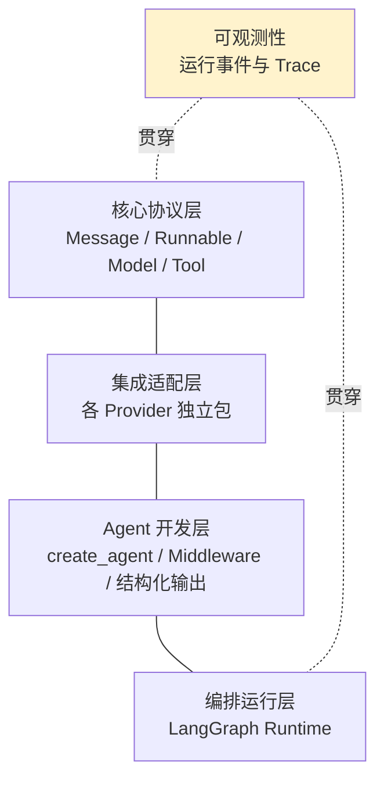
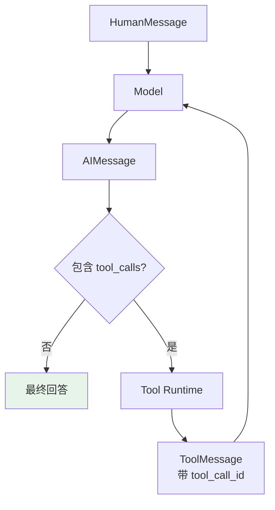
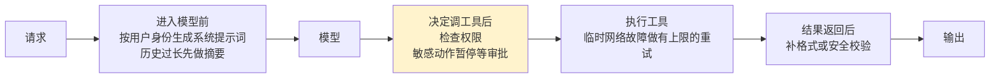

# 第三章：LangChain v1 的底层架构

## 3.1 LangChain 解决什么问题

**直接调用一家模型厂商的 SDK 并不困难。** 应用复杂度上来后，问题主要出现在这些地方：

- 不同厂商的**消息格式、工具调用结构和流式响应各不相同**；
- 业务还需要接入 Prompt、工具、状态、重试和追踪；
- **一旦更换模型，大量厂商专属字段可能已经散落在业务代码中。**

LangChain 的做法是在这些差异之上定义稳定接口：厂商集成负责适配，应用只依赖公共协议，从而让模型、工具和运行时能够相对独立地演进。

## 3.2 四层架构

| 层次 | 主要职责 | 典型对象 |
|---|---|---|
| **核心协议层** | 统一组件的数据结构与调用接口 | Message、Runnable、Model、Tool |
| **集成适配层** | 屏蔽模型、向量库和外部服务差异 | `langchain-openai` 等独立集成包 |
| **Agent 开发层** | 提供高层 Agent 组装与扩展能力 | `create_agent`、Middleware、Structured Output |
| **编排运行层** | 管理状态、循环、路由、持久化和恢复 | LangGraph Runtime |

**可观测性贯穿各层**，通过运行事件和 Trace 记录模型调用、工具调用、耗时和异常。



这张图描述的是职责边界，不是严格的单向调用顺序。例如模型和编译后的 Agent 都遵循 Runnable 调用方式，但它们承担的架构角色不同。

## 3.3 协议如何统一数据与执行

比起记类名，更重要的是看一条数据如何从用户走到模型，再进入业务系统。

### 3.3.1 第一棒：统一「传什么」

| 消息类型 | 表示 |
|---|---|
| `HumanMessage` | 用户输入 |
| `AIMessage` | 模型输出 |
| `ToolMessage` | 工具执行结果 |

**不同厂商原本各有一套消息格式**，适配成 Message 之后，上层就不用跟着每家 SDK 反复改动。

### 3.3.2 第二棒：Tool 划清边界

这里讨论由应用提供、在客户端执行的自定义工具；供应商托管的内置工具也可能在提供方服务端执行。

**模型看到的只是工具名称、描述和参数 Schema**，它只能提出「想调用哪个工具、参数是什么」。

Python 函数或外部服务仍由应用程序执行，权限校验和副作用控制也必须留在这里。

### 3.3.3 第三棒：Runnable 统一「怎么执行」

提供 `invoke`、异步调用、批处理和流式输出等调用语义。步骤确定的流程可以直接用 LCEL 组合（见 [第二章](02-chain-and-lcel.md)）：

```python
# 三个组件都遵循 Runnable 协议，可以用管道符顺序组合
chain = prompt | model | output_parser

# 组合后的整体仍然通过统一的 invoke 接口执行
result = chain.invoke({"question": "什么是 Agent？"})
```

> **Message 统一数据表达，Tool 划清模型与业务动作的边界，Runnable 统一执行方式。** 三者连起来，LangChain 才不只是替换模型 SDK 的薄封装。

## 3.4 Agent loop 如何运行

Agent 与普通单次调用的区别，在于模型和工具之间可能反复多轮执行。



### 3.4.1 `tool_call_id` 为什么重要

**模型一轮可能请求多个工具**，工具结果必须通过**调用 ID 与原请求对应**，模型才能知道每条结果属于哪次调用。

### 3.4.2 `create_agent` 返回的是什么

`create_agent` 根据模型、工具、系统提示词和中间件创建这套循环。

> **它返回的不是普通函数，而是编译后的 LangGraph 图**，可以输出进度并决定下一条执行边。跨调用保存和恢复状态还必须配置 checkpointer，并传入 `thread_id`；编译图本身不等于已经启用持久化。

## 3.5 数据应该放在哪里

**Agent 中的数据不应该全部塞进消息或 Prompt。** 运行时会区分三类：

| 数据 | 作用 | 示例 |
|---|---|---|
| **State** | 执行中**不断变化**的数据 | 消息、当前步骤、工具结果 |
| **Context** | 一次调用期间**不变的可信依赖** | 用户 ID、租户、权限 |
| **Store** | **跨线程**保存的数据 | 用户偏好、长期事实 |

这样划分后，可信用户身份不需要让模型生成，数据库连接也不会被写入对话上下文。工具可以通过 Runtime 读取这些数据，**同时只把真正需要模型填写的参数暴露在工具 Schema 中**。

Context 的可信性来自应用的认证边界，不来自 dataclass 或类型注解；State 中的工具结果可能仍是不可信外部内容。长暂停后恢复时，应重新检查当下权限，不能因为旧 checkpoint 记录过一个身份就跳过授权。Store 的 namespace 是定位机制，也不替代服务端访问控制。

## 3.6 Middleware 做什么

真实应用通常需要处理**动态提示词、模型切换、工具筛选、重试、对话摘要、敏感信息和人工审批**。

**如果把这些逻辑全部塞进 Prompt 或 Tool，代码会很快纠缠在一起。**



> **Middleware 并不是另一套运行时。** 它运行在 `create_agent` 编译出的 LangGraph 内部，对执行行为进行**组合式扩展**。

## 3.7 LangGraph 是什么角色

**如果只用 `while` 循环实现 Agent**：进程退出后中间状态容易丢失，也很难在敏感工具前暂停几小时再继续。

LangGraph 把流程建模为 **State + Node + Edge**：

| 概念 | 职责 |
|---|---|
| State | 保存状态 |
| Node | 执行模型或工具 |
| Edge | 决定下一步 |

**检查点在 super-step 边界保存状态快照**，同一步成功节点的 pending writes 可辅助故障恢复；不是每一行代码都被持久化。由此能支持中断恢复、人工介入和长时间运行，但外部写入与 checkpoint 不自动处于同一事务。

### 3.7.1 两者不是二选一

LangChain 提供高层组件和标准 Agent 架构，LangGraph 提供底层执行能力。标准 Agent 直接用 `create_agent`，工具审批可由中间件接入；当业务分支、并行汇合或恢复边界超出标准循环的表达范围时，再直接编写 LangGraph。

## 3.8 旧版 Chain 还能用吗

早期教程常见的 `LLMChain`、`ConversationChain` 和部分旧式 Agent 执行器已经进入 **`langchain-classic`**。

**它们可以用于维护存量项目，但不再代表 v1 的主架构。**

| 场景 | 更合适的方式 |
|---|---|
| 固定的 Prompt、Model、Parser 流程 | **Runnable + LCEL** |
| 标准模型与工具循环 | **`create_agent`** |
| 超出标准循环的业务分支、并行汇合或审批流程 | **直接使用 LangGraph** |
| 维护旧式 Chain 项目 | `langchain-classic` 后渐进迁移 |

## 3.9 常见错误

### 3.9.1 把 LangChain 说成「模型 SDK 的薄封装」

**Message 统一数据、Tool 划边界、Runnable 统一执行**，三者组合起来才是它的价值。

### 3.9.2 认为这类自定义工具是模型执行的

对于这类自定义工具，**模型只能提出调用意图**，真正执行、权限校验和副作用都在应用程序里。

### 3.9.3 忽略 `tool_call_id`

一轮可能请求多个工具，**没有 ID 对应模型就分不清哪条结果属于哪次调用**。

### 3.9.4 以为 `create_agent` 返回的是普通函数

**它返回的是编译后的 LangGraph 图**，可以流式输出进度；跨调用保存与恢复状态仍需配置 checkpointer 和 `thread_id`。

### 3.9.5 把所有数据都塞进消息或 Prompt

**State / Context / Store 三分**：可信身份不该让模型生成，数据库连接不该进对话上下文。

### 3.9.6 把 Middleware 当成另一套运行时

**它跑在 `create_agent` 编译出的图内部**，是组合式扩展点。

### 3.9.7 把 LangChain 和 LangGraph 说成二选一

前者是高层组件与标准架构，后者是底层执行能力。

### 3.9.8 照抄旧教程用 `LLMChain`

已进 `langchain-classic`，新项目不该以它为首选。

## 3.10 本章总结

1. **LangChain 的思路是在厂商差异之上定义稳定接口**，让模型、工具、运行时独立演进；
2. **四层架构**：核心协议层、集成适配层、Agent 开发层、编排运行层，可观测性贯穿各层；
3. **Message 统一「传什么」**：Human / AI / Tool 三类消息隔离了各家 SDK 的格式差异；
4. **Tool 统一「谁执行什么」**：模型只提意图，执行与权限校验留在应用程序；
5. **Runnable 统一「怎么执行」**：invoke、异步、批处理、流式；
6. **Agent loop 是模型与工具间可重复多轮的循环**，`tool_call_id` 保证多工具结果能对上原请求；
7. **`create_agent` 返回编译后的 LangGraph 图**，可输出进度并控制执行边；跨调用恢复还需 checkpointer 与 `thread_id`；
8. **数据三分**：State（可变）、Context（不变可信依赖）、Store（跨线程持久）；
9. **Middleware 是模型和工具调用前后的扩展点**，覆盖动态提示词、权限、审批、重试、摘要、校验；
10. **LangGraph 用 State + Node + Edge 建模**，检查点支撑中断恢复与人工介入；
11. **v1 主线是「标准协议 + create_agent + LangGraph Runtime」**，LCEL 仍适合确定性流程，旧式 Chain 主要用于维护存量。

可以顺着一次请求理解 LangChain v1：协议层统一了传什么和怎么执行，Agent 层组装出模型与工具的循环，LangGraph 让这个循环拥有状态、检查点和恢复能力，Middleware 则在关键位置提供扩展点。

## 参考资料

- [LangChain 官方文档](https://docs.langchain.com/oss/python/langchain/overview)
- [LangChain: Agents 概念文档](https://docs.langchain.com/oss/python/langchain/agents)
- [LangChain: Messages 概念文档](https://docs.langchain.com/oss/python/langchain/messages)
- [LangChain: Tools 概念文档](https://docs.langchain.com/oss/python/langchain/tools)
- [LangChain: Middleware 概念文档](https://docs.langchain.com/oss/python/langchain/middleware)
- [LangChain v1 迁移指南](https://docs.langchain.com/oss/python/migrate/langchain-v1)
- [LangGraph 官方文档](https://docs.langchain.com/oss/python/langgraph/overview)
- [LangGraph Checkpointers：super-step 与 pending writes](https://docs.langchain.com/oss/python/langgraph/checkpointers)
