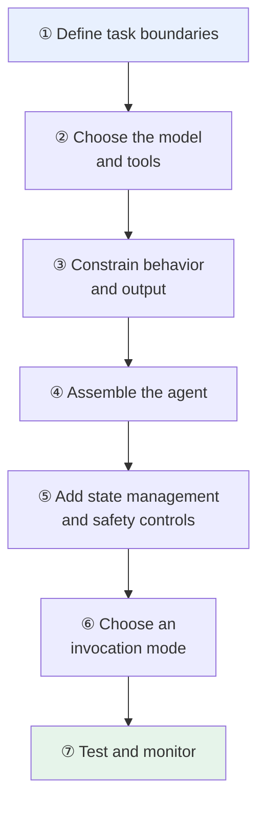
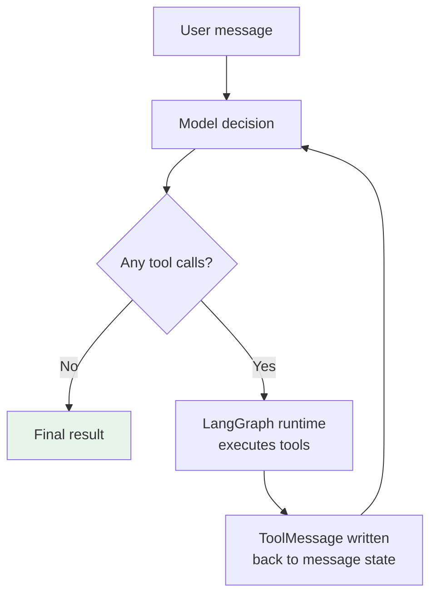
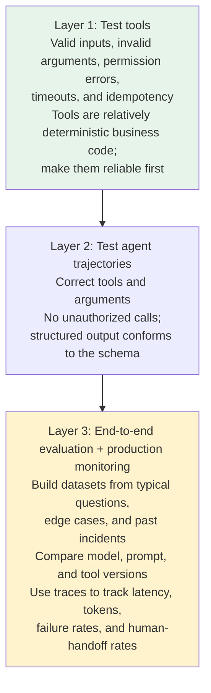

# Chapter 4: Seven Steps to a Production-Ready LangChain Agent

## 4.1 What Makes an Agent Complete?

**One successful call to a weather tool proves only that the demo works.**

Once an agent enters a business process, further questions emerge:

- What may it do, and **what must it not do**?
- After the model selects a tool, **are the arguments correct**? Could a failed or repeated call **cause side effects**?
- As the process runs longer, **can it resume after an interrupted conversation**? Can downstream business systems reliably consume its final result? **Can a production failure be reproduced**?

A complete agent is more than a model invocation. It requires an engineering process that runs from task design and capability integration through execution control, testing, and monitoring.



## 4.2 Step One: Define Task Boundaries

**The first step in building an agent is defining its task, not choosing a model.**

The following fictional order-support assistant illustrates how the pieces connect. Its order IDs and statuses are examples; the lookup and refund tools are not connected to real services. This is not a deployed or experimentally evaluated system.

| Category | Requirement |
|---|---|
| Allowed | Look up orders and explain shipping status |
| **Prohibited** | **Issue refunds on its own** |
| Mandatory human handoff | The order does not exist, identity verification fails, or the user requests a high-risk action |
| Required output | An answer, the order status, and whether a human handoff is needed |

**Define these boundaries in order**:

1. Define the goal and **permitted actions**.
2. Identify **prohibited actions and authorization boundaries**.
3. Specify what counts as success or failure, and **when to stop**.
4. Identify the situations that **require a human handoff**.

These answers determine the tools, prompts, and test cases that follow. If the boundaries are vague, the model has to guess what correct behavior means. Later engineering choices can do little to compensate.

## 4.3 Step Two: Choose the Model and Tools

The model must support the project's required **tool calling, structured output, and context length**.

The model makes decisions and plans. Tools should perform actions such as accessing databases, searching for information, and sending messages.

### 4.3.1 Why Keep Tools Small and Clearly Defined?

**The model relies primarily on the name, description, and argument schema to decide whether a tool is appropriate.**

- If one tool handles **lookups, refunds, and notifications**, the model is more likely to choose the wrong action.
- Without **type and range constraints** on arguments, the runtime also has a harder time rejecting invalid input.

```python
from langchain.tools import tool

# The decorator turns the function name, docstring, and type hints into a tool definition.
@tool
def lookup_order(order_id: str) -> dict[str, str]:
    """Look up an order's status by ID. Read-only; does not modify the order."""
    # In a real project, call an order service that verifies identity here.
    return {"order_id": order_id, "status": "已发货"}
```

The Chinese status value in this test data means “shipped.”

### 4.3.2 Separate the Two Layers of Responsibility

| Layer | Goal | Responsibilities |
|---|---|---|
| **Model-facing contract** | Help the model **choose correctly** | A single responsibility, a clear name, and understandable inputs and outputs |
| **Server-side execution** | Ensure the system **acts safely** | Recheck identity and authorization; add idempotency and auditing for side effects |

“Read-only” in a tool description helps guide the model. But “no refunds” in a prompt cannot replace identity checks in the refund API itself.

## 4.4 Step Three: Constrain Behavior and Output

The `system_prompt` should specify the **role, goal, information boundaries, tool-use rules, and failure policy**. For example: call the lookup tool before answering an order-status question; do not guess information absent from the database; hand high-risk requests to a person.

### 4.4.1 When Is Structured Output Needed?

| Consumer | Output format |
|---|---|
| A person reading the answer | Natural language is sufficient |
| **A frontend, support ticket, or downstream workflow** | **Define structured output** |

```python
from pydantic import BaseModel, Field

class SupportReply(BaseModel):
    # response_format validates the agent's final result against these three fields.
    answer: str = Field(description="A concise answer for the user")
    order_status: str | None = Field(default=None, description="Order status")
    needs_human: bool = Field(description="Whether a human handoff is needed")
```

Structured output can constrain fields and types, but it cannot guarantee correct business facts or perform authorization. Facts must still come from trusted tools, and business services must still enforce permissions.

### 4.4.2 A Model-Generated Field Is Not an Authorization Switch

`needs_human: bool` is only a field produced by the model. The model may omit it, set it incorrectly, or even be induced by prompt injection to set it to `false`. Therefore, **it must not determine whether a sensitive operation actually executes**. Similarly, “the model did not call a sensitive tool” is not an authorization decision.

Enforce non-negotiable policies on a deterministic execution path. For a standard tool-calling agent, prefer middleware that interrupts before tool execution. The tool service must still reauthorize the action using trusted identity:

```python
from langchain.agents import create_agent
from langchain.agents.middleware import HumanInTheLoopMiddleware
from langchain.tools import tool
from langgraph.checkpoint.memory import InMemorySaver

@tool
def request_refund(order_id: str) -> str:
    """Submit a refund request; the real service must reauthorize using trusted identity and use an idempotency key."""
    return f"演示：订单 {order_id} 的退款申请未连接真实服务"

agent = create_agent(
    model="<provider>:<your-model-id>",
    tools=[lookup_order, request_refund],
    middleware=[
        HumanInTheLoopMiddleware(
            interrupt_on={
                "lookup_order": False,
                "request_refund": {"allowed_decisions": ["approve", "reject"]},
            }
        )
    ],
    # This example uses memory; production requires a persistent checkpointer.
    checkpointer=InMemorySaver(),
)
```

Business rules such as amount thresholds, tenant isolation, and separation of duties may extend beyond a single tool call. Enforce those rules in a deterministic routing node before invoking the agent, or in LangGraph nodes and edges. **Interrupts and server-side authorization are the enforcement points; model-generated fields are only data for the interface and downstream processes.**

This snippet illustrates a different scope: submitting a request after human approval. It does not change the earlier read-only assistant's prohibition on issuing refunds on its own. The Chinese return value says that the example refund request for the order is not connected to a real service. When using this agent, the initial invocation and resumption with `Command(resume={"decisions": [{"type": "approve"}]})` must reuse the same `thread_id`. For multiple tool calls awaiting approval, decisions must correspond one-to-one with the actions in the interrupt request, in the same order. The approval API must first verify the reviewer's permissions, ownership of the task, and the decision's validity period. A browser must not be allowed to resume arbitrary threads directly.

## 4.5 Step Four: Assemble the Agent

```python
from langchain.agents import create_agent

# Assemble the model, tools, behavioral constraints, and output schema into an agent.
agent = create_agent(
    model="<provider>:<your-model-id>",
    tools=[lookup_order],
    system_prompt=(
        "你是订单客服。回答订单状态前必须调用查询工具；"
        "不得猜测，无法处理时设置转人工。"
    ),
    response_format=SupportReply,
)

# messages is the default input field in Agent State.
result = agent.invoke({
    "messages": [{"role": "user", "content": "订单 A100 到哪了？"}]
})

# The structured result has passed SupportReply field validation.
reply: SupportReply = result["structured_response"]
```

The Chinese prompt tells the order-support assistant to call the lookup tool before answering, never guess, and request a human handoff when it cannot handle the request. The user asks, “Where is order A100?” These executable example strings are kept unchanged.

Passing a Pydantic type directly lets the framework choose `ProviderStrategy` (provider-native structural constraints) or `ToolStrategy` (output carried through a tool call), depending on model capabilities. If business tools are also supplied, verify that the model supports that combination. Wrap JSON Schema dictionaries in an explicit strategy. `structured_response` is the result of successful completion; it is not guaranteed to exist after a refusal, truncation, or exhausted validation retries. The caller must distinguish success, pending approval, and errors rather than fabricate a “handled” response when a field is missing.

**Underlying execution flow** (see [Chapter 3](../01-foundations/03-langchain-architecture.md)):



> **Existing projects may still use `create_tool_calling_agent` and `AgentExecutor` from older materials, but new projects should prefer `create_agent`.**

## 4.6 Step Five: Add State Management and Safety Controls

### 4.6.1 Do Not Confuse the Two Persistence Mechanisms

| Mechanism | Purpose | Key configuration |
|---|---|---|
| **Checkpointer** | Saves messages and execution state **within one thread**, allowing resumption after an interruption | Consistently supply a stable `thread_id` |
| **Store** | Saves user preferences or long-lived facts **across threads** | Locate data by namespace + key; check tenant and user permissions on the server |

Both support durable storage, but they serve different purposes and are not interchangeable.

### 4.6.2 Put Cross-Cutting Logic in Middleware

Retries, summarization, permissions, and approvals **often affect multiple model or tool calls**. Scattering these rules across individual nodes quickly leads to duplication.

| Situation | Middleware placement |
|---|---|
| Transient model or **read-only tool** failure | Wrap the call with **bounded** retries |
| Excessive context length | Compress history before the model call |
| A change in user permissions | Dynamically narrow visible tools; still authorize execution against current permissions |
| Sensitive action | **Pause for approval** before tool execution |
| After model output | Add format or safety checks |

> **Tools that pay, send email, or delete data require idempotency, least privilege, and auditing. Automatic retries must not cause duplicate charges or messages.**

## 4.7 Step Six: Choose an Invocation Mode

| Invocation mode | Suitable uses |
|---|---|
| `invoke` | Short tasks, background jobs, or waiting for the final result |
| Asynchronous invocation | Concurrent I/O and asynchronous web services |
| `stream` | Long tasks that need to show tokens, steps, or tool progress |

Streaming improves the waiting experience; it does not automatically shorten tool execution. Timeouts, cancellation, concurrency limits, and caching still need their own design.

Stopping conditions need separate budgets: track model calls, tool calls, total elapsed time, and cost independently. `recursion_limit` limits graph super-steps, not model turns, Python recursion depth, or a global token budget. One model response may also request several tools at once. Changing this value only adjusts the final safeguard against excessive looping; it does not fix the reason the model repeatedly chooses the wrong tool.

## 4.8 Step Seven: Test and Monitor

**Agent output is probabilistic, so tests cannot stop at comparing final text.**



For connecting traces, production feedback, datasets, offline experiments, and release gates into a feedback loop, see [The LangSmith Production Quality Loop](../05-production/13-langsmith-production-loop.md).

### 4.8.1 Pre-Release Checklist

- [ ] Are the task and **stopping conditions** explicit?
- [ ] Does each tool have a single responsibility and enforce permissions **on the server**?
- [ ] Do side-effecting operations have **idempotency and approval controls**?
- [ ] Do the checkpointer and store use **persistent implementations** with proper user isolation?
- [ ] Are there **timeouts, retry limits, concurrency limits, and cost budgets**?
- [ ] Do evaluations cover tools, trajectories, and end-to-end behavior?
- [ ] Can you **trace the complete call chain of a failed run**?

## 4.9 Common Mistakes

### 4.9.1 Choosing a Model Before Defining the Task

**No amount of later configuration can make up for unclear boundaries.**

### 4.9.2 Packing Many Capabilities into One Large Tool

The model selects tools by name, description, and schema. **The more responsibilities a tool mixes together, the easier it is to choose incorrectly.**

### 4.9.3 Replacing Authorization Checks with a Prompt

A prompt can influence the model's choice, but cannot guarantee that a refund is blocked. Final authorization checks belong on the server.

### 4.9.4 Assuming Structured Output Guarantees Correct Facts

**It constrains fields and types only.** Facts must come from trusted tools.

### 4.9.5 Treating Model-Generated Fields as Authorization Decisions

Neither `needs_human=false`, a low risk score, nor the absence of a sensitive tool selection **grants execution permission**. Deterministic middleware/`interrupt()` must pause sensitive tool calls, and the business service must authorize them using trusted identity.

### 4.9.6 Confusing Checkpointer and Store

One restores state within a thread; the other manages long-term data across threads. **Their purposes are different.**

### 4.9.7 Automatically Retrying Side-Effecting Tools

Without idempotency safeguards, a timeout retry or replay during recovery can cause duplicate charges or messages.

### 4.9.8 Assuming Streaming Makes the Task Faster

**It only improves the waiting experience.** Timeouts, cancellation, and concurrency limits still require separate design.

### 4.9.9 Testing Only by Comparing Final Text

**Test tool trajectories.** Correct tool selection, valid arguments, and the absence of unauthorized actions cannot be inferred from the final text.

### 4.9.10 Using an In-Memory Checkpointer in Production

All state is lost on process restart. **Use a persistent implementation.**

## 4.10 Chapter Summary

1. **A complete agent is an engineered system**, not one successful tool call.
2. **Start with boundaries**: allowed and prohibited actions, success/failure/stopping conditions, and human-handoff conditions.
3. **The model makes decisions; tools perform actions.** The model needs tool calling, structured output, and sufficient context.
4. **Tools have two layers**: the model-facing contract helps selection; server-side execution enforces safety.
5. **`system_prompt` constrains behavior; `response_format` defines business output.** Neither guarantees factual correctness or authorization. Deterministic middleware/`interrupt()` and server-side authorization control sensitive actions.
6. **`create_agent` is the standard v1 entry point.** LangGraph manages the underlying model–tool loop.
7. **Checkpointers handle recovery within a thread; stores manage long-term data across threads.** Do not confuse them.
8. **Middleware handles cross-cutting logic**: retries, summarization, permissions, approvals, and safety checks.
9. **Side-effecting tools must be idempotent, least-privileged, and auditable.**
10. **Choose an invocation mode to suit the product**: invoke / asynchronous / stream. Streaming does not shorten execution.
11. **Test at three levels**: tools → trajectories → end-to-end behavior and production traces.

Getting `create_agent` to run is only the starting point. Putting an agent into a business process requires all seven steps—boundaries, capabilities, constraints, assembly, state, interaction, and validation—to turn a probabilistic model loop into a testable, observable system.

## References

- [LangChain: Agents Concepts](https://docs.langchain.com/oss/python/langchain/agents)
- [LangChain: Tools Concepts](https://docs.langchain.com/oss/python/langchain/tools)
- [LangChain: Structured Output](https://docs.langchain.com/oss/python/langchain/structured-output)
- [LangChain: Middleware](https://docs.langchain.com/oss/python/langchain/middleware)
- [LangChain: Short-term Memory](https://docs.langchain.com/oss/python/langchain/short-term-memory)
- [LangChain: Long-term Memory](https://docs.langchain.com/oss/python/langchain/long-term-memory)
- [LangChain: Streaming](https://docs.langchain.com/oss/python/langchain/streaming)
- [LangGraph: Persistence](https://docs.langchain.com/oss/python/langgraph/persistence)
- [LangChain: Human-in-the-Loop Approval and Resumption](https://docs.langchain.com/oss/python/langchain/human-in-the-loop)
- [LangGraph Graph API: Recursion Limit](https://docs.langchain.com/oss/python/langgraph/graph-api#recursion-limit)
