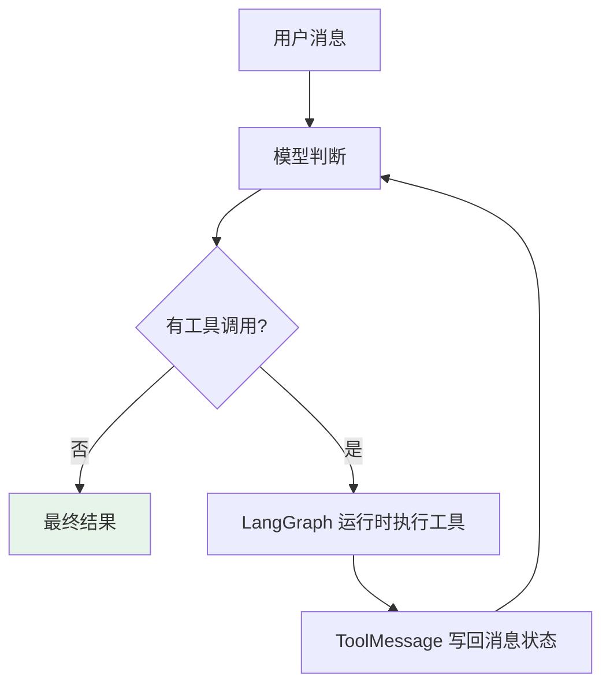
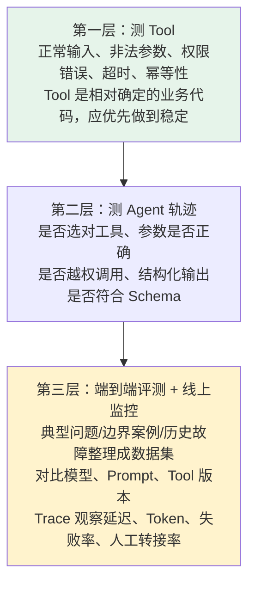

# 第四章：用 LangChain 构建生产级 Agent 的七步

## 4.1 什么才算完整 Agent

**模型成功调用一次天气工具，只能说明 Demo 跑通了。**

进入业务后，问题会一层层出现：

- 它能做什么、**不能做什么**？
- 模型选中工具后，**参数是否正确**？失败或重复调用**会不会带来副作用**？
- 流程跑得更久时：**会话中断后能否恢复**？最终结果能否稳定进入业务系统？**线上出错后能不能复现**？

完整 Agent 关注的不只是一次模型调用，而是一条从任务设计、能力接入、运行控制走到测试监控的工程链路。


## 4.2 第一步：明确任务边界

**构建 Agent 的第一步不是选择模型，而是定义任务。**

以订单客服 Agent 为例：

| 项目 | 内容 |
|---|---|
| 允许做 | 查询订单、解释物流状态 |
| **禁止做** | **自行退款** |
| 必须转人工 | 订单不存在、身份验证失败、用户要求高风险操作 |
| 输出要求 | 答复 + 订单状态 + 是否转人工 |

**把边界说清楚的顺序**：

1. 定义目标和**允许执行的动作**；
2. 划出**禁止动作与权限边界**；
3. 约定什么算成功、什么算失败、**什么时候停止**；
4. 哪些情况**必须转人工**。

这些答案会继续决定后面的工具、Prompt 和测试用例。边界一旦模糊，模型就只能猜测什么行为算正确，后面的工程配置也很难补回来。

## 4.3 第二步：选择模型与 Tools

模型需要支持项目所需的**工具调用、结构化输出和上下文长度**。

模型负责判断和规划；访问数据库、搜索资料、发送消息这类动作应由 Tool 执行。

### 4.3.1 Tool 为什么要尽量小而清楚

**因为模型主要依靠名称、描述和参数 Schema 来判断能不能调用。**

- 一个工具同时负责**查询、退款和通知**，模型就更容易选错动作；
- 参数**没有类型与范围约束**，运行时也很难拦住错误输入。

```python
from langchain.tools import tool

# 装饰器会把函数名、docstring 和类型注解转换成工具说明
@tool
def lookup_order(order_id: str) -> dict[str, str]:
    """根据订单号查询订单状态，只读，不修改订单。"""
    # 真实项目应在这里调用经过身份校验的订单服务
    return {"order_id": order_id, "status": "已发货"}
```

### 4.3.2 两层职责必须分开

| 层 | 目标 | 做什么 |
|---|---|---|
| **给模型看的一层** | 帮模型**选对** | 职责单一、名称清楚、输入输出容易理解 |
| **服务端执行的一层** | 保证系统**做得安全** | 重新检查身份与权限；有副作用就补幂等和审计 |

工具描述里的「只读」能帮助模型少走错路，但 Prompt 中写「禁止退款」不能替代退款接口本身的身份校验。

## 4.4 第三步：约束行为与输出

`system_prompt` 应说明**角色、目标、信息边界、工具规则和失败策略**。例如：回答订单状态前必须查询工具，不能猜测数据库中不存在的信息，高风险请求必须转人工。

### 4.4.1 什么时候需要结构化输出

| 输出去向 | 形式 |
|---|---|
| 只供人阅读 | 自然语言即可 |
| **进入前端、工单或后续工作流** | **定义结构化输出** |

```python
from pydantic import BaseModel, Field

class SupportReply(BaseModel):
    # response_format 会按这三个字段校验 Agent 的最终结果
    answer: str = Field(description="给用户的简洁答复")
    order_status: str | None = Field(default=None, description="订单状态")
    needs_human: bool = Field(description="是否需要转人工")
```

结构化输出可以约束字段和类型，但不能保证业务事实正确，也不会执行授权。事实仍必须来自可信工具，权限仍必须由业务服务控制。

### 4.4.2 模型字段不是授权开关

`needs_human: bool` 只是模型产出的一个字段：模型可以漏填、误填，甚至被提示注入诱导填成 `false`。因此，**不能用它决定敏感操作是否真的执行**；同样，不能把「模型没有调用敏感工具」当作授权结论。

把不可协商的策略放在确定性执行路径上。对标准工具调用 Agent，优先用 middleware 在工具执行前中断；工具服务仍要按可信身份再次授权：

```python
from langchain.agents import create_agent
from langchain.agents.middleware import HumanInTheLoopMiddleware
from langchain.tools import tool
from langgraph.checkpoint.memory import InMemorySaver

@tool
def request_refund(order_id: str) -> str:
    """提交退款申请；实际退款服务必须基于可信身份重新授权并使用幂等键。"""
    return f"演示：订单 {order_id} 的退款申请未连接真实服务"

agent = create_agent(
    model="<provider>:<your-model-id>",
    tools=[lookup_order, request_refund],
    middleware=[
        HumanInTheLoopMiddleware(
            interrupt_on={
                "lookup_order": False,
                "request_refund": {"allowed_decisions": ["approve", "reject"]},
            }
        )
    ],
    # 示例使用内存；生产环境必须使用持久化 checkpointer。
    checkpointer=InMemorySaver(),
)
```

金额阈值、租户隔离、职责分离等业务规则若不属于一次 Tool Call，则应在调用 Agent 前的确定性路由节点，或在 LangGraph 节点与边中执行。**中断和服务端授权才是控制点；模型字段只是供界面和后续流程参考的数据。**

这个片段演示「允许人工批准后提交申请」的另一个业务范围，不改变前面只读助手「禁止自行退款」的边界。使用此 Agent 时，首次调用与 `Command(resume={"decisions": [{"type": "approve"}]})` 恢复必须复用同一 `thread_id`；多个待审批工具调用的 decisions 应按中断请求顺序一一对应。审批接口需要先验证审核员权限、任务归属和决策有效期，不能让浏览器直接调用任意线程的恢复入口。

## 4.5 第四步：组装 Agent

```python
from langchain.agents import create_agent

# 将模型、工具、行为约束和输出 Schema 组装成 Agent
agent = create_agent(
    model="<provider>:<your-model-id>",
    tools=[lookup_order],
    system_prompt=(
        "你是订单客服。回答订单状态前必须调用查询工具；"
        "不得猜测，无法处理时设置转人工。"
    ),
    response_format=SupportReply,
)

# messages 是 Agent State 的默认输入字段
result = agent.invoke({
    "messages": [{"role": "user", "content": "订单 A100 到哪了？"}]
})

# 结构化结果已经通过 SupportReply 的字段校验
reply: SupportReply = result["structured_response"]
```

这里直接传 Pydantic 类型时，框架会根据模型能力选择 `ProviderStrategy`（供应商原生结构约束）或 `ToolStrategy`（用工具调用承载输出）。若同时提供业务工具，必须验证模型支持相应组合；JSON Schema 字典则应显式包进策略。`structured_response` 是成功完成后的结果，不代表拒答、截断或校验重试耗尽时也一定存在。调用方必须区分成功、等待审批和异常，而不是缺字段就制造一个「已处理」答复。

**底层执行流程**（详见 [第三章](../01-foundations/03-langchain-architecture.md)）：



> **旧资料中的 `create_tool_calling_agent` 和 `AgentExecutor` 仍可能出现在存量项目中，但新项目应优先使用 `create_agent`。**

## 4.6 第五步：补齐状态与安全

### 4.6.1 两种持久化不能混为一谈

| 机制 | 作用 | 关键配置 |
|---|---|---|
| **Checkpointer** | 保存**同一线程**的消息和执行状态，中断后可恢复 | 稳定传入 `thread_id` |
| **Store** | 保存**跨线程**的用户偏好或长期事实 | 用 namespace + key 隔离租户与用户 |

二者都能落盘，但职责不同，不能混用。

### 4.6.2 横切逻辑写在 Middleware

重试、摘要、权限和审批**往往会同时影响多个模型或工具调用**。散落在每个节点里，规则很快就会重复。

| 场景 | Middleware 位置 |
|---|---|
| 模型或**只读工具**临时失败 | 调用周围做**有上限**的重试 |
| 上下文过长 | 模型调用前压缩历史 |
| 用户权限变化 | 动态隐藏工具 |
| 敏感动作 | 工具执行前**暂停等待审批** |
| 模型输出后 | 补充格式或安全检查 |

> **付款、发邮件、删除数据等工具必须具备幂等、最小权限和审计能力——自动重试不能导致重复扣款或重复发信。**

## 4.7 第六步：选择调用方式

| 调用方式 | 适用场景 |
|---|---|
| `invoke` | 短任务、后台任务、等待最终结果 |
| 异步调用 | 并发 I/O、异步 Web 服务 |
| `stream` | 长任务，需要展示 Token、步骤或工具进度 |

流式输出改善的是等待体验，不会自动缩短工具执行时间。超时、取消、并发限制和缓存仍要单独设计。

停止条件应有独立预算：模型调用次数、工具调用次数、总耗时与费用分别计数。`recursion_limit` 限制的是图的 super-step 数，不等同于模型轮数、Python 递归深度或一个全局 Token 上限；一次模型响应还可能同时请求多个工具。更改该值只能调整最后一道循环保护，不能解决重复选错工具的根因。

## 4.8 第七步：测试与监控

**Agent 输出具有概率性，所以测试不能只比较最终文本。**



如何把 Trace、生产反馈、Dataset、离线实验和发布门禁连成闭环，见 [LangSmith 生产质量闭环](../05-production/13-langsmith-production-loop.md)。

### 4.8.1 上线前检查清单

- [ ] 任务和**停止条件**是否明确
- [ ] Tool 是否职责单一，并在**服务端**校验权限
- [ ] 有副作用的操作是否具备**幂等和审批**
- [ ] Checkpointer 与 Store 是否使用**持久化实现**并做好用户隔离
- [ ] 是否设置**超时、重试上限、并发和成本预算**
- [ ] 是否覆盖工具、轨迹和端到端评测
- [ ] 是否能够**追踪一次失败运行的完整调用链**

## 4.9 常见错误

### 4.9.1 先选模型再想任务

**边界模糊，后面所有工程配置都补不回来。**

### 4.9.2 把一堆能力塞进一个大工具

模型靠名称、描述、Schema 选工具，**职责越杂越容易选错**。

### 4.9.3 用 Prompt 代替权限校验

**Prompt 里写「禁止退款」拦不住任何东西**，权限必须在服务端。

### 4.9.4 以为结构化输出保证事实正确

**它只约束字段和类型**，事实要来自可信工具。

### 4.9.5 把模型字段当授权结论

`needs_human=false`、风险分低或未选中敏感工具，都**不是**执行权限。敏感 Tool Call 要由确定性 middleware/`interrupt()` 暂停，业务服务还要基于可信身份授权。

### 4.9.6 把 Checkpointer 和 Store 混用

一个是线程内状态恢复，一个是跨线程长期数据，**用途完全不同**。

### 4.9.7 给有副作用的工具配自动重试

**没有幂等就会重复扣款、重复发信。**

### 4.9.8 以为流式能加快任务

**它只改善等待体验**，超时、取消、并发限制仍要单独设计。

### 4.9.9 只对比最终文本做测试

**必须测工具轨迹**——选对工具、参数正确、无越权，这些用最终文本看不出来。

### 4.9.10 用内存版 Checkpointer 上生产

进程重启状态全丢，**必须换持久化实现**。

## 4.10 本章总结

1. **完整 Agent 是一条工程链路**，不是一次成功的工具调用；
2. **第一步定边界**：允许动作、禁止动作、成功/失败/停止条件、转人工条件；
3. **模型负责判断，Tool 负责动作**；模型需支持工具调用、结构化输出和足够上下文；
4. **Tool 分两层**：给模型看的一层帮它选对，服务端一层保证做得安全；
5. **`system_prompt` 约束行为，`response_format` 固定业务输出**，但都不保证事实正确或授权；敏感动作由确定性 middleware/`interrupt()` 与服务端授权控制；
6. **`create_agent` 是 v1 的标准入口**，底层由 LangGraph 管理模型与工具的循环；
7. **Checkpointer 管线程内恢复，Store 管跨线程长期数据**，二者不可混淆；
8. **Middleware 承接横切逻辑**：重试、摘要、权限、审批、安全校验；
9. **有副作用的工具必须幂等、最小权限、可审计**；
10. **调用方式按产品形态选**：invoke / 异步 / stream，流式不缩短执行时间；
11. **三层测试**：Tool → 轨迹 → 端到端与线上 Trace。

把 `create_agent` 跑通只是起点；要让 Agent 落到业务里，还得沿着边界、能力、约束、组装、状态、交互和验证七步，把概率性的模型循环收束成可测试、可观测的系统。

## 参考资料

- [LangChain: Agents 概念文档](https://docs.langchain.com/oss/python/langchain/agents)
- [LangChain: Tools 概念文档](https://docs.langchain.com/oss/python/langchain/tools)
- [LangChain: Structured Output](https://docs.langchain.com/oss/python/langchain/structured-output)
- [LangChain: Middleware](https://docs.langchain.com/oss/python/langchain/middleware)
- [LangChain: Short-term Memory](https://docs.langchain.com/oss/python/langchain/short-term-memory)
- [LangChain: Long-term Memory](https://docs.langchain.com/oss/python/langchain/long-term-memory)
- [LangChain: Streaming](https://docs.langchain.com/oss/python/langchain/streaming)
- [LangGraph 持久化文档](https://docs.langchain.com/oss/python/langgraph/persistence)
- [LangChain Human-in-the-loop：审批与恢复](https://docs.langchain.com/oss/python/langchain/human-in-the-loop)
- [LangGraph Graph API：recursion limit](https://docs.langchain.com/oss/python/langgraph/graph-api#recursion-limit)
