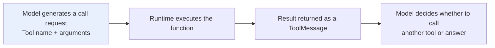
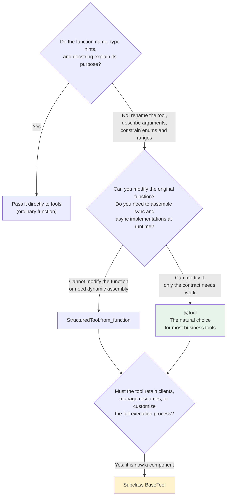
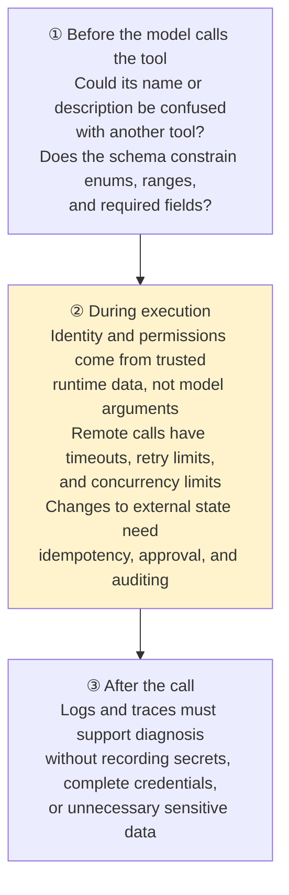

# Chapter 5: Tool Registration and Tool Contracts

## 5.1 What Does Tool Registration Register?

The model cannot see a Python function's source code. When registering a tool, LangChain first converts the function into a **description the model can understand**:

| Component | Consumer | Purpose |
|---|---|---|
| `name` + `description` | **Model** | Identify the tool and when to use it |
| `args_schema` | **Model** | Generate arguments that satisfy types and constraints |
| Executor (function/coroutine) | **Application** | Perform the actual operation with those arguments |



> **A tool's description and schema are not ordinary comments. They are the calling contract between the model and business code.**
>
> A vague description can cause the model to **select the wrong tool**. Missing argument constraints can lead it to generate **inputs that cannot be executed**.

## 5.2 How Do You Choose Among Four Definition Methods?

You do not need to start by subclassing the lowest-level class. First ask: **is this tool still just an ordinary function?**



These four methods form a progression in implementation complexity: first make the function's purpose clear, then enrich its tool contract, then handle dynamic assembly, and only then manage a component's lifecycle.

### 5.2.1 One Exception

Model providers' **server-side tools, such as web search and code interpreters**, sometimes use provider-defined configuration dictionaries.

These tools are provider-specific capabilities. Consult the relevant integration documentation separately; **do not treat them as the primary way to define general-purpose Python tools**.

## 5.3 Why Prefer `@tool`?

By default, `@tool` **infers the argument schema from the function signature** and uses the docstring as the tool description. Parsing individual argument descriptions from the docstring requires explicitly enabling `parse_docstring=True` and following a supported format. Declare complex constraints explicitly with Pydantic; do not assume that a natural-language description becomes a runtime validator.

The order status below is a fixed teaching example for examining the argument contract, not an actual lookup result. Its Chinese return string says that the order has shipped and includes the requested return mode.

```python
from typing import Literal

from langchain.agents import create_agent
from langchain.tools import tool
from pydantic import BaseModel, Field

class OrderQuery(BaseModel):
    # Field descriptions and type constraints enter the model-visible tool schema.
    order_id: str = Field(description="The ID of the order to look up")
    detail: Literal["summary", "full"] = Field(
        default="summary",
        description="Whether to return a summary or full details",
    )

# args_schema explicitly sets the validation model for tool arguments.
@tool(args_schema=OrderQuery)
def query_order(order_id: str, detail: str = "summary") -> str:
    """Look up order status. Use when the user asks about a specific order."""
    return f"订单 {order_id} 的状态为已发货，返回模式：{detail}"

agent = create_agent(
    model="<provider>:<your-model-id>",
    tools=[query_order],
)
```

**Pydantic field descriptions and enum constraints appear in the tool schema**, serving two purposes:

- **Help the model supply correct arguments**.
- **Reject invalid input before execution**.

You can also pass a simple function directly to `tools` without a decorator. However, it needs a clear name, type hints, and a docstring; otherwise, the generated description will do little to guide correct tool use.

## 5.4 When Should You Use More Advanced Definitions?

### 5.4.1 `StructuredTool.from_function`

Use this when **you cannot modify the original function but need to change how it is presented to the model**:

- Register the same business function under **different names**.
- Combine a **synchronous function and an asynchronous coroutine into one tool object**.

### 5.4.2 `BaseTool`

Use this **when the tool is no longer just a function**, but needs to:

- Retain **database or third-party clients** over a longer lifetime.
- Manage **synchronous and asynchronous execution, tags, metadata, and callbacks** together.

> **It has become a component that needs custom execution behavior.** Only then is the extra boilerplate worthwhile. `BaseTool` does not automatically close database connections or manage a connection pool's lifecycle. Application dependency injection, startup, and shutdown procedures must still manage those resources.

## 5.5 How Are Trusted Parameters Injected?

**Suppose a “check my account balance” tool needs a user ID.**

If `user_id` is in the model-visible schema:

- The model may **supply the wrong user**.
- A **malicious prompt may induce it to query another account**.

### 5.5.1 Separate Two Kinds of Parameters

| Parameter type | Examples | Source |
|---|---|---|
| **Task arguments** | City, keywords, order ID | Generated by the **model** from the user's question |
| **Trusted identity and dependencies** | Authenticated user ID, tenant, server-side permissions | **Injected by the application runtime** |

### 5.5.2 ToolRuntime's Three Scopes and Complete Wiring

| Source | Contents |
|---|---|
| `runtime.context` | User identity, tenant, dependencies—the **context of this invocation** |
| `runtime.state` | Current conversation messages and short-term state |
| `runtime.store` | Long-term data retained **across conversations** |

```python
from dataclasses import dataclass

from langchain.agents import create_agent
from langchain.tools import ToolRuntime, tool
from langgraph.store.memory import InMemoryStore

@dataclass
class UserContext:
    """Created only at an authenticated application boundary, never parsed from chat text or tool arguments."""
    user_id: str
    tenant_id: str
    permissions: frozenset[str]
```

Next, define read and write tools that follow the same namespace convention. In this example, the product defaults to `zh-CN` when no language preference has been saved. The Chinese return strings mean “unsupported language,” “the current user cannot change preferences,” and “language preference saved,” respectively.

```python
@tool
def save_locale(
    locale: str,
    runtime: ToolRuntime[UserContext],
) -> str:
    """Save the signed-in user's interface language, such as zh-CN or en-US."""
    if locale not in {"zh-CN", "en-US"}:
        return "不支持的语言"
    if "profile:write" not in runtime.context.permissions:
        return "当前用户无权修改偏好"

    # Include both tenant and user in the namespace to avoid cross-tenant/user reads.
    namespace = ("profile", runtime.context.tenant_id, runtime.context.user_id)
    runtime.store.put(namespace, "locale", {"value": locale})
    return f"已保存语言偏好：{locale}"

@tool
def get_locale(runtime: ToolRuntime[UserContext]) -> str:
    """Read the signed-in user's saved interface language."""
    namespace = ("profile", runtime.context.tenant_id, runtime.context.user_id)
    item = runtime.store.get(namespace, "locale")
    return item.value["value"] if item else "zh-CN"
```

Finally, wire the dependency type, store, and tools into the agent, then pass the context created by the authentication layer. The Chinese user message below asks to set the interface language to `en-US`.

```python
store = InMemoryStore()  # In-process demo; use a persistent store in production.
agent = create_agent(
    model="<provider>:<your-model-id>",
    tools=[save_locale, get_locale],
    context_schema=UserContext,
    store=store,
)

# The web/API layer validates the session/JWT before the server builds Context.
# Do not accept a client-asserted user_id.
authenticated_context = UserContext(
    user_id="u_123",
    tenant_id="tenant_acme",
    permissions=frozenset({"profile:write"}),
)
result = agent.invoke(
    {"messages": [{"role": "user", "content": "把我的语言设为 en-US"}]},
    context=authenticated_context,
)
```

`context_schema=UserContext` declares the agent's context type; `context=` supplies the data for this invocation. The `ToolRuntime[UserContext]` annotation does not itself authenticate a user or construct an identity. The model-visible tool arguments contain only `locale`, not `runtime`. If a tool writes identity or namespace information into results, errors, or logs, that information can still leak. Hiding an argument is not comprehensive redaction.

The trusted identity boundary sits outside the agent. The authentication layer constructs `UserContext` only after validating credentials and looking up server-side permissions. Do not construct it from user messages, model output, tool arguments, or a browser-supplied `user_id`. The tool service should authorize that identity again. `runtime.state` holds the current thread's business state and must not be used to manufacture an identity; `runtime.store` is not an access-control system either.

A string or dictionary returned by a tool is normally passed to the model as a tool result. Arbitrary dictionary fields are not automatically merged into Agent State. To update custom state, use `Command(update=...)` and include the `ToolMessage` with the corresponding `tool_call_id`, as required by the tool-message protocol. Do not directly mutate shared lists in `runtime.state`: parallel tools, reducers, and checkpoints require state updates to be submitted through the runtime.

## 5.6 How Should Asynchronous Tools Work?

Search, database access, and remote API calls are usually **I/O-bound**. When the underlying client supports asynchronous operation, the tool should use native `async def` and be invoked through the agent's `ainvoke` or asynchronous streaming interface.

> **The most common form of fake async** is declaring a function with `async def` while still calling a blocking HTTP client inside it. **That does not automatically improve concurrency.**

**The tool's execution mode should match both the underlying client and the entire agent call chain.**

## 5.7 How Should Errors Be Classified?

Do not classify every failed tool call as retryable. Different failures require entirely different next steps.

| Failure type | Examples | Correct handling |
|---|---|---|
| **Argument error** | Invalid date format, missing required field | Let the **schema reject it**, then give the model actionable feedback to correct the arguments |
| **Business outcome** | Insufficient stock, no permission, order not found | **Not a system fault**; explain the reason so the agent can take another path or inform the user |
| **Transient failure** | Network timeout, rate limiting, unavailable service | **Bounded** retries + backoff + an **overall timeout** |
| **Actual defect** | Programming bug, corrupted data, misconfigured permissions | **Do not turn everything into “call failed” and continue**; doing so hides the underlying problem |

> **For side-effecting tools such as payment, email, and order creation**, design business-level idempotency keys. Whether human approval is needed depends on risk and business policy. Approval does not replace idempotency: one user approval must not lead to repeated execution.

## 5.8 What Should You Check After Registration?

**A function that an agent can call is not necessarily a tool that is safe to deploy.** Follow an actual call from start to finish:



### 5.8.1 More Tools Are Not Always Better

Exposing many similar tools at once increases the likelihood of selection errors and argument confusion. A better approach is to **dynamically narrow the tool set based on user permissions and the current task**. Middleware can implement this; see [Chapter 4](04-build-agent.md).

Tool schemas also consume input tokens. When reducing the tool set, measure both whether the target tool remains among the candidates and whether the model selects correctly within that set. Otherwise, token savings may come at the cost of making the task impossible. Two calls with identical arguments are not necessarily duplicate business actions: `tool_call_id` correlates model messages, while an idempotency key for a payment or message should identify the business request. Do not rely solely on a model-generated call ID.

## 5.9 Common Mistakes

### 5.9.1 Treating Tool Descriptions as Ordinary Comments

**The description is part of the calling contract between the model and business code.** Vague descriptions lead to wrong selections.

### 5.9.2 Starting by Subclassing `BaseTool`

**The four methods form a progression in complexity.** `@tool` is sufficient for most business tools.

### 5.9.3 Putting `user_id` in the Model-Visible Schema

The model may supply it incorrectly or be manipulated by a malicious prompt. **Trusted parameters must be injected by the runtime.**

### 5.9.4 Confusing `context` / `state` / `store`

They represent **this invocation's context, short-term conversation state, and long-term data across conversations**, respectively.

### 5.9.5 Fake Async

Wrapping a blocking client in `async def` **does not create concurrency out of thin air**.

### 5.9.6 Retrying Every Kind of Failure

**Business outcomes should not be retried as failures, and actual defects must not be hidden behind a generic “call failed.”**

### 5.9.7 Retrying Without Backoff or an Overall Timeout

**The agent will simply keep waiting on a broken service.**

### 5.9.8 Omitting Idempotency Keys for Side-Effecting Tools

A single retry can become a **duplicate charge or message**.

### 5.9.9 Exposing Dozens of Similar Tools at Once

**Selection errors and argument confusion become more likely.** Narrow the set dynamically according to permissions and the task.

### 5.9.10 Logging Sensitive Data

Traces must support troubleshooting, **but must not store secrets or complete identity credentials**.

## 5.10 Chapter Summary

1. **Tool = model-visible calling contract + runtime-executable function.** The model sees name / description / args_schema; the application runs the executor.
2. **The four definition methods form a progression in complexity**: ordinary function → `@tool` → `StructuredTool` → `BaseTool`.
3. **`@tool` is the first choice for most business tools.** Pydantic field descriptions and enum constraints guide the model and reject invalid inputs.
4. **`StructuredTool` handles runtime assembly** (renaming and combining sync/async implementations); **`BaseTool` supports full execution customization**. The application still manages resource lifecycles.
5. **Separate two kinds of parameters**: the model generates task arguments; **the runtime injects trusted parameters**.
6. **ToolRuntime has three scopes**: `context_schema` defines and wires the trusted invocation context; context (invocation context), state (conversation state), and store (long-term data across conversations) each have a distinct role.
7. **Async must be genuinely asynchronous**: the underlying client, tool, and call chain must agree.
8. **Classify errors into four groups**: argument errors, business outcomes, transient failures, and actual defects. They require different handling.
9. **Side-effecting tools need idempotency and auditing.** Configure human approval according to risk; it does not replace idempotency.
10. **Review deployment readiness along a real call**: inspect the contract before selection, authorization and rate limits during execution, and log redaction afterward.
11. **Manage the number of tools** by dynamically narrowing the visible set based on permissions and the task.

When registering tools, the essential distinction is between the model-visible contract and the server-side execution boundary. The former determines whether the model can choose correctly; the latter determines whether the system is safe.

## References

- [LangChain: Tools Concepts](https://docs.langchain.com/oss/python/langchain/tools)
- [LangChain: Agents Concepts](https://docs.langchain.com/oss/python/langchain/agents)
- [LangChain: Middleware](https://docs.langchain.com/oss/python/langchain/middleware)
- [langchain-core Tools API Reference](https://reference.langchain.com/python/langchain-core/tools/)
- [Pydantic Documentation](https://docs.pydantic.dev/latest/)
