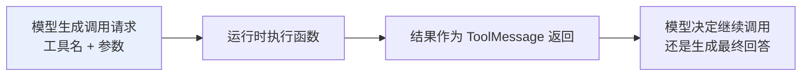
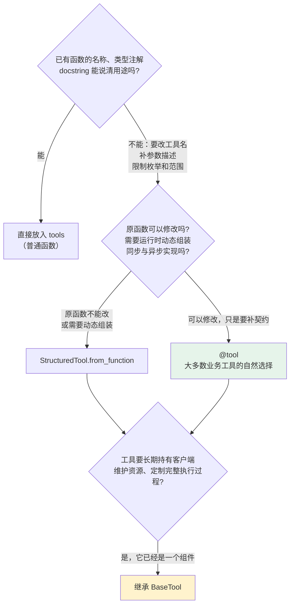
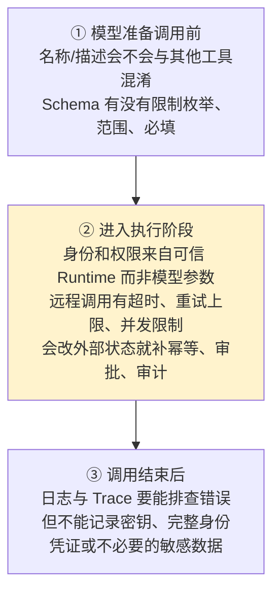

# 第五章：Tool 注册与工具契约

## 5.1 Tool 注册的是什么

模型看不到 Python 函数的源码，因此注册工具时，LangChain 会先把函数转换成一份**模型能够理解的说明**：

| 部分 | 谁看 | 作用 |
|---|---|---|
| `name` + `description` | **模型** | 判断工具叫什么、什么情况下该用 |
| `args_schema` | **模型** | 生成满足类型和约束的参数 |
| executor（函数/协程） | **应用侧** | 按这些参数执行实际操作 |



> **工具描述和 Schema 不是普通注释，而是模型与业务代码之间的调用合同。**
>
> 描述过于模糊，模型可能**选错工具**；参数缺少约束，模型可能生成**无法执行的数据**。

## 5.2 四种定义方式怎么选

不必一开始就继承最底层的类。选择时先判断：**这个工具是否仍然只是一个普通函数？**



这四种方式对应的是复杂度逐步上升的实现路径：先让函数把用途说清楚，再补充工具契约，接着处理动态组装，最后才管理组件生命周期。

### 5.2.1 一个例外

模型厂商提供的 **Web Search、代码执行器等服务端工具**，有时会使用厂商约定的字典配置。

这类工具属于特定 Provider 的能力。使用时应单独查看对应集成文档，**不要把它当作通用 Python Tool 的主要定义方式**。

## 5.3 优先使用 `@tool` 的原因

`@tool` 默认从**函数签名推导参数 Schema**、把 docstring 用作工具描述；逐参数的 docstring 解析需显式启用 `parse_docstring=True` 并遵循支持的格式。复杂约束可通过 Pydantic 显式声明，不能假设自然语言描述就会成为运行时校验器。

下面的订单状态是教学用固定返回值，用于观察参数契约，不是实际查询结果。

```python
from typing import Literal

from langchain.agents import create_agent
from langchain.tools import tool
from pydantic import BaseModel, Field

class OrderQuery(BaseModel):
    # Field 描述和类型约束都会进入模型看到的工具 Schema
    order_id: str = Field(description="要查询的订单号")
    detail: Literal["summary", "full"] = Field(
        default="summary",
        description="返回摘要还是完整信息",
    )

# args_schema 显式指定工具参数的校验模型
@tool(args_schema=OrderQuery)
def query_order(order_id: str, detail: str = "summary") -> str:
    """查询订单状态。用户询问某个订单时调用。"""
    return f"订单 {order_id} 的状态为已发货，返回模式：{detail}"

agent = create_agent(
    model="<provider>:<your-model-id>",
    tools=[query_order],
)
```

**Pydantic 的字段描述和枚举限制会进入工具 Schema**，一举两得：

- **帮助模型正确填写参数**；
- **在执行前拦截非法输入**。

简单函数也可以不加装饰器直接传给 `tools`，但函数必须有清楚的名称、类型注解和 docstring，否则自动生成的说明很难指导模型正确调用。

## 5.4 何时使用高级定义

### 5.4.1 `StructuredTool.from_function`

适合「**原函数不能修改，但需要改变它对模型的呈现方式**」：

- 同一个业务函数需要注册成**不同名称**；
- 要把**同步函数和异步协程组合成一个工具对象**。

### 5.4.2 `BaseTool`

**当工具不再只是一个函数**，而是要：

- 长期持有**数据库或第三方客户端**；
- 同时管理**同步、异步、tags、metadata 和回调**。

> **它已经变成了需要定制执行行为的组件**，此时才值得承担更多样板代码。`BaseTool` 不会自动关闭数据库连接或实现连接池生命周期；资源仍应由应用的依赖注入、启动和关闭流程管理。

## 5.5 可信参数如何注入

**假设「查询我的账户余额」工具需要用户 ID。**

如果把 `user_id` 放进模型可见的 Schema：

- 模型可能**填错用户**；
- 也可能被**恶意提示诱导查询其他账户**。

### 5.5.1 两类参数必须分开

| 参数类型 | 示例 | 来源 |
|---|---|---|
| **任务参数** | 城市、关键词、订单号 | **模型**根据用户问题生成 |
| **可信身份与依赖** | 已认证用户 ID、租户、服务端权限 | **应用运行时注入** |

### 5.5.2 ToolRuntime 的三个作用域与完整接线

| 来源 | 存放 |
|---|---|
| `runtime.context` | 用户身份、租户、依赖——**本次调用上下文** |
| `runtime.state` | 当前会话消息和短期状态 |
| `runtime.store` | **跨会话**仍要保留的长期数据 |

```python
from dataclasses import dataclass

from langchain.agents import create_agent
from langchain.tools import ToolRuntime, tool
from langgraph.store.memory import InMemoryStore

@dataclass
class UserContext:
    """仅由已认证的应用边界创建，绝不从聊天文本或 Tool 参数解析。"""
    user_id: str
    tenant_id: str
    permissions: frozenset[str]
```

接着定义读写工具。两者使用同一个 namespace 规则；未保存语言时，本例约定产品默认语言为 `zh-CN`。

```python
@tool
def save_locale(
    locale: str,
    runtime: ToolRuntime[UserContext],
) -> str:
    """保存当前登录用户的界面语言，如 zh-CN 或 en-US。"""
    if locale not in {"zh-CN", "en-US"}:
        return "不支持的语言"
    if "profile:write" not in runtime.context.permissions:
        return "当前用户无权修改偏好"

    # namespace 必须包含租户和用户，避免跨租户/跨用户读取长期数据。
    namespace = ("profile", runtime.context.tenant_id, runtime.context.user_id)
    runtime.store.put(namespace, "locale", {"value": locale})
    return f"已保存语言偏好：{locale}"

@tool
def get_locale(runtime: ToolRuntime[UserContext]) -> str:
    """读取当前登录用户已保存的界面语言。"""
    namespace = ("profile", runtime.context.tenant_id, runtime.context.user_id)
    item = runtime.store.get(namespace, "locale")
    return item.value["value"] if item else "zh-CN"
```

最后把依赖类型、Store 和工具接入 Agent，再传入认证层构造的上下文。

```python
store = InMemoryStore()  # 进程内演示；生产环境换成持久化 Store。
agent = create_agent(
    model="<provider>:<your-model-id>",
    tools=[save_locale, get_locale],
    context_schema=UserContext,
    store=store,
)

# Web/API 层先验证 session/JWT，再由服务端构造 Context；不要接受客户端声称的 user_id。
authenticated_context = UserContext(
    user_id="u_123",
    tenant_id="tenant_acme",
    permissions=frozenset({"profile:write"}),
)
result = agent.invoke(
    {"messages": [{"role": "user", "content": "把我的语言设为 en-US"}]},
    context=authenticated_context,
)
```

`context_schema=UserContext` 声明 Agent 的 Context 类型，`context=` 才传入本次调用的数据；`ToolRuntime[UserContext]` 注解本身不会完成认证或构造身份。模型可见的工具参数只有 `locale`，不含 `runtime`。如果工具把身份或 namespace 写进结果、错误或日志，它们仍可能泄漏，不能把参数隐藏理解为全面脱敏。

可信身份边界在 Agent 外部：认证层验证凭证、查出服务端权限后才构造 `UserContext`。不要从用户消息、模型输出、工具参数或浏览器传入的 `user_id` 创建它；工具服务还应对该身份重新执行授权。`runtime.state` 是当前线程的业务状态，不应用来伪造身份；`runtime.store` 也不是访问控制系统。

工具返回字符串或字典时，通常会作为工具结果交给模型，不会把字典里的任意字段自动合并进 Agent State。需要更新自定义状态时，应使用 `Command(update=...)`，并按工具消息协议补齐对应 `tool_call_id` 的 `ToolMessage`。不要直接修改 `runtime.state` 中的共享列表：并行工具、reducer 和检查点要求状态更新经过运行时提交。

## 5.6 异步工具怎么处理

搜索、数据库和远程 API 通常是 **I/O 密集型**。底层客户端支持异步时，工具也应使用原生 `async def`，并通过 Agent 的 `ainvoke` 或异步流式接口调用。

> **最常见的假异步**：只把函数声明成 `async def`，内部却继续调用阻塞式 HTTP 客户端——**这种写法不会自动提高并发能力**。

**工具是否异步，应该和底层客户端以及整条 Agent 调用链保持一致。**

## 5.7 错误应该怎么分类

工具调用失败时，不应先把所有情况都归为可重试错误，因为不同失败意味着完全不同的下一步。

| 失败类型 | 例子 | 正确处理 |
|---|---|---|
| **参数错误** | 日期格式错误、缺必填字段 | 先让 **Schema 拦截**，再把可修正信息交给模型重填 |
| **业务结果** | 库存不足、无权限、订单不存在 | **不是故障**，工具说清原因，让 Agent 换路径或告知用户 |
| **临时故障** | 网络超时、限流、服务不可用 | **有上限**的重试 + 退避 + **总超时** |
| **真实缺陷** | 程序 Bug、数据损坏、权限配置错误 | **不应统一转成「调用失败」后继续执行**，否则掩盖真正的问题 |

> **对于付款、发邮件、创建订单等有副作用的工具**，应设计业务幂等键；是否需要人工审批由风险和业务策略决定。审批不能代替幂等，用户批准一次也不应导致重复执行。

## 5.8 注册后还要检查什么

**一个能被 Agent 调用的函数，并不等于一个可以安全上线的工具。** 沿着一次真实调用往下走：



### 5.8.1 工具数量不是越多越好

一次性向模型暴露大量相似工具，会增加选择错误和参数混淆的概率。更合理的做法是**根据用户权限和当前任务动态缩小工具集合**（可用 Middleware 实现，见 [第四章](04-build-agent.zh.md)）。

工具 Schema 本身也占输入 Token。工具裁剪应同时测「目标工具是否仍在候选集」和「候选集内选择是否正确」，否则节省 Token 的代价可能是根本无法完成任务。两次参数相同的调用也不一定是重复业务动作：`tool_call_id` 用于关联模型消息，支付或发信的幂等键应绑定业务请求，不能只靠模型生成的调用 ID。

## 5.9 常见错误

### 5.9.1 把工具描述当成普通注释

**它是模型与业务代码之间的调用合同**，描述模糊模型就会选错。

### 5.9.2 一上来就继承 `BaseTool`

**四种方式是随复杂度上升的路径**，绝大多数业务工具 `@tool` 就够了。

### 5.9.3 把 `user_id` 放进模型可见 Schema

模型可能填错，也可能被恶意提示诱导——**可信参数必须从 Runtime 注入**。

### 5.9.4 混淆 `context` / `state` / `store`

分别对应**本次调用上下文、会话短期状态、跨会话长期数据**。

### 5.9.5 假异步

`async def` 里包阻塞客户端，**并发能力不会凭空提高**。

### 5.9.6 把所有失败统一重试

**业务结果不该重试，真实缺陷更不该被掩盖成「调用失败」。**

### 5.9.7 重试没有退避和总超时

**Agent 只会在一个坏掉的服务前反复等待。**

### 5.9.8 有副作用的工具没有幂等键

一次重试就可能变成**重复扣款、重复发信**。

### 5.9.9 一次性暴露几十个相似工具

**选择错误和参数混淆的概率随之上升**，应按权限和任务动态裁剪。

### 5.9.10 日志里记录敏感数据

Trace 要能排查问题，**但不能落密钥和完整身份凭证**。

## 5.10 本章总结

1. **Tool = 模型可见的调用合同 + 运行时可执行函数**，name / description / args_schema 给模型看，executor 给应用跑；
2. **四种定义方式是一条复杂度递增的路径**：普通函数 → `@tool` → `StructuredTool` → `BaseTool`；
3. **`@tool` 是大多数业务工具的首选**，Pydantic 字段描述与枚举既指导模型也拦截非法输入；
4. **`StructuredTool` 解决运行时组装**（改名、同步异步合一），**`BaseTool` 提供完整执行定制**；资源生命周期仍由应用管理；
5. **参数必须二分**：任务参数由模型生成，**可信参数由运行时注入**；
6. **ToolRuntime 三作用域**：`context_schema` 定义并接入可信的调用上下文，context（调用上下文）、state（会话状态）、store（跨会话长期）各司其职；
7. **异步要真异步**，底层客户端、工具、调用链三者一致；
8. **错误分四类**：参数错误、业务结果、临时故障、真实缺陷——处理方式完全不同；
9. **有副作用的工具需要幂等与审计**，人工审批按风险配置，不代替幂等；
10. **上线检查沿一次真实调用走**：选择前看契约、执行时看权限与限流、结束后看日志脱敏；
11. **工具数量要治理**，按权限和任务动态缩小可见集合。

注册工具时，更关键的是把「模型看得见的契约」和「服务端执行的安全边界」彻底分开：前者决定模型能否选对，后者决定系统是否安全。

## 参考资料

- [LangChain: Tools 概念文档](https://docs.langchain.com/oss/python/langchain/tools)
- [LangChain: Agents 概念文档](https://docs.langchain.com/oss/python/langchain/agents)
- [LangChain: Middleware](https://docs.langchain.com/oss/python/langchain/middleware)
- [langchain-core Tools API 参考](https://reference.langchain.com/python/langchain-core/tools/)
- [Pydantic 官方文档](https://docs.pydantic.dev/latest/)
