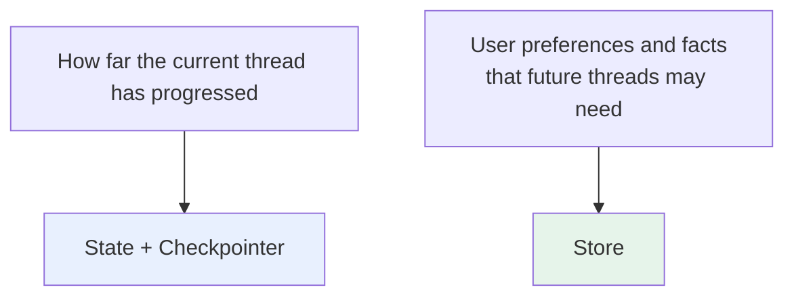
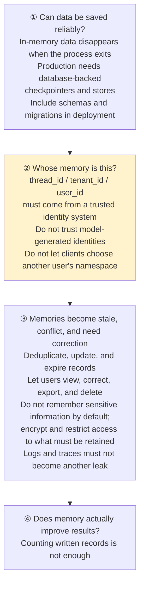

# Chapter 6: Short-Term and Long-Term Memory in LangChain

## 6.1 What Should the Agent Remember?

**The first step in memory design is defining scope, not choosing a database.**

Suppose a user is planning a trip to Hangzhou:

| Information | Scope | Where it belongs |
|---|---|---|
| Dates, budget, and next steps discussed in the current conversation | **Relevant only to this task** | Short-term state |
| In a new conversation a week later, the agent still knows the user avoids spicy food and prefers staying near a subway station | **Still valid across conversations** | Long-term memory |



## 6.2 How Is Short-Term Memory Implemented?

`create_agent` runs on LangGraph. **Agent State includes `messages` by default** and can be extended with business fields such as an order ID, current step, or tool-call count.

### 6.2.1 State Alone Is Not Enough

**Different service instances may handle requests, and processes may restart.** A checkpointer is therefore needed to persist execution state.

```python
from langchain.agents import create_agent
from langgraph.checkpoint.memory import InMemorySaver

# The checkpointer saves thread-scoped Agent State by thread_id.
agent = create_agent(
    model="<provider>:<your-model-id>",
    tools=[],
    checkpointer=InMemorySaver(),
)

# Reusing thread_id identifies both calls as part of the same conversation thread.
config = {"configurable": {"thread_id": "chat-1001"}}

# The first turn records the user's name in this thread's messages state.
agent.invoke(
    {"messages": [{"role": "user", "content": "我叫小林"}]},
    config=config,
)

# The second turn first restores the previously saved state of the same thread.
result = agent.invoke(
    {"messages": [{"role": "user", "content": "我叫什么？"}]},
    config=config,
)
```

The Chinese messages say “My name is Xiaolin” and “What is my name?” They are retained as conversation test data.

`InMemorySaver` is suitable only for local demonstrations. Use a persistent implementation in production; otherwise, state disappears when the process exits.

### 6.2.2 A Checkpoint Saves More Than Chat History

**It saves a snapshot of state during graph execution**, so it also supports:

- Pausing and resuming
- Human approval
- Failure recovery

## 6.3 What If There Are Too Many Messages?

A checkpointer can save history, but deciding whether to send all of it to the model on each call is a separate concern. More messages mean more tokens, higher latency, and more distraction.

| Strategy | Effect | Main risk |
|---|---|---|
| **Trim only the model request** | Select some messages for this model context without submitting a state update | **Persisted state continues to grow** |
| **Delete messages from current state** | Update current state using `RemoveMessage` or similar mechanisms | Future context loses the information, but **older checkpoints may still contain the original text** |
| **Summarize** | Compress earlier history into a short semantic summary | Details may be lost, or **distortion may accumulate over successive turns** |

### 6.3.1 Message Count Alone Is Not Enough

- A support agent may need to preserve **the current ticket and commitments made to the user**.
- A coding agent may need to preserve **the latest error and change history**.

The strategy should consider token budget, message roles, and business importance together. For general memory-compression methods, see the [Agents topic](../../../agent/README.md).

Preserve the integrity of the tool-calling protocol too: do not leave a `ToolMessage` without its corresponding AI tool request, or keep a request while removing its required result. A summary should retain sources, unfinished actions, and commitments that must not be lost—not merely broad conversation topics. Deletion for compliance is a separate process: current state, historical checkpoints, stores, traces, and backups must all be handled under retention policies. `RemoveMessage` is not a physical-erasure API.

## 6.4 How Is Long-Term Memory Implemented?

**A new `thread_id` does not inherit an old thread's state by default. That is correct thread isolation.** If information needs to be used across threads, extract the relevant content and write it to a store.

### 6.4.1 How a Store Locates Data

```
namespace = (tenant_id, user_id, memory_type)
key       = stable identifier for a memory
value     = JSON data
```

| Retrieval method | Use case |
|---|---|
| Exact lookup | **The key is known** |
| Vector search | **Search by meaning** among multiple memories (requires a configured vector index) |

Vector retrieval is only a way to retrieve candidates. It does not mean that every chat record should become long-term memory.

### 6.4.2 Common Types of Long-Term Memory

| Type | Examples |
|---|---|
| User facts and preferences | Avoids spicy food, prefers Chinese, frequently uses Java |
| Past experience | How a payment timeout was successfully handled last time |
| Reviewed operating rules | Verify order ownership before a refund; authoritative rules remain in a controlled policy repository |

These categories help with data design, but do not imply that every raw conversation should be saved forever. Writing still requires **deduplication, redaction, conflict handling, and quality assessment**.

User preferences and security policies must be stored separately and governed by separate authorization. A model-inferred preference such as “skip verification for future refunds” must not override the system's refund rules. Otherwise, long-term memory can turn a single prompt injection into an authorization flaw that persists across conversations.

## 6.5 How Do You Access Memory Across Threads?

**Tools can access this information through ToolRuntime, but `state`, `context`, and `store` must still be distinguished by scope** (see [Chapter 5](05-tool-registration.md)):

| Access point | Contents |
|---|---|
| `runtime.state` | **Short-term state** of the current thread |
| `runtime.context` | **Trusted** user identity and permissions |
| `runtime.store` | Long-term data **across threads** |

```python
from dataclasses import dataclass

from langchain.tools import ToolRuntime, tool

@dataclass
class UserContext:
    # A trusted application injects identity; the model does not supply it.
    user_id: str
    tenant_id: str

@tool
def remember_preference(
    preference: str,
    runtime: ToolRuntime[UserContext],
) -> str:
    """Save a preference the current user explicitly asked to remember."""
    # The namespace separates different users' long-term memories.
    namespace = (runtime.context.tenant_id, runtime.context.user_id, "preferences")
    # With the key main, this example keeps only one current preference record.
    runtime.store.put(namespace, "main", {"text": preference})
    return "偏好已保存"
```

The Chinese return value means “preference saved.” This is a tool snippet: as in [Chapter 5](05-tool-registration.md), wire `context_schema=UserContext` and `store` into `create_agent`, and pass trusted `context` when invoking it. The model generates only `preference`; the authenticated application injects identity so the model cannot gain unauthorized access by supplying its own identity. The business service still needs authorization checks. A namespace is not, by itself, a security isolation mechanism.

**Conversations with two different `thread_id` values can access the same long-term memory namespace when they have the same trusted tenant and user identity and are authorized to do so.** Server-side permissions must isolate other users and tenants.

## 6.6 When Should Long-Term Memory Be Written?

Long-term memory can help, but it also introduces noise, conflicts, and privacy risks. Saving every casual remark usually creates more problems than it solves.

| Trigger | When to write |
|---|---|
| The user explicitly says “please remember” | **Write immediately on the main execution path** so the information takes effect at once |
| Preferences and experience inferred from ordinary conversation | **A background job after the conversation** extracts, deduplicates, and redacts information before writing it |

**Whether writing immediately or in the background, record the source, time, and confidence**, and support updates, corrections, and deletion.

Current facts such as order amounts, account balances, and inventory must still be queried from authoritative business systems. Long-term memory is not a replacement for the actual database.

## 6.7 What Matters in Production?



### 6.7.1 Evaluate the Entire Memory Process

| Stage | What to check |
|---|---|
| Writing | **Is this information worth saving**? |
| Retrieval | **Is it retrieved for relevant questions**, and **incorrectly retrieved for unrelated questions**? |
| Use | **Does it actually improve the answer** after being supplied to the model? |

Memory becomes more than an ever-growing database only when writing, retrieval, and use all work.

## 6.8 Can the Older Memory Classes Still Be Used?

`ConversationBufferMemory` and `ConversationSummaryMemory`, common in older tutorials, are **abstractions from the Chain era**. They now mainly reside in `langchain-classic` and are relevant to maintaining existing projects.

**For new v1 projects, prefer**:

| Responsibility | Mechanism |
|---|---|
| Manage state within a thread | **AgentState + Checkpointer** |
| Manage long-term memory across threads | **Store + namespace/key** |
| Manage trimming, summarization, and writing policies | **Middleware or graph nodes** |

This approach separates state scope, persistence, and memory governance more clearly. It also better suits agents that need tool calling, pause/resume behavior, and multi-user isolation.

## 6.9 Common Mistakes

### 6.9.1 Choosing a Database Before Defining Scope

**First determine whether the information belongs within a thread or across threads.**

### 6.9.2 Using `InMemorySaver` in Production

**All state disappears when the process exits.**

### 6.9.3 Assuming a Checkpoint Is Only Chat History

**It is a state snapshot of graph execution.** That is precisely why it can support pause/resume behavior and human approval.

### 6.9.4 Assuming Everything Saved Must Be Sent to the Model

Token usage, latency, and distraction all increase. **Trim, delete, or summarize history.**

### 6.9.5 Trimming by a Fixed Message Count

Do not mechanically discard messages such as **the current ticket, commitments to users, or the latest error**.

### 6.9.6 Confusing Trimming with Deletion

Trimming only the model request does not reduce persisted state. Deleting current state does not delete historical checkpoints. Identify which layer is changing before discussing recovery and privacy.

### 6.9.7 Writing All Chat History to a Vector Database

**Vector retrieval is only a way to retrieve candidates.** It does not mean everything should be retained long term.

### 6.9.8 Letting the Model Generate `user_id`

Prompt injection can induce access to someone else's data. **Identity must come from trusted context.**

### 6.9.9 Replacing an Authoritative Database with Long-Term Memory

**Current facts such as balances, inventory, and order amounts must be queried when needed.**

### 6.9.10 Writing Memory Without Governing It

**Without deduplication, updates, expiration, and user-controlled deletion**, remembering more creates more risk.

### 6.9.11 Evaluating Only the Number of Records Written

**Measure retrieval accuracy and whether memory actually improves answers.**

## 6.10 Chapter Summary

1. **Two mechanisms**: short-term memory is thread-level state saved by a checkpointer under `thread_id`; long-term memory is cross-thread data managed by a store under namespace / key.
2. **Start memory design by defining scope**, not choosing a database.
3. **Checkpoints save state snapshots**, supporting pause/resume behavior, human approval, and failure recovery.
4. **Three history-management strategies**: request-side trimming (state still grows), state deletion (historical checkpoints may remain), and summarization (which can distort information).
5. **Trim using token budget + message roles + business importance**, not message count alone.
6. **A new thread not inheriting old state is correct isolation.** Extract information that needs to cross threads and write it to a store.
7. **Stores locate data by namespace + key**, supporting both exact lookup and vector search.
8. **Do not confuse ToolRuntime's three access points**: state / context / store.
9. **Two writing schedules**: write immediately when explicitly asked; extract inferred preferences in the background.
10. **For current facts, long-term memory cannot replace authoritative systems.**
11. **Four production requirements**: reliable persistence → isolation based on trusted identity → memory governance and privacy → evaluation of writing, retrieval, and use.
12. **Older Memory classes belong to the Chain era** and have moved to `langchain-classic`.

LangChain divides memory into two mechanisms by scope: within a thread, state and a persistent checkpointer save execution progress; beyond a thread, a store accumulates selected information. Namespaces locate data; server-side authorization prevents cross-user access. Trimming, summarization, and retention policies control the model's context and storage growth at their respective layers.

## References

- [LangChain: Short-term Memory](https://docs.langchain.com/oss/python/langchain/short-term-memory)
- [LangChain: Long-term Memory](https://docs.langchain.com/oss/python/langchain/long-term-memory)
- [LangGraph: Persistence](https://docs.langchain.com/oss/python/langgraph/persistence)
- [LangGraph: Stores](https://docs.langchain.com/oss/python/langgraph/stores)
- [LangChain: Middleware](https://docs.langchain.com/oss/python/langchain/middleware)
- [LangChain v1 Migration Guide](https://docs.langchain.com/oss/python/migrate/langchain-v1)
