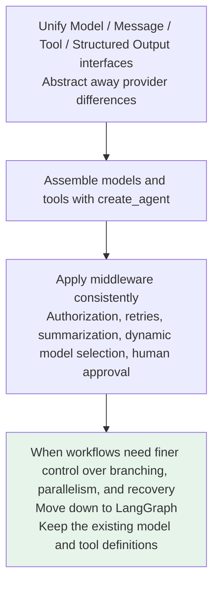
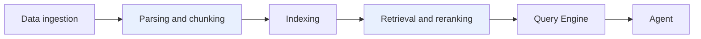

# Chapter 7: Dividing Responsibilities Between LangChain and LlamaIndex

## 7.1 Why Are They Easy to Confuse?

Both frameworks support model calls, tools, RAG, agents, and workflows. Looking only at a feature list, it is easy to conclude that they are much the same.

> Their design priorities provide a more useful distinction:
>
> - **LangChain** focuses more on **unifying models and tools and quickly assembling general-purpose agents**.
> - **LlamaIndex** focuses more on **turning private data into high-quality context** for a model or agent to use.

## 7.2 The Core Difference

| Dimension | LangChain | LlamaIndex |
|---|---|---|
| **Design priority** | General-purpose agent assembly and tool integration | Data ingestion and context augmentation |
| **Main strengths** | Models, tools, middleware, and third-party integrations | Document processing, indexing, retrieval, and reranking |
| **Common use cases** | Tool-using agents, SQL agents, business assistants | Enterprise knowledge bases, document agents, complex RAG |
| **Complex workflows** | Manage state, recovery, and human intervention through LangGraph | Use Workflows, or combine with LangGraph |

> **This table compares areas of strength, not hard capability boundaries.** LangChain also has a full set of RAG components, and LlamaIndex can also create agents. **The difference is which set of abstractions better matches the project's main problem.**

## 7.3 Where LangChain Is Strong

**When a project needs multiple models, search, databases, browsers, MCP servers, and internal company APIs**, the largest engineering cost is often **adapting between different interfaces**.



**The main challenge** is getting the model to **choose the right tool and supply the right arguments**, while consistently integrating authorization, retries, and approval into execution.

> **LangGraph is the underlying runtime for LangChain agents.** Pausing, resuming, and tool approval within the standard loop can be configured directly through `create_agent`. Write an explicit state graph only when the business workflow's topology needs additional control.

## 7.4 Where LlamaIndex Is Strong

**The challenges of a real RAG project usually go beyond putting documents into a vector database.**

| Stage | Practical challenges |
|---|---|
| **Initial ingestion** | PDF tables, content spanning pages, chunking, and metadata; when a policy has multiple versions, **determine which one is still in force** |
| **Querying** | Decide between vector retrieval, keyword retrieval, and a structured database |
| **After results arrive from multiple sources** | Filter, rerank, and **resolve conflicts** |

> **Difficulties propagate through ingestion → indexing → retrieval → context assembly. No single vector database can solve them all.**



> **LlamaIndex treats obtaining high-quality context as the central engineering problem.**

Enterprise documents, routing across data sources, and complex retrieval are natural starting points for using it.

More precisely, **LlamaIndex's strengths center on data**; that does not mean it can only do RAG. It also provides agents and event-driven workflows.

## 7.5 How Should You Choose?

Start with the risks that matter most to the project.

| Main project risk | Evaluate first | Reason |
|---|---|---|
| Too many models and business tools make integration complex | **LangChain** | General-purpose components and tool interfaces are a natural fit |
| Poor document parsing, chunking, or retrieval quality | **LlamaIndex** | More fine-grained abstractions for the data-to-context pipeline |
| Workflows need pause/resume and human approval | **LangGraph**, optionally with LangChain | State and execution control are core capabilities |
| Both complex retrieval and complex workflows are required | **LlamaIndex + LangChain/LangGraph** | Choose suitable components separately for the data and orchestration layers |

> **For a simple knowledge base or a single-tool agent, there is no need to introduce both frameworks just to make the architecture look complete.**
>
> Combining them adds dependency, tracing, and debugging costs. **It is worthwhile only when each solves a distinct problem.**

## 7.6 How to Combine Them

**The most common integration boundary is a tool.**

```python
# Wrap a LlamaIndex Query Engine as a tool LangChain can call
@tool
def search_company_knowledge(question: str) -> str:
    """Query the company knowledge base."""
    return str(query_engine.query(question))

# The LangChain agent decides when to query knowledge and when to use order tools
agent = create_agent(
    model=chat_model,
    tools=[search_company_knowledge, lookup_order],
)
```

| Layer | Responsible component |
|---|---|
| Data loading, index construction, Query Engine | **LlamaIndex** |
| Deciding when to call a tool and which one | **LangChain agent** |
| Approval, retries, recovery | **LangGraph** |

> **This snippet illustrates the division of responsibilities.** Production use also requires **tenant authorization, citation sources, timeouts, and observability**.

`str(query_engine.query(...))` illustrates a boundary that passes only answer text; it may discard evidence metadata such as `source_nodes`. If the Query Engine has already called a generative model, having the outer agent summarize again incurs the cost of two generations and risks factual drift. When citations must be verifiable, pass the answer separately from authorization-filtered evidence IDs, excerpts, and source versions. If the outer model writes the final response, expose the retriever's evidence results directly to avoid duplicate generation.

To decide whether the combination is worthwhile, do not evaluate only the final answer. Keep documents, chunks, and questions fixed, then compare retrieval quality, the proportion of citations that support their claims, generation counts, and P95 latency against a single-framework baseline. If each layer allows three attempts, the worst case can multiply into nine underlying requests. One layer should therefore own cross-boundary deadlines, cancellation, and the retry budget.

## 7.7 Common Mistakes

### 7.7.1 Using the Outdated Label "LangChain Does Chains; LlamaIndex Does RAG"

**Both support agents, tool calling, and RAG.** Their design priorities differ.

### 7.7.2 Thinking LangChain Only Strings Prompts into Chains

**Its main direction has shifted toward agents.** Runnable and LCEL handle fixed workflows.

### 7.7.3 Thinking LlamaIndex Is a Vector Database

**It connects to vector databases, but is itself an abstraction for data processing, indexing, retrieval, and context assembly.**

### 7.7.4 Comparing Frameworks by Feature Lists

**Overlapping features do not imply identical design priorities.** Ask which abstractions better fit your main difficulty.

### 7.7.5 Assuming You Must Choose One or the Other

You can combine them through **tools or service interfaces**.

### 7.7.6 Introducing Both for Architectural Completeness

**A simple knowledge base or single-tool agent does not need both.** The extra dependencies only add debugging costs.

### 7.7.7 Reducing RAG to "Choose a Vector Database"

**Difficulties propagate through ingestion → indexing → retrieval → context assembly.**

### 7.7.8 Forgetting Production Requirements When Combining Frameworks

Tenant authorization, citation sources, timeouts, and observability **do not appear automatically**.

## 7.8 Chapter Summary

1. **Drop the outdated labels.** Both support agents, tool calling, and RAG.
2. **The real difference is design priority**: LangChain emphasizes general-purpose agent assembly and tool integration; LlamaIndex emphasizes ingestion and context augmentation.
3. **LangChain's value lies in abstracting away interface differences**: unify Model / Message / Tool / structured output, assemble them with `create_agent`, and apply cross-cutting behavior through middleware.
4. **Complex workflows can move from LangChain down to LangGraph** without discarding existing model and tool definitions.
5. **LlamaIndex's value lies in treating high-quality context as the central engineering problem**, with finer-grained abstractions along the pipeline.
6. **RAG difficulties propagate through the pipeline.** No single vector database can solve them all.
7. **Choose based on the project's greatest risks**, then decide what to evaluate first.
8. **The most common integration boundary is a tool**: LlamaIndex handles data and retrieval, LangChain handles model and tool selection, and LangGraph handles state and recovery.
9. **Combining frameworks has a cost.** It is worthwhile only when each addresses a distinct difficulty.

> Think of the boundary this way: LangChain first addresses how to unify and coordinate models and tools; LlamaIndex first addresses how to turn private data into high-quality context. When both problems exist, connect the two through a tool.

## References

- [LangChain official documentation](https://docs.langchain.com/oss/python/langchain/overview)
- [LangChain: Agents](https://docs.langchain.com/oss/python/langchain/agents)
- [LangChain: Retrieval](https://docs.langchain.com/oss/python/langchain/retrieval)
- [LangGraph official documentation](https://docs.langchain.com/oss/python/langgraph/overview)
- [LlamaIndex official documentation](https://docs.llamaindex.ai/)
- [LlamaIndex: Building an Agent](https://docs.llamaindex.ai/en/stable/understanding/agent/)
- [LlamaIndex: Workflows](https://docs.llamaindex.ai/en/stable/understanding/workflows/)
