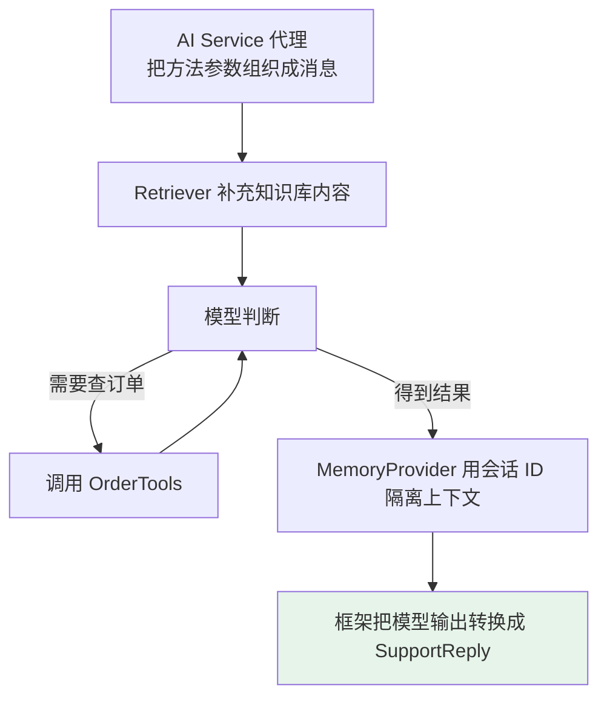
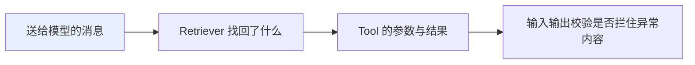

# 第八章：LangChain4j 与 Java 生态

## 8.1 它是 LangChain 的 Java 版吗

**这是这道题的第一个雷。**

> **官方定位很明确**：LangChain4j 是**从 Java 习惯出发设计的 JVM 开源库**，重视类型安全、POJO、注解、接口和依赖注入。
>
> **它的 API、内部实现和发布周期都独立于 Python LangChain。** 更准确的说法是「它吸收了 LLM 应用生态中的通用模式」，而不是「逐项复刻 LangChain」。

### 8.1.1 这个区别为什么重要

**因为它解释了 LangChain4j 最有辨识度的能力为什么叫 AI Services。**

Java 开发者熟悉的是**接口、类型和服务层**，而不是在业务代码里到处拼消息数组和 JSON。**LangChain4j 选择顺着 Java 的思维方式，把一次 AI 能力包装成一个可调用的服务接口。**

### 8.1.2 两层抽象

| 层 | 类比 | 代表抽象 |
|---|---|---|
| **低层** | 自己组零件 | `ChatModel`、`EmbeddingModel`、`ChatMemory` |
| **高层** | 直接调用装修好的服务台 | **AI Services** |

> **官方文档中的旧式 Chains 已明确标为 legacy。** 不要因为框架名字里有 Chain，就把 `ConversationalChain` 当成主入口。

## 8.2 统一接口能抹平所有差异吗

**假设公司今天试一家云厂商模型，明天因为数据合规换一家，后天又要接本地 Ollama。**

直接调用每家 SDK：认证方式、请求对象、消息格式、流式回调和异常类型都不同，**业务层很快会长满适配代码**。

| 能力 | 核心接口 |
|---|---|
| 聊天模型 | `ChatModel` / `StreamingChatModel` |
| 文本向量化 | `EmbeddingModel` |
| 向量写入与搜索 | `EmbeddingStore` |

**具体厂商能力放进独立集成模块，业务代码尽量依赖核心接口。**

### 8.2.1 真正的收益不是「一行代码切换任意模型」

> **而是把变化关在适配层里。** 单元测试可以替换模型实现，试验不同向量库时也不用推翻上层 RAG 流程。

### 8.2.2 为什么不能吹成完全无锁定

**因为抽象只能覆盖交集。**

- 某个模型是否支持**工具调用、原生 JSON Schema、图片输入、思考内容或特殊采样参数**，仍要查官方能力矩阵；
- 切换供应商后，**Prompt 效果、Token 计算、限流、异常处理和评测基线也要重新验证**。

## 8.3 AI Services 解决什么问题

**只做一次模型调用，手写几行 SDK 代码并不难。** 真正麻烦的是业务开始要求多轮对话、工具调用、知识检索和稳定字段之后——开发者要不断处理 **Prompt 拼装、消息转换、模型循环和输出反序列化**。

> **AI Services 就是为了收拢这些胶水代码。** 开发者声明一个 Java 接口，LangChain4j 在运行时提供代理实现。
>
> **它很像 Spring Data JPA 或 Retrofit**：我们描述「服务要暴露什么方法」，框架负责把方法参数变成消息，再把模型响应转换成方法返回值。

### 8.3.1 一个把关键能力放在一起的例子

```java
record SupportReply(
        @Description("给用户展示的中文答复") String answer,
        @Description("查到的订单状态，未查询时返回空字符串") String orderStatus,
        @Description("是否需要转人工") boolean needsHuman) {
}

interface SupportAssistant {

    @SystemMessage("""
            你是订单客服。涉及订单状态时必须调用查询工具，
            不得猜测系统中不存在的信息；高风险请求必须建议转人工。
            """)
    SupportReply chat(@MemoryId String conversationId,
                      @UserMessage String question);
}

final class OrderTools {

    private final OrderService orderService;

    OrderTools(OrderService orderService) {
        // 复用现有 Java 领域服务，不把数据库连接直接暴露给模型
        this.orderService = orderService;
    }

    @Tool("根据订单号查询订单状态，只读，不执行退款或修改")
    String findOrder(@P("订单号") String orderId) {
        // 真正的鉴权、租户隔离和审计仍应由业务服务完成
        return orderService.findStatus(orderId);
    }
}

// 向量库中的文档应已在离线流程完成切分、向量化和写入
ContentRetriever retriever = EmbeddingStoreContentRetriever.builder()
        .embeddingStore(embeddingStore)
        .embeddingModel(embeddingModel)
        .maxResults(5)
        .minScore(0.75)
        .build();

SupportAssistant assistant = AiServices.builder(SupportAssistant.class)
        .chatModel(chatModel)
        .tools(new OrderTools(orderService))
        .contentRetriever(retriever)
        .chatMemoryProvider(memoryId -> MessageWindowChatMemory.builder()
                .id(memoryId)
                .maxMessages(20)
                // 生产环境可接自定义 ChatMemoryStore 持久化当前记忆窗口
                .chatMemoryStore(chatMemoryStore)
                .build())
        .build();

SupportReply reply = assistant.chat("conversation-1001", "订单 A1024 到哪了？");
```

**入口只有一句 `assistant.chat()`，背后却串起了一条完整链路**：



### 8.3.2 结构化输出的三个时效性细节

1. **返回 record 或 POJO 时**，LangChain4j 可以自动生成 Schema 并解析响应；
2. **想用模型供应商原生的 JSON Schema 约束**，要确认对应 `ChatModel` 支持并**显式启用**——模型不支持时框架可能退回到 **Prompt 格式指令，可靠性更弱**；
3. **即使反序列化成功，也只说明数据形状能对上**，不代表金额、权限和订单状态符合业务规则。**确定性的业务校验仍然不能交给模型。**

> **依赖版本不要在多处手填。** 官方推荐通过 `langchain4j-bom` 管理模块版本，再从官方 Release Notes 选择经过验证的版本，避免核心包、模型集成和 Spring Starter 版本互相错位。

## 8.4 Tools 如何连接业务动作

**Tools 最容易被误解成「把数据库权限交给模型」。**

> **模型只负责生成工具名和参数、请求执行某个动作，真正运行 Java 方法的是应用程序。**

LangChain4j 通过 `@Tool` 暴露对象方法，也支持运行时提供工具。框架把工具说明和参数 Schema 发给模型，再执行模型选择的 Java 方法，把结果作为工具消息交回模型。

**一次 AI Service 调用中可能发生多轮「模型 → 工具 → 模型」，直到拿到最终结果。**

### 8.4.1 自动循环省的是代码，不是安全边界

| 动作 | 必须补的约束 |
|---|---|
| 查订单 | 用户与**租户校验** |
| 退款 | **幂等 + 额度控制** |
| 发消息 | **审批与审计** |
| 工具异常 | **不应把堆栈、路径或敏感信息原样回传给模型** |

> **工具描述约束的是模型行为，服务端权限约束的才是真实能力。**

## 8.5 Chat Memory 等于聊天档案吗

多轮客服每次手工拼回历史消息，既麻烦又容易超上下文窗口。LangChain4j 提供 `ChatMemory` 抽象：

| 实现 | 淘汰依据 |
|---|---|
| `MessageWindowChatMemory` | 消息条数 |
| `TokenWindowChatMemory` | Token 窗口 |

### 8.5.1 必须分清 memory 和 history

| 概念 | 是什么 |
|---|---|
| **Chat Memory** | **下一次要喂给模型的上下文**，可以发生淘汰、压缩或注入 |
| **完整聊天记录** | 产品实际展示和**审计所需的事实记录** |

> **官方明确说明 LangChain4j 提供的是 memory，不替应用保存完整 history。**

### 8.5.2 工程注意点

- 默认实现把消息放在内存中，**需要持久化时实现 `ChatMemoryStore` 接到数据库**；
- 多用户场景用 `@MemoryId` 和 `ChatMemoryProvider` **隔离会话**，不能让所有用户共享同一个窗口；
- **同一个 MemoryId 不应被并发调用**，否则可能破坏 Chat Memory——**分布式并发控制仍是应用的责任**。

> **如果业务说的「长期记忆」是用户偏好、历史事实或企业知识**，通常应该结构化存入业务数据库，或做成可检索知识再通过 RAG 注入，**而不是无限增大消息窗口**（对照 [第六章](../02-agent-building/06-memory.md)）。

## 8.6 RAG 不只是连接向量库

企业项目常见的需求是让模型回答**内部制度、产品手册和客户资料**。

| 复杂度 | 做法 |
|---|---|
| 简单知识库 | 把一个检索器直接交给 AI Service |
| **需要查询改写、多路检索、融合、重排和上下文注入** | 用 **`RetrievalAugmentor`** 把这些阶段组合起来 |

**底层来源也不只限于向量库**，还可以是全文搜索、Web 搜索、知识图谱或业务数据库。

> **对 Java 团队的价值**：数据加载、检索策略和模型调用可以继续留在同一套工程、配置和测试体系中。
>
> **但框架只提供积木**——文档质量、切分策略、召回率、权限过滤、引用溯源和离线评测仍决定最终效果。

## 8.7 Java 生态如何集成

**选哪种集成，先看团队原来用什么服务框架，而不是先背一遍支持列表。**

| 现状 | 做法 |
|---|---|
| 已有 **Spring Boot** 服务 | 沿用其配置、依赖注入和监控体系；Starter 可自动创建常用 Bean，也能用 `@AiService` 声明；按项目的 Spring Boot 大版本选依赖 |
| 已有 **Quarkus** 服务 | 优先 **Quarkus LangChain4j**——复用核心抽象，再接入 CDI、构建期装配、原生镜像和开发工具 |
| Helidon / Micronaut | 有对应集成，但除非岗位技术栈明确使用，**说清「优先沿用团队现有依赖注入、配置和监控体系」就够了** |

## 8.8 可观测性与 Guardrails 的边界

**一次客服回答错了，应该先看什么？** 不能只盯最终文本，因为一次调用可能已经经过 RAG 检索、模型判断和工具执行。



`ChatModelListener` 等监听入口就是为了采集这些阶段的**请求、响应、耗时和错误**。Spring Boot 或 Quarkus 集成能把这些事件接入团队已有的指标与追踪系统。

### 8.8.1 Guardrails 的两条边界

1. **官方仍把 Guardrails 和 AI Service Observability 标为实验性**，而且**只适用于 AI Services，不能直接套在低层 `ChatModel` 上**；
2. **Guardrail 不是安全系统的替代品**——Prompt Injection 检测可能漏报，输出校验也不能替代业务权限。

> **认证、授权、数据隔离、资金风控和审计必须继续放在确定性的业务层。**

## 8.9 什么时候适合 LangChain4j

### 8.9.1 适合

**团队已有大量 Java 服务，希望把 AI 能力嵌入现有系统**：企业知识库问答、带会话上下文的智能客服、从合同和简历中抽取结构化字段、批量摘要与分类、让模型查询订单或创建工单、需要在多个模型或向量库之间评估选型。

> **它尤其适合「AI 是业务系统的一部分」的团队。** 领域服务、数据库访问、权限和审计已经写在 Java 中，**直接把这些能力注册为受控 Tools，通常比新增一个 Python 微服务再跨语言调用更简单**。

### 8.9.2 不适合

- **只调一家模型做一次文本生成**：厂商官方 SDK 可能更轻，不必为了抽象而抽象；
- **深度依赖某家模型刚发布的专属能力**：直接 SDK 往往更早暴露完整参数；
- **跨小时运行、可暂停恢复、强事务补偿的复杂流程**：不能只依赖模型工具循环，还要结合工作流引擎、消息系统或图编排方案。

### 8.9.3 同类 Java 方案怎么选

| 现状或目标 | 更值得优先评估的方案 |
|---|---|
| 已有普通 Java 项目，需要丰富的模型、Tools、Memory 和 RAG 组件 | **LangChain4j** |
| Spring Boot 是统一技术底座，希望沿用 Spring 官方抽象 | **Spring AI**，也可对比 LangChain4j Spring Boot Starter |
| Quarkus、原生镜像和 Dev Services 是核心诉求 | **Quarkus LangChain4j** |
| 深度绑定单一供应商最新专属能力 | **厂商官方 Java SDK** |
| 长时间、可恢复、强确定性的业务流程 | **工作流引擎或图编排层**，再组合 LLM 框架 |

> **选型时做一个小型真实 PoC，而不是只比功能清单**：用同一批问题验证回答质量、工具参数准确率、结构化输出成功率、延迟、Token 成本、监控完整度和故障恢复。
>
> **因为「支持某项功能」和「满足自己的生产要求」，中间还隔着业务数据与工程验证。**

## 8.10 常见错误

### 8.10.1 说它是「Python LangChain 的官方 Java 移植」

**API、实现和发布周期都独立**，它是从 Java 习惯出发设计的独立框架。

### 8.10.2 因为名字里有 Chain 就用 `ConversationalChain`

**旧式 Chains 已标为 legacy**，主入口是 AI Services。

### 8.10.3 把统一接口吹成完全无锁定

**抽象只能覆盖交集**，工具调用、JSON Schema、多模态支持仍有差异。

### 8.10.4 切换模型后不重新验证

**Prompt 效果、Token 计算、限流、异常处理、评测基线都要重跑。**

### 8.10.5 以为反序列化成功就代表业务正确

**只说明数据形状对上了**，金额、权限、状态仍需确定性校验。

### 8.10.6 在多处手填依赖版本

**用 `langchain4j-bom`**，否则核心包与集成模块容易错位。

### 8.10.7 以为 `@Tool` 是把数据库权限交给模型

**模型只提意图，执行和鉴权都在 Java 侧。**

### 8.10.8 工具异常把堆栈原样回传给模型

**会泄漏路径和敏感信息。**

### 8.10.9 把 Chat Memory 当成完整聊天记录

**memory 是给模型的上下文，history 是审计事实**，框架不替你保存后者。

### 8.10.10 所有用户共享一个记忆窗口 / 并发用同一 MemoryId

**必须用 `@MemoryId` 隔离，并发控制是应用的责任。**

### 8.10.11 把 Guardrails 当安全系统

**它是实验性的、只适用于 AI Services、且不能替代权限与风控。**

### 8.10.12 靠无限增大消息窗口实现「长期记忆」

**应该结构化入库或做成可检索知识再 RAG 注入。**

## 8.11 本章总结

1. **定位先说准**：不是 Python LangChain 的 Java 移植，而是遵循 Java 习惯的独立 JVM LLM 框架；
2. **两层抽象**：低层 `ChatModel` / `EmbeddingModel` / `ChatMemory`，高层 AI Services；
3. **统一接口的收益是把变化关在适配层**，而非「一行切换任意模型」；
4. **AI Services 收拢胶水代码**：声明接口，框架运行时代理，类似 Spring Data JPA / Retrofit；
5. **结构化输出能约束形状，不保证业务正确**，原生 JSON Schema 需模型支持并显式启用；
6. **用 `langchain4j-bom` 统一版本**；
7. **Tools 是模型提意图、Java 执行**，鉴权、幂等、审批、审计一个都不能省；
8. **memory ≠ history**，多用户要用 `@MemoryId` 隔离，同一 MemoryId 不可并发；
9. **RAG 从简单 Retriever 到 `RetrievalAugmentor`**，但效果仍取决于文档质量与评测；
10. **集成先看团队现有服务框架**：Spring Boot / Quarkus / Helidon / Micronaut；
11. **可观测性顺调用链排查**，Guardrails 是实验性且不替代安全体系；
12. **选型用小型真实 PoC 验证**，而不是比功能清单。

> **一句话概括：LangChain4j 的价值不是「让 Java 也能写 LangChain」，而是顺着 Java 的接口、类型和依赖注入习惯，把 Prompt、Tools、Memory、RAG 和结构化输出收拢成一个类型化的服务接口——但统一 API 不等于厂商能力一致，memory 不等于 history，Guardrails 也不等于权限系统。**

## 参考资料

- [LangChain4j 官方文档](https://docs.langchain4j.dev/)
- [LangChain4j GitHub 仓库](https://github.com/langchain4j/langchain4j)
- [LangChain4j: AI Services 教程](https://docs.langchain4j.dev/tutorials/ai-services)
- [LangChain4j: Tools 教程](https://docs.langchain4j.dev/tutorials/tools)
- [LangChain4j: Chat Memory 教程](https://docs.langchain4j.dev/tutorials/chat-memory)
- [LangChain4j: RAG 教程](https://docs.langchain4j.dev/tutorials/rag)
- [Quarkus LangChain4j](https://docs.quarkiverse.io/quarkus-langchain4j/dev/)
- [Spring AI 官方文档](https://docs.spring.io/spring-ai/reference/)
