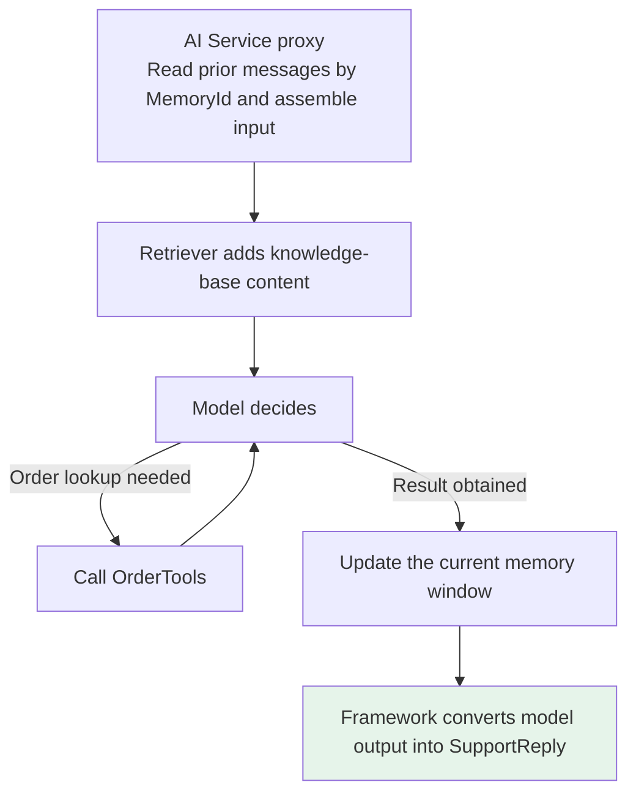
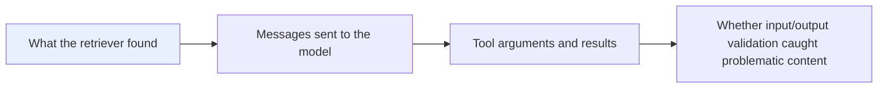

# Chapter 8: LangChain4j and the Java Ecosystem

## 8.1 Is It the Java Version of LangChain?

It is tempting to assume that LangChain4j is simply LangChain's Java counterpart.

> **Its official positioning is clear**: LangChain4j is **an open-source JVM library designed around Java idioms**, emphasizing type safety, POJOs, annotations, interfaces, and dependency injection.
>
> **Its API, implementation, and release cycle are independent of Python LangChain.** It adopts common patterns from the LLM application ecosystem rather than replicating LangChain feature by feature.

### 8.1.1 Why This Distinction Matters

**It explains why LangChain4j's most distinctive abstraction is called AI Services.**

Java developers are accustomed to **interfaces, types, and service layers**, not assembling message arrays and JSON throughout business code. **LangChain4j follows that way of thinking by wrapping an AI capability in a callable service interface.**

### 8.1.2 Two Layers of Abstraction

| Layer | Analogy | Representative abstractions |
|---|---|---|
| **Low-level** | Assemble the parts yourself | `ChatModel`, `EmbeddingModel`, `ChatMemory` |
| **High-level** | Walk up to a fully equipped service desk | **AI Services** |

> **The official documentation explicitly marks the older Chains as legacy.** Do not treat `ConversationalChain` as the main entry point just because the framework's name contains "Chain."

## 8.2 Can Unified Interfaces Eliminate Every Difference?

**Suppose a company tries one cloud provider's model today, switches to another tomorrow for data compliance, and then needs a local Ollama deployment.**

Calling each SDK directly means handling different authentication methods, request objects, message formats, streaming callbacks, and exception types. **The business layer quickly fills with adapter code.**

| Capability | Core interface |
|---|---|
| Chat models | `ChatModel` / `StreamingChatModel` |
| Text embedding | `EmbeddingModel` |
| Vector storage and search | `EmbeddingStore` |

**Provider-specific capabilities live in separate integration modules, while business code depends on core interfaces wherever possible.**

### 8.2.1 What Do Unified Interfaces Buy You?

> **Their main benefit is containing change within the adapter layer.** Unit tests can substitute model implementations, and experiments with different vector databases need not replace the RAG workflow above them.

### 8.2.2 Why This Does Not Mean Complete Freedom from Lock-In

**An abstraction can only standardize the shared capabilities.**

- Whether a model supports **tool calling, native JSON Schema, image input, reasoning content, or special sampling parameters** still requires checking the official capability matrix.
- After changing providers, **prompt effectiveness, token accounting, rate limits, exception handling, and evaluation baselines all need to be revalidated**.

## 8.3 What Problem Do AI Services Solve?

**Writing a few lines of SDK code for a single model call is straightforward.** The trouble starts when the application needs multi-turn conversations, tool calling, knowledge retrieval, and consistent output fields. Developers repeatedly handle **prompt assembly, message conversion, model loops, and output deserialization**.

> **AI Services consolidate this glue code.** Developers declare a Java interface, and LangChain4j supplies a proxy implementation at runtime.
>
> **The approach resembles Spring Data JPA or Retrofit**: declare the methods the service should expose, and the framework converts method arguments into messages and model responses into return values.

### 8.3.1 An Example That Brings the Main Capabilities Together

These are assembly snippets, not standalone Java files. The application must initialize `chatModel`, `embeddingModel`, `embeddingStore`, `chatMemoryStore`, and `orderService`. Records and text blocks require a compatible JDK; the framework's and integrations' JDK/Spring Boot requirements depend on the selected versions. `minScore(0.75)` is only an example threshold. Calibrate it against the model, distance-to-score conversion, and business data rather than treating it as a universal probability of relevance.

The example keeps its Chinese customer-service strings. The field descriptions request a Chinese reply for the user, the retrieved order status (an empty string if no lookup occurred), and whether human assistance is needed. The system message tells the assistant to use the lookup tool for order status, never invent information absent from the system, and recommend human assistance for high-risk requests.

```java
record SupportReply(
        @Description("给用户展示的中文答复") String answer,
        @Description("查到的订单状态，未查询时返回空字符串") String orderStatus,
        @Description("是否需要转人工") boolean needsHuman) {
}

interface SupportAssistant {

    @SystemMessage("""
            你是订单客服。涉及订单状态时必须调用查询工具，
            不得猜测系统中不存在的信息；高风险请求必须建议转人工。
            """)
    SupportReply chat(@MemoryId String conversationId,
                      @UserMessage String question);
}
```

The interface declares the inputs and outputs; the tool object connects model requests to the existing order service. The model supplies the order ID, but the server still verifies order ownership and permission to act. The Chinese tool description specifies a read-only order-status lookup, with no refunds or modifications; the parameter description means "order ID."

```java
final class OrderTools {

    private final OrderService orderService;

    OrderTools(OrderService orderService) {
        // Reuse the Java domain service; do not expose a database connection to the model
        this.orderService = orderService;
    }

    @Tool("根据订单号查询订单状态，只读，不执行退款或修改")
    String findOrder(@P("订单号") String orderId) {
        // The business service still enforces authorization, tenant isolation, and auditing
        return orderService.findStatus(orderId);
    }
}
```

Configure the knowledge-base retriever separately. Enforce document access controls before retrieval, rather than waiting until after answer generation to hide unauthorized content.

```java
// Documents should already be chunked, embedded, and stored by an offline pipeline
ContentRetriever retriever = EmbeddingStoreContentRetriever.builder()
        .embeddingStore(embeddingStore)
        .embeddingModel(embeddingModel)
        .maxResults(5)
        .minScore(0.75)
        .build();
```

Finally, supply the model, tools, retriever, and memory window to the AI Service proxy. The sample customer question asks, in Chinese, "Where is order A1024?"

```java
SupportAssistant assistant = AiServices.builder(SupportAssistant.class)
        .chatModel(chatModel)
        .tools(new OrderTools(orderService))
        .contentRetriever(retriever)
        .chatMemoryProvider(memoryId -> MessageWindowChatMemory.builder()
                .id(memoryId)
                .maxMessages(20)
                // In production, a custom ChatMemoryStore can persist the current memory window
                .chatMemoryStore(chatMemoryStore)
                .build())
        .build();

SupportReply reply = assistant.chat("conversation-1001", "订单 A1024 到哪了？");
```

**The entry point is just `assistant.chat()`, but it connects a complete sequence behind the scenes**:



### 8.3.2 Three Engineering Details of Structured Output

1. **When returning a record or POJO**, LangChain4j can generate the schema and parse the response automatically.
2. **To use a provider's native JSON Schema constraints**, confirm support in the corresponding `ChatModel` and **enable it explicitly**. When the model does not support it, the framework may fall back to **format instructions in the prompt, which are less reliable**.
3. **Successful deserialization only establishes that the data has the expected shape.** It does not establish that amounts, permissions, or order statuses satisfy business rules. **Deterministic business validation must not be delegated to the model.**

> **Do not manually specify dependency versions in multiple places.** The official recommendation is to manage module versions with `langchain4j-bom` and select a validated release from the official release notes, avoiding mismatches between the core package, model integrations, and Spring starters.

## 8.4 How Tools Connect to Business Actions

**A common misconception is that tools give the model database permissions.**

> **The model generates a tool name and arguments to request an action. The application actually executes the Java method.**

LangChain4j exposes object methods through `@Tool` and also supports supplying tools at runtime. The framework sends tool descriptions and parameter schemas to the model, executes the Java methods the model selects, and returns their results as tool messages.

**A single AI Service invocation may involve several rounds of model → tool → model before producing the final result.**

### 8.4.1 An Automatic Loop Saves Code, Not Security Boundaries

| Action | Required controls |
|---|---|
| Look up an order | User and **tenant checks** |
| Issue a refund | **Idempotency and amount limits** |
| Send a message | **Approval and auditing** |
| Handle a tool exception | **Do not return raw stack traces, paths, or sensitive information to the model** |

> **Tool descriptions guide model behavior; server-side permissions constrain what can actually happen.**

## 8.5 Is Chat Memory a Conversation Archive?

Manually rebuilding prior messages on every turn of a support conversation is cumbersome and can exceed the context window. LangChain4j provides the `ChatMemory` abstraction:

| Implementation | Eviction basis |
|---|---|
| `MessageWindowChatMemory` | Message count |
| `TokenWindowChatMemory` | Token window |

### 8.5.1 Distinguish Memory from History

| Concept | Meaning |
|---|---|
| **Chat Memory** | **Context to feed the model next**, which may undergo eviction, compression, or injection |
| **Complete conversation history** | What the product actually displays and **the factual record needed for auditing** |

> **The official documentation explicitly states that LangChain4j provides memory; it does not preserve complete history for the application.**

### 8.5.2 Engineering Considerations

- Default implementations keep messages in memory. **For persistence, implement `ChatMemoryStore` and connect it to a database.**
- In multi-user applications, use `@MemoryId` and `ChatMemoryProvider` to **isolate conversations**, rather than sharing one window across all users.
- **Do not make concurrent calls with the same MemoryId**, as this can corrupt Chat Memory. **Distributed concurrency control remains the application's responsibility.**

> **If "long-term memory" means user preferences, historical facts, or enterprise knowledge**, store it as structured data in a business database, or make it retrievable knowledge and inject it through RAG. **Do not keep enlarging the message window indefinitely** (compare [Chapter 6](../02-agent-building/06-memory.md)).

## 8.6 RAG Is More Than Connecting a Vector Database

A common enterprise requirement is answering questions about **internal policies, product manuals, and customer information**.

| Complexity | Approach |
|---|---|
| Simple knowledge base | Supply a retriever directly to the AI Service |
| **Query rewriting, multi-source retrieval, fusion, reranking, and context injection are needed** | Compose those stages with **`RetrievalAugmentor`** |

**Underlying sources are not limited to vector databases.** They can include full-text search, web search, knowledge graphs, or business databases.

> **The benefit for Java teams** is keeping data loading, retrieval strategies, and model calls within the same project, configuration, and testing setup.
>
> **The framework only supplies building blocks.** Document quality, chunking strategy, recall, permission filtering, citation provenance, and offline evaluation still determine the outcome.

## 8.7 Integrating with the Java Ecosystem

Start with the team's existing service framework, configuration practices, and monitoring setup.

| Current setup | Approach |
|---|---|
| Existing **Spring Boot** services | Retain their configuration, dependency injection, and monitoring; starters can create common beans automatically, and `@AiService` supports declarative services; choose dependencies for the project's Spring Boot major version |
| Existing **Quarkus** services | Evaluate **Quarkus LangChain4j** first: reuse the core abstractions with CDI, build-time wiring, native images, and development tools |
| Helidon / Micronaut | Integrations exist, but unless the role explicitly uses them, **it is enough to explain why you would retain the team's existing dependency injection, configuration, and monitoring** |

## 8.8 The Boundaries of Observability and Guardrails

When investigating an incorrect support response, do not inspect only the final text. A single invocation may already have passed through RAG retrieval, model decisions, and tool execution.



The diagram lists investigative clues, not a rule that all validation runs at the end; checks may occur at several stages. `ChatModelListener` observes model requests, responses, and errors. It does not automatically create spans across retrieval, tools, approvals, and the rest of the workflow. Observing the whole invocation also requires AI Service events or application-level instrumentation correlated by the same trace ID. Spring Boot or Quarkus integrations can connect to the team's existing metrics and tracing systems.

### 8.8.1 Two Boundaries of Guardrails

1. **The official documentation still marks Guardrails and AI Service Observability as experimental.** They **apply only to AI Services and cannot be applied directly to the low-level `ChatModel`**.
2. **A guardrail is not a replacement for a security system.** Prompt injection detection can miss attacks, and output validation cannot replace business authorization.

> **Authentication, authorization, data isolation, financial risk controls, and auditing must remain in the deterministic business layer.**

Pay particular attention to execution order: the documented Input Guardrail runs after RAG operations and before the model call. Retrieval may therefore have already happened even if the guardrail ultimately rejects the question. Enforce tenant ACLs in the retriever or data service. Model-based guardrails also add cost and latency; do not turn every check into an additional model request without measuring the cost.

## 8.9 When Is LangChain4j a Good Fit?

### 8.9.1 Good Fits

**The team already has many Java services and wants to embed AI in existing systems**: enterprise knowledge-base Q&A, customer support with conversational context, extracting structured fields from contracts and résumés, batch summarization and classification, letting models look up orders or create tickets, or evaluating several models or vector databases.

> **It is especially suitable when AI is part of the business system.** Domain services, database access, authorization, and auditing are already implemented in Java. **Registering these capabilities as controlled tools is usually simpler than adding a Python microservice and making cross-language calls.**

### 8.9.2 Poor Fits

- **A single text-generation call to one provider**: its official SDK may be lighter; avoid abstraction for its own sake.
- **Heavy dependence on a provider's newly released proprietary feature**: the direct SDK often exposes the full parameter set sooner.
- **Complex workflows that run for hours, support pause/resume, and require robust transaction compensation**: a model/tool loop alone is not enough. Combine it with a workflow engine, messaging system, or graph orchestration layer.

### 8.9.3 Choosing Among Java Alternatives

| Current setup or goal | Option to evaluate first |
|---|---|
| An existing plain Java project needs a broad range of model, tool, memory, and RAG components | **LangChain4j** |
| Spring Boot is the standard foundation and the team wants official Spring abstractions | **Spring AI**; also compare the LangChain4j Spring Boot Starter |
| Quarkus, native images, and Dev Services are central requirements | **Quarkus LangChain4j** |
| Deep reliance on one provider's newest proprietary capabilities | **The provider's official Java SDK** |
| Long-running, recoverable business workflows requiring deterministic execution | **A workflow engine or graph orchestration layer**, combined with an LLM framework |

> **Run a small PoC using a real use case instead of merely comparing feature lists.** Use the same questions to evaluate answer quality, tool-argument accuracy, structured-output success rate, latency, token cost, monitoring coverage, and failure recovery.
>
> **Supporting a feature is not the same as meeting your production requirements. Business data and engineering validation bridge that gap.**

## 8.10 Common Mistakes

### 8.10.1 Calling It "the Official Java Port of Python LangChain"

**Its API, implementation, and release cycle are independent.** It is a separate framework designed around Java idioms.

### 8.10.2 Using `ConversationalChain` Because the Name Contains "Chain"

**The older Chains are marked as legacy.** AI Services are the main entry point.

### 8.10.3 Claiming Unified Interfaces Eliminate All Lock-In

**Abstractions standardize shared capabilities.** Tool calling, JSON Schema, and multimodal support still differ.

### 8.10.4 Skipping Revalidation After Switching Models

**Recheck prompt effectiveness, token accounting, rate limits, exception handling, and evaluation baselines.**

### 8.10.5 Equating Successful Deserialization with Business Correctness

**It only confirms the data's shape.** Amounts, permissions, and statuses still require deterministic validation.

### 8.10.6 Manually Specifying Versions in Multiple Places

**Use `langchain4j-bom`** to avoid mismatches between core and integration modules.

### 8.10.7 Thinking `@Tool` Gives the Model Database Permissions

**The model proposes an action; Java code handles execution and authorization.**

### 8.10.8 Returning Raw Stack Traces from Tool Exceptions

**This can leak paths and sensitive information to the model.**

### 8.10.9 Treating Chat Memory as Complete Conversation History

**Memory is context for the model; history is the factual audit record.** The framework does not preserve the latter for you.

### 8.10.10 Sharing One Memory Window Across Users or Calling the Same MemoryId Concurrently

**Isolate conversations with `@MemoryId`. Concurrency control is the application's responsibility.**

### 8.10.11 Treating Guardrails as a Security System

**Guardrails are experimental, apply only to AI Services, and cannot replace authorization or risk controls.**

### 8.10.12 Implementing "Long-Term Memory" by Enlarging the Message Window Indefinitely

**Store structured records in a database, or make the information retrievable and inject it through RAG.**

## 8.11 Chapter Summary

1. **State its role accurately**: an independent JVM LLM framework following Java idioms, not a Java port of Python LangChain.
2. **Two abstraction layers**: low-level `ChatModel` / `EmbeddingModel` / `ChatMemory`, and high-level AI Services.
3. **Unified interfaces contain change in the adapter layer**; they do not make every model interchangeable with one line of code.
4. **AI Services consolidate glue code**: declare an interface and let the framework provide a runtime proxy, much like Spring Data JPA or Retrofit.
5. **Structured output constrains shape, not business correctness.** Native JSON Schema requires model support and explicit configuration.
6. **Align versions with `langchain4j-bom`.**
7. **The model proposes tool actions; Java executes them.** Authorization, idempotency, approval, and auditing are all still required.
8. **Memory ≠ history.** Isolate users with `@MemoryId` and avoid concurrent calls with the same MemoryId.
9. **RAG ranges from a simple retriever to `RetrievalAugmentor`**, but quality still depends on documents and evaluation.
10. **Integrate with the team's existing service framework first**: Spring Boot / Quarkus / Helidon / Micronaut.
11. **Use observability to investigate the call sequence.** Guardrails remain experimental and do not replace a security system.
12. **Validate the choice with a small, realistic PoC**, not a feature-list comparison.

> LangChain4j follows Java's conventions for interfaces, types, and dependency injection to bring prompts, tools, memory, RAG, and structured output behind typed service interfaces. But a unified API does not make provider capabilities identical, memory is not history, and guardrails are not an authorization system.

## References

- [LangChain4j official documentation](https://docs.langchain4j.dev/)
- [LangChain4j GitHub repository](https://github.com/langchain4j/langchain4j)
- [LangChain4j: AI Services tutorial](https://docs.langchain4j.dev/tutorials/ai-services)
- [LangChain4j: Tools tutorial](https://docs.langchain4j.dev/tutorials/tools)
- [LangChain4j: Chat Memory tutorial](https://docs.langchain4j.dev/tutorials/chat-memory)
- [LangChain4j: RAG tutorial](https://docs.langchain4j.dev/tutorials/rag)
- [LangChain4j: Guardrails and execution order](https://docs.langchain4j.dev/tutorials/guardrails)
- [LangChain4j: AI Service Observability](https://docs.langchain4j.dev/tutorials/observability)
- [Quarkus LangChain4j](https://docs.quarkiverse.io/quarkus-langchain4j/dev/)
- [Spring AI official documentation](https://docs.spring.io/spring-ai/reference/)
