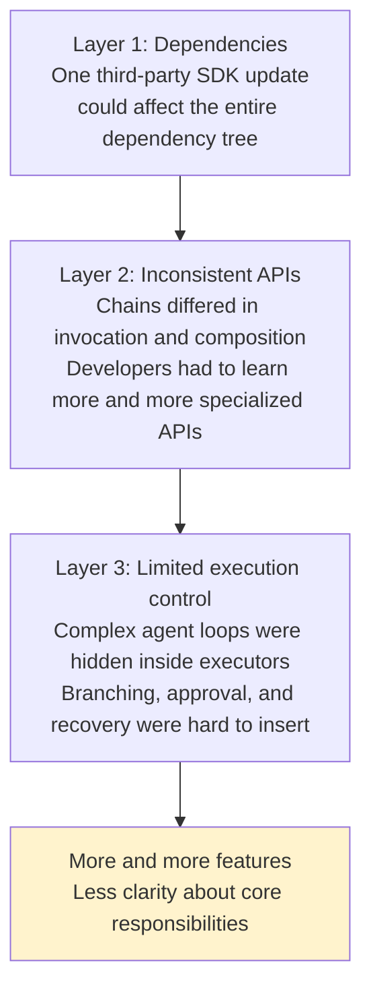
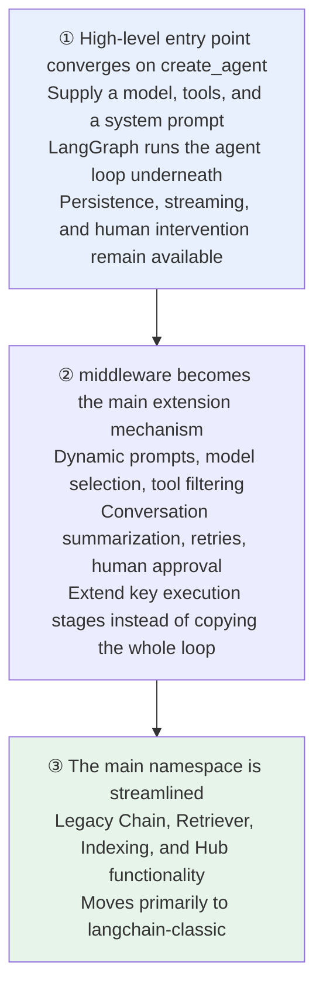
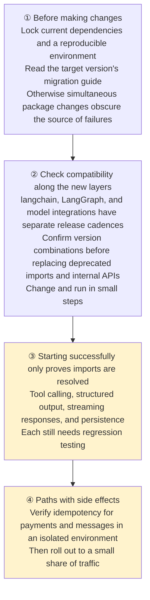
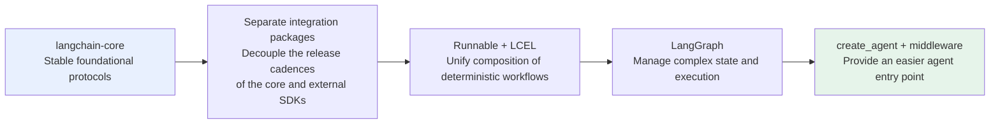

# Chapter 11: LangChain's Version Evolution

## 11.1 Why Keep Changing the Architecture?

**Early LangChain placed models, vector stores, tools, retrievers, and many prebuilt chains in closely related packages.** This made it convenient to test ideas quickly.

**But problems accumulated at several layers**:



> **Major-version changes are not simply about adding features; they redefine boundaries**: which protocols should stay stable, which integrations should evolve independently, and which workflows belong in a lower-level runtime.

## 11.2 Milestone One: Separating the Core from Integrations

**SDKs for model providers, vector databases, and external tools change quickly, while core protocols such as messages, Runnable, and Tool should remain as stable as possible.**

> **Putting them in the same package couples two different release cadences.**

| Package | Core responsibility |
|---|---|
| `langchain-core` | **Foundational protocols** for messages, models, Tool, Runnable, and related components |
| `langchain` | **High-level agent capabilities** for application development |
| `langchain-community` | Numerous **community-maintained** third-party integrations |
| Separate packages such as `langchain-openai` | **Evolve independently alongside a specific provider's SDK** |

**The benefit of the split** is that projects install only the integrations they need, and an individual model SDK upgrade has less impact on the framework as a whole.

> The point is not to memorize package names, but to understand the design: stabilize the core and let integrations evolve independently.

## 11.3 Milestone Two: A Unified Runnable Protocol

**Early versions supplied many Chain classes for different workflows, with inconsistent invocation and extension patterns.**

```python
# Prompt, Model, and Parser all follow the Runnable protocol
chain = prompt | model | output_parser

# The composition still uses the same invoke interface
result = chain.invoke({"question": "什么是 Agent？"})
```

The sample question is Chinese for "What is an agent?"

> **The important part is not the pipe operator**: **the composition still follows the Runnable protocol**, so it supports consistent synchronous, asynchronous, batch, streaming, and tracing interfaces.

**This represents a shift from many prebuilt classes to a few standard protocols plus composition** (see [Chapter 2](../01-foundations/02-chain-and-lcel.md)).

> **For deterministic workflows with fixed steps, Runnable and LCEL are often easier to test and control than agents.**

## 11.4 Milestone Three: Moving to LangGraph

**Traditional agent executors typically hide a loop inside the executor: the model decides, tools run, and the model decides again.**

**This is convenient for simple agents, but adding planning, reflection, parallel branches, human approval, or failure recovery makes the hidden loop hard to change.**

### 11.4.1 The Approach: Make the Hidden Loop Explicit

| Concept | Responsibility |
|---|---|
| **State** | Store messages and business progress |
| **Node** | Execute models, tools, or **ordinary business logic** |
| **Edge** | Decide where results flow next |

> **Loops and branches are no longer hidden inside the executor.** Checkpoints can save runtime state, providing a foundation for pause/resume, human intervention, and long-running execution (see [Chapter 10](../04-langgraph/10-langgraph-advantages.md)).

**LangGraph does not replace LangChain outright.** LangChain provides high-level development interfaces such as models, tools, middleware, and `create_agent`; LangGraph supplies the underlying state and execution capabilities.

## 11.5 Milestone Four: v1 Refocuses on Agents

**Start with the entry points developers use most often**:



> **LangChain retains the easy-to-use interface; LangGraph handles complex execution.**

**Why introduce middleware?** If every new capability requires rewriting the loop, **the high-level entry point quickly loses its purpose again**.

### 11.5.1 An Important Clarification

> **Do not interpret v1 as "all old APIs were deleted."**
>
> **More accurately**, new projects use the focused agent API, while existing projects can keep running through `langchain-classic` and migrate incrementally as needed.

## 11.6 Where Pydantic 2 Fits into the Migration

**LangChain Python v0.3 migrated its internal data models to Pydantic 2 and stopped using the Pydantic 1 compatibility layer.**

**This is important migration context**, because tool schemas, structured output, and configuration objects depend on Pydantic.

> Pydantic's details need not dominate the engineering story. It is usually enough to understand that it establishes a common baseline for data models and validation, and that upgrades require checking import paths and model definitions.
>
> The package split, Runnable, LangGraph, and the v1 agent architecture better express the long-term direction.

## 11.7 What Should You Check When Upgrading?

**A major-version upgrade takes more than one dependency update.**



### 11.7.1 An Easily Overlooked Stability Boundary

> **Packages do not all evolve at the same pace. The main package's stability commitments do not automatically cover community integrations, partner packages, or experimental APIs.**

**Production projects should therefore pin dependencies and rely on public, stable interfaces wherever possible.**

### 11.7.2 Break the Migration Down into Checkable Interfaces

The following checks follow the official v1 migration guide. Installing an arbitrary set of "latest" packages does not let you skip them:

| Previous usage or assumption | Migration checkpoint |
|---|---|
| Python 3.9 and Pydantic v1 models | LangChain/LangGraph v1 require at least Python 3.10 and use Pydantic 2; do not mix in models from the old compatibility layer |
| `langgraph.prebuilt.create_react_agent` | Use `langchain.agents.create_agent` and rename `prompt` to `system_prompt`; do not confuse this with the ReAct factory of the same name in the classic package |
| `pre_model_hook`, `post_model_hook` | Move responsibilities into middleware; revalidate execution order, state updates, and exception paths |
| Passing a model already configured with `bind_tools` to the factory | Let `create_agent` manage tool binding and use middleware for dynamic model selection |
| A custom Pydantic agent state | Use `TypedDict` for custom state in `create_agent`; do not infer that the underlying `StateGraph` also prohibits Pydantic |
| Reading all business dependencies from `config["configurable"]` | Pass trusted static dependencies through `context_schema` and the invocation's `context=`; the checkpoint `thread_id` still belongs in `configurable` |
| Streaming consumers match the node name `"agent"` | The model node is named `"model"` after migration; regression-test event types and filtering rules accordingly |

A minimum major version is not a complete compatibility matrix. For example, node `timeout`/`error_handler` support requires `langgraph>=1.2`; reading native structured-output capabilities from the model profile requires `langchain>=1.1`; and `ProviderStrategy(strict=...)` requires `langchain>=1.2`. Nor can `stream_events(version="v3")` be mixed with the event-dictionary protocol of the older `astream_events(version="v2")`. Check the API for the chosen version. No unverified first patch version for v3 is asserted here.

Upgrading a resumable system also requires testing old checkpoints. Renaming nodes, removing a node that is pending execution, or changing the meaning of state fields can prevent paused threads from continuing. Keep compatible routes or drain old tasks before migrating state incrementally. Rolling back a dependency lockfile does not roll back persisted state.

## 11.8 What Direction Does This Evolution Take?

Taken together, these architectural changes form a continuous path:



> **This direction moves LangChain from wrapping many LLM features toward a clearly layered approach to agent engineering.**
>
> **The cost** is handling dependencies and import paths when upgrading existing projects. **The benefits** are more stable core interfaces and better control of complex workflows, making them better suited to production.

## 11.9 Common Mistakes

### 11.9.1 Interpreting Evolution as "Adding More Features"

**The recurring theme is redefining boundaries**: what stays stable, what evolves independently, and what moves to a lower layer.

### 11.9.2 Memorizing Every Minor Version's API Changes

Focus on the four architectural milestones. The current latest patch version should not be the main point either.

### 11.9.3 Assuming v1 Deleted All Old APIs

**They moved to `langchain-classic`**, allowing existing projects to migrate incrementally.

### 11.9.4 Thinking LangGraph Replaces LangChain

**LangChain keeps the high-level ease of use; complex execution moves down to LangGraph.**

### 11.9.5 Treating the Pydantic 2 Migration as the Most Important Change

It is important context, **but the package split, Runnable, LangGraph, and v1 architecture better express the direction**.

### 11.9.6 Deploying After Only Updating Dependency Versions

**Regression-test tool calling, structured output, streaming responses, and persistence separately.**

### 11.9.7 Changing All the Code Before Running It

**Change and run in small steps**, or it becomes impossible to isolate the source of failures.

### 11.9.8 Assuming the Main Package's Stability Promise Covers Every Package

**Community integrations, partner packages, and experimental APIs evolve at different rates.** Pin production dependencies.

### 11.9.9 Sending Full Traffic to Side-Effecting Paths Immediately After an Upgrade

**Verify idempotency in an isolated environment first, then roll out to a small share of traffic.**

## 11.10 Chapter Summary

1. **Three accumulating problems drove the evolution**: cascading dependency changes, inconsistent specialized APIs, and execution loops hidden inside executors.
2. **Milestone one: package separation.** `langchain-core` stabilizes protocols while integrations evolve independently.
3. **Milestone two: Runnable + LCEL.** Move from many prebuilt classes to a few standard protocols plus composition; the composition is still a Runnable.
4. **Milestone three: LangGraph.** Expose the hidden loop as State + Node + Edge, with checkpoints supporting pause/resume and long-running execution.
5. **Milestone four: v1 focuses on agents.** `create_agent` is the entry point, middleware provides extensions, and `langchain-classic` carries legacy capabilities.
6. **v1 does not simply delete old APIs.** It streamlines the main namespace and supports incremental migration.
7. **Pydantic 2 is important migration context**, but not the change that best expresses the architectural direction.
8. **Four upgrade steps**: lock the environment and read the guide → confirm version combinations across layers and replace code incrementally → regression-test the four boundary capabilities separately → verify side-effect idempotency in isolation before a limited rollout.
9. **Stability commitments do not cover community packages or experimental APIs.** Pin production versions.
10. **The overall direction**: stabilize the core, decouple integrations, compose deterministic workflows, and make the agent runtime graph-based.

> The trajectory is to stabilize protocols and separate integrations, use Runnable to unify deterministic workflows and LangGraph to handle complex execution, then consolidate high-level agent development around `create_agent` and middleware.

## References

- [LangChain v1 migration guide](https://docs.langchain.com/oss/python/migrate/langchain-v1)
- [LangChain official documentation](https://docs.langchain.com/oss/python/langchain/overview)
- [LangChain v1 release notes](https://docs.langchain.com/oss/python/releases/langchain-v1)
- [LangChain v0.3 official release notes: Pydantic 2 migration](https://blog.langchain.com/announcing-langchain-v0-3/)
- [LangChain official blog](https://blog.langchain.com/)
- [LangGraph official documentation](https://docs.langchain.com/oss/python/langgraph/overview)
- [Pydantic migration guide](https://docs.pydantic.dev/latest/migration/)
- [LangChain Structured output: capabilities and minimum versions](https://docs.langchain.com/oss/python/langchain/structured-output)
- [LangGraph Fault tolerance](https://docs.langchain.com/oss/python/langgraph/fault-tolerance)
- [LangGraph Graph API: graph migrations](https://docs.langchain.com/oss/python/langgraph/graph-api#graph-migrations)
- [LangChain Event streaming](https://docs.langchain.com/oss/python/langchain/event-streaming)
