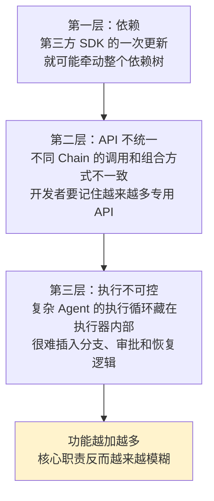
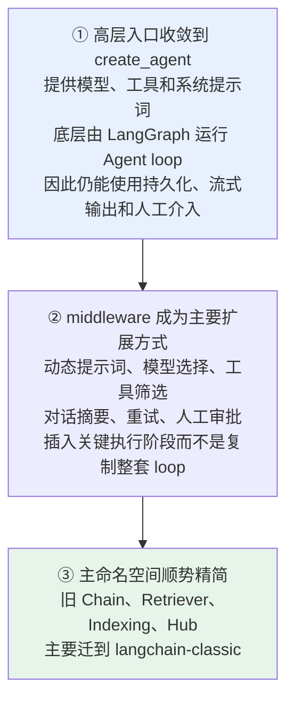
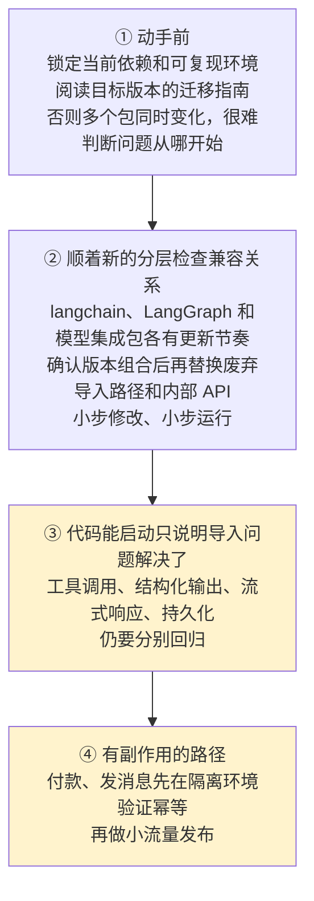
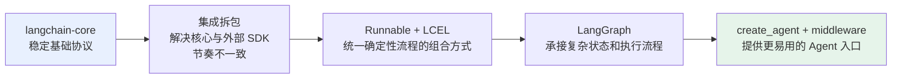

# 第十一章：LangChain 的版本演进

## 11.1 为什么要不断调整架构

**LangChain 早期把模型、向量库、工具、Retriever 和大量预制 Chain 都放在相近的包结构中**，快速验证想法很方便。

**但问题是层层叠加的**：



> **大版本演进的重点并不是单纯增加功能，而是重新划分边界**：哪些协议需要保持稳定，哪些集成应该独立更新，哪些流程应该由更底层的运行时管理。

## 11.2 节点一：核心与集成拆开

**模型厂商、向量数据库和外部工具的 SDK 变化很快，而消息、Runnable、Tool 等核心协议应该尽量稳定。**

> **把它们放在同一个包中，会让两种不同的迭代节奏互相影响。**

| 包 | 核心职责 |
|---|---|
| `langchain-core` | 消息、模型、Tool、Runnable 等**基础协议** |
| `langchain` | 面向应用开发的**高层 Agent 能力** |
| `langchain-community` | 大量**社区维护**的第三方集成 |
| `langchain-openai` 等独立包 | **跟随特定厂商 SDK 独立迭代** |

**拆分后的收益**：项目只安装真正需要的集成，也降低了某个模型 SDK 升级对整个框架的影响。

> 重点不是记包名列表，而是理解「稳定内核，释放边缘」这条拆分思路。

## 11.3 节点二：Runnable 统一协议

**早期为不同流程提供了大量 Chain 类，调用方式和扩展方式并不完全一致。**

```python
# Prompt、Model 和 Parser 统一遵循 Runnable 协议
chain = prompt | model | output_parser

# 组合后的整体仍然使用统一的 invoke 接口
result = chain.invoke({"question": "什么是 Agent？"})
```

> **这段代码的重要之处不是管道符**，而是**组合后的整体仍然遵循 Runnable 协议**，因此可以使用统一的同步、异步、批处理、流式和追踪接口。

**它代表 LangChain 从「大量预制类」转向「少量标准协议 + 组合」**（详见 [第二章](../01-foundations/02-chain-and-lcel.md)）。

> **对于步骤固定的确定性流程，Runnable 和 LCEL 往往比 Agent 更容易测试和控制。**

## 11.4 节点三：转向 LangGraph

**传统 Agent 执行器通常在内部运行「模型判断、调用工具、再次判断」的循环。**

**简单 Agent 使用方便，但一旦加入规划、反思、并行分支、人工审批或故障恢复，隐藏的循环就会变得难以修改。**

### 11.4.1 解决思路：把隐藏循环摊开

| 概念 | 承担 |
|---|---|
| **State** | 保存消息和业务进度 |
| **Node** | 执行模型、工具或**普通业务逻辑** |
| **Edge** | 决定结果接下来流向哪里 |

> **循环和分支不再隐藏在执行器内部**，检查点还能保存运行状态，为暂停恢复、人工介入和长时间执行提供基础（详见 [第十章](../04-langgraph/10-langgraph-advantages.md)）。

**LangGraph 并不是把 LangChain 完全替换掉**：LangChain 提供模型、Tool、middleware 和 `create_agent` 等高层开发体验，LangGraph 提供底层状态与执行能力。

## 11.5 节点四：v1 重新聚焦 Agent

**从开发者最常接触的入口看起**：



> **易用性留在 LangChain，复杂执行能力则由 LangGraph 承接。**

**为什么需要 middleware 这一层**：如果每增加一项能力都重写循环，**高层入口很快又会失去意义**。

### 11.5.1 一个关键澄清

> **不能把 v1 简单理解成「旧 API 全部删除」。**
>
> **更准确的说法是**：新项目使用聚焦后的 Agent API，旧项目通过 `langchain-classic` 保持运行，再根据需要逐步迁移。

## 11.6 Pydantic 2 在迁移中的位置

**LangChain 的 Python v0.3 版本将内部数据模型迁移到 Pydantic 2，并停止使用 Pydantic 1 兼容层。**

**这属于重要的迁移背景**，因为工具 Schema、结构化输出和配置对象都依赖 Pydantic。

> 工程上不必把 Pydantic 的细节当成主线。知道它统一了数据模型与校验基线，旧项目升级时需要检查导入路径和模型定义，通常就够了。
>
> 相比之下，拆包、Runnable、LangGraph 和 v1 Agent 架构更能体现长期演进方向。

## 11.7 升级时要注意什么

**跨大版本升级不能只执行一次依赖更新。**



### 11.7.1 一条容易被忽略的稳定性边界

> **不同包的更新节奏并不完全一致。主包的稳定承诺不能自动覆盖社区集成、合作伙伴包和实验性 API。**

**因此生产项目应该固定依赖版本，并尽量建立在公开稳定接口之上。**

### 11.7.2 把迁移拆到可检查的接口

以下按官方 v1 迁移指南列出，不是安装任意一组「最新包」就能跳过的工作：

| 旧写法或假设 | 迁移后的检查点 |
|---|---|
| Python 3.9、Pydantic v1 模型 | LangChain/LangGraph v1 最低 Python 3.10，统一 Pydantic 2；不能混入旧兼容层模型 |
| `langgraph.prebuilt.create_react_agent` | 改用 `langchain.agents.create_agent`，`prompt` 改为 `system_prompt`；不要与 classic 包内同名 ReAct 工厂混淆 |
| `pre_model_hook`、`post_model_hook` | 按职责迁到 middleware，重新验证执行顺序、状态更新与异常路径 |
| 向工厂传入已 `bind_tools` 的模型 | 让 `create_agent` 管理工具绑定，动态模型通过 middleware 选择 |
| Pydantic 自定义 Agent State | `create_agent` 自定义 State 使用 `TypedDict`；不要据此误推底层 `StateGraph` 也禁止 Pydantic |
| 从 `config["configurable"]` 取所有业务依赖 | 可信静态依赖通过 `context_schema` 与调用的 `context=` 传入；checkpoint 的 `thread_id` 仍在 `configurable` |
| 流式消费者匹配节点名 `"agent"` | 迁移后模型节点名为 `"model"`；事件类型和过滤规则应同步回归 |

最低主版本不是完整兼容矩阵。例如节点 `timeout`/`error_handler` 需要 `langgraph>=1.2`；原生结构化输出能力读取 model profile 需要 `langchain>=1.1`，`ProviderStrategy(strict=...)` 需要 `langchain>=1.2`。`stream_events(version="v3")` 也不能与旧 `astream_events(version="v2")` 的事件字典协议混用，须对照选定版本的 API。这里不声明未经确认的 v3 首发补丁号。

升级恢复型系统还要测试旧 checkpoint：节点改名、移除待执行节点或改变 State 字段语义，可能让暂停中的线程无法继续。保留兼容路由或先排空旧任务，再逐步迁移状态；依赖锁文件回滚不等于持久状态已经回滚。

## 11.8 演进方向是什么

把几次架构变化连起来，可以看到一条连续的路线：



> **这套方向让 LangChain 从「封装大量 LLM 功能」，转向「提供清晰分层的 Agent 工程体系」。**
>
> **代价**是旧项目升级需要处理依赖和导入路径；**收益**是核心接口更稳定、复杂流程更可控，也更适合生产环境。

## 11.9 常见错误

### 11.9.1 把演进理解成「不断加功能」

**它是在反复重新划分边界**：哪些稳定、哪些独立、哪些下沉。

### 11.9.2 背诵每个小版本的 API 变化

把注意力放在四个架构节点即可，也不建议把当前最新补丁版本当成重点。

### 11.9.3 认为 v1 把旧 API 全删了

**它们迁到了 `langchain-classic`**，存量项目可渐进迁移。

### 11.9.4 以为 LangGraph 是来替换 LangChain 的

**高层易用性留在 LangChain，复杂执行能力下沉到 LangGraph。**

### 11.9.5 把 Pydantic 2 迁移当成最重要的变化

它是重要背景，**但拆包、Runnable、LangGraph 和 v1 架构更能体现方向**。

### 11.9.6 升级只更新依赖版本就上线

**必须分别回归工具调用、结构化输出、流式响应和持久化。**

### 11.9.7 一次性改完所有代码再启动

**应该小步修改、小步运行**，否则无法定位问题来源。

### 11.9.8 假设主包稳定承诺覆盖所有包

**社区集成、合作伙伴包和实验性 API 节奏不同**，生产要固定版本。

### 11.9.9 升级后直接放量有副作用的路径

**先在隔离环境验证幂等，再小流量发布。**

## 11.10 本章总结

1. **演进的动因是三层问题叠加**：依赖牵一发动全身、专用 API 不统一、执行循环藏在执行器内部；
2. **节点一「拆包」**：`langchain-core` 稳定协议，集成独立迭代——「稳定内核，释放边缘」；
3. **节点二「Runnable + LCEL」**：从「大量预制类」转向「少量标准协议 + 组合」，组合后仍是 Runnable；
4. **节点三「LangGraph」**：把隐藏循环摊开成 State + Node + Edge，检查点支撑暂停恢复与长时间执行；
5. **节点四「v1 聚焦 Agent」**：`create_agent` 做入口、middleware 做扩展、`langchain-classic` 承接旧能力；
6. **v1 不是删掉旧 API**，而是主命名空间精简 + 渐进迁移；
7. **Pydantic 2 是重要迁移背景**，但不是最能体现方向的变化；
8. **升级四步**：锁环境读指南 → 按分层确认版本组合并小步替换 → 分别回归四类边界能力 → 副作用路径先隔离验证幂等再小流量；
9. **稳定承诺不覆盖社区包和实验性 API**，生产要固定版本；
10. **总方向**：稳定核心、解耦集成、组合确定性流程、图化 Agent 运行时。

> 可以把这条演进路线概括为：先把协议稳下来、把集成拆出去，再用 Runnable 统一确定性流程、用 LangGraph 承接复杂执行，最后在高层用 `create_agent` 和 middleware 收敛 Agent 开发入口。

## 参考资料

- [LangChain v1 迁移指南](https://docs.langchain.com/oss/python/migrate/langchain-v1)
- [LangChain 官方文档](https://docs.langchain.com/oss/python/langchain/overview)
- [LangChain v1 发布说明](https://docs.langchain.com/oss/python/releases/langchain-v1)
- [LangChain v0.3 官方发布说明（Pydantic 2 迁移）](https://blog.langchain.com/announcing-langchain-v0-3/)
- [LangChain 官方博客](https://blog.langchain.com/)
- [LangGraph 官方文档](https://docs.langchain.com/oss/python/langgraph/overview)
- [Pydantic 迁移指南](https://docs.pydantic.dev/latest/migration/)
- [LangChain Structured output：能力与最低版本](https://docs.langchain.com/oss/python/langchain/structured-output)
- [LangGraph Fault tolerance](https://docs.langchain.com/oss/python/langgraph/fault-tolerance)
- [LangGraph Graph API：graph migrations](https://docs.langchain.com/oss/python/langgraph/graph-api#graph-migrations)
- [LangChain Event streaming](https://docs.langchain.com/oss/python/langchain/event-streaming)
