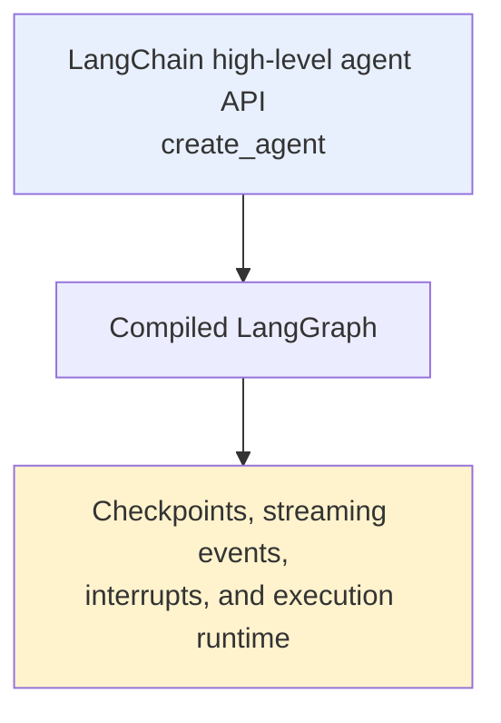
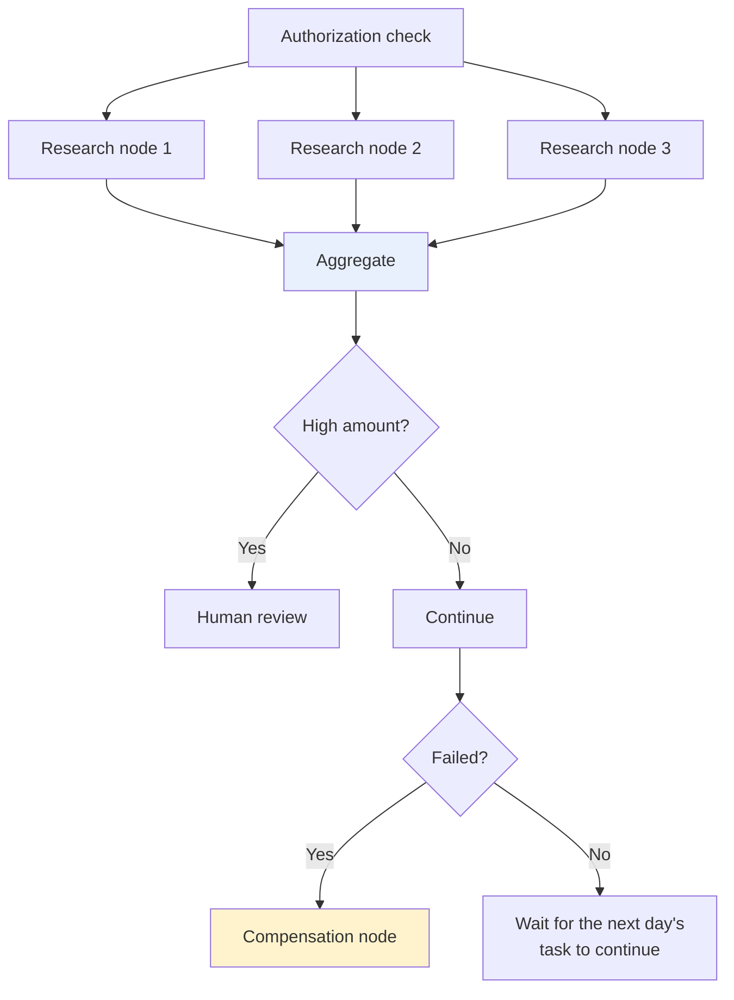
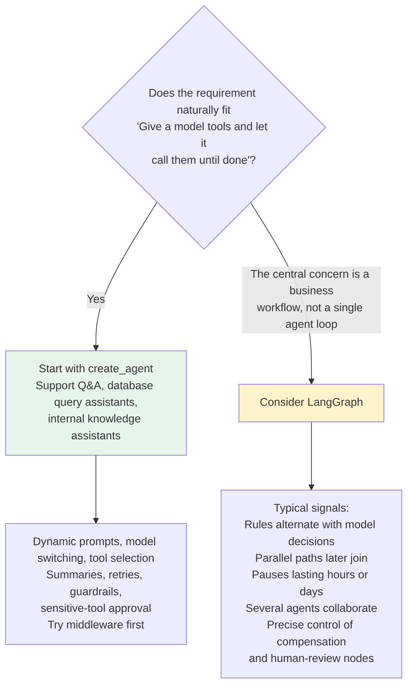

# Chapter 9: The Layered Relationship Between LangChain and LangGraph

## 9.1 Are they at the same layer?

Comparing these frameworks only by counting features makes it easy to overlook their **layered relationship**.

> **LangChain provides a high-level agent API; LangGraph provides a lower-level orchestration framework and runtime.**

> This chapter focuses on layers, framework selection, and composition boundaries. [Chapter 10](10-langgraph-advantages.md) covers the `interrupt` approval protocol, version requirements for node fault tolerance, stream redaction, and persistence implementation.

| Framework | Official positioning |
|---|---|
| **LangChain** | A **high-level agent framework** providing models, tools, and common agent loops |
| **LangGraph** | A **lower-level orchestration framework and runtime** governing how stateful workflows execute, pause, and resume |

**LangGraph does not require the high-level `langchain` package or its model wrappers**: it can call other model SDKs or ordinary Python functions directly. However, the Python `langgraph` package depends on foundational libraries such as `langchain-core`. “Usable independently” does not mean its dependency tree contains no LangChain ecosystem components.

### 9.1.1 The key layering relationship



**`create_agent` builds a graph runtime based on LangGraph**: the agent loops between model and tool nodes until the model produces a final answer or a stopping condition is reached.

> **This explains why their capabilities appear to overlap without making them interchangeable**:
>
> - With **LangChain**, the framework has already assembled a common agent topology. **You mainly configure components and lifecycle hooks**.
> - With **LangGraph**, **you decide how to divide nodes, update state, and choose the next step**.

## 9.2 The core difference: level of abstraction

| Dimension | LangChain v1 | LangGraph |
|---|---|---|
| **Official positioning** | High-level agent development framework | Low-level agent orchestration framework and runtime |
| **Main entry points** | `create_agent`, models, tools, middleware, structured output | `StateGraph`, state, nodes, edges, `Command`, `Send`, subgraphs |
| **What it provides by default** | A prebuilt model/tool-calling loop and common extension points | Orchestration primitives for arbitrary stateful workflows; **it does not prescribe prompts or an agent architecture** |
| **Control flow** | A standard agent loop, customizable through middleware | Explicitly defined sequences, conditional routing, loops, parallelism, dynamic dispatch, and subgraphs |
| **State** | `AgentState` and `messages` as the default core, with extensible fields | Full state schemas, input/output schemas, internal channels, and reducers |
| **Persistence and memory** | Available through the underlying LangGraph checkpointer and store | Direct control over checkpointers, stores, threads, and state history at graph compilation and execution |
| **Durable execution** | Inherits runtime capabilities; standard agents can also pause and resume | **A core capability**, particularly suited to explicitly designing recovery boundaries and side effects in long workflows |
| **Human involvement** | Commonly uses `HumanInTheLoopMiddleware` to review tool calls | Can pause with `interrupt()` **inside any node** and resume with `Command(resume=...)` |
| **Streaming** | Streams message tokens, step updates, and custom progress directly from the agent | Exposes lower-level checkpoint, task, and debug events in addition to messages and state |
| **Extension mechanisms** | Middleware hooks into agent, model, and tool lifecycles | Nodes, edges, routing functions, `Command`, `Send`, subgraphs, and Runtime |
| **Deployment and debugging** | Integrates with LangSmith tracing, Studio, and Deployment | The same capabilities, with more direct visibility into node paths and state changes |
| **Best suited to** | Standard tool-calling agents, customer support assistants, data-query assistants, rapid prototypes | Long workflows, multistage approvals, mixed deterministic/agent workflows, complex parallelism, multi-agent systems |

> **Persistence, streaming, and human involvement appear in both columns because the LangGraph runtime supplies these capabilities, and LangChain agents can use them directly.**
>
> The main distinction is the level of abstraction and granularity of control, not a simple yes/no feature checklist.

## 9.3 Why is “LangChain can only run linearly” wrong?

**It conflates three different ideas.**

### 9.3.1 Traditional chains are not limited to sequential execution

**Beyond `RunnableSequence`, LCEL can express concurrency and conditional selection through parallel and branching runnables** (see [Chapter 2](../01-foundations/02-chain-and-lcel.md)).

> Fixed prompt/model/parser pipelines **are often written linearly, but that is a usage choice, not the framework's capability limit**.

### 9.3.2 `create_agent` is not a straight line either

A model may finish immediately or request tools. After tools execute, control returns to the model for another decision. **That is already conditional routing plus a loop**, and multiple tool calls may execute in parallel.

> **An early `prompt | model | parser` pipeline is not a fair representation of today's LangChain agents.**

### 9.3.3 The real distinction is making business topology a first-class concern

**Consider this workflow**:



**Here, developers need a clear view of every node, state field, and routing condition.** This is where graph orchestration becomes valuable.

> **A more accurate boundary**: LangChain can express branches and loops, but its high-level agent API primarily organizes work around a **general-purpose model/tool loop**. **LangGraph lets developers directly control the topology of the entire workflow.**

## 9.4 How does middleware differ from graph orchestration?

Middleware covers some customization needs, but it is not equivalent to graph orchestration.

> The distinction is between **adding cross-cutting logic around the same agent loop** and **redefining the topology of the entire business workflow**.

| | Problems addressed |
|---|---|
| **Middleware** | Customizes a **standard agent loop**: dynamically generates prompts, trims messages, and selects models and tools before a model call; performs safety checks afterward; adds retries and human approval to tool calls. **These changes follow agent/model/tool lifecycles without requiring a redesign of the whole graph** |
| **Nodes and edges** | Express **more general workflow structures**: a classifier routes to entirely different subflows; multiple nodes run in parallel and then join; database writes, human forms, rules engines, and a complete agent coexist in one graph. **A step need not be a model or tool call, and the workflow may use no LLM at all** |

> **Middleware is not a separate runtime**: it runs inside the compiled graph returned by `create_agent`. **That complete agent can itself become a node or subgraph in a larger `StateGraph`, and its middleware continues to work there.**
>
> **This is composition across two layers, not an either/or choice.**

### 9.4.1 A composition example

```python
from typing import Literal

from langchain.agents import AgentState, create_agent
from langgraph.graph import END, START, StateGraph

class WorkflowState(AgentState):
    # route belongs to the outer workflow, not the standard agent loop's fixed fields.
    route: Literal["research", "reject"]

def classify_request(state: WorkflowState) -> dict:
    # Deterministic routing for illustration; a real project could use a classifier.
    text = str(state["messages"][-1].content)
    route = "reject" if "删除生产数据" in text else "research"
    return {"route": route}

def choose_route(state: WorkflowState) -> Literal["research_agent", "reject"]:
    # The conditional edge selects the next node from the outer workflow state.
    return "research_agent" if state["route"] == "research" else "reject"

def reject_request(state: WorkflowState) -> dict:
    # A deterministic rejection node needs no model call.
    return {"messages": [{"role": "assistant", "content": "该操作不在允许范围内。"}]}

# create_agent returns a compiled LangGraph, embeddable as a subgraph.
research_agent = create_agent(
    model=research_model,
    tools=[search_tool],
)

builder = StateGraph(WorkflowState)
builder.add_node("classify", classify_request)
builder.add_node("research_agent", research_agent)
builder.add_node("reject", reject_request)
builder.add_edge(START, "classify")
builder.add_conditional_edges("classify", choose_route)
builder.add_edge("research_agent", END)
builder.add_edge("reject", END)

# Outer LangGraph: business topology. Inner LangChain agent: model/tool loop.
workflow = builder.compile()
```

> **This code is not “migrating” LangChain to LangGraph; it assigns responsibilities to the right layer.** The inner research agent keeps its high-level abstractions, while the outer business workflow gains explicit routing.

This assembly fragment requires `research_model` and `search_tool`. The Chinese example strings mean “delete production data” and “This operation is outside the permitted scope.” String matching only illustrates routing; it is not an authorization policy or a prompt-injection defense. Production authorization must evaluate trusted identities, actions, and resources. When a subgraph is added directly as a node, shared message fields are merged through their reducer. Different state structures require an explicit mapping wrapper; arbitrary graphs cannot simply be plugged together.

## 9.5 State: defaults versus custom modeling

Agents need state because model calls, tool results, human feedback, and intermediate artifacts cannot all be carried indefinitely through function-local variables.

| | Approach to state |
|---|---|
| **LangChain** | Provides **`AgentState`, centered by default on `messages`**, for common agents. User messages, tool calls, tool results, and final responses are added to this state. Fields can be extended with a `TypedDict`; **the documentation recommends declaring middleware-specific state in the relevant middleware**, keeping capabilities and their data together |
| **LangGraph** | **State design becomes part of the workflow architecture.** You can define an overall state and separate input, output, and internal schemas. **Nodes return only partial updates; reducers determine how concurrent or repeated updates are merged** |

### 9.5.1 Why are reducers necessary?

> **If several research nodes write to `evidence` simultaneously, we want their evidence merged. A default single-value channel raises an error when it receives multiple updates in the same super-step; it does not use last-write-wins.**
>
> **Merge semantics must be defined in the state in advance.**

**This does not mean LangChain has no state**: its agent state runs on LangGraph. With LangChain, you usually accept a **state skeleton designed for the standard agent loop**. With LangGraph directly, you **design data channels and update rules for the entire business workflow**, gaining both freedom and responsibility.

## 9.6 Who provides persistence and memory?

Two common misconceptions are:

- ❌ “LangChain handles memory; LangGraph handles persistence.”
- ❌ “Only LangGraph can resume from a checkpoint.”

> Both statements incorrectly separate two layers of the same stack.

### 9.6.1 LangGraph's two persistence mechanisms

| Mechanism | What it stores | Suitable uses |
|---|---|---|
| **Checkpointer** | Graph state snapshots organized by `thread_id` | Thread-scoped short-term memory, human involvement, time travel, failure recovery |
| **Store** | Application data outside graph state, accessible **across threads** | Long-term memory such as user preferences, facts, and shared knowledge |

**`create_agent` passes its checkpointer and store to the underlying graph**, so LangChain agents also gain short-term memory, long-term memory, and recovery capabilities (see [Chapter 6](../02-agent-building/06-memory.md)).

> **The real difference is control granularity**: LangChain exposes convenient entry points for standard agents; **LangGraph lets developers design state-saving and recovery boundaries at arbitrary nodes and subgraphs**.

### 9.6.2 What durable execution means for framework selection

A checkpointer can restore state, but it does not make business side effects safe. Complex workflows need explicit task boundaries and idempotency. This is one signal that a workflow may benefit from direct LangGraph control. **See [Chapter 10](10-langgraph-advantages.md) for recovery semantics, approval protocols, and fault-tolerance implementation.**

## 9.7 How does human involvement differ?

| Requirement | Better fit |
|---|---|
| “Ask a person before the model sends an email” | **`HumanInTheLoopMiddleware`**: pauses before actual tool execution and accepts approval, edits, rejection, or a direct human response |
| Show intermediate insurance-claim materials so a reviewer can fill in missing fields; resume a marketing workflow after a week; collect several reviewers' opinions and route by vote count | **LangGraph's `interrupt()`**: can pause at **any business step inside a node** and return external input to the workflow on resumption |

> **LangGraph persists the underlying state in both cases, and resumption uses the same `thread_id`.**
>
> **The precise distinction**: LangChain provides a **high-level approval experience around agent tool calls**; LangGraph provides **more general interrupt and resume primitives**. The former is easier to use; the latter covers a broader range of workflows.
>
> A strict approval-payload schema, identity boundaries, task/version binding, and a single idempotent decision are implementation requirements, covered in [Chapter 10](10-langgraph-advantages.md). Do not reduce approval to a Boolean confirmation box.

## 9.8 How deep does streaming visibility go?

**Displaying a model's answer token by token is only the most visible layer of streaming.**

- Users also want progress such as “Searching,” “Tool returned,” and “Waiting for approval.”
- **Developers may need to know which node updated which state, which task failed, and when a checkpoint was written.**

| | Observable information |
|---|---|
| **LangChain agent** | `stream` / `stream_events` expose model messages, agent steps, and custom tool progress (**`create_agent` returns a compiled graph, so it follows LangGraph's streaming interfaces**) |
| **LangGraph** | Lower-level event types including `values`, `updates`, `messages`, `custom`, `checkpoints`, `tasks`, and `debug`, with support for **subgraph namespaces** |

> **Both support streaming**: LangChain prioritizes common agent experiences; LangGraph exposes the complete execution engine.

Typed projections from `stream_events(..., version="v3")` and frontend state allowlists are implementation details covered in [Chapter 10](10-langgraph-advantages.md). This interface is version-dependent: LangChain introduced typed event streaming in v1.3, while LangGraph's 1.2.0 implementation marked v3 experimental; see Section 10.8 for the distinction between the two packages.

## 9.9 How are deployment and debugging responsibilities divided?

**It is also inaccurate to treat LangSmith as a LangGraph-only console.**

LangSmith provides platform capabilities for **tracing, evaluation, Studio, and Deployment**. It can observe LangChain agents and directly written LangGraph workflows, and it supports tracing integrations with other frameworks.

> **Because `create_agent` is itself a graph, LangChain agents can also display nodes, threads, state, and execution traces in Studio.**

**When using LangGraph directly**, business steps become more explicit nodes. That often makes complex routing paths easier to inspect and enables checkpoint-based state replay and time-travel debugging. **This visibility comes from the granularity of graph modeling, not from any inability to deploy or debug LangChain.**

> Separate two questions: using a managed platform is a **deployment choice**; using LangChain's high-level agent API is a **development abstraction choice**.

## 9.10 When should you move down to LangGraph?



### 9.10.1 Incremental composition is the more common approach

**Build one useful agent with LangChain first. When the business topology becomes complex, use that agent as a LangGraph node or subgraph.**

> The official recommendation follows the same progression: start with the high-level entry point, then move to finer-grained control as complexity increases.

### 9.10.2 One final misconception

> **Being lower-level does not make LangGraph inherently better for every project.**
>
> More control means more state, routing, recovery behavior, and side effects to design and test yourself. Rebuilding a standard agent with dozens of nodes may increase maintenance costs rather than reliability.

## 9.11 Common mistakes

### 9.11.1 Comparing them as two peer engines by counting features

**They occupy different layers**: `create_agent` is built on LangGraph.

### 9.11.2 Saying “LangChain is linear only”

**LCEL supports parallelism and branching; the agent loop itself combines conditional routing and iteration.**

### 9.11.3 Claiming that only LangGraph has persistence, streaming, memory, or human approval

**LangChain agents use those capabilities through LangGraph too.** The differences are control granularity and implementation effort.

### 9.11.4 Assuming middleware can replace graph orchestration

**Middleware follows agent/model/tool lifecycles**; nodes and edges handle more general workflow structures, including workflows with no LLM.

### 9.11.5 Treating middleware as a separate runtime

**It runs inside the compiled graph.**

### 9.11.6 Using LangGraph without defining reducers

Default single-value channels raise `InvalidUpdateError` for multiple updates in one step. Define reducers to merge results or have branches write different fields. `add_messages` updates or appends by message ID; it is not unconditional list concatenation.

### 9.11.7 Thinking durable execution just means saving state to a database

**Charging a payment or sending an email again during recovery can still cause incidents.** Put side effects behind task boundaries and make them idempotent.

### 9.11.8 Treating LangSmith as exclusive to LangGraph

**It observes LangChain agents and supports integrations with other frameworks too.**

### 9.11.9 Conflating deployment choices with abstraction choices

**Managed hosting ≠ using a high-level API.**

### 9.11.10 Assuming “lower-level = more advanced”

**More control means more things to design and test yourself.**

## 9.12 Chapter summary

1. **Establish the relationship first**: LangChain v1 is a high-level agent framework; LangGraph is a low-level orchestration framework and runtime. **`create_agent` is built on LangGraph**.
2. **The core boundary**: LangChain supplies a common model/tool loop by default. LangGraph does not prescribe an agent architecture; it exposes state, nodes, edges, branches, loops, parallelism, subgraphs, interrupts, and recovery.
3. **“LangChain is linear only” is wrong**: LCEL supports parallelism and branching, and the agent loop itself combines conditional routing with iteration.
4. **The real difference is whether business topology becomes a first-class concern**.
5. **Middleware modifies the same machine; graph orchestration redesigns the production line.** Middleware runs inside the compiled graph.
6. **`AgentState` is a skeleton for a standard loop; LangGraph makes state design part of the architecture.** Reducers define merge semantics.
7. **Checkpointers manage thread-scoped snapshots; stores manage cross-thread data.** LangGraph provides both, and LangChain uses them directly.
8. **The hard part of durable execution is side effects, not storage**: task boundaries plus idempotency.
9. **Two levels of human involvement**: middleware approval for tool calls versus `interrupt()` at arbitrary business steps.
10. **Two levels of streaming**: agent steps and messages versus engine-level checkpoint, task, and debug events.
11. **LangSmith is not exclusive to LangGraph**. Keep deployment choices separate from abstraction choices.
12. **Incremental composition is the recommended path**: start with a useful LangChain agent, then embed it as a LangGraph node or subgraph when business topology becomes complex.

LangChain supplies the high-level agent entry point and standard model/tool loop; LangGraph offers finer-grained state and workflow control. You can build an agent first and compose it into a business graph as needed. This is a migration path, not a statistical claim about the architecture of all projects.

## References

- [LangChain documentation](https://docs.langchain.com/oss/python/langchain/overview)
- [LangChain: Agents](https://docs.langchain.com/oss/python/langchain/agents)
- [LangChain: Middleware](https://docs.langchain.com/oss/python/langchain/middleware)
- [LangChain: Streaming](https://docs.langchain.com/oss/python/langchain/streaming)
- [LangGraph documentation](https://docs.langchain.com/oss/python/langgraph/overview)
- [LangGraph: Graph API](https://docs.langchain.com/oss/python/langgraph/use-graph-api)
- [LangGraph: Persistence](https://docs.langchain.com/oss/python/langgraph/persistence)
- [LangGraph: Human-in-the-loop](https://docs.langchain.com/oss/python/langgraph/interrupts)
- [LangSmith documentation](https://docs.langchain.com/langsmith/observability)
- [LangGraph Python package dependencies](https://github.com/langchain-ai/langgraph/blob/main/libs/langgraph/pyproject.toml)
- [LangGraph concurrent state-update error](https://docs.langchain.com/oss/python/langgraph/errors/INVALID_CONCURRENT_GRAPH_UPDATE)
