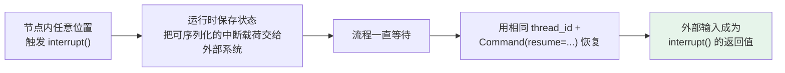
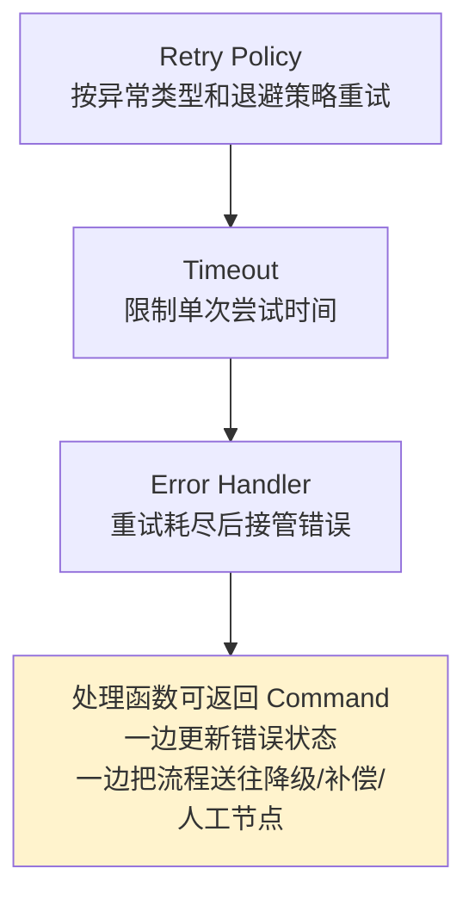

# 第十章：LangGraph 的核心优势

## 10.1 两者为什么不对立

直接比较功能表，容易漏掉一个前提：LangChain Agent 本身就运行在 LangGraph 之上。

本章提到的持久化、流式输出和人工介入，并不是在说 LangChain Agent 无法获得这些能力（层次关系见 [第九章](09-langchain-vs-langgraph.md)）。

> 直接使用 LangGraph 的差异在于：开发者可以决定这些能力放在哪个节点、围绕哪些状态生效、失败后从哪里恢复，以及不同子流程如何组合。

## 10.2 为什么要把流程与状态摊开

标准工具调用 Agent 一旦变复杂，开发者很容易失去控制，因为模型通常既在理解问题，又在决定下一步做什么。

流程只有两三个工具时问题不大。**可一旦加入权限校验、并行取证、质量评估、人工审批和失败补偿，把所有规则塞进 Prompt，就等于把业务流程交给一个概率模型临场发挥。**

### 10.2.1 核心价值：让两类逻辑各就各位

| 步骤性质 | 放在哪 |
|---|---|
| 需要模型判断 | 交给 Agent |
| 权限、金额阈值、审批顺序、结束条件 | **写成节点与边** |

> **模型仍然有自主性，但自主性被放在明确的护栏里。**

### 10.2.2 采购流程的类比

| 概念 | 类比 |
|---|---|
| **State** | 一张不断补充的**申请单** |
| **Node** | 预算检查、合规检查等**办事窗口** |
| **Edge** | 规定材料**下一步送到哪里** |
| **Reducer** | 预算和合规同时往申请单写结果时，**规定如何合并**，谁也不能覆盖谁 |

**两个高级原语**：

- **`Command`**：一个节点既要**改状态又要改道**；
- **`Send`**：运行时才知道要派出多少个研究任务时**动态分发**。

> 先看它们分别解决什么问题，再决定是否需要它们。

### 10.2.3 这比「多了一张流程图」多在哪里

> **图结构会直接决定执行。** 哪些节点能并行、哪些必须等前置完成、哪份状态会被保存、恢复后从哪继续，**都不再只是文档上的约定**。

**显式状态还有一个工程好处**：可以把**输入、输出和内部状态分开**。

- 外部请求只提交用户问题；
- 内部节点维护证据、风险分、重试次数和审批意见；
- 最后只返回对外结果。

> **复杂流程的中间变量不必全部塞进消息历史，也不必让每个节点看到所有数据。**

但输入/输出 Schema 不是安全沙箱：它们约束接口，不阻止拥有进程权限的节点访问其他资源；`values` 流还可能包含内部通道。流式出口与日志必须另外做最小化投影，不能以为字段标成 private 就不会泄露。

### 10.2.4 自由度也意味着责任

> **LangGraph 不会因为用了图就自动让流程合理。** State 字段怎么设计、并行写入如何合并、节点边界切多细，都由开发者决定，**错误的 State 设计照样会造成状态膨胀、并发覆盖和难以维护**。

默认单值通道在同一 super-step 收到多个更新会抛出 `InvalidUpdateError`，不是静默覆盖。Reducer 应明确重复结果如何去重、顺序是否影响含义：列表追加能收集结果，但不能自动保证证据的业务顺序或幂等性。并行分支可按稳定证据 ID 合并，最终展示时再排序。

## 10.3 两种编排 API 怎么选

LangGraph 同时提供 `StateGraph` 和 **Functional API**。两者**共享同一套运行时能力**，但编程方式不同。

| 需求特征 | 更自然的入口 | 原因 |
|---|---|---|
| 分支和循环很多，需要看清完整拓扑 | **Graph API** | 节点、边和共享 State 显式，便于可视化与评审 |
| 多路并行后汇合，或多 Agent 交接 | **Graph API** | 并发关系、Reducer 和子图边界更容易建模 |
| 已有过程式代码，希望少改代码 | **Functional API** | 保留普通 Python 控制流，用装饰器增加运行时能力 |
| 线性流程加少量条件和人工确认 | **Functional API** | 局部变量与函数作用域更自然，样板代码更少 |
| 不同子流程复杂度差异很大 | **混合使用** | 外层图负责调度，内部函数工作流负责局部步骤 |

**Functional API 的两个装饰器**：

- `@entrypoint` 表示工作流入口；
- `@task` 把**有副作用或非确定性**的操作变成可记录任务。

> 流程仍然可以写成普通的 `if`、`for` 和函数调用。
>
> 两者可以混合：外层用图处理拓扑，局部步骤保留过程式写法。

## 10.4 流程跨小时后如何继续

**一个 Agent 运行几十秒，进程挂了可以让用户重试。**

**可如果它要运行几小时**，期间已经查了数据库、调用了外部服务，还在等审批——**重新从第一步开始就不只是浪费 token，还可能重复发邮件、重复创建订单**。

### 10.4.1 两个容易混淆的概念

| 机制 | 保存 | 回答的问题 |
|---|---|---|
| **Checkpointer** | 某个线程的图状态快照 | **「这次任务走到哪里」** |
| **Store** | 图状态之外的应用数据 | **「以后其他任务还要记住什么」** |

> **真实项目经常同时使用，而不是二选一。**

### 10.4.2 durable execution 不是数据库开关

> **恢复时，节点里的代码可能重新执行；从旧 checkpoint 重放时，后续模型调用和 API 请求也会再次发生。**

**因此外部副作用必须有幂等保护**：由外部服务接受业务幂等键，或用唯一约束、原子 upsert、事务 outbox 等约束一次业务动作。普通「先查后写」存在并发竞态，不足以保证幂等；数据库记录成功与外部系统成功也未必能原子提交。复杂节点还应该把非确定性操作和副作用划分成更清楚的恢复边界。

> **LangGraph 能提供可靠执行的基础设施，却不能替业务自动定义幂等语义。**
>
> 把 Checkpointer 说成「绝对不会重复执行」会误导对恢复机制的理解。

检查点粒度是 super-step：同一步的节点读取该步开始时的状态，结果在更新阶段合并；不是某分支一写字段，另一个分支立刻可见。`sync` 持久化在进入下一步前等待写入，`async` 让写入与下一步重叠但增加进程崩溃时的恢复窗口，`exit` 主要在运行退出时保存。选择模式是在写入延迟与故障恢复目标之间取舍，并不改变外部服务的事务语义。

## 10.5 人工怎样进入任意一步

**Agent 真正进入生产系统后，完全自治往往不是终点。** 退款、付款、删库、发送正式邮件、发布内容等动作需要人看一眼；有些流程还要等人工补充材料、修改状态，甚至等待几天后再继续。

### 10.5.1 `interrupt()` 的工作方式



**这比只支持「确认或取消」更灵活**：审核员可以批准、拒绝，也可以**修改金额、补充证据或给出反馈**，后续路由再根据这份输入决定去哪。多级审批也可以拆成多个节点，**让每个角色只看到自己需要的信息**。

### 10.5.2 什么时候用中间件就够了

**如果需求只是对若干敏感 Tool Call 做批准、编辑或拒绝**，`HumanInTheLoopMiddleware` 通常更省事。

> **LangGraph 的优势出现在**：审批对象**不是一个标准工具调用**，或者暂停点要**嵌进更长的业务工作流**时。

### 10.5.3 恢复时的执行边界

> **节点恢复时会从节点开头重新执行，而不是从 `interrupt()` 那一行继续跑。**

因此：

- **放在中断之前的副作用也要幂等**；
- **`interrupt()` 的调用顺序不要随意改变**；
- **中断载荷应保持可序列化**。

`interrupt()` 使用运行时控制异常实现暂停，不能被包在会吞掉异常的宽泛 `try/except` 内。存在多个并行中断时，应按 interrupt ID 绑定恢复值；相同 `thread_id` 只是找到线程，不证明调用者拥有审批权。

### 10.5.4 审批恢复是安全协议，不是一个布尔转换

不要写 `bool(review["approved"])`：`bool("false")` 在 Python 中是 `True`。恢复载荷必须用严格 schema 校验，并与**正在等待的任务 ID 和审批版本**绑定；审批人身份只能由认证后的服务端注入，不能相信浏览器、模型或恢复 JSON 自报的 `reviewer_id`。

同一任务版本只接受一个决策。把「写入审批决定」做成带唯一约束的原子操作（如数据库唯一键 `(request_id, approval_version)`）；网络重试携带同一个 `decision_id` 时返回原结果，不得再次触发采购。

## 10.6 失败后为什么不必整段重跑

**传统脚本失败后，开发者常见的选择只有两个**：整段重跑，或者手工改数据库再祈祷流程能继续。

### 10.6.1 节点失败处理的三层与版本边界



| 能力 | 最低版本 / 条件 | 说明 |
|---|---|---|
| `RetryPolicy` | 本章讨论的 LangGraph v1 接口 | 只为可重试的临时故障配置；明确 `retry_on`，不要重试参数、权限和业务拒绝 |
| 节点 `timeout`、`error_handler` | **`langgraph>=1.2`** | timeout 仅适用于 `async` 节点；超时会成为可由 Retry Policy 处理的 `NodeTimeoutError` |
| `asyncio.timeout()` | **Python 3.11+** | 在节点内为单个 SDK/API 调用设更细的超时；阻塞 I/O 先用 `asyncio.to_thread` 隔离 |

```python
import asyncio

from langgraph.errors import NodeTimeoutError
from langgraph.types import RetryPolicy, TimeoutPolicy

async def check_budget(state: PurchaseState) -> dict:
    # API 自己的超时比整个节点更细；不要在 async 节点直接调用阻塞客户端。
    async with asyncio.timeout(10):
        approved = await budget_client.check(state["amount"])
    return {"budget_ok": approved}

builder.add_node(
    "budget",
    check_budget,
    timeout=TimeoutPolicy(run_timeout=30, idle_timeout=10),
    retry_policy=RetryPolicy(
        max_attempts=3,
        retry_on=(NodeTimeoutError, TimeoutError, ConnectionError),
    ),
)
```

> `max_attempts` 包含第一次尝试。节点级 timeout/error handler 是 LangGraph 1.2 的能力；若受限于更旧版本，应在异步节点中用 `asyncio.timeout()`（或调用方超时）实现限制，而不是假设 `timeout=` 会生效。

超时不等于远端操作已取消：`asyncio.to_thread` 能避免阻塞事件循环，但协程取消后底层线程或已发出的 HTTP 请求可能仍在执行。需要 SDK 自身的网络 deadline，以及对「结果未知」的查询/对账路径；否则超时重试仍可能重复产生副作用。三次尝试的总耗时还包含三次单次超时与退避，不能把 `run_timeout=30` 解释为整个任务最多 30 秒。

### 10.6.2 并行节点失败会怎样

> **配合持久化检查点，LangGraph 会保存同一步中已经成功完成节点的结果。恢复时，成功分支不必全部重跑，只重试失败部分。**

**这对并行抓取多个数据源特别有价值**——否则一个慢接口失败，就会让其他已经成功的请求也重新付费。

### 10.6.3 时间旅行处理的是另一个问题

通过状态历史找到旧 checkpoint 后，可以：

- 从旧位置**重新执行**；
- 也可以**先修改旧状态，再分出另一条轨迹**。

**适合**：复现 Agent 为什么走错路、尝试不同人工决策、修正错误的中间状态。

> **但不要夸大**：Time travel 不是把程序时光倒流后原样播放录像。**checkpoint 之前的节点会跳过，之后的节点会重新执行**，因此模型输出、网络响应和外部副作用可能不同。
>
> **它提供的是「可定位、可重放、可分叉」的调试基础，不是自动撤销现实世界已经发生的操作。**

## 10.7 复杂任务如何并行又汇合

深度研究类任务适合图，是因为它往往不是一个 Agent 从头想到尾，而是**先拆主题，再并行搜索多个来源，随后交叉验证、合并证据、发现空白后继续补搜，最后统一写报告**。

- Graph API 支持把一个任务拆成多条并行分支再汇合；
- **任务数量在运行时才能确定时，用 `Send` 动态创建分支**；
- **并行节点更新同一个 State 字段时必须用 Reducer 明确合并方式**，不能指望最后写入者碰巧正确。

### 10.7.1 子图解决模块化问题

**一个完整 `create_agent` 返回的本来就是图**，可以作为外层 `StateGraph` 的节点或子图。

> 不同团队也可以分别维护研究、合规、财务等子图，**只要约定好输入输出状态，父图不必知道内部细节**。

**子图的记忆范围需要显式选择**：

| 类型 | 做法 |
|---|---|
| 一次性子任务 | `checkpointer=None`（默认）：每次调用从新状态开始，但在本次调用内继承父图 checkpointer，仍支持中断和恢复 |
| 确实需要连续记忆的子 Agent | `checkpointer=True`：同一线程跨调用积累状态，需防止同一子图 namespace 的并发调用冲突 |
| 完全无检查点的子任务 | `checkpointer=False`：显式关闭该子图检查点，不具备上述恢复能力 |

> **不保留跨调用历史，不等于调用期间没有检查点。** 前两种模式需要父图配置 checkpointer；它们的区别是状态保留作用域，不是能否中断。

### 10.7.2 多 Agent 不等于效果必然更好

> **角色越多，提示词、上下文交接、错误定位和 Token 成本越高。**
>
> 很多交接场景**使用单 Agent 加 middleware 会更简单**。只有角色需要**不同工具、不同状态结构、独立生命周期**，或者确实需要并行和跨团队维护时，子图才值得引入。

## 10.8 运行中怎样持续看见进度

**复杂 Agent 常常不是慢在最后回答，而是慢在搜索、文件处理、子 Agent 调用和人工等待。**

> **如果前端只显示一个转圈图标，用户不知道系统卡住了还是仍在工作。**

LangGraph 的 streaming 不只有模型 Token，还能输出**每步 State 更新、模型消息、自定义进度、checkpoint 和任务状态**。

| 面向 | 看到什么 |
|---|---|
| 产品界面 | 「正在查询政策库」「已完成 3/5 个来源」「等待财务审批」 |
| 开发者 | 哪个节点更新了什么、哪个任务失败 |

> 这些底层事件需要投影成用户能理解的进度。

**LangChain Agent 因为运行在 LangGraph 上，也能使用相同的底层流式能力。** 对前端和多数应用集成，优先使用 `stream_events(..., version="v3")` 的类型化投影；不要把原始 State、Tool 参数或完整 Trace 直接透传给浏览器。

```python
# 仅投影产品需要的公开字段；默认拒绝，不做“删几个敏感字段”的黑名单。
PUBLIC_PROGRESS_FIELDS = {"phase", "completed_sources", "total_sources", "status"}

def project_progress(state: dict) -> dict:
    return {
        key: state[key]
        for key in PUBLIC_PROGRESS_FIELDS
        if key in state
    }

def stream_public_progress(agent, inputs: dict, config: dict):
    stream = agent.stream_events(inputs, config=config, version="v3")
    for item in stream.values:
        # 本例仅公开进度，不透传任意模型节点生成的文本。
        yield {"type": "progress", "data": project_progress(item)}
```

> v3 投影简化了消息、工具调用、状态和子图事件的消费；它**不自动脱敏**。在产生事件处建立白名单，并为日志/Trace 使用独立脱敏策略。原始协议事件只应进入受控的调试通道。

这个片段假定 Agent 定义了表中的公开进度字段；`phase` 和 `status` 应使用受控枚举，不能把敏感原文塞进一个名字安全的字段。需要展示答案时，应只转发指定对外回答节点，并在输出前执行适用的内容策略；其他模型节点的文本可能只是内部草稿。只有在完整输出后运行的检查无法收回已经推到浏览器的 Token。

## 10.9 状态如何走向生产部署

**长时间运行的 Agent 不能只靠进程内列表保存状态，也不能把用户偏好和当前任务进度混进一个向量库。**

| 记忆 | 载体 | 隔离 |
|---|---|---|
| 短期 | State + Checkpointer | `thread_id` |
| 长期 | Store | namespace + key |

**生产环境还要使用数据库后端，并补齐租户隔离、保留期限、删除更正与敏感信息治理。**

### 10.9.1 部署边界要讲清楚

> **开源 LangGraph 是编排框架和运行时，不等于购买某个托管服务。**

| 方式 | 说明 |
|---|---|
| 自行托管 | 接自己的 Checkpointer、Store 和队列 |
| 托管 Agent Server | 把图、持久化数据库与任务队列组合起来，更适合后台运行、流式交互和有状态长任务 |

> LangGraph 不会自动带来高可用。
>
> 自托管时，**数据库、任务队列、Worker 扩缩容、重试策略、监控和数据保留都仍然是团队责任**；即使使用托管平台，也需要做容量评估、幂等设计和故障演练。

## 10.10 完整流程示例

**采购 Agent**：申请提交后并行做预算检查和合规检查，两个结果齐了才进入人工审批，通过才调用采购系统，拒绝则结束。

> **模型可以帮助理解材料，但顺序与权限不能交给模型自由发挥。**

```python
from typing import Literal, TypedDict

from pydantic import BaseModel, ConfigDict, Field
from langgraph.checkpoint.memory import InMemorySaver
from langgraph.graph import END, START, StateGraph
from langgraph.types import Command, interrupt

class ApprovalDecision(BaseModel):
    # strict=True 拒绝 "false"、1 等隐式布尔值；extra="forbid" 拒绝意外字段。
    model_config = ConfigDict(strict=True, extra="forbid")
    request_id: str = Field(min_length=1)
    approval_version: int = Field(ge=1)
    decision_id: str = Field(min_length=1)
    reviewer_id: str = Field(min_length=1)
    action: Literal["approve", "reject"]

class PurchaseState(TypedDict, total=False):
    # request_id 也可作为外部采购接口的幂等键
    request_id: str
    approval_version: int
    amount: float
    budget_ok: bool
    compliance_ok: bool
    approved: bool
    approval_decision_id: str
    result: str

# 教学用内存账本；生产中使用事务表和唯一键 (request_id, approval_version)。
approval_ledger: dict[tuple[str, int], ApprovalDecision] = {}

def record_decision_once(decision: ApprovalDecision) -> ApprovalDecision:
    key = (decision.request_id, decision.approval_version)
    existing = approval_ledger.get(key)
    if existing is None:
        approval_ledger[key] = decision
        return decision
    if existing == decision:
        return existing  # 同一决策的安全重试
    raise ValueError("该任务版本已作出不可覆盖的审批决定")

def normalize_request(state: PurchaseState) -> dict:
    # 真实项目应在这里完成字段校验和权限检查
    return {"amount": round(state["amount"], 2), "approval_version": 1}

def check_budget(state: PurchaseState) -> dict:
    # 该节点可以替换为预算系统查询，并配置重试与超时
    return {"budget_ok": state["amount"] <= 100_000}

def check_compliance(state: PurchaseState) -> dict:
    # 与预算检查写入不同字段，因此两个节点可以安全并行
    return {"compliance_ok": True}

def human_review(state: PurchaseState) -> dict:
    # 暂停流程，将两项检查结果交给审核系统
    raw_decision = interrupt(
        {
            "request_id": state["request_id"],
            "approval_version": state["approval_version"],
            "budget_ok": state["budget_ok"],
            "compliance_ok": state["compliance_ok"],
        }
    )
    decision = ApprovalDecision.model_validate(raw_decision)
    if (
        decision.request_id != state["request_id"]
        or decision.approval_version != state["approval_version"]
    ):
        raise ValueError("审批载荷不属于当前等待的任务版本")
    stored = record_decision_once(decision)
    return {
        "approved": stored.action == "approve",
        "approval_decision_id": stored.decision_id,
    }

def route_after_review(state: PurchaseState) -> Literal["execute", "reject"]:
    # 人工同意不能覆盖预算或合规硬约束。
    allowed = state["budget_ok"] and state["compliance_ok"] and state["approved"]
    return "execute" if allowed else "reject"

def execute_purchase(state: PurchaseState) -> dict:
    # 真实调用必须携带 request_id，防止恢复或重试造成重复采购
    return {"result": f"演示：采购申请 {state['request_id']} 通过，未执行真实采购"}

def reject_purchase(state: PurchaseState) -> dict:
    # 拒绝路径不触发外部采购副作用
    return {"result": "采购申请未通过"}

builder = StateGraph(PurchaseState)
builder.add_node("normalize", normalize_request)
builder.add_node("budget", check_budget)
builder.add_node("compliance", check_compliance)
builder.add_node("human_review", human_review)
builder.add_node("execute", execute_purchase)
builder.add_node("reject", reject_purchase)

builder.add_edge(START, "normalize")

# 从同一节点扇出，预算和合规检查进入并行分支
builder.add_edge("normalize", "budget")
builder.add_edge("normalize", "compliance")

# 使用多起点边做 fan-in，两项检查都完成后才进入人工审批
builder.add_edge(["budget", "compliance"], "human_review")
builder.add_conditional_edges("human_review", route_after_review)
builder.add_edge("execute", END)
builder.add_edge("reject", END)

# 内存检查点仅用于示例，生产环境应替换为数据库后端
graph = builder.compile(checkpointer=InMemorySaver())

def resume_from_authenticated_reviewer(
    reviewer_id: str, client_payload: dict, config: dict
) -> dict:
    # Web/API 层必须先验证会话、MFA 和审批权限；覆盖而非采纳客户端 reviewer_id。
    server_payload = {**client_payload, "reviewer_id": reviewer_id}
    return graph.invoke(Command(resume=server_payload), config=config)
```

> 示例内存账本只演示单进程、串行执行，不保证跨重启、跨 worker 或并发一致性。生产实现应以服务端持久化唯一约束和事务写入审批决定，检查同一幂等键的载荷是否一致，审计审批身份和时间，并以 `request_id`（或等价业务幂等键）调用采购系统；恢复、超时重试和重复点击都不得执行第二次。人工批准只满足该审批环节，不能覆盖权限、预算或合规硬约束。

示例没有连接真实预算、合规和采购服务，也没有实现 Web 认证，不可直接作为支付系统使用。生产金额宜使用最小货币单位整数或受控 Decimal，而不是用浮点 `round` 实现财务规则；审批版本应绑定已提交材料，材料变化就生成新版本，不沿用旧批准。

## 10.11 常见错误

### 10.11.1 说 LangGraph「多出了」持久化、流式和人工介入

**LangChain Agent 也能用同一套运行时**，差别是控制粒度。

### 10.11.2 把复杂业务规则全写进 Prompt

**等于把流程交给概率模型临场发挥**，确定性规则应该变成节点与边。

### 10.11.3 以为「用了图」流程就自动合理

**State 设计错了照样状态膨胀、并发覆盖。**

### 10.11.4 只知道 `StateGraph` 不知道 Functional API

**已有过程式代码时，后者往往改造成本更低**，且两者可混合。

### 10.11.5 认为「加 Checkpointer 就不会重复执行」

**恢复时节点代码会重跑**，副作用必须自己做幂等。

### 10.11.6 以为恢复从 `interrupt()` 那一行继续

**是从节点开头重新执行**，中断之前的副作用也要幂等。

### 10.11.7 用 `bool()` 解析审批载荷

`bool("false")` 是 `True`。恢复载荷要严格 schema 校验，绑定任务 ID 与审批版本；审批身份由认证服务端注入，同一版本的决定必须一次性、幂等地持久化。

### 10.11.8 并行写同一字段不定义 Reducer

默认单值通道会报并发更新错误；自定义 reducer 后仍需定义去重与业务排序，不能只靠列表拼接。

### 10.11.9 把 time travel 当成「撤销现实操作」

**它只是可定位、可重放、可分叉的调试基础**，重放后模型输出和副作用可能不同。

### 10.11.10 认为多 Agent 一定更好

**角色越多，交接、定位和成本越高**，很多场景单 Agent + middleware 更简单。

### 10.11.11 说「用了 LangGraph 就自动高可用」

**自托管时数据库、队列、扩缩容、监控都是团队责任。**

### 10.11.12 把开源框架和托管服务混为一谈

**LangGraph 是编排框架和运行时**，托管是另一个选择。

## 10.12 本章总结

1. **关系先说准**：LangChain Agent 本身构建在 LangGraph 上，**优势不是凭空多出能力，而是让开发者从高层 loop 下沉、显式控制整个有状态流程**；
2. **主线一「控制」**：State、Node、Edge 让确定性规则和模型决策各就各位，模型的自主性被放在护栏里；
3. **`Command` 改状态兼改道，`Send` 运行时动态分发，Reducer 定义并行合并语义**；
4. **显式状态支持输入/输出/内部三分**，中间变量不必全塞进消息历史；
5. **两种 API**：Graph API 适合复杂拓扑，Functional API 适合已有过程式代码，可混合；
6. **主线二「可靠」**：Checkpointer 答「走到哪」，Store 答「以后记什么」；**durable execution 的难点是幂等而非落盘**；
7. **`interrupt()` 可放节点内任意位置**，支持修改、补充材料、多级审批；**恢复从节点开头重跑**。审批恢复必须严格验证任务 ID、版本和决策，身份来自认证边界，并以一次性、幂等的持久化决策保护副作用；
8. **节点容错三层**：Retry Policy、Timeout、Error Handler；节点 timeout/error handler 需要 **`langgraph>=1.2`** 且 timeout 只适用于 async 节点。并行失败在持久化检查点下只重试失败分支；
9. **time travel 是可定位/可重放/可分叉的调试基础**，不是撤销现实操作；
10. **子图带来模块化**，但多 Agent 有交接与成本代价，不是越多越好；
11. **主线三「工程化」**：使用 `stream_events(..., version="v3")` 的类型化投影，按白名单输出脱敏进度；短长期记忆分层、部署边界清晰；
12. **选型边界**：标准工具调用 Agent 优先 `create_agent`，简单审批优先 middleware，**只有当业务拓扑、状态作用域、恢复边界或多角色协作成为主要复杂度时才直接用 LangGraph**。

> 可以把 LangGraph 的优势归纳成三条线：把业务拓扑和状态显式建模，用 checkpoint / 中断 / 节点级容错支撑长任务恢复，再用流式事件、记忆分层和部署边界把它接到生产系统；相应的代价是，状态设计、合并语义和副作用幂等都要自己负责。

## 参考资料

- [LangGraph 官方文档](https://docs.langchain.com/oss/python/langgraph/overview)
- [LangGraph: Graph API](https://docs.langchain.com/oss/python/langgraph/use-graph-api)
- [LangGraph: Functional API](https://docs.langchain.com/oss/python/langgraph/functional-api)
- [LangGraph 持久化文档](https://docs.langchain.com/oss/python/langgraph/persistence)
- [LangGraph: Human-in-the-loop](https://docs.langchain.com/oss/python/langgraph/interrupts)
- [LangGraph: Time Travel](https://docs.langchain.com/oss/python/langgraph/use-time-travel)
- [LangGraph: Subgraphs](https://docs.langchain.com/oss/python/langgraph/use-subgraphs)
- [LangGraph: Fault tolerance](https://docs.langchain.com/oss/python/langgraph/fault-tolerance)
- [LangChain: Event streaming](https://docs.langchain.com/oss/python/langchain/event-streaming)
- [LangChain: Agents 概念文档](https://docs.langchain.com/oss/python/langchain/agents)
- [LangGraph Checkpointers：检查点与恢复语义](https://docs.langchain.com/oss/python/langgraph/checkpointers)
- [LangGraph 并行状态更新错误](https://docs.langchain.com/oss/python/langgraph/errors/INVALID_CONCURRENT_GRAPH_UPDATE)
