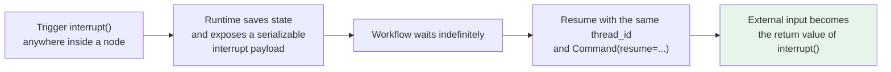
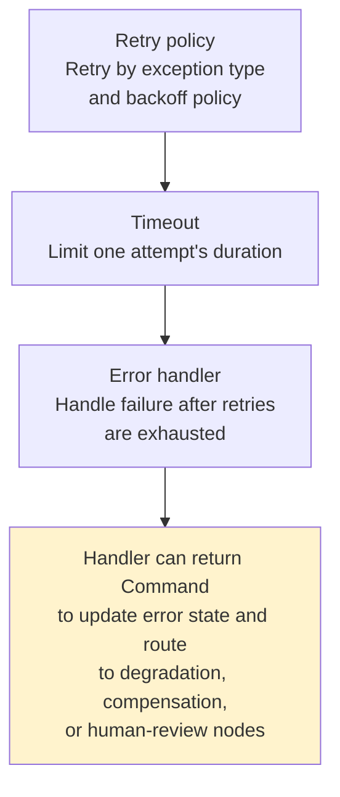

# Chapter 10: LangGraph's Core Advantages

## 10.1 Why are the two frameworks not alternatives at the same layer?

A feature-by-feature comparison can miss a key premise: LangChain agents already run on LangGraph.

Discussing persistence, streaming, and human involvement in this chapter does not mean LangChain agents lack these capabilities (see [Chapter 9](09-langchain-vs-langgraph.md) for the layering relationship).

> The difference when using LangGraph directly is that developers choose which nodes use these capabilities, which state they operate on, where execution resumes after failure, and how subflows fit together.

## 10.2 Why make workflow and state explicit?

As a standard tool-calling agent becomes more complex, developers can easily lose control because the model is usually both interpreting the problem and deciding what to do next.

With only two or three tools, this may be manageable. **But once authorization checks, parallel evidence gathering, quality assessment, human approval, and failure compensation enter the picture, packing every rule into a prompt leaves a probabilistic model to improvise the business process.**

### 10.2.1 The core value: put each kind of logic where it belongs

| Kind of step | Where it belongs |
|---|---|
| Requires model judgment | Delegate to an agent |
| Authorization, monetary thresholds, approval order, termination conditions | **Encode as nodes and edges** |

> **The model retains autonomy, but that autonomy operates within explicit guardrails.**

### 10.2.2 A procurement analogy

| Concept | Analogy |
|---|---|
| **State** | A **request form** that is filled in over time |
| **Node** | A **service desk**, such as budget review or compliance review |
| **Edge** | Rules specifying **where the paperwork goes next** |
| **Reducer** | Rules for appending, deduplicating, replacing, or otherwise merging updates when several desks write the same field; it does not automatically prevent overwrites |

**Two advanced primitives**:

- **`Command`**: a node needs to **update state and change the route**.
- **`Send`**: **dynamic dispatch** when the number of research tasks is known only at runtime.

> Understand the problem each solves before deciding whether you need it.

### 10.2.3 What does this add beyond a flowchart?

> **The graph structure directly determines execution.** Which nodes can run in parallel, which must wait for prerequisites, what state gets saved, and where execution resumes **are no longer just agreements written in documentation**.

**Explicit state has another engineering benefit**: it can **separate input, output, and internal state**.

- External requests submit only the user's question.
- Internal nodes maintain evidence, risk scores, retry counts, and approval feedback.
- The final output includes only the public result.

> **Intermediate variables in complex workflows do not all have to live in message history, nor does every node need to see every field.**

Input/output schemas are not a security sandbox, however. They constrain interfaces; they do not prevent a node with process privileges from accessing other resources. A `values` stream may also contain internal channels. Streaming outputs and logs need separate, minimal projections. Marking a field private does not guarantee it cannot leak.

### 10.2.4 More freedom also means more responsibility

> **Using a graph does not automatically make a LangGraph workflow sound.** Developers still choose state fields, merge behavior for concurrent writes, and node granularity. **Poor state design can still cause state growth, concurrent overwrites, and maintenance problems.**

A default single-value channel raises `InvalidUpdateError` when it receives multiple updates in the same super-step; it does not silently overwrite. A reducer must specify how duplicate results are deduplicated and whether order changes their meaning. List concatenation collects results but does not automatically preserve business ordering or idempotency. Parallel branches can merge evidence by stable evidence IDs and sort it for final presentation.

## 10.3 How should you choose between the two orchestration APIs?

LangGraph provides both `StateGraph` and the **Functional API**. They **share the same runtime capabilities**, but use different programming styles.

| Requirement | More natural entry point | Why |
|---|---|---|
| Many branches and loops; the full topology needs to be visible | **Graph API** | Explicit nodes, edges, and shared state support visualization and review |
| Multiple parallel paths join, or agents hand off work | **Graph API** | Concurrency, reducers, and subgraph boundaries are easier to model |
| Existing procedural code should change as little as possible | **Functional API** | Keeps ordinary Python control flow and adds runtime capabilities through decorators |
| A linear process with a few conditions and human confirmations | **Functional API** | Local variables and function scope feel more natural, with less boilerplate |
| Subflows vary substantially in complexity | **Mix both** | An outer graph schedules work; inner functional workflows handle local steps |

**The Functional API's two decorators**:

- `@entrypoint` marks the workflow entry point.
- `@task` makes a **side-effecting or nondeterministic** operation a recordable task.

> The workflow can still use ordinary `if`, `for`, and function calls.
>
> The APIs can be combined: use a graph for outer topology and procedural code for local steps.

## 10.4 How does a workflow continue after hours?

Retrying a whole short, read-only task can sometimes be acceptable. But even a task lasting only seconds cannot be rerun unconditionally once it has made a payment or sent a message.

**If a workflow runs for hours**, has already queried databases and called external services, and is waiting for approval, **starting from step one is not just a waste of tokens: it may send duplicate emails or create duplicate orders**.

### 10.4.1 Two easily confused concepts

| Mechanism | What it saves | Question it answers |
|---|---|---|
| **Checkpointer** | Graph state snapshots for a thread | **“How far has this task progressed?”** |
| **Store** | Application data outside graph state | **“What should other tasks remember later?”** |

> **Real applications often use both rather than choosing one.**

### 10.4.2 Durable execution is not a database switch

> **Code inside a node may run again during recovery. Replaying from an older checkpoint also reruns subsequent model calls and API requests.**

**External side effects therefore need idempotency protection**: have the external service accept a business idempotency key, or constrain a business action through unique constraints, atomic upserts, or a transactional outbox. An ordinary “check, then write” sequence has a concurrency race and is insufficient. A successful database write and success in an external system may not be atomically committable either. Complex nodes should also divide nondeterministic operations and side effects into clearer recovery boundaries.

> **LangGraph supplies infrastructure for reliable execution; it cannot define application-specific idempotency semantics for you.**
>
> Describing a checkpointer as a guarantee that “nothing ever executes twice” misrepresents recovery.

Checkpoint granularity is the super-step. Nodes in the same step read the state as it existed at the start of that step; results are merged in the update phase. One branch's write is not immediately visible to another branch. `sync` persistence waits for writes before the next step; `async` overlaps writes with the next step but widens the recovery window if the process crashes; `exit` saves primarily when execution exits. Choosing a mode trades write latency against recovery objectives. It does not change the transaction semantics of external services.

## 10.5 How can a person participate at any step?

**Once agents enter production systems, full autonomy is often not the end goal.** Refunds, payments, database deletion, formal emails, and publishing may need human review. Some workflows must wait for additional materials, state edits, or even several days before continuing.

### 10.5.1 How `interrupt()` works



**This is more flexible than “confirm or cancel.”** A reviewer can approve, reject, **change an amount, add evidence, or provide feedback**. Subsequent routing uses that input to choose the next step. Multilevel approval can also be split into nodes, **so each role sees only the information it needs**.

### 10.5.2 When is middleware enough?

**If the requirement is simply to approve, edit, or reject selected sensitive tool calls**, `HumanInTheLoopMiddleware` is usually easier.

> **LangGraph's advantage appears when** the object being reviewed **is not a standard tool call**, or the pause point must be **embedded in a longer business workflow**.

### 10.5.3 Execution boundaries on resumption

> **A resumed node restarts from its beginning; execution does not simply continue at the `interrupt()` line.**

Therefore:

- **Side effects before the interrupt must also be idempotent**.
- **Do not arbitrarily change the order of `interrupt()` calls**.
- **Keep interrupt payloads serializable**.

`interrupt()` pauses execution using a runtime control exception. Do not wrap it in a broad `try/except` that swallows the exception. When multiple interrupts occur in parallel, bind resume values to interrupt IDs. Reusing a `thread_id` only identifies the thread; it does not prove the caller is authorized to approve it.

### 10.5.4 Approval resumption is a security protocol, not a Boolean conversion

Do not write `bool(review["approved"])`: in Python, `bool("false")` is `True`. Validate resume payloads against a strict schema and bind them to **the waiting task ID and approval version**. Only an authenticated server may inject the reviewer's identity. Do not trust a `reviewer_id` reported by the browser, the model, or the resume JSON.

Accept only one decision per task version. Make recording the approval decision an atomic operation backed by a unique constraint, such as a database unique key on `(request_id, approval_version)`. A network retry carrying the same `decision_id` must return the original result, not trigger another purchase.

## 10.6 Why needn't a failure restart the whole workflow?

**When a traditional script fails, developers often face two choices**: rerun everything, or manually edit the database and hope the process can continue.

### 10.6.1 Three layers of node failure handling and their version boundaries



| Capability | Minimum version / condition | Notes |
|---|---|---|
| `RetryPolicy` | The LangGraph v1 interface discussed here | Configure only for retryable transient faults. Set `retry_on` explicitly; do not retry invalid parameters, permission failures, or business rejections |
| Node `timeout` and `error_handler` | **`langgraph>=1.2`** | Timeouts apply only to `async` nodes; a timeout becomes a `NodeTimeoutError` that the retry policy can handle |
| `asyncio.timeout()` | **Python 3.11+** | Use inside a node for finer-grained SDK/API-call timeouts; isolate blocking I/O with `asyncio.to_thread` first |

```python
import asyncio

from langgraph.errors import NodeTimeoutError
from langgraph.types import RetryPolicy, TimeoutPolicy

async def check_budget(state: PurchaseState) -> dict:
    # Bound the API call more tightly than the node; do not call blocking clients here.
    async with asyncio.timeout(10):
        approved = await budget_client.check(state["amount_minor"])
    return {"budget_ok": approved}

builder.add_node(
    "budget",
    check_budget,
    timeout=TimeoutPolicy(run_timeout=30, idle_timeout=10),
    retry_policy=RetryPolicy(
        max_attempts=3,
        retry_on=(NodeTimeoutError, TimeoutError, ConnectionError),
    ),
)
```

> `max_attempts` includes the first attempt. Node-level timeouts and error handlers require LangGraph 1.2. On older versions, use `asyncio.timeout()` inside an asynchronous node, or a caller-side timeout, rather than assuming `timeout=` will work.

This assumes that the budget client accepts amounts in RMB fen; `PurchaseState` is defined in Section 10.10. If the actual service has a different monetary contract, convert explicitly in the adapter.

A timeout does not mean the remote operation has been canceled. `asyncio.to_thread` avoids blocking the event loop, but the underlying thread or an already-issued HTTP request may continue after coroutine cancellation. Use the SDK's own network deadline and provide a status-query or reconciliation path for unknown outcomes; otherwise timeout retries can duplicate side effects. Three attempts include the duration of three individual timeouts plus backoff. `run_timeout=30` does not cap the entire task at 30 seconds.

### 10.6.2 What happens when parallel nodes fail?

> **With checkpoint persistence, LangGraph saves results from nodes that have already completed successfully in the same step. On resumption, successful branches need not all rerun; only failed work needs to be retried.**

**This is especially valuable when fetching from several sources in parallel**. Otherwise, one slow interface could fail and force another paid request to every source that already succeeded.

### 10.6.3 Time travel addresses a different problem

After locating an earlier checkpoint in state history, you can:

- **Re-execute** from that point.
- **Modify the earlier state first, then fork a new trajectory**.

**Useful cases** include investigating why an agent took a wrong path, trying a different human decision, or correcting an erroneous intermediate state.

> **Do not overstate it**: time travel is not rewinding a program and watching an identical recording. **Nodes before the checkpoint are skipped; nodes after it run again.** Model outputs, network responses, and external side effects may therefore differ.
>
> **It provides a debugging foundation for locating, replaying, and branching execution—not an automatic undo for actions that already happened in the real world.**

## 10.7 How do complex tasks run in parallel and then join?

Deep-research tasks suit graphs because they often involve more than one agent thinking from beginning to end: **split the topic, search several sources in parallel, cross-check and merge evidence, search again when gaps appear, and finally write a unified report**.

- The Graph API can split a task into parallel branches and join them afterward.
- **Use `Send` to create branches dynamically when the task count is known only at runtime**.
- **When parallel nodes update the same state field, a reducer must define how updates merge**. Do not hope that whichever write happens last is correct.

### 10.7.1 Subgraphs provide modularity

**A complete `create_agent` result is already a graph**, so it can serve as a node or subgraph in an outer `StateGraph`.

> Different teams can maintain research, compliance, and finance subgraphs independently. **If they agree on input/output state, the parent graph need not know the internal details**.

**Choose the subgraph's memory scope explicitly**:

| Type | Configuration |
|---|---|
| One-off subtask | `checkpointer=None` (default): each invocation starts fresh but inherits the parent's checkpointer within that invocation, retaining interrupt and recovery support |
| Subagent that genuinely needs ongoing memory | `checkpointer=True`: state accumulates across calls in the same thread; guard against concurrent invocations using the same subgraph namespace |
| Subtask with no checkpointing at all | `checkpointer=False`: explicitly disables checkpointing for the subgraph, removing the recovery capabilities above |

> **Not retaining history across calls does not mean there are no checkpoints during a call.** The first two modes require a checkpointer on the parent graph. Their difference is state-retention scope, not whether interrupts are supported.

### 10.7.2 More agents do not guarantee better results

> **More roles increase prompt complexity, context handoffs, debugging effort, and token costs.**
>
> Many handoff scenarios are **simpler with one agent plus middleware**. Subgraphs become worthwhile when roles need **different tools, different state structures, or independent lifecycles**, or when parallelism and cross-team ownership are genuine requirements.

## 10.8 How can users keep seeing progress during execution?

**Complex agents often spend most of their time searching, processing files, invoking subagents, and waiting for people—not writing the final answer.**

> **If the frontend shows only a spinner, users cannot tell whether the system is stuck or still working.**

LangGraph streaming includes more than model tokens: it can expose **per-step state updates, model messages, custom progress, checkpoints, and task status**.

| Audience | Information |
|---|---|
| Product interface | “Searching the policy repository,” “Completed 3/5 sources,” “Waiting for finance approval” |
| Developers | Which node updated what, and which task failed |

> Project these low-level events into progress information users can understand.

**LangChain agents run on LangGraph and can use the same underlying streaming capabilities.** For frontends and most application integrations, prefer the typed projections from `stream_events(..., version="v3")`. Do not pass raw state, tool arguments, or complete traces directly to the browser.

Pin compatible versions before using this interface: LangChain introduced typed event streaming in v1.3, and LangGraph's 1.2.0 implementation marked v3 experimental. These are separate packages; direct LangGraph use does not require LangChain v1.3 merely because of that introduction date, and other LangGraph versions need their own API and stability checks.

```python
# Expose only public fields the product needs; default-deny, not a sensitive-field denylist.
PUBLIC_PROGRESS_FIELDS = {"phase", "completed_sources", "total_sources", "status"}

def project_progress(state: dict) -> dict:
    return {
        key: state[key]
        for key in PUBLIC_PROGRESS_FIELDS
        if key in state
    }

def stream_public_progress(agent, inputs: dict, config: dict):
    stream = agent.stream_events(inputs, config=config, version="v3")
    for item in stream.values:
        # Publish progress only, not arbitrary text generated by any model node.
        yield {"type": "progress", "data": project_progress(item)}
```

> v3 projections simplify consuming messages, tool calls, state, and subgraph events; they **do not redact data automatically**. Establish an allowlist where events are produced and use a separate redaction policy for logs and traces. Raw protocol events belong only in controlled debugging channels.

This fragment assumes the agent defines the public progress fields above. `phase` and `status` should use controlled enumerations; a safe-looking field name does not make sensitive content safe. To display an answer, forward only the designated public-answer node's output and apply the relevant content policy before release. Text from other model nodes may be internal drafts. Checks that run only after the full output completes cannot retract tokens already sent to the browser.

## 10.9 How does state management reach production?

**Long-running agents cannot rely solely on in-process lists, nor should user preferences and current task progress be mixed into a single vector database.**

| Memory | Storage mechanism | Isolation |
|---|---|---|
| Short-term | State + checkpointer | `thread_id` |
| Long-term | Store | namespace + key |

**Production also requires database backends, tenant isolation, retention policies, deletion and correction procedures, and governance for sensitive information.**

### 10.9.1 Make deployment boundaries explicit

> **Open-source LangGraph is an orchestration framework and runtime; using it does not mean purchasing a managed service.**

| Approach | Description |
|---|---|
| Self-hosted | Connect your own checkpointer, store, and queues |
| Managed Agent Server | Combines graphs, persistence databases, and task queues; well suited to background execution, streaming interaction, and long-running stateful tasks |

> LangGraph does not automatically provide high availability.
>
> With self-hosting, **databases, task queues, worker scaling, retry policies, monitoring, and data retention remain the team's responsibility**. Managed platforms still require capacity planning, idempotency design, and failure drills.

## 10.10 A complete workflow example

**Procurement agent**: after a request is submitted, budget and compliance checks run in parallel. Human review starts only after both results arrive. Approval leads to the procurement system; rejection ends the workflow.

This fictional RMB procurement workflow stores amounts in fen, with a budget ceiling of RMB 100,000. Budget, compliance, and procurement services are placeholders. The in-memory checkpointer and approval ledger demonstrate only serial invocations in one process; they do not implement web authentication, persistence across restarts, or concurrent transactions.

First define the request, approval decision, and execution state. The business service supplies the request version with the submitted materials; do not reset it to 1 on every run.

```python
from typing import Literal, TypedDict

from pydantic import BaseModel, ConfigDict, Field
from langgraph.checkpoint.memory import InMemorySaver
from langgraph.graph import END, START, StateGraph
from langgraph.types import Command, interrupt

class PurchaseRequest(BaseModel):
    model_config = ConfigDict(strict=True, extra="forbid")
    request_id: str = Field(min_length=1)
    approval_version: int = Field(ge=1)
    amount_minor: int = Field(gt=0)

class ApprovalDecision(BaseModel):
    # Strict validation rejects coercion (such as string versions) and undeclared fields.
    model_config = ConfigDict(strict=True, extra="forbid")
    request_id: str = Field(min_length=1)
    approval_version: int = Field(ge=1)
    decision_id: str = Field(min_length=1)
    reviewer_id: str = Field(min_length=1)
    action: Literal["approve", "reject"]

class PurchaseState(TypedDict, total=False):
    # request_id can also be the external procurement API's idempotency key.
    request_id: str
    approval_version: int
    amount_minor: int
    budget_ok: bool
    compliance_ok: bool
    approved: bool
    approval_decision_id: str
    result: str
```

Only one decision is accepted per request version. A retry with an identical payload returns the original decision; a conflicting payload raises an error. The dictionary below illustrates the rule. In production, database unique keys and transactions must make this operation atomic.

```python
approval_ledger: dict[tuple[str, int], ApprovalDecision] = {}

def record_decision_once(decision: ApprovalDecision) -> ApprovalDecision:
    key = (decision.request_id, decision.approval_version)
    existing = approval_ledger.get(key)
    if existing is None:
        approval_ledger[key] = decision
        return decision
    if existing == decision:
        return existing  # Safe retry of the same decision.
    raise ValueError("该任务版本已作出不可覆盖的审批决定")

def normalize_request(state: PurchaseState) -> dict:
    request = PurchaseRequest.model_validate({
        "request_id": state["request_id"],
        "approval_version": state["approval_version"],
        "amount_minor": state["amount_minor"],
    })
    return request.model_dump()

def check_budget(state: PurchaseState) -> dict:
    # Replace with a budget-system query and configure retries and timeouts as needed.
    return {"budget_ok": state["amount_minor"] <= 10_000_000}

def check_compliance(state: PurchaseState) -> dict:
    # Writes a different field from the budget check, so the two nodes can run in parallel.
    return {"compliance_ok": True}
```

Approval is requested only after both checks finish. The resume payload must match the request and version; human approval cannot override a hard budget or compliance rejection.

```python
def human_review(state: PurchaseState) -> dict:
    # Pause the workflow and pass both check results to the review system.
    raw_decision = interrupt(
        {
            "request_id": state["request_id"],
            "approval_version": state["approval_version"],
            "amount_minor": state["amount_minor"],
            "budget_ok": state["budget_ok"],
            "compliance_ok": state["compliance_ok"],
        }
    )
    decision = ApprovalDecision.model_validate(raw_decision)
    if (
        decision.request_id != state["request_id"]
        or decision.approval_version != state["approval_version"]
    ):
        raise ValueError("审批载荷不属于当前等待的任务版本")
    stored = record_decision_once(decision)
    return {
        "approved": stored.action == "approve",
        "approval_decision_id": stored.decision_id,
    }

def route_after_review(state: PurchaseState) -> Literal["execute", "reject"]:
    # Human approval cannot override hard budget or compliance constraints.
    allowed = state["budget_ok"] and state["compliance_ok"] and state["approved"]
    return "execute" if allowed else "reject"

def execute_purchase(state: PurchaseState) -> dict:
    # Real calls must carry request_id to prevent duplicate purchases on recovery/retry.
    return {"result": f"演示：采购申请 {state['request_id']} 通过，未执行真实采购"}

def reject_purchase(state: PurchaseState) -> dict:
    # Rejection causes no external procurement side effects.
    return {"result": "采购申请未通过"}
```

The Chinese example strings are preserved: the errors say that a decision for this task version cannot be overwritten and that the approval payload does not match the waiting task version. The results say “Demo: procurement request … approved; no real purchase executed” and “Procurement request not approved.”

Use an edge with multiple starting nodes to express “both checks have completed,” rather than allowing either branch to trigger approval on its own:

```python
builder = StateGraph(PurchaseState)
builder.add_node("normalize", normalize_request)
builder.add_node("budget", check_budget)
builder.add_node("compliance", check_compliance)
builder.add_node("human_review", human_review)
builder.add_node("execute", execute_purchase)
builder.add_node("reject", reject_purchase)

builder.add_edge(START, "normalize")

# Fan out from the same node into parallel budget and compliance checks.
builder.add_edge("normalize", "budget")
builder.add_edge("normalize", "compliance")

# A multi-start edge performs fan-in: human review waits for both checks.
builder.add_edge(["budget", "compliance"], "human_review")
builder.add_conditional_edges("human_review", route_after_review)
builder.add_edge("execute", END)
builder.add_edge("reject", END)

# In-memory checkpoints are for this example; use a database backend in production.
graph = builder.compile(checkpointer=InMemorySaver())
```

The resume entry point accepts only a reviewer identity established by the authentication layer. Before calling it, the server must also verify thread ownership, approval permissions, the current materials version, and the decision's validity period.

```python
def resume_from_authenticated_reviewer(
    reviewer_id: str, client_payload: dict, config: dict
) -> dict:
    # The Web/API layer first checks session, MFA, and approval rights; override client identity.
    server_payload = {**client_payload, "reviewer_id": reviewer_id}
    return graph.invoke(Command(resume=server_payload), config=config)
```

A production implementation must persist approval decisions through durable unique constraints and transactions, check payload consistency for a reused idempotency key, audit reviewer identity and time, and call the procurement system with `request_id` or an equivalent business idempotency key. Recovery, timeout retries, and repeated clicks must not execute a second purchase. Initial invocation and resumption must use the same `thread_id`, and that thread may process only authorized requests.

Changed materials require a new approval version and a fresh pass through checks and approval. Do not update the amount while retaining an old `approved` value. Multicurrency systems also need currency and precision rules; these integer amounts cover only the fixed RMB-fen case.

## 10.11 Common mistakes

### 10.11.1 Saying LangGraph “adds” persistence, streaming, and human involvement

**LangChain agents use the same runtime.** The difference is control granularity.

### 10.11.2 Putting every complex business rule in the prompt

**That leaves a probabilistic model to improvise the workflow.** Deterministic rules belong in nodes and edges.

### 10.11.3 Assuming a graph automatically makes a workflow sound

**Poor state design can still cause state growth and concurrent overwrites.**

### 10.11.4 Knowing `StateGraph` but not the Functional API

**The Functional API often costs less to adopt when procedural code already exists**, and both APIs can be combined.

### 10.11.5 Believing a checkpointer prevents all repeated execution

**Node code runs again during recovery.** You must make side effects idempotent.

### 10.11.6 Expecting resumption to continue at the `interrupt()` line

**The node restarts from the beginning**, so side effects before the interrupt must also be idempotent.

### 10.11.7 Parsing an approval payload with `bool()`

`bool("false")` is `True`. Validate resume payloads with a strict schema and bind them to the task ID and approval version. The authenticated server supplies reviewer identity, and each version's decision must be persisted once, idempotently.

### 10.11.8 Writing the same field in parallel without a reducer

Default single-value channels raise a concurrent-update error. Even with a custom reducer, define deduplication and business ordering; list concatenation alone is insufficient.

### 10.11.9 Treating time travel as an undo for real-world actions

**It is a debugging foundation for locating, replaying, and branching execution.** Model outputs and side effects may differ after replay.

### 10.11.10 Assuming multiple agents are always better

**More roles increase handoffs, debugging effort, and cost.** One agent plus middleware is simpler in many cases.

### 10.11.11 Claiming LangGraph automatically gives high availability

**With self-hosting, databases, queues, scaling, and monitoring remain the team's responsibility.**

### 10.11.12 Conflating the open-source framework with a managed service

**LangGraph is an orchestration framework and runtime.** Managed hosting is a separate choice.

## 10.12 Chapter summary

1. **Start with the relationship**: LangChain agents are built on LangGraph. **The advantage is not obtaining otherwise absent features, but moving below the high-level loop to explicitly control the whole stateful workflow**.
2. **First theme—control**: state, nodes, and edges put deterministic rules and model decisions in their proper places, keeping model autonomy within guardrails.
3. **`Command` updates state and changes the route; `Send` dispatches dynamically at runtime; reducers define concurrent merge semantics**.
4. **Explicit state separates input, output, and internal data**. Intermediate variables need not all enter message history.
5. **Two APIs**: the Graph API suits complex topologies; the Functional API suits existing procedural code. They can be combined.
6. **Second theme—reliability**: checkpointers answer “How far have we progressed?”; stores answer “What should we remember later?” **The hard part of durable execution is idempotency, not writing to disk**.
7. **`interrupt()` can appear anywhere inside a node**, supporting edits, additional materials, and multilevel approval. **Resumption reruns the node from the start.** Approval resumption must strictly validate task IDs, versions, and decisions; identity comes from the authentication boundary, and a single idempotently persisted decision protects side effects.
8. **Three layers of node fault tolerance**: retry policy, timeout, and error handler. Node timeouts and error handlers require **`langgraph>=1.2`**, and timeouts apply only to async nodes. With checkpoint persistence, parallel failure recovery retries failed branches rather than successful ones.
9. **Time travel supports locating, replaying, and branching execution for debugging**, not undoing real-world actions.
10. **Subgraphs provide modularity**, but multiple agents bring handoff and cost overhead. More is not always better.
11. **Third theme—production engineering**: use typed projections from `stream_events(..., version="v3")`, expose redacted progress through an allowlist, separate short- and long-term memory, and clarify deployment boundaries.
12. **Selection boundary**: prefer `create_agent` for standard tool-calling agents and middleware for simple approvals. **Use LangGraph directly when business topology, state scope, recovery boundaries, or multi-role collaboration become the main source of complexity**.

> LangGraph's advantages fall into three areas: explicitly model business topology and state; support long-running recovery through checkpoints, interrupts, and node-level fault tolerance; then connect the workflow to production through streaming events, memory separation, and clear deployment boundaries. The corresponding cost is responsibility for state design, merge semantics, and side-effect idempotency.

## References

- [LangGraph documentation](https://docs.langchain.com/oss/python/langgraph/overview)
- [LangGraph: Graph API](https://docs.langchain.com/oss/python/langgraph/use-graph-api)
- [LangGraph: Functional API](https://docs.langchain.com/oss/python/langgraph/functional-api)
- [LangGraph: Persistence](https://docs.langchain.com/oss/python/langgraph/persistence)
- [LangGraph: Human-in-the-loop](https://docs.langchain.com/oss/python/langgraph/interrupts)
- [LangGraph: Time Travel](https://docs.langchain.com/oss/python/langgraph/use-time-travel)
- [LangGraph: Subgraphs](https://docs.langchain.com/oss/python/langgraph/use-subgraphs)
- [LangGraph: Fault tolerance](https://docs.langchain.com/oss/python/langgraph/fault-tolerance)
- [LangChain: Event streaming](https://docs.langchain.com/oss/python/langchain/event-streaming)
- [LangChain: Agents](https://docs.langchain.com/oss/python/langchain/agents)
- [LangGraph Checkpointers: checkpoint and recovery semantics](https://docs.langchain.com/oss/python/langgraph/checkpointers)
- [LangGraph concurrent state-update error](https://docs.langchain.com/oss/python/langgraph/errors/INVALID_CONCURRENT_GRAPH_UPDATE)
