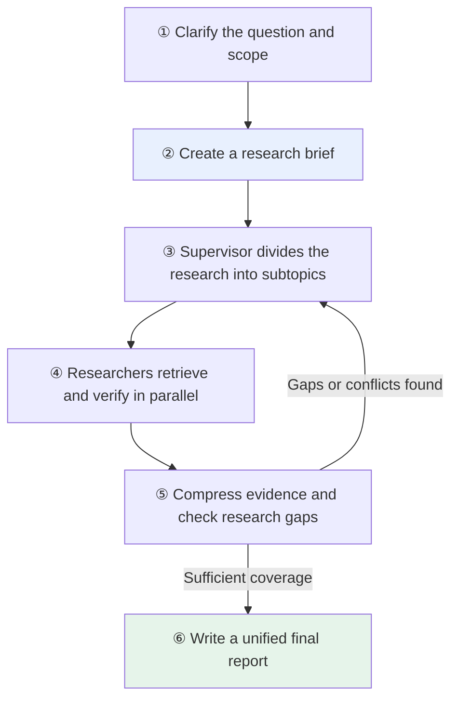
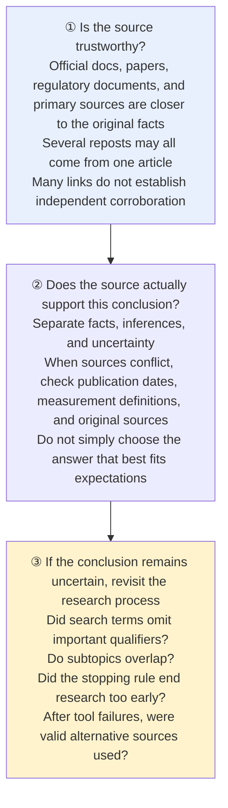
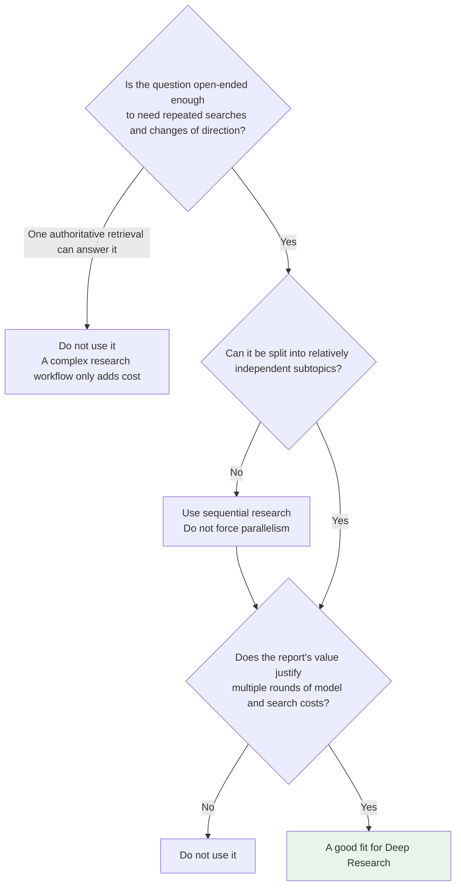

# Chapter 12: How Deep Research Works

## 12.1 What is Deep Research?

One retrieval may answer a simple factual question; an open-ended research task often has no predetermined path. There is no strict number of retrieval steps that separates ordinary multi-hop question answering from Deep Research.

For example, comparing the agent-hosting capabilities of three cloud providers requires investigating product positioning, pricing, limitations, and regional differences, while handling **renamed products, outdated material, and conflicting sources**.

> Deep Research is about a research process: the system must use the research objective to decide what to search for next, which questions can be explored in parallel, whether the evidence is sufficient, and when to stop.

### 12.1.1 Distinguishing the names in the ecosystem

| Name | Role |
|---|---|
| **LangChain** | Provides **high-level building blocks** such as models, tools, and agents |
| **LangGraph** | Handles **orchestration and execution of stateful workflows** |
| **open_deep_research** | Demonstrates **a specific research workflow** |
| **Deep Agents** | A Python **agent harness** built on LangGraph, providing planning, subagents, context management, and filesystem tools; not a hosted research product that guarantees correct research |

> Keep the boundaries clear: Deep Agents is the separately installed `deepagents` SDK/harness, not a switch in the core LangChain package. It does not supply your model, identity system, business authorization, data governance, or security isolation. By default, a `task` subagent is a one-shot invocation with an isolated context that returns only its final report. Task lists are opt-in from v0.7 onward; do not assume that every Deep Agent plans or has long-term memory.

Here, `task` refers to a synchronous subagent: the parent call waits for it to finish, so delegation does not always mean background execution. The official async subagents feature supports long-running tasks, mid-task instructions, and cancellation. It depends on a server implementing the Agent Protocol, either LangSmith Deployment or a self-hosted compatible service. Wrapping a synchronous subtask in a thread does not amount to durable background scheduling. An optional task list does not guarantee that the model will produce an effective research plan, either.

## 12.2 The core workflow

| Step | Key point |
|---|---|
| **① Clarify scope** | When a user only says “research this company,” establish whether the focus is **investment value, technical direction, or employment risk**; otherwise, subsequent searches can easily drift |
| **② Research brief** | Turn the user's objective, research dimensions, time range, source requirements, and deliverable format into **stable success criteria** |
| **③ Divide into subtopics** | **Only relatively independent questions suit parallel execution**, such as researching three companies' pricing separately; if one question depends on another's conclusion, handle them sequentially |
| **④ Retrieve over multiple rounds** | Each researcher **handles only one topic** and **retains source information** |
| **⑤ Compress and identify gaps** | **Do not send every full web page back to the supervisor**; compress the material into **key evidence with provenance**, then check whether it covers the brief |
| **⑥ Write a unified report** | Organize the argument, remove duplication, and **distinguish facts, inferences, and uncertainty** |

## 12.3 Why use subagents?

**If one agent researches several topics at once**, search results keep filling the same context. Company A's pricing, company B's security documentation, and failed requests for company C become mixed together, **making it harder for the model to focus on the evidence at hand**.

### 12.3.1 The primary purpose is context isolation

> **Each researcher handles one subtopic and returns only compressed findings and sources. The main agent can continue reasoning without carrying the entire search history.**

This isolates the message context, not operating-system permissions or all storage. Files in the default Deep Agents State backend can be shared by the main agent and subagents. Confidentiality requires separate tool permissions and storage boundaries; delegation alone does not provide them.

### 12.3.2 Parallelism follows naturally from isolation

- Independent research tasks can run at the same time, **reducing overall wait time**.
- **Tasks that depend on each other still have to run in order**.

> **More agents also mean more model calls, search spending, rate-limit pressure, and coordination overhead. Parallelism is not an end in itself; the question is whether the subtopics can progress independently.**

### 12.3.3 Why not let each subagent write a report section?

> **Sections may repeat background material, use inconsistent definitions or measurement methods, or even reach conflicting conclusions.**
>
> **Collect evidence in parallel, then write a unified report** to make consistency easier to maintain.

## 12.4 How do you ensure research quality?

**A long research report with many links is not necessarily a good one.**

To assess quality, work backward through the chain of “source → evidence → conclusion”:

### 12.4.1 Evaluate both the answer and the trace

| Dimension | Check |
|---|---|
| Final answer | Does it cover the brief? |
| **Research trace** | Was the search path reasonable? |
| **Source coverage** | Is there evidence for every key dimension? |
| **Citation correctness** | Do citations actually support the conclusions? |
| Time and cost | Did the task stay within budget? |

> **General-purpose benchmarks can compare versions, but cannot replace an organization's own business datasets.**

Compressed evidence should retain at least the claim, original excerpt, URL/document ID, page or paragraph location, source version, and retrieval time. The writing model should use these evidence IDs rather than regenerate links from memory. Finally, verify each citation against its adjacent claim and count claims that need citations but lack evidence. A working link proves accessibility, not the correctness of a conclusion; several reposts do not constitute several independent sources.

“Keep going until there is enough evidence” is not a useful stopping rule. Define required research dimensions, a list of unresolved conflicts, the amount of new useful evidence found over successive follow-up searches, and hard time/cost limits. When the budget runs out, deliver partial findings with explicit gaps rather than letting the summarizing model turn missing information into asserted facts.

## 12.5 How do you control cost and security?

### 12.5.1 Both breadth and depth affect cost

| Dimension | Meaning | Control |
|---|---|---|
| **Breadth** | Number of parallel research units | **Limit concurrently running research units** |
| **Depth** | Maximum iterations for each researcher and the supervisor | **Limit tool calls and follow-up search rounds** |

**A limit on each branch is not enough**. Set **total token, search-cost, and timeout budgets** for the entire task, along with policies for retries, caching, rate limiting, and cancellation.

> These controls make it clear when to continue, reduce functionality, or stop.

### 12.5.2 Web pages and external documents are untrusted input

> **They may contain prompt injections that try to make the agent disclose secrets or perform dangerous actions.**

| Measure |
|---|
| Prefer **read-only research tools** |
| Apply **least privilege** to internal data |
| **Do not expose secrets to search or sandbox environments** |
| High-risk actions **require human approval and retained traces** |

> **For financial, medical, legal, and security decisions, Deep Research can only assist with organizing information. Citations in a report are not a reason to remove expert review.**

### 12.5.3 Filesystem and sandbox boundaries in Deep Agents

Deep Agents exposes a **filesystem tool surface backed by pluggable backends**: `ls`, `read_file`, `write_file`, `edit_file`, `delete`, `glob`, and `grep`. This is not merely an abstraction: choosing the wrong backend can give the model access to read and write real files.

| Backend / scenario | Data and capabilities | Security boundary |
|---|---|---|
| Default State backend | Files are retained within **the same thread** through LangGraph state/checkpointer | Suitable for a temporary workspace; not shared across threads |
| `StoreBackend` | Files persist across threads | The application owns namespaces, tenant isolation, retention, and deletion policies |
| `FilesystemBackend` | Reads and writes real local files | `root_dir` alone is not an access restriction; use `virtual_mode=True` to constrain filesystem tool paths, which still does not provide a process sandbox |
| `LocalShellBackend` | Host filesystem plus `execute` | **No isolation**; only for controlled development environments |
| Sandbox backend | Isolated filesystem and `execute` | Suitable for untrusted code and autonomous agents; still requires restrictions on networking, credentials, mounts, resources, and lifetime |

> The Sandbox and LocalShell backends above provide shell `execute`; custom backends or tools may add further capabilities. A sandbox is an isolation boundary, not a synonym for “secure by default.” Inject least-privilege credentials only when needed, use read-only access/restricted networking and CPU, memory, and time quotas, and enable `interrupt_on` approval before actions such as deletion, outbound transmission, or paid calls. Do not directly expose host environment variables or cloud credentials to the agent.

The official documentation states that `FilesystemBackend` defaults to `virtual_mode=False`, which provides no path security boundary even when `root_dir` is set. Even with virtual paths enabled, expose only a minimal, dedicated directory. If host shell access is also available, commands can bypass the filesystem tools' path restrictions; a separately restricted execution environment is required.

**A recommended combination**: put temporary intermediate artifacts in a thread-scoped State backend; put reviewed material that must persist across sessions in a Store backend with tenant namespaces; execute code in a disposable sandbox. When combining these, use a Composite backend to route by path rather than placing all data and permissions in one writable local directory.

## 12.6 Which scenarios are a good fit?

First decide whether dynamic, multi-round evidence gathering is necessary, then whether parallel researchers are worthwhile. The ability to split a task into independent subtopics determines the parallelization strategy; it is not a prerequisite for Deep Research:

**Typical scenarios** include competitive analysis, research into technical directions, literature reviews, vendor due diligence, policy-impact studies, and analysis that combines internal company material with public information.

**Poor fits**:

| Situation | Reason |
|---|---|
| Looking up one easily verified, current fact | **One authoritative search is faster and cheaper** |
| Several subtasks must strictly share intermediate state | Do not force parallelism; use sequential research or a workflow with explicit dependencies |
| Sources are unreliable or inaccessible due to permissions | **A research agent cannot produce a correct answer out of nothing** |

## 12.7 Common mistakes

### 12.7.1 Treating Deep Research as “searching many times”

The point is to decide dynamically what to search for, whether work can run in parallel, whether the evidence is sufficient, and when to stop.

### 12.7.2 Treating it as a switch in the core LangChain package

**It is a class of research-agent architectures**. A reference implementation and a general-purpose framework have different roles.

### 12.7.3 Searching before clarifying the scope

**An unclear brief can send every subsequent search in the wrong direction.**

### 12.7.4 Running dependent subtopics in parallel

**If one subtopic depends on another's conclusion, they must run sequentially.**

### 12.7.5 Sending every full web page back to the supervisor

**Compress the material into key evidence with provenance**, or the context will quickly fill up.

### 12.7.6 Letting subagents write separate report sections

**Background may be repeated, definitions may differ, and conclusions may conflict**. Collect evidence in parallel, then write a unified report.

### 12.7.7 Treating link count as independent corroboration

**Several reposts may all come from the same article.**

### 12.7.8 Resolving conflicts by choosing the answer that fits expectations

**Investigate publication dates, measurement definitions, and original sources.**

### 12.7.9 Limiting branch iterations without a total budget

**The entire task also needs total token, search-cost, and timeout limits.**

### 12.7.10 Treating web content as trusted input

**Prompt injection may induce secret disclosure or dangerous actions**. Prefer read-only research tools.

### 12.7.11 Removing expert review because a report has citations

**It can only assist with financial, medical, legal, and security decisions.**

### 12.7.12 Evaluating only with general-purpose benchmarks

**They cannot replace the organization's own business datasets.**

### 12.7.13 Assuming Deep Agents provides isolation by default

The backend determines the permissions of filesystem tools and `execute`; `LocalShellBackend` operates directly on the host. For untrusted input or autonomous code execution, use a sandbox and separately restrict credentials, networking, mounts, and resources.

## 12.8 Chapter summary

1. **Deep Research is a class of research-agent architectures**, not a switch in a core package.
2. **The reference implementation in this chapter uses LangChain and LangGraph**, but the general approach to research agents does not depend on these frameworks.
3. **The six-step workflow**: clarify scope → create a brief → divide into subtopics → retrieve and verify in parallel → compress evidence and identify gaps → write a unified report.
4. **A research brief defines success criteria**, reducing the risk of searches drifting away from the objective.
5. **Only independent subtopics suit parallel execution**; handle dependencies sequentially.
6. **Context isolation is the primary purpose of subagents**; parallelism follows naturally from that isolation.
7. **Collect evidence in parallel, then write a unified report** to avoid duplicate sections and conflicting conclusions.
8. **Assess quality by tracing backward through “source → evidence → conclusion”**; many links do not establish independent corroboration.
9. **Evaluate the answer, trace, coverage, citation correctness, time, and cost**.
10. **Both breadth and depth affect cost**; branch-level limits need an overall budget and cancellation policy.
11. **External documents are untrusted input**: use read-only tools, least privilege, secret isolation, and human approval for high-risk actions.
12. **How open-ended the question is and the report's value determine whether research is worthwhile; subtopic independence determines whether to parallelize**. Sequential research can also be Deep Research.
13. **Deep Agents is an SDK/harness, not a promise of security or correctness**: filesystem, persistence, and shell permissions depend on the backend; untrusted code belongs in a restricted sandbox.

> Think of it as turning a research task with no fixed path into a stateful workflow: the supervisor plans and fills gaps, researchers gather evidence in parallel with isolated contexts, and a final writing step unifies the report. Production readiness also depends on controlling breadth, depth, budget, source trustworthiness, and prompt-injection risk together.

## References

- [LangChain official blog: Open Deep Research](https://blog.langchain.com/open-deep-research/)
- [Official open_deep_research repository](https://github.com/langchain-ai/open_deep_research)
- [Deep Agents overview](https://docs.langchain.com/oss/python/deepagents/overview)
- [Deep Agents Backends](https://docs.langchain.com/oss/python/deepagents/backends)
- [Deep Agents Sandboxes](https://docs.langchain.com/oss/python/deepagents/sandboxes)
- [Deep Agents synchronous subagents](https://docs.langchain.com/oss/python/deepagents/subagents)
- [Deep Agents async subagents](https://docs.langchain.com/oss/python/deepagents/async-subagents)
- [Official deepagents repository](https://github.com/langchain-ai/deepagents)
- [Official LangGraph documentation](https://docs.langchain.com/oss/python/langgraph/overview)
- [LangSmith Evaluation documentation](https://docs.langchain.com/langsmith/evaluation)
- [Anthropic: Building Effective Agents](https://www.anthropic.com/engineering/building-effective-agents)
