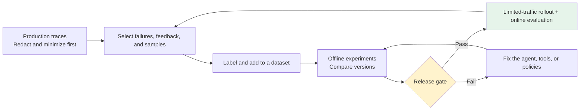
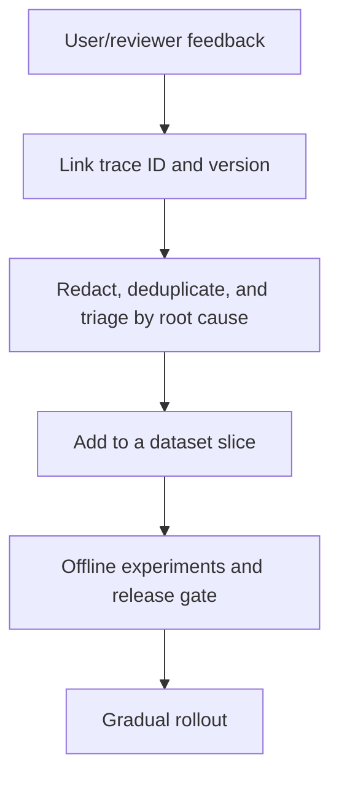

# Chapter 13: Building a Production Quality Feedback Loop with LangSmith

## 13.1 Why tracing is more than checking logs after launch

An agent failure is rarely just a problem with the final answer. It may involve the wrong tool, a timeout, an unauthorized action, insufficient citations, or duplicate execution after human approval. A trace connects inputs, model/tool steps, outputs, timing, and feedback so that production problems can become reproducible cases and verifiable improvements.

> A production feedback loop typically follows “trace redaction → root-cause analysis and labeling → dataset → offline experiment → release gate → production evaluation and feedback → regression tests from failed traces,” rather than responding to every failure with a prompt edit.



## 13.2 Define trace data boundaries first

Observability does not mean collecting everything. Minimize inputs, outputs, metadata, and attachments before sending a trace; hiding a field in the console does not mean it was never collected.

| Data | Default policy |
|---|---|
| Secrets, tokens, cookies, Authorization headers | **Never write them** into traces, metadata, tool outputs, or error stack traces |
| PII, order bodies, raw retrieved text, file contents | Avoid collection where possible; when diagnosis requires it, use field-level redaction, truncation, access controls, and retention limits |
| User/tenant identifiers | Use controlled pseudonymous identifiers; do not log email addresses, phone numbers, or complete identity credentials. Even after HMAC, data may remain linkable to a person |
| Tool arguments and results | Define a logging allowlist for each tool; for sensitive fields, record only category, length, hash, or status code |
| High-risk actions such as approvals, payments, and deletions | Record task ID, policy version, decision ID, outcome, and the principal involved for auditing; omit unnecessary source material |

```python
import hmac
from hashlib import sha256

def trace_metadata(
    tenant_id: str,
    prompt_version: str,
    trace_key: bytes,
) -> dict[str, str]:
    # Obtain trace_key from server-side secret management and rotate it regularly.
    # Never embed it in source code or a client.
    tenant_hash = hmac.new(trace_key, tenant_id.encode(), sha256).hexdigest()[:24]
    return {
        "tenant_hash": tenant_hash,
        "prompt_version": prompt_version,
    }

def project_tool_log(result: dict) -> dict:
    # Deny by default and project only safe fields; do not return result and then remove secrets.
    return {
        "status": result.get("status"),
        "item_count": len(result.get("items", [])),
    }
```

> Review and test redaction functions, sampling rules, and trace access permissions alongside application code. For debugging samples that must be retained, specify tenant isolation, storage region, retention period, deletion path, and who can export them. LangSmith does not make these business decisions automatically.

The helpers above are illustrative; defining them does not automatically connect them to tracing. LangSmith provides `LANGSMITH_HIDE_INPUTS=true`, `LANGSMITH_HIDE_OUTPUTS=true`, or `Client(hide_inputs=..., hide_outputs=...)` to hide or transform data before transmission. Metadata, attachments, and nested tool traces still need separate review. Disable the relevant tracing for tenants that prohibit retention rather than assuming that hashing or UI hiding satisfies zero-retention requirements.

## 13.3 Datasets: turn one failure into a repeatable test

A dataset should contain more than impressive demos. Each example should include at least versioned inputs, expected outcomes or scoring criteria, risk labels, and reproducible tool mocks/fixtures where necessary.

| Source | Purpose | Caveat |
|---|---|---|
| Manually designed typical and edge cases | Establish a minimum quality baseline | Cover unauthorized actions, formatting, timeouts, refusals, and human handoff |
| Redacted successful/failed traces | Reflect the real distribution | Obtain authorization to use the data; retain failure causes and versions |
| User feedback and human review queues | Identify experience and factuality problems | Distinguish dislike from actionable failure labels |
| Synthetic cases | Fill rare but important gaps | Do not substitute them for the real production distribution |

**A minimal process for regression tests from failed traces**:

1. Freeze the redacted inputs, necessary context, expected safe behavior, and the agent/tool/policy versions in use at the time.
2. Add the case to a dataset slice matching its root cause, such as `tool-timeout`, `authorization`, or `citation`.
3. Add deterministic checks, human scoring, or an LLM-as-judge for that slice, and calibrate the judge.
4. After the fix, rerun both the full baseline and the affected slice. A fix that repairs one trace but harms other slices is not ready to release.

> A dataset is a testing asset, not an unreviewed backup of production data. Do not copy raw user conversations, credentials, or complete internal documents directly into it.

Paraphrases of the same incident must not appear in both the tuning set and the final test set, or apparent generalization may just be memorization of that incident. Split by groups such as user session, document source, or time period, and freeze a holdout set. Use mocks to control tool responses during tests, while retaining separate integration evaluations against real services. These answer different questions: “Did the policy change?” and “Are production dependencies available?”

## 13.4 Offline experiments: compare reproducible versions before release

Offline evaluation compares candidate versions on controlled datasets. Version prompts, models, middleware, tool schemas, routing, and policies. Each experiment should fix the dataset version, evaluator version, model configuration, randomness settings, and concurrency/cache conditions; otherwise, score differences are hard to interpret.

| Evaluator | Suitable checks | Limitation |
|---|---|---|
| Code-based rules | Schemas, forbidden tools, authorization paths, budgets, citation presence | Poor at evaluating natural-language quality |
| Human review | High-risk cases, subjective quality, judge calibration | Slow and expensive |
| LLM-as-judge | Relevance, completeness, and style comparisons at scale | Subject to bias; needs a rubric, spot checks, and prompt-injection defenses |
| Pairwise comparison | Relative performance of two candidate versions | Still requires fixed samples and statistical thresholds |

Repeated runs of the same example help estimate variability in model behavior and tool paths. LangSmith's `num_repetitions` repeats both the target function and evaluators, so it also increases evaluation spending. Compare candidates with the baseline using paired results on the same questions, and report sample size, repetition count, and intervals rather than treating a 0.01 change in the mean score as a reliable gain. Repeated results from the same question are not independent new samples; if a cache reuses the same model response, those runs cannot estimate generation randomness either.

### 13.4.1 A release gate needs more than the mean score

Express release conditions as auditable rules, for example:

- **Zero regressions** in critical safety, authorization, and side-effect cases.
- Every core dataset slice meets a minimum score and does not drop below the baseline by more than the allowed threshold.
- Latency, error rate, tool costs, and human handoff rate stay within budget.
- New failed traces have been added to the regression set, and evaluator changes have been calibrated by people.
- Rollout expansion requires the owner to review the experiment, dataset version, and known risks.

> **A higher mean score cannot offset an unauthorized action, a data leak, or a duplicate charge.** High-risk gates should rely on deterministic rules and human approval, not an LLM judge's average score.

## 13.5 Online evaluation and sampling: observe real traffic without losing control

Production runs lack reference answers. They are suitable for automated trace checks of formatting, safety, tool errors, and reference-free LLM judging, with dashboards and alerts to monitor trends. These checks reveal “what happened in production”; **they do not replace pre-release offline gates**.

| Scenario | Sampling guidance |
|---|---|
| High-risk actions such as approvals, payments, and deletions | Record all necessary decisions and outcomes in a controlled audit system; decide separately whether and how to collect or sample diagnostic traces and judge evaluations based on compliance and budget |
| Safety refusals and tool errors | Prioritize compliant, minimal diagnostic information rather than sending the complete raw text of every failed request to the evaluation platform |
| Gradual rollout of a new model or prompt | Stratify samples by release version and tenant, retaining a control group |
| Ordinary low-risk traffic | Sample randomly and cap costs |
| Long-tail or high-value user paths | Use targeted sampling triggered by risk, feedback, latency, or tool type |

Retain the version, route, tenant hash, and sampling reason so that evaluation does not cover only requests that are easy to handle successfully. Set filters, sampling rates, and spending limits for online LLM-as-judge evaluation. Send low-scoring samples that need investigation to a human review queue rather than automatically treating judge conclusions as facts.

Targeted sampling gives scores for the selected population, not the site-wide failure rate. Retain a separate random sample to estimate overall trends, or record inclusion probabilities and apply appropriate weighting. Online judges generally score after execution and cannot replace authorization checks before an action. Nor does creating an experiment automatically make LangSmith block a release: the release gate must be wired into the actual CI/CD decision path.

## 13.6 How feedback returns to the loop

Collect thumbs-up/down feedback, corrected answers, reasons for human takeover, and reasons for denied approval in the product. Link feedback to the trace ID, version, and user-visible output. Redact, deduplicate, check for abuse, and triage feedback manually before deciding whether it belongs in a dataset.



> A single thumbs-up is not proof of quality, and user text must not directly rewrite the system prompt or authorization policy. Feedback is input to evaluation and improvement; it still needs deterministic safety controls and human review.

## 13.7 Common mistakes

### 13.7.1 Logging every prompt, argument, and tool output for debugging

**Traces themselves become a surface for sensitive data.** Apply allowlist projection, redaction, and retention limits at the source.

### 13.7.2 Using only general-purpose datasets or the overall mean score

**Real failures cluster in specific slices.** Fill gaps with failed production traces and business edge cases, and set thresholds for critical slices.

### 13.7.3 Treating online evaluation as pre-release testing

Online evaluation monitors real traffic. Before release, you still need reproducible experiments on fixed datasets and a release gate.

### 13.7.4 Confusing audit retention, diagnostic sampling, and judge sampling

High-risk actions require complete records of the necessary audit information. That does not mean every raw conversation must enter LangSmith, let alone receive an expensive judge call. Configure permissions, retention, and budgets separately for these three data paths.

### 13.7.5 Fixing an incident without adding its failed trace to regression tests

The same class of problem will recur. Every confirmed root cause should become part of a dataset slice and the release gate.

## 13.8 Chapter summary

1. **Traces start the production feedback loop; they are not unlimited logs**. Begin with minimization, redaction, isolation, and retention limits.
2. **Datasets must cover real failures and business slices**. Reviewed failed traces become lasting regression assets.
3. **Offline experiments compare versions; online evaluation monitors real traffic**. Neither replaces the other.
4. **Release gates examine critical safety cases, slices, costs, and latency**, not just mean scores.
5. **Stratify sampling by risk and version**, prioritizing high-risk and failure paths.
6. **Link feedback to traces and triage it before feeding it back**, continually improving datasets and regression gates.

> LangSmith's role here is to continually turn redacted production evidence into datasets, offline experiments, release gates, and production monitoring, so that each real failure can become a regression check before the next release.

## References

- [LangSmith Observability](https://docs.langchain.com/langsmith/observability)
- [LangSmith Evaluation](https://docs.langchain.com/langsmith/evaluation)
- [LangSmith dataset management](https://docs.langchain.com/langsmith/manage-datasets)
- [LangSmith Online evaluation](https://docs.langchain.com/langsmith/online-evaluations-llm-as-judge)
- [LangSmith user feedback](https://docs.langchain.com/langsmith/attach-user-feedback)
- [LangSmith: hide and transform sensitive data before transmission](https://docs.langchain.com/langsmith/mask-inputs-outputs)
- [LangSmith experiment repetitions, concurrency, and caching](https://docs.langchain.com/langsmith/experiment-configuration)
