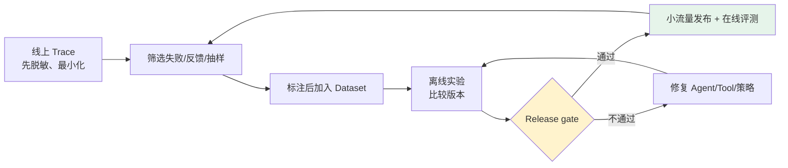
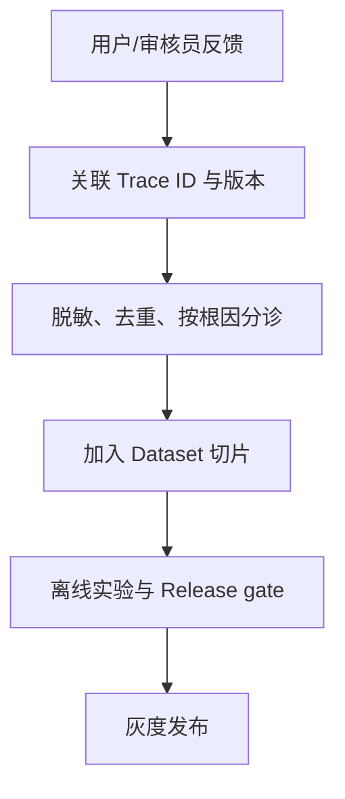

# 第十三章：用 LangSmith 建立生产质量闭环

## 13.1 为什么 Trace 不是「上线后再看日志」

一次 Agent 失败通常不是单一最终答案的问题：可能选错工具、超时、越权、引用不足，或在人工审批后重复执行。Trace 将输入、模型/工具步骤、输出、耗时和反馈关联起来，才能把线上问题变成可复现、可验证的改进工作。

> 生产闭环通常沿着「Trace 脱敏 → 归因与标注 → 数据集 → 离线实验 → 发布门禁 → 线上评测与反馈 → 失败 Trace 回归」推进，而不是看到失败就只改 Prompt。



## 13.2 先定义 Trace 数据边界

可观测不等于收集一切。发送 Trace 前就应最小化输入、输出、metadata 和附件；不要把控制台隐藏字段当成“未采集”。

| 数据 | 默认策略 |
|---|---|
| 密钥、令牌、Cookie、Authorization header | **绝不写入** Trace、metadata、Tool 输出或错误堆栈 |
| PII、订单正文、检索原文、文件内容 | 尽量不采集；必须诊断时使用字段级脱敏、截断、访问控制与保留期限 |
| 用户/租户标识 | 使用受控伪名标识；不要写邮箱、手机号或完整身份凭证，HMAC 后仍可能属于可关联个人数据 |
| Tool 参数与结果 | 为每个工具定义日志白名单；敏感字段只记录类别、长度、哈希或状态码 |
| 审批、支付、删除等高风险动作 | 记录任务 ID、策略版本、决策 ID、结果与审计主体；不记录不必要的材料正文 |

```python
import hmac
from hashlib import sha256

def trace_metadata(
    tenant_id: str,
    prompt_version: str,
    trace_key: bytes,
) -> dict[str, str]:
    # trace_key 来自服务端密钥管理系统并定期轮换，不能写进代码或客户端。
    tenant_hash = hmac.new(trace_key, tenant_id.encode(), sha256).hexdigest()[:24]
    return {
        "tenant_hash": tenant_hash,
        "prompt_version": prompt_version,
    }

def project_tool_log(result: dict) -> dict:
    # 默认拒绝，只投影安全字段；不要 return result 后再尝试删除敏感键。
    return {
        "status": result.get("status"),
        "item_count": len(result.get("items", [])),
    }
```

> 脱敏函数、采样规则和 Trace 访问权限应与应用代码一起评审和测试。对需留存的调试样本，明确租户隔离、地域、保留期、删除路径和谁能导出；这不由 LangSmith 自动替业务决定。

上面的 helper 只是示意，定义后不会自动接入 tracing。LangSmith 提供 `LANGSMITH_HIDE_INPUTS=true`、`LANGSMITH_HIDE_OUTPUTS=true`，或 `Client(hide_inputs=..., hide_outputs=...)` 在发送前隐藏/转换数据；metadata、附件和嵌套工具 trace 仍需分别审查。禁止留存的租户应关闭相应 tracing，而不是假定哈希或 UI 隐藏就满足零留存。

## 13.3 Dataset：把「一次失败」变成可重复测试

Dataset 不应只收集漂亮的 Demo。每个 example 至少应包含：版本化输入、预期结果或评分准则、风险标签，以及在需要时的可复现 Tool mock/fixture。

| 来源 | 用途 | 注意 |
|---|---|---|
| 人工设计的典型与边界案例 | 建立最小质量基线 | 覆盖越权、格式、超时、拒绝和转人工 |
| 已脱敏的成功/失败 Trace | 贴近真实分布 | 取得数据授权；保留失败根因与版本 |
| 用户反馈和人工审核队列 | 发现体验与事实问题 | 区分「不喜欢」和可操作的失败标签 |
| 合成案例 | 填补罕见但重要的边界 | 不应替代真实生产分布 |

**失败 Trace 回归的最小流程**：

1. 固定脱敏后的输入、必要上下文、预期安全行为和当时的 agent/tool/policy 版本；
2. 将它加入与根因对应的数据集切片，如 `tool-timeout`、`authorization`、`citation`；
3. 为该切片增加确定性检查、人工评分或 LLM-as-judge（并校准 judge）；
4. 修复后在完整基线和该切片上重跑；仅修复单一 Trace 但伤害其他切片，不能发布。

> Dataset 是测试资产，不是未审查的生产数据备份。不要把原始用户对话、凭证或完整内部文档直接复制进去。

同一事故的改写问题不能同时进入调参集和最终测试集，否则看似泛化的提升可能只是记住了该事故。按用户会话、文档来源或时间段分组切分，固定留出集；测试中用 mock 控制工具响应，另保留真实服务集成评测，两者分别回答「策略是否改变」和「线上依赖是否可用」。

## 13.4 离线实验：在发布前比较可复现版本

离线评测在受控 Dataset 上比较候选版本：Prompt、模型、middleware、Tool schema、路由与策略都应带版本号。一次 experiment 要固定数据集版本、评测器版本、模型配置、随机性设置和并发/缓存条件，否则分数差异难以解释。

| 评测器 | 适合检查 | 不足 |
|---|---|---|
| 代码规则 | Schema、禁止工具、权限路径、预算、引用是否存在 | 难评估自然语言质量 |
| 人工评审 | 高风险、主观质量、judge 校准 | 慢且昂贵 |
| LLM-as-judge | 大规模相关性、完整性、风格比较 | 会偏差；需要 rubric、抽检和防提示注入 |
| 成对比较 | 两个候选版本的相对表现 | 仍须固定样本与统计阈值 |

同一个 example 重复运行可以估计模型与工具路径的波动；LangSmith 的 `num_repetitions` 会重复目标函数和评测器，因此也会增加评测费用。比较候选与基线时，宜对同一批题做配对比较，并报告样本数、重复次数与区间，而不是把 0.01 的均分变化直接视为稳定收益。共享同一题的重复结果不是彼此独立的新样本；缓存若复用同一次模型响应，也不能用来估计生成随机性。

### 13.4.1 Release gate 不只看平均分

将发布条件写成可审计的规则，例如：

- 关键安全/授权/副作用用例 **零回归**；
- 每个核心数据集切片达到最低分，且相对基线不下降超过阈值；
- 延迟、错误率、Tool 成本和人工转接率不超过预算；
- 新增失败 Trace 已纳入回归集，评测器变更已人工校准；
- 负责人审阅 experiment、数据集版本和已知风险后才允许推广。

> **平均分提升不能抵消一次越权、泄密或重复扣款。** 高风险门禁应以确定性规则和人工审批为准，而不是 LLM judge 的平均分。

## 13.5 在线评测与采样：观察真实流量而不失控

线上运行没有参考答案，适合对 Trace 自动做格式、安全、工具错误、无参考 LLM judge 等评测，并结合仪表盘和告警观察趋势。它发现的是「生产中发生了什么」，**不能替代上线前的离线门禁**。

| 场景 | 采样建议 |
|---|---|
| 审批、支付、删除等高风险动作 | 在受控审计系统完整记录必要决策与结果；诊断 Trace 与 judge 是否采集、采样另按合规和预算决定 |
| 安全拒绝、Tool error | 优先保留合规的最小诊断信息，避免把全部错误请求的原文全量发送到评测平台 |
| 新模型/新 Prompt 的灰度发布 | 按发布版本和租户分层采样，保留对照组 |
| 普通低风险流量 | 随机采样，并设置成本上限 |
| 长尾/高价值用户路径 | 以风险、反馈、延迟或工具类型触发的定向采样 |

采样要保留版本、路由、租户哈希和采样原因，避免只评测「容易成功」的请求。在线 LLM-as-judge 应设置过滤条件、采样率和花费上限；对需要调查的低分样本进入人工队列，而非自动把 judge 结论当事实。

定向抽样得到的是被选中人群的分数，不是全站失败率。保留独立随机样本估计总体趋势，或记录纳入概率后做适当加权。线上 judge 通常在运行后评分，不能代替操作执行前的授权拦截；LangSmith 也不会仅因为创建了 experiment 就自动阻断发布，Release gate 必须接入实际 CI/CD 决策路径。

## 13.6 反馈如何回流

在产品中收集点赞/点踩、纠正答案、人工接管原因和审批拒绝原因，并把反馈关联到 Trace ID、版本和用户可见输出。反馈应经过脱敏、去重、滥用检测和人工分诊后，再决定是否进入 Dataset。



> 单次点赞不能直接当成质量证明，用户文本也不应直接改写系统 Prompt 或授权策略。反馈是评测与改进的输入，仍要经过确定性安全控制和人工审核。

## 13.7 常见错误

### 13.7.1 为了排障记录全部 Prompt、参数和 Tool 输出

**Trace 本身会成为敏感数据面。** 在源头按白名单投影、脱敏和限制保留期。

### 13.7.2 只用通用 Dataset 或只看总平均分

**真实失败会集中在特定切片。** 用生产失败 Trace 和业务边界案例补齐，并为关键切片设门槛。

### 13.7.3 把线上评测当作发布前测试

线上评测用于监测真实流量；发布前仍要在固定 Dataset 上完成可复现实验和 Release gate。

### 13.7.4 混淆审计留存、诊断采样与 judge 采样

高风险动作需要完整的必要审计记录，不表示原始对话必须全量进入 LangSmith，更不表示每条都要调用昂贵 judge。三个数据路径分别设置权限、保留期和预算。

### 13.7.5 修复线上事故却不把失败 Trace 加入回归

同类问题会再次出现。每个已确认根因都应成为数据集切片和发布门禁的一部分。

## 13.8 本章总结

1. **Trace 是生产闭环的起点，不是无边界日志**：先最小化、脱敏、隔离与设定保留期；
2. **Dataset 要覆盖真实失败与业务切片**，失败 Trace 经审核后成为长期回归资产；
3. **离线实验比较版本，线上评测监测真实流量**，两者不能互相替代；
4. **Release gate 看关键安全用例、切片、成本和延迟**，不只看平均分；
5. **采样按风险和版本分层**，高风险/失败路径优先覆盖；
6. **反馈关联 Trace 后经分诊回流**，持续丰富 Dataset 和回归门禁。

> 可以把 LangSmith 在这里的作用概括为：把经过脱敏的生产证据持续转成 Dataset、离线实验、发布门禁和线上监测，让每一次真实失败都能在下一次发布前进入回归验证。

## 参考资料

- [LangSmith Observability](https://docs.langchain.com/langsmith/observability)
- [LangSmith Evaluation](https://docs.langchain.com/langsmith/evaluation)
- [LangSmith 管理 Dataset](https://docs.langchain.com/langsmith/manage-datasets)
- [LangSmith Online evaluation](https://docs.langchain.com/langsmith/online-evaluations-llm-as-judge)
- [LangSmith 用户反馈](https://docs.langchain.com/langsmith/attach-user-feedback)
- [LangSmith 发送前隐藏与转换敏感数据](https://docs.langchain.com/langsmith/mask-inputs-outputs)
- [LangSmith 实验重复次数、并发与缓存](https://docs.langchain.com/langsmith/experiment-configuration)
