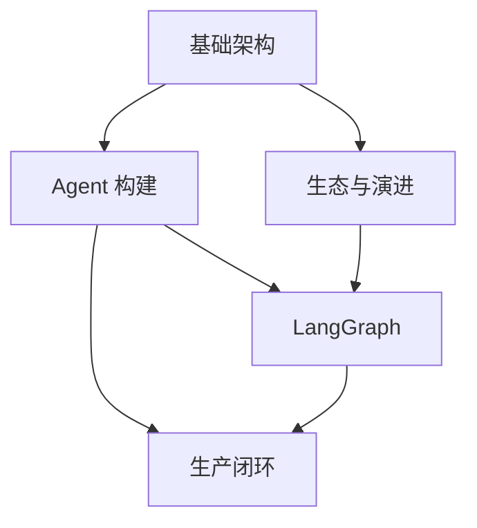

# 框架与编排 · LangChain 生态

本模块是「AI 框架与编排」主题下最完整的一支：LangChain 从 Chain/LCEL 起步，经 `create_agent` 走向标准化 Agent 构建，再用 LangGraph 补上图编排、持久化与人工介入，最后用 LangSmith 闭环生产质量。它是本主题里唯一原生覆盖「从原型到生产」全链路的框架，也是后续 02–06 各模块反复对照的基线（见各章节内的“与 LangChain 比较”段落）。

本模块集中维护 LangChain、LangGraph、LangSmith 及相关生态内容，结构与原有学习路径保持一致。

## 子模块

1. [基础架构（第 1–3 章）](01-foundations/README.md)
2. [Agent 构建（第 4–6 章）](02-agent-building/README.md)
3. [生态与演进（第 7–8、11 章）](03-ecosystem/README.md)
4. [LangGraph（第 9–10 章）](04-langgraph/README.md)
5. [生产闭环（第 12–13 章）](05-production/README.md)

## 模块关系

## 阅读建议

- **框架入门**：基础架构 → Agent 构建；
- **复杂工作流**：基础架构 → Agent 构建 → LangGraph；
- **技术选型与升级**：基础架构 → 生态与演进；
- **生产质量闭环**：Agent 构建 → LangGraph → 生产闭环；
- **跨框架比较**：读完本模块任意子模块后，可直接跳到 [框架选型与可移植架构](../06-selection-portability/README.md) 看统一对照表。

返回 [AI 框架与编排 相关知识点](../README.md)。
