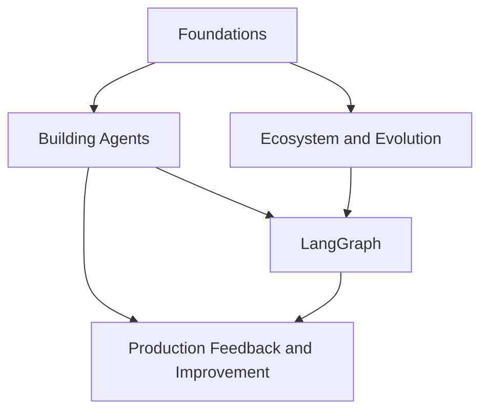

# Frameworks and Orchestration · LangChain Ecosystem

This module follows the LangChain ecosystem from Chain/LCEL and `create_agent` through LangGraph's graph orchestration, persistence, and human intervention to the production quality-improvement cycle in LangSmith. It supplies a reference point for comparisons in modules 02–06. That is a teaching choice, not a suggestion that other frameworks are unsuitable for production or that adopting this ecosystem automatically provides production reliability.

On a first read, follow chapter numbers: after the ecosystem comparisons in Chapters 7–8, read the LangGraph material in Chapters 9–10, return to Chapter 11 for version evolution, and finish with production workflows in Chapters 12–13.

The Python examples use LangChain v1 interfaces and require at least Python 3.10; the in-node `asyncio.timeout()` example requires Python 3.11. Replace placeholder model identifiers, install the relevant provider package, and configure credentials. Production projects need a pinned, compatible combination of `langchain`, `langchain-core`, `langgraph`, provider packages, and checkpoint backends. Chapters 10 and 11 give minimum versions for specific features; "v1" does not mean every minor version is interchangeable.

## Submodules

1. [Foundations (Chapters 1–3)](01-foundations/README.md)
2. [Building Agents (Chapters 4–6)](02-agent-building/README.md)
3. [Ecosystem and Evolution (Chapters 7–8 and 11)](03-ecosystem/README.md)
4. [LangGraph (Chapters 9–10)](04-langgraph/README.md)
5. [Production Feedback and Improvement (Chapters 12–13)](05-production/README.md)

## How the submodules connect

## Suggested reading paths

- **Getting started with the framework**: Foundations → Building Agents.
- **Complex workflows**: Foundations → Building Agents → LangGraph.
- **Technology selection and upgrades**: Foundations → Ecosystem and Evolution.
- **Improving production quality**: Building Agents → LangGraph → Production Feedback and Improvement.
- **Comparing frameworks**: after any submodule, go directly to [Framework Selection and Portable Architecture](../06-selection-portability/README.md) for the shared comparison tables.

Back to [AI Frameworks and Orchestration](../README.md).
