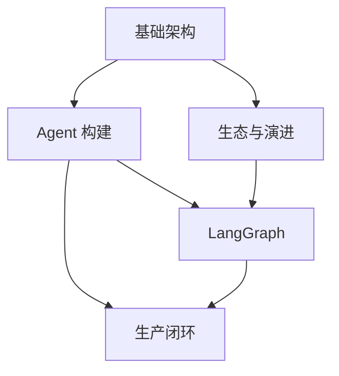

# 框架与编排 · LangChain 生态

本模块沿着 LangChain 生态展开：从 Chain/LCEL、`create_agent`，到 LangGraph 的图编排、持久化与人工介入，再到 LangSmith 的生产质量闭环。它作为后续 02–06 各模块对照时的参考基线；这是一种教学组织方式，不表示其他框架不能用于生产，也不表示采用该生态就自动具备生产可靠性。

首次通读按章号前进：第 7–8 章比较生态后，先读第 9–10 章的 LangGraph，再回到第 11 章看版本演进，最后进入第 12–13 章的生产流程。

Python 示例按 LangChain v1 接口讲解，最低 Python 3.10；节点内 `asyncio.timeout()` 示例需要 Python 3.11。模型标识中的占位符必须替换，并安装对应 provider 包和配置凭证。生产项目需要锁定 `langchain`、`langchain-core`、`langgraph`、provider 与 checkpoint 后端的兼容组合；特定功能的最低版本见第 10、11 章，不能把「v1」当成任意小版本都兼容。

## 子模块

1. [基础架构（第 1–3 章）](01-foundations/README.md)
2. [Agent 构建（第 4–6 章）](02-agent-building/README.md)
3. [生态与演进（第 7–8、11 章）](03-ecosystem/README.md)
4. [LangGraph（第 9–10 章）](04-langgraph/README.md)
5. [生产闭环（第 12–13 章）](05-production/README.md)

## 模块关系

## 阅读建议

- **框架入门**：基础架构 → Agent 构建；
- **复杂工作流**：基础架构 → Agent 构建 → LangGraph；
- **技术选型与升级**：基础架构 → 生态与演进；
- **生产质量闭环**：Agent 构建 → LangGraph → 生产闭环；
- **跨框架比较**：读完本模块任意子模块后，可直接跳到 [框架选型与可移植架构](../06-selection-portability/README.md) 看统一对照表。

返回 [AI 框架与编排 相关知识点](../README.md)。
