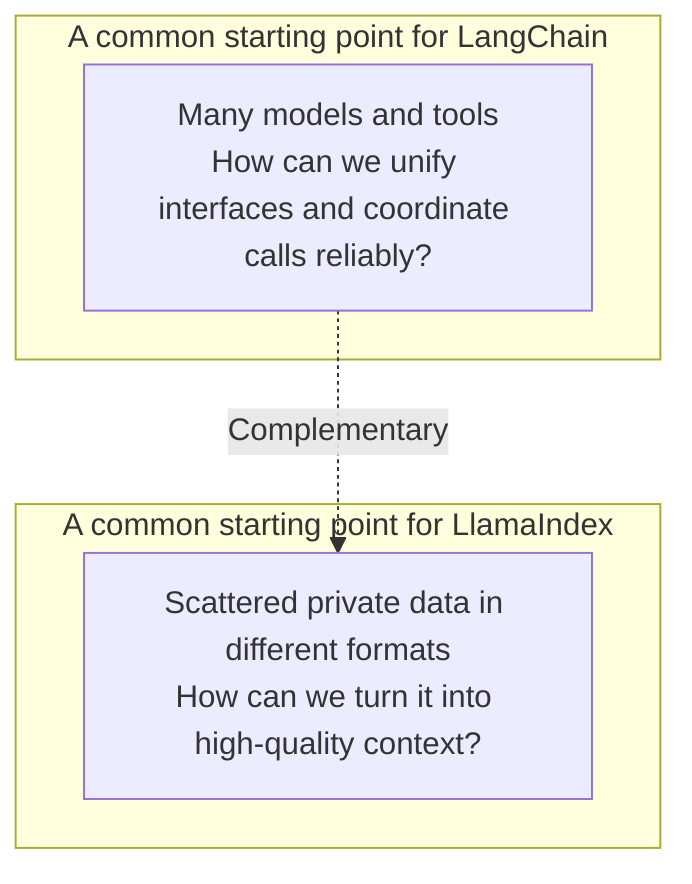
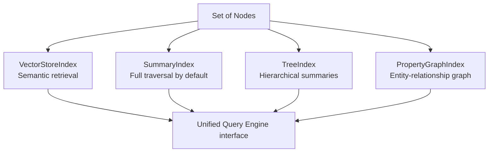

# Chapter 14: LlamaIndex Data and Index Abstractions

## 14.1 Why private data cannot simply be handed to a model

Private data is usually neither part of a model's learned knowledge nor organized into retrievable context with traceable sources. Tables in PDFs, database records, and support-ticket bodies first need to be parsed, located within their sources, and organized for retrieval. Giving the model a file path is not enough.

This data-processing pipeline is a common starting point for LlamaIndex. The [LangChain ecosystem](../01-langchain/README.md), by comparison, places more emphasis on unified Model / Message / Tool interfaces and on how models call tools.

The two have substantial overlap and can also complement each other. This comparison concerns the emphasis of their commonly used abstractions, not product boundaries such as "LlamaIndex can only do RAG" or "LangChain is poor at data processing."



## 14.2 Data ingestion: `Document`, `Node`, and `IngestionPipeline`

LlamaIndex conceptually distinguishes "source data" from "retrievable units," but these are not mutually incompatible type systems:

- **`Document`**: A container for source data, usually corresponding to a file, a database record, or an API response, carrying `text` and arbitrary `metadata`.
- **`Node`**: A unit processed during indexing and retrieval. It is often a text chunk, but can also represent other modalities or be constructed directly. Its `relationships` can preserve source, previous/next, or parent/child relationships; whether those relationships are generated depends on the parser and configuration.
- **`IngestionPipeline`**: Applies transformations such as splitting, metadata extraction, and embedding to already loaded documents or nodes. The transformation contract maps a sequence of nodes to another sequence, not one node to exactly one node. Caching reuses transformation results; document deduplication and update management additionally require a `docstore`, stable document IDs, and an appropriate update strategy.

```python
from llama_index.core import Document
from llama_index.core.ingestion import IngestionPipeline
from llama_index.core.node_parser import SentenceSplitter
from llama_index.embeddings.openai import OpenAIEmbedding

pipeline = IngestionPipeline(
    transformations=[
        SentenceSplitter(chunk_size=512, chunk_overlap=64),
        OpenAIEmbedding(),
    ],
)
nodes = pipeline.run(documents=[Document(text=raw_text, metadata={"source": "handbook.pdf"})])
```

This is an ingestion fragment. `raw_text` must come from data actually read, and the OpenAI embedding integration package and credentials must already be configured. For incremental updates in production, give each Document a stable ID as well.

`IngestionPipeline` does more than split text. More importantly, it captures the splitting strategy, metadata extraction, and embedding generation as a reusable, cacheable sequence of components. To change how the same source data is split, you can usually replace one step in `transformations` rather than rewrite the entire ingestion script.

Compared with a typical pipeline in the [LangChain ecosystem](../01-langchain/README.md), LlamaIndex's Node relationships offer a more direct entry point for expanding retrieved context. However, using `SentenceSplitter` does not automatically create hierarchical parent/child relationships. Hierarchical retrieval requires the corresponding parser, relationship data, and retriever to work together.

## 14.3 Index abstractions: from vector indexes to property graphs

After Nodes have been created, LlamaIndex organizes them using different **Index** types. Each Index embodies a different retrieval assumption:

| Index type | Organization | Suitable questions |
|---|---|---|
| `VectorStoreIndex` | Stores each Node's embedding in a vector store | Semantic similarity retrieval; the most common default |
| `SummaryIndex` | Keeps an ordered list of Nodes and, by default, passes all nodes to the synthesizer; other retrieval modes can be configured | Questions requiring complete coverage, such as "summarize the entire document"; verify that top-k retrieval or filtering is not enabled |
| `TreeIndex` | Builds a summary tree from the bottom up | Hierarchical summarization of large documents and question answering that narrows down through the tree |
| `KeywordTableIndex` | Extracts keywords from nodes and queries, then maps keywords to Nodes | Term-based queries; extraction may call an LLM, so this is not equivalent to exact database predicates |
| `PropertyGraphIndex` | Extracts entities and relationships from Nodes into a graph | Multi-hop reasoning and relational questions, as discussed in the GraphRAG chapter under `docs/rag` |



Index types embody different retrieval assumptions; they are not just interchangeable database backends. Giving a question such as "summarize the entire document" to a `VectorStoreIndex` usually retrieves only a small number of semantically similar passages, not enough for a summary covering the whole document. This is one of the common mistakes in Section 14.5.

## 14.4 Decoupling storage from indexes: `StorageContext` and vector-store independence

LlamaIndex uses `StorageContext` to organize storage dependencies. The following three components are common in text-vector applications; additional fields support graph stores, property graph stores, named vector stores, and more:

- **`docstore`**: Stores the original content of Nodes.
- **`index_store`**: Stores the index's structural metadata, such as the tree relationships in a `TreeIndex`.
- **`vector_store`**: Stores embedding vectors; some implementations also store text and metadata. Backends with existing adapters, such as Pinecone, Weaviate, and pgvector, are options, but an arbitrary database is not a drop-in replacement.

```python
from llama_index.core import StorageContext, VectorStoreIndex
from llama_index.vector_stores.postgres import PGVectorStore

vector_store = PGVectorStore.from_params(
    connection_string=sync_database_url,
    async_connection_string=async_database_url,
    table_name="handbook",
    embed_dim=1536,
)
storage_context = StorageContext.from_defaults(vector_store=vector_store)
index = VectorStoreIndex(nodes, storage_context=storage_context)
```

This fragment assembles storage components. The PostgreSQL integration package and pgvector extension must already be installed. The application supplies `sync_database_url` and `async_database_url` for the same database, using compatible synchronous and asynchronous drivers, such as `postgresql+psycopg2` and `postgresql+asyncpg`. Both URLs are passed explicitly: [`from_params()` does not discover an existing application connection](https://github.com/run-llama/llama_index/blob/f475afd8a9bbda84f252567e045d89d07b5701b3/llama-index-integrations/vector_stores/llama-index-vector-stores-postgres/llama_index/vector_stores/postgres/base.py#L413-L478). Keep credentials in application configuration rather than in the example. `embed_dim` must match the actual embedding output; 1536 is only an example value.

Switching backends can often preserve the higher-level interface, but you still need to migrate node IDs, text, metadata, and vectors, then verify filtering, hybrid retrieval, deletion semantics, and score scales. Nor is `persist()` an atomic backup across multiple remote stores: recovery requires consistent versions of the docstore, index structures, and vector collection.

## 14.5 Common mistakes

### 14.5.1 Treating `SummaryIndex` as a replacement for `VectorStoreIndex`

By default, `SummaryIndex` passes every node in its list to response synthesis. It also supports retrieval modes such as embedding-based retrieval, so it is inaccurate to say that it never performs semantic retrieval. The default full-coverage path can involve substantial data volume and synthesis cost. Before switching to it, confirm that the question needs a complete view.

### 14.5.2 Using vector retrieval for global summarization

If "summarize this 200-page report" covers only a few similar passages, the problem may be that top-k retrieval lacks global coverage, not that retrieval is random. Options include reading everything and synthesizing hierarchically, or building summaries in advance. With `SummaryIndex`, you must still select a mode that covers all nodes; branch retrieval in `TreeIndex` does not automatically guarantee full-document coverage either.

### 14.5.3 Ignoring relationships between Nodes and storing only text

Without `relationships` preserved during splitting, expanding a context window becomes harder. If stable document IDs, chunk sequence numbers, or character offsets remain available, relationships can still be reconstructed without necessarily reparsing the source. Decide which location information to keep during ingestion.

### 14.5.4 Assuming index selection is a one-time decision

The same data can have both a vector index and a property graph index, sharing some node-processing results, but do not build both by default. A property graph also requires entity and relationship extraction, disambiguation, and graph-store maintenance. Introduce it only when the benefits for relational questions justify the extra model calls and update complexity.

### 14.5.5 Taking `StorageContext`'s vector-store independence for granted

Vector stores differ in their support for metadata filtering and hybrid retrieval. After switching backends, you still need to revalidate filter syntax and retrieval quality; this is not merely a configuration change.

## 14.6 From "can retrieve" to "can stay up to date"

Suppose a knowledge base updates support tickets daily, yet the production system still cites an old policy. First distinguish three questions: Was the source document reread? Did the transformation hit the cache? Were the old nodes deleted? A stable `doc_id` combined with a document hash can identify updates; generating a random ID each time turns an update into an append. If the content hash is unchanged but the splitter or embedding model has changed, document deduplication alone is not enough. An explicit rebuild or a new index version is usually necessary.

Useful follow-up questions concern these engineering decisions:

- **Deletion and access revocation**: Updating only the source system is insufficient. Invalidate the vector store, docstore, caches, and derived summaries or graph data as well. Tenant and document ACL boundaries must survive context expansion and reranking.
- **Locating the failing layer**: Measure ingestion coverage, recall, reranking quality, and the faithfulness of answer citations separately. Switching to a property graph will not necessarily fix tables lost during parsing.
- **Rebuild cost**: Estimate it from data volume, the number of nodes after splitting, embedding charges, and the incremental-update window. Writing and validating a new collection before switching the read pointer makes rollback easier than overwriting the existing collection.

## 14.7 Chapter summary

1. **LlamaIndex first addresses how data becomes high-quality context**, complementing rather than replacing LangChain's emphasis on coordinating models and tools through unified interfaces.
2. **A `Document` contains source data; a `Node` is a retrieval-processing unit.** `IngestionPipeline` captures splitting, extraction, and embedding in a reusable pipeline, while loading and incremental synchronization still require explicit configuration.
3. **Choose the Index and Retriever together.** Vector neighbors, default full reads, summary trees, and property graphs embody different data-organization and retrieval assumptions; none automatically guarantees answer quality.
4. **`StorageContext` decouples storage backends from index structures.** It can reduce interface changes but cannot eliminate data migration or regression testing of retrieval behavior.
5. **Multiple indexes can coexist over the same data.** Index selection is neither a one-time nor a mutually exclusive decision.

Think of LlamaIndex as a set of abstractions organized around data ingestion and retrieval: `Document`, `Node`, `Index`, and `StorageContext` handle source data, retrievable units, retrieval organization, and storage decoupling respectively. Together, they form a data-processing pipeline with replaceable components.

## References

- [LlamaIndex official documentation](https://developers.llamaindex.ai/python/framework/)
- [LlamaIndex: Loading Data (Ingestion Pipeline)](https://developers.llamaindex.ai/python/framework/module_guides/loading/ingestion_pipeline/)
- [LlamaIndex: Indexing concepts](https://developers.llamaindex.ai/python/framework/module_guides/indexing/)
- [LlamaIndex: Default and optional retrieval modes for each index](https://developers.llamaindex.ai/python/framework/module_guides/indexing/index_guide/)
- [LlamaIndex: Property Graph Index](https://developers.llamaindex.ai/python/framework/module_guides/indexing/lpg_index_guide/)
- [LlamaIndex: Storage concepts](https://developers.llamaindex.ai/python/framework/module_guides/storing/)
