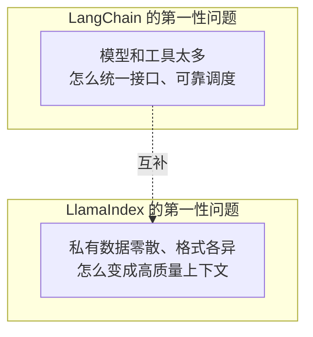
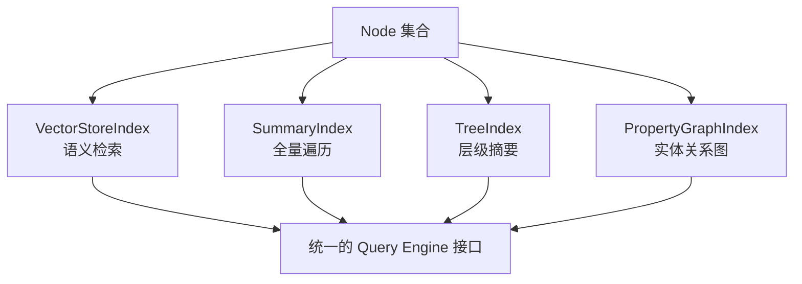

# 第十四章：LlamaIndex 的数据与索引抽象

## 14.1 先看问题定义：不是「工具怎么调度」，而是「数据怎么变上下文」

[LangChain 生态](../01-langchain/README.md) 的主要抽象是 Model / Message / Tool 的统一接口，重点放在模型如何稳定地调用工具。LlamaIndex 把问题放在更上游：模型默认并不了解私有数据，而这些数据也不是天然可检索的，因此更关注如何把 PDF、数据库、工单系统里的内容加工成模型可用的高质量上下文。

> LlamaIndex 和 LangChain 更像分工互补：前者把「数据 → 索引 → 检索」这条链路拆得更细，后者把「模型 → 工具 → Agent」这条链路拆得更细。这也是为什么 LangChain 模块第 7 章会专门比较两者的分工。



## 14.2 数据接入层：`Document`、`Node` 与 `IngestionPipeline`

LlamaIndex 把「原始数据」和「可检索单元」严格分成两层：

- **`Document`**：一份原始数据的容器，通常对应一个文件、一条数据库记录或一次 API 响应，携带 `text` 与任意 `metadata`；
- **`Node`**：`Document` 被切分（chunking）后的最小可检索单元，除了文本本身，还持有指回 `Document`、指向相邻 `Node` 的关系（`relationships`），用于后续做上下文回填；
- **`IngestionPipeline`**：把「加载 → 切分 → 抽取元数据 → 生成 Embedding」串成一条可缓存、可增量执行的流水线，`transformations` 列表里的每个组件都遵循同一个 `Node → Node` 契约。

```python
from llama_index.core import Document
from llama_index.core.ingestion import IngestionPipeline
from llama_index.core.node_parser import SentenceSplitter
from llama_index.embeddings.openai import OpenAIEmbedding

pipeline = IngestionPipeline(
    transformations=[
        SentenceSplitter(chunk_size=512, chunk_overlap=64),
        OpenAIEmbedding(),
    ],
)
nodes = pipeline.run(documents=[Document(text=raw_text, metadata={"source": "handbook.pdf"})])
```

`IngestionPipeline` 的作用不只是切分文本，更重要的是把切分策略、元数据抽取和 Embedding 生成固化成可复用、可缓存的组件序列。同一份原始数据如果要更换切分策略，通常只需要替换 `transformations` 里的一步，不必重写整个摄取脚本。

对照 [LangChain 生态](../01-langchain/README.md) 的对应抽象：LangChain 的 `Document Loader` 也产出 `Document` 对象，但通常直接喂给 `RecursiveCharacterTextSplitter` 后就交给向量库，不强制维护 Node 之间的关系图；LlamaIndex 会显式保留「相邻块」「父子块」这些结构关系，这也是后面 14.3 节多种索引类型能够存在的基础。

## 14.3 索引抽象：从向量索引到属性图索引

`Node` 生成之后，LlamaIndex 用不同的 **Index** 类型组织它们，每种 Index 对应一种检索假设：

| Index 类型 | 组织方式 | 适合的问题 |
|---|---|---|
| `VectorStoreIndex` | 把每个 Node 的 Embedding 存进向量库 | 语义相似度检索，最常用的默认选择 |
| `SummaryIndex` | 保留 Node 的顺序列表，不做向量检索 | 需要遍历全部内容才能回答的问题（如「总结全文」） |
| `TreeIndex` | 自底向上构建摘要树 | 大文档的层级摘要与逐层收敛问答 |
| `KeywordTableIndex` | 关键词到 Node 的倒排表 | 关键词精确匹配、无 Embedding 场景 |
| `PropertyGraphIndex` | 把 Node 抽取成图谱中的实体与关系 | 多跳推理、关系型问题（对应 `docs/rag` 中的 GraphRAG 章节） |



索引类型对应的是不同的检索假设，而不只是更换数据库后端。把「总结全文」这类问题交给 `VectorStoreIndex`，通常只会召回少量语义相似片段，无法得到覆盖全局的摘要；这正是 14.5 节的常见错误之一。

## 14.4 索引背后的存储解耦：`StorageContext` 与向量库无关性

LlamaIndex 用 `StorageContext` 把「索引结构」和「底层存储」解耦成三个可独立替换的组件：

- **`docstore`**：存 `Node` 的原始内容；
- **`index_store`**：存索引的元结构（比如 `TreeIndex` 的树形关系）；
- **`vector_store`**：存 Embedding 向量，可以换成 Pinecone、Weaviate、pgvector 等任意后端（见 `docs/rag` 向量数据库章节的选型标准）。

```python
from llama_index.core import StorageContext, VectorStoreIndex
from llama_index.vector_stores.postgres import PGVectorStore

vector_store = PGVectorStore.from_params(database="ragdb", table_name="handbook")
storage_context = StorageContext.from_defaults(vector_store=vector_store)
index = VectorStoreIndex(nodes, storage_context=storage_context)
```

这层解耦意味着 LlamaIndex 不会把上层代码直接绑定在某个向量库上。更换后端时，通常只需要替换 `vector_store` 实现，`Node`、`IngestionPipeline` 和上层 Query Engine 代码都可以保持不变。这是 14.6 节讨论「数据层 lock-in」时的关键判断依据，也会在 [框架选型与可移植架构](../06-selection-portability/README.md) 中作为可移植性的正面案例出现。

## 14.5 常见错误

### 14.5.1 把 `SummaryIndex` 当成 `VectorStoreIndex` 的替代品

`SummaryIndex` 不做语义检索，查询时会遍历（或部分遍历）全部 Node——数据量大时成本很高，只适合「必须看到全貌」的问题。

### 14.5.2 用向量检索回答「全局摘要」类问题

如果让系统「总结这份 200 页的报告」，得到的答案只覆盖了随机几段，通常是因为向量检索擅长「找相似」而不是「找全部」，`VectorStoreIndex` 无法保证覆盖率。此时应改用 `SummaryIndex`，或先做层级摘要（`TreeIndex`）。

### 14.5.3 忽视 `Node` 之间的关系，只存文本

如果切分时不保留 `relationships`（前后节点、父子节点），后续想做「命中一个块后回填上下文窗口」就没有依据可用，只能重新解析原始文档。

### 14.5.4 认为索引选型是一次性决定

同一份数据经常需要**同时**建 `VectorStoreIndex`（做检索）和 `PropertyGraphIndex`（做多跳关系推理），二者可以共享同一个 `IngestionPipeline` 产出的 `Node` 集合，不必二选一。

### 14.5.5 把 `StorageContext` 的向量库无关性当作理所当然

不同向量库对元数据过滤、混合检索的支持程度不同，切换后端仍然需要重新验证过滤语法和检索质量，不是纯粹的配置项替换。

## 14.6 本章总结

1. **LlamaIndex 先解决的是「数据怎么变成高质量上下文」**，与 LangChain「模型和工具怎么统一调度」形成互补，而非替代；
2. **`Document` 是原始数据容器，`Node` 是可检索最小单元**，`IngestionPipeline` 把加载、切分、抽取、Embedding 固化成可复用流水线；
3. **不同 Index 类型对应不同的检索假设**：`VectorStoreIndex` 做语义相似度，`SummaryIndex` 做全量遍历，`TreeIndex` 做层级摘要，`PropertyGraphIndex` 做关系推理，选错类型会直接导致答不对问题；
4. **`StorageContext` 把存储后端与索引结构解耦**，是 LlamaIndex 数据层可移植性的关键设计，换向量库不需要重写摄取和查询代码；
5. **同一份数据可以并存多种索引**，索引选型不是一次性、互斥的决定。

可以把 LlamaIndex 理解为一组围绕数据接入和检索构建的抽象：`Document`、`Node`、`Index` 与 `StorageContext` 分别承担原始数据、可检索单元、检索组织方式和存储解耦职责，组合后形成可替换的数据加工流水线。

## 参考资料

- [LlamaIndex 官方文档](https://developers.llamaindex.ai/python/framework/)
- [LlamaIndex: Loading Data (Ingestion Pipeline)](https://developers.llamaindex.ai/python/framework/module_guides/loading/ingestion_pipeline/)
- [LlamaIndex: Indexing 概念](https://developers.llamaindex.ai/python/framework/module_guides/indexing/)
- [LlamaIndex: Property Graph Index](https://developers.llamaindex.ai/python/framework/module_guides/indexing/lpg_index_guide/)
- [LlamaIndex: Storage 概念](https://developers.llamaindex.ai/python/framework/module_guides/storing/)
