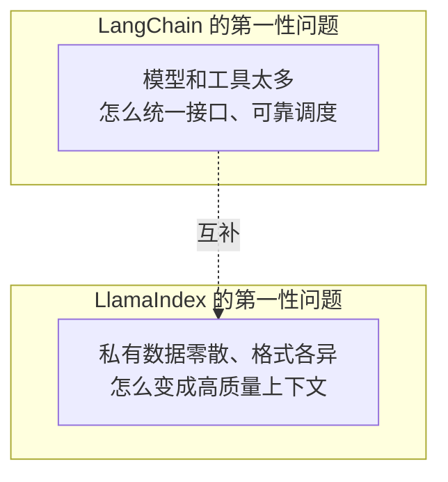
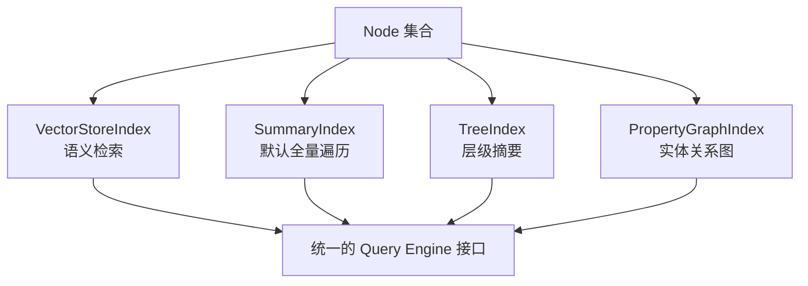

# 第十四章：LlamaIndex 的数据与索引抽象

## 14.1 先看问题定义：不是「工具怎么调度」，而是「数据怎么变上下文」

[LangChain 生态](../01-langchain/README.md) 的主要抽象是 Model / Message / Tool 的统一接口，重点放在模型如何稳定地调用工具。LlamaIndex 把问题放在更上游：模型默认并不了解私有数据，而这些数据也不是天然可检索的，因此更关注如何把 PDF、数据库、工单系统里的内容加工成模型可用的高质量上下文。

两者有大量能力重叠，也可以分工互补；这里比较的是常用抽象的侧重点，不是「LlamaIndex 只能做 RAG」或「LangChain 不擅长数据处理」的产品边界。



## 14.2 数据接入层：`Document`、`Node` 与 `IngestionPipeline`

LlamaIndex 在概念上区分「原始数据」和「可检索单元」，但它们不是互不相容的类型体系：

- **`Document`**：一份原始数据的容器，通常对应一个文件、一条数据库记录或一次 API 响应，携带 `text` 与任意 `metadata`；
- **`Node`**：索引和检索处理的单元，常见的是文本块，也可以是其他模态或直接构造的节点；`relationships` 可保存来源、前后或父子关系，但是否生成这些关系取决于解析器和配置；
- **`IngestionPipeline`**：对加载好的文档或节点应用切分、元数据抽取、Embedding 等转换；转换契约是节点序列到节点序列，不是单节点的一对一映射。缓存用于复用转换结果，文档去重和更新管理还需要 `docstore`、稳定文档 ID 及合适的更新策略。

```python
from llama_index.core import Document
from llama_index.core.ingestion import IngestionPipeline
from llama_index.core.node_parser import SentenceSplitter
from llama_index.embeddings.openai import OpenAIEmbedding

pipeline = IngestionPipeline(
    transformations=[
        SentenceSplitter(chunk_size=512, chunk_overlap=64),
        OpenAIEmbedding(),
    ],
)
nodes = pipeline.run(documents=[Document(text=raw_text, metadata={"source": "handbook.pdf"})])
```

这是摄取片段，`raw_text` 需来自实际读取结果，OpenAI Embedding 集成包与凭据需预先配置；生产增量更新还应给 Document 设置稳定 ID。

`IngestionPipeline` 的作用不只是切分文本，更重要的是把切分策略、元数据抽取和 Embedding 生成固化成可复用、可缓存的组件序列。同一份原始数据如果要更换切分策略，通常只需要替换 `transformations` 里的一步，不必重写整个摄取脚本。

对照 [LangChain 生态](../01-langchain/README.md) 的常见流水线，LlamaIndex 的 Node 关系提供了更直接的上下文扩展入口。不过，使用 `SentenceSplitter` 不代表自动获得层级父子关系；层级检索需要相应解析器、关系数据和 Retriever 配合。

## 14.3 索引抽象：从向量索引到属性图索引

`Node` 生成之后，LlamaIndex 用不同的 **Index** 类型组织它们，每种 Index 对应一种检索假设：

| Index 类型 | 组织方式 | 适合的问题 |
|---|---|---|
| `VectorStoreIndex` | 把每个 Node 的 Embedding 存进向量库 | 语义相似度检索，最常用的默认选择 |
| `SummaryIndex` | 保留 Node 顺序列表，默认把全部节点交给合成器，也可配置其他检索模式 | 需要全量覆盖的问题（如「总结全文」），需确认未启用 top-k/过滤 |
| `TreeIndex` | 自底向上构建摘要树 | 大文档的层级摘要与逐层收敛问答 |
| `KeywordTableIndex` | 从节点和查询抽取关键词，再做关键词到 Node 的匹配 | 依赖词项的查询；抽取可能调用 LLM，不等于数据库精确条件检索 |
| `PropertyGraphIndex` | 把 Node 抽取成图谱中的实体与关系 | 多跳推理、关系型问题（对应 `docs/rag` 中的 GraphRAG 章节） |



索引类型对应的是不同的检索假设，而不只是更换数据库后端。把「总结全文」这类问题交给 `VectorStoreIndex`，通常只会召回少量语义相似片段，无法得到覆盖全局的摘要；这正是 14.5 节的常见错误之一。

## 14.4 索引背后的存储解耦：`StorageContext` 与向量库无关性

LlamaIndex 用 `StorageContext` 组织存储依赖。文本向量场景常见以下三个组件，此外还有图存储、属性图存储及命名向量存储等字段：

- **`docstore`**：存 `Node` 的原始内容；
- **`index_store`**：存索引的元结构（比如 `TreeIndex` 的树形关系）；
- **`vector_store`**：存 Embedding 向量，部分实现也存文本和元数据；可选 Pinecone、Weaviate、pgvector 等已有适配器的后端，并非任意数据库都能直接替换。

```python
from llama_index.core import StorageContext, VectorStoreIndex
from llama_index.vector_stores.postgres import PGVectorStore

vector_store = PGVectorStore.from_params(
    database="ragdb",
    table_name="handbook",
    embed_dim=1536,
)
storage_context = StorageContext.from_defaults(vector_store=vector_store)
index = VectorStoreIndex(nodes, storage_context=storage_context)
```

上例是存储装配片段，需要预先配置数据库连接和扩展，且 `embed_dim` 必须与实际 Embedding 输出一致；1536 只是示例值。更换后端常能保留上层接口，但仍需迁移节点 ID、文本、元数据和向量，并验证过滤、混合检索、删除语义与得分尺度。`persist()` 也不是跨多个远程存储的原子备份：恢复时要保证 docstore、索引结构和向量集合版本一致。

## 14.5 常见错误

### 14.5.1 把 `SummaryIndex` 当成 `VectorStoreIndex` 的替代品

`SummaryIndex` 默认把列表中全部节点送入答案合成；它也支持 Embedding 等检索模式，不能说它绝对不做语义检索。默认全量路径的数据量和合成成本可能很高，换用它之前应确认问题是否需要全貌。

### 14.5.2 用向量检索回答「全局摘要」类问题

如果「总结 200 页报告」只覆盖少数相似片段，问题可能是 top-k 检索没有全局覆盖，而不是随机召回。可采用全量读取后分层合成或预先构建摘要。`SummaryIndex` 仍要选择覆盖全部节点的模式，`TreeIndex` 的分支检索也不自动保证覆盖全文。

### 14.5.3 忽视 `Node` 之间的关系，只存文本

如果切分时不保留 `relationships`，上下文窗口扩展会更困难；若保留了稳定文档 ID、块序号或字符偏移，仍可重建关联，不一定要重新解析原文。应在摄取时决定保留哪些定位信息。

### 14.5.4 认为索引选型是一次性决定

同一份数据可以同时建向量和属性图索引，并共享部分节点加工结果，但不要默认双建。属性图还需要实体关系抽取、消歧和图存储维护；只有关系问题的收益覆盖额外模型调用与更新复杂度时才值得引入。

### 14.5.5 把 `StorageContext` 的向量库无关性当作理所当然

不同向量库对元数据过滤、混合检索的支持程度不同，切换后端仍然需要重新验证过滤语法和检索质量，不是纯粹的配置项替换。

## 14.6 从「能检索」追问到「能持续更新」

假设知识库每天更新工单，线上却仍引用旧政策，先区分三个问题：源文档是否被重新读取、转换是否命中缓存、旧节点是否被删除。稳定 `doc_id` 配合文档哈希能识别更新；每次随机生成 ID 会把更新变成追加。内容哈希未变但切分器或 Embedding 模型变了，也不能只看文档去重结果，通常需要显式重建或更新索引版本。

进一步追问可以落在以下工程决策：

- **删除与权限撤销**：不能只更新来源系统；向量库、docstore、缓存及摘要/图派生数据都要失效。检索扩窗和 rerank 后仍要保留租户与文档 ACL 边界。
- **定位失败层**：分别测摄取覆盖率、召回率、重排质量和答案引用忠实度。换成属性图不一定能修复解析丢表格的问题。
- **重建成本**：用数据量、切分后节点数、Embedding 费用和增量更新窗口估算；先写新集合并校验，再切换读指针，比原地覆盖更容易回滚。

## 14.7 本章总结

1. **LlamaIndex 先解决的是「数据怎么变成高质量上下文」**，与 LangChain「模型和工具怎么统一调度」形成互补，而非替代；
2. **`Document` 是原始数据容器，`Node` 是检索处理单元**，`IngestionPipeline` 把切分、抽取、Embedding 固化成可复用流水线，加载与增量同步仍需明确配置；
3. **Index 与 Retriever 要一起选择**：向量近邻、默认全量读取、摘要树和属性图对应不同的数据组织与检索假设，并不自动保证回答质量；
4. **`StorageContext` 把存储后端与索引结构解耦**，能减少接口改动，但不能消除数据迁移与检索行为回归；
5. **同一份数据可以并存多种索引**，索引选型不是一次性、互斥的决定。

可以把 LlamaIndex 理解为一组围绕数据接入和检索构建的抽象：`Document`、`Node`、`Index` 与 `StorageContext` 分别承担原始数据、可检索单元、检索组织方式和存储解耦职责，组合后形成可替换的数据加工流水线。

## 参考资料

- [LlamaIndex 官方文档](https://developers.llamaindex.ai/python/framework/)
- [LlamaIndex: Loading Data (Ingestion Pipeline)](https://developers.llamaindex.ai/python/framework/module_guides/loading/ingestion_pipeline/)
- [LlamaIndex: Indexing 概念](https://developers.llamaindex.ai/python/framework/module_guides/indexing/)
- [LlamaIndex: 各索引的默认与可选检索方式](https://developers.llamaindex.ai/python/framework/module_guides/indexing/index_guide/)
- [LlamaIndex: Property Graph Index](https://developers.llamaindex.ai/python/framework/module_guides/indexing/lpg_index_guide/)
- [LlamaIndex: Storage 概念](https://developers.llamaindex.ai/python/framework/module_guides/storing/)

原文与图示：Polo Li，按 [CC BY 4.0](https://creativecommons.org/licenses/by/4.0/) 授权。
