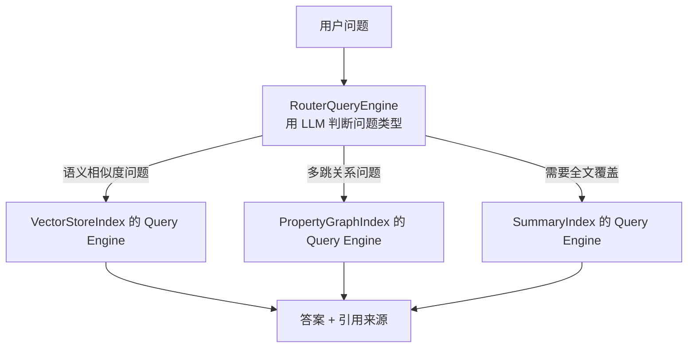
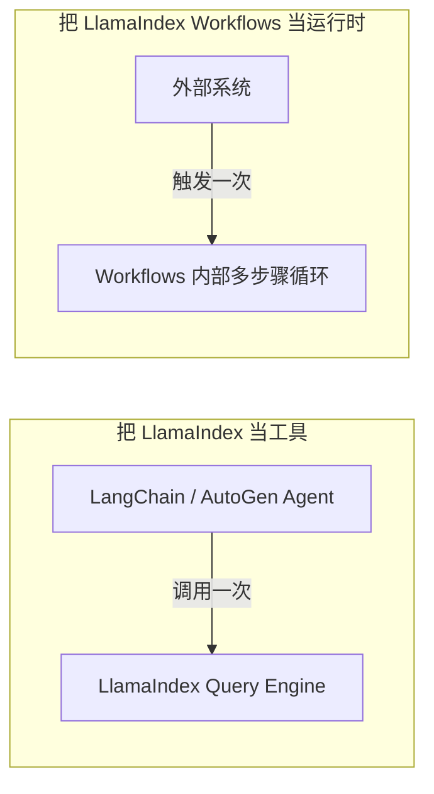

# 第十五章：LlamaIndex 的查询引擎与 Workflows 编排

## 15.1 从索引到答案：Query Engine 与 Router

第十四章讨论了「怎么把数据组织成索引」，这里继续看这些索引如何对外回答问题。每种 Index 都能生成一个 **Query Engine**，把「检索 + 组织上下文 + 调用模型生成答案」封装成统一的 `query()` 接口：

```python
query_engine = index.as_query_engine(similarity_top_k=5)
response = query_engine.query("公司差旅报销的额度上限是多少？")
```

当系统里同时存在多个索引（比如员工手册的 `VectorStoreIndex` 和财务制度的 `PropertyGraphIndex`），**`RouterQueryEngine` 负责在查询到达时先判断该走哪一条**：



Router 也会引入一次额外的 LLM 调用。它依赖描述各 Query Engine 适用场景的 `description` 做路由判断，因此描述写得越精确，路由越稳定；这也是 15.5 节常见错误之一的来源。

## 15.2 Workflows：事件驱动的编排模型

当问题不再是「查一次索引就能回答」，而是「需要多步骤、可能包含反思和重试」时，LlamaIndex 用 **Workflows** 承接这部分复杂度。这里主要涉及两个抽象：

- **`Event`**：一份携带数据的信号，标志「某个步骤的输出产生了」；
- **`@step`**：一个被装饰的方法，声明它「消费哪种 Event，产出哪种 Event」，框架根据类型签名自动把步骤串联成一张隐式的执行图。

```python
from llama_index.core.workflow import Workflow, StartEvent, StopEvent, Event, step

class RetrieveEvent(Event):
    nodes: list

class RAGWorkflow(Workflow):
    @step
    async def retrieve(self, ev: StartEvent) -> RetrieveEvent:
        nodes = await retriever.aretrieve(ev.query)
        return RetrieveEvent(nodes=nodes)

    @step
    async def synthesize(self, ev: RetrieveEvent) -> StopEvent:
        answer = await synthesizer.asynthesize(ev.nodes)
        return StopEvent(result=answer)
```

**这里没有显式的「图」定义**——步骤之间的连接关系完全由 Event 类型的生产者/消费者关系推导出来。加一个新步骤，只需要新增一个消费某个已有 Event、产出新 Event 的 `@step` 方法，不需要改动其它步骤的代码。

## 15.3 编排哲学对比：事件驱动 vs 状态图

[LangGraph](../01-langchain/04-langgraph/README.md) 用**显式状态图**表达复杂流程：开发者先定义一个共享 `State`，再显式声明节点和边，图结构在运行前就完全确定。LlamaIndex Workflows 走的是相反的路线：**没有中心化的共享状态和显式边，只有「谁消费什么 Event、产出什么 Event」的类型契约**，执行路径是隐式推导出来的。

| 维度 | LangGraph（状态图） | LlamaIndex Workflows（事件驱动） |
|---|---|---|
| **核心抽象** | 显式 `State` + 节点 + 边 | `Event` 类型 + `@step` 方法 |
| **流程可见性** | 图结构在编写时显式声明，一眼看清全貌 | 依赖类型签名推导，复杂流程需要额外画图理解 |
| **并行与分支** | 通过图的多条出边、`Send` API 显式表达 | 多个 `@step` 同时监听同一个 Event 类型即为并行 |
| **持久化与恢复** | `checkpointer` 对整个 `State`做快照，语义明确 | 依赖 `Context` 的持久化，恢复粒度是「事件流」 |
| **心智负担** | 前期需要设计好状态 Schema | 前期几乎零设计，步骤增多后才需要梳理事件流 |

两种模型对应的是「显式建模成本」和「渐进式扩展成本」之间的取舍：状态图前期投入更高，但流程更容易看清；事件驱动前期几乎不需要设计、上手更快，步骤一多就需要额外维护「谁触发了谁」这类隐性知识。这组权衡会在 [框架选型与可移植架构](../06-selection-portability/README.md) 第 22 章的统一状态模型对照表中再次出现。

## 15.4 互操作：把 LlamaIndex 当工具，还是当运行时

LlamaIndex 和 LangChain 的组合边界，[LangChain 生态 · 第七章](../01-langchain/03-ecosystem/07-langchain-vs-llamaindex.md) 已经从 LangChain 视角讲过一次（把 Query Engine 包装成 LangChain 的 `@tool`）。从 LlamaIndex 视角看，常见有两种落法：

1. **把 LlamaIndex 当「数据工具」**：只暴露 `query_engine.query()`，编排逻辑（判断何时查询、和其他工具怎么配合）全部交给外部的 Agent 框架。适合「数据侧很重、编排侧很轻」的项目。
2. **把 LlamaIndex Workflows 当「运行时」**：整个多步骤流程（检索 → 反思 → 重试 → 生成）都用 Workflows 编排，外部框架只在入口处调用一次 `workflow.run()`。适合「数据和编排都很重，且希望减少跨框架状态同步」的项目。



选择的关键在于中间状态由谁持有：如果多步骤的中间状态（检索结果、反思意见、重试次数）需要和外部 Agent 的记忆、审批流程共享，适合选方案一，把控制权交给外部框架；如果这些中间状态只在数据加工内部有意义，外部只关心最终答案，适合选方案二，以减少跨框架序列化成本。这也对应 [框架选型与可移植架构](../06-selection-portability/README.md) 中的「状态归属先于工具选择」。

## 15.5 常见错误

### 15.5.1 用一句模糊描述配置 `RouterQueryEngine`

Router 的路由准确率完全依赖每个 Query Engine 的 `description` 是否精确区分适用场景；写得含糊（比如都写「回答通用问题」），路由会退化成随机选择。

### 15.5.2 把 Workflows 当成「不需要设计」的免费午餐

步骤少的时候类型驱动确实省心；步骤超过五六个之后，「谁产出了谁需要的 Event」往往需要额外画图或写注释才能维护，不能无限制地堆叠步骤而不补充流程文档。

### 15.5.3 混淆「工具」和「运行时」两种互操作方式

在同一个项目里一半流程把 LlamaIndex 当工具调用、一半又让 Workflows 反过来调用外部 Agent，会导致状态在两个框架之间来回跳转，排查问题时不知道该看哪一边的 Trace。

### 15.5.4 忽视 Router 本身的延迟和成本

`RouterQueryEngine` 每次查询都要多一次 LLM 调用做路由判断；查询模式相对固定的场景，用规则或元数据过滤路由往往比 LLM 路由更快更省。

## 15.6 本章总结

1. **Query Engine 把「检索 + 组织上下文 + 生成答案」封装成统一接口**，`RouterQueryEngine` 在多索引场景下负责判断该走哪条路径，路由质量取决于 `description` 的精确度；
2. **Workflows 用 `Event` 类型和 `@step` 方法表达编排**，执行路径由类型的生产者/消费者关系隐式推导，不需要显式声明图结构；
3. **Workflows 与 LangGraph 是「隐式事件驱动」与「显式状态图」两种编排哲学**：前者上手快、渐进式扩展，后者前期设计成本高但流程一目了然，选择取决于团队愿意在哪个阶段投入建模成本；
4. **LlamaIndex 与其他框架的互操作有「当工具」和「当运行时」两种落法**，选择依据是中间状态该由谁持有，不能在同一项目里混用两种模式而不做取舍；
5. **Router 本身有额外的延迟和成本**，查询模式固定时应优先考虑规则路由，而不是默认使用 LLM 路由。

LlamaIndex 的编排层延续了它以数据为中心的设计：Query Engine 负责单次查询如何组织答案，Workflows 负责多步骤流程如何串联；两者都不要求开发者预先画出完整状态图，但流程复杂后需要额外维护隐性的事件依赖关系。

## 参考资料

- [LlamaIndex: Query Engine 概念](https://developers.llamaindex.ai/python/framework/module_guides/deploying/query_engine/)
- [LlamaIndex: Router Query Engine](https://developers.llamaindex.ai/python/framework/module_guides/deploying/query_engine/router_query_engine/)
- [LlamaIndex: Workflows](https://developers.llamaindex.ai/python/llamaagents/workflows/)
- [LlamaIndex: Workflows 部署为生产微服务](https://developers.llamaindex.ai/python/workflows/deployment/)
- [LangGraph 官方文档](https://docs.langchain.com/oss/python/langgraph/overview)
