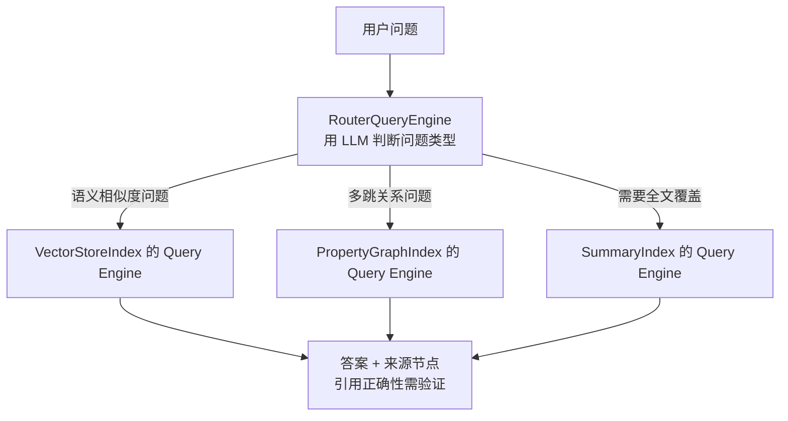
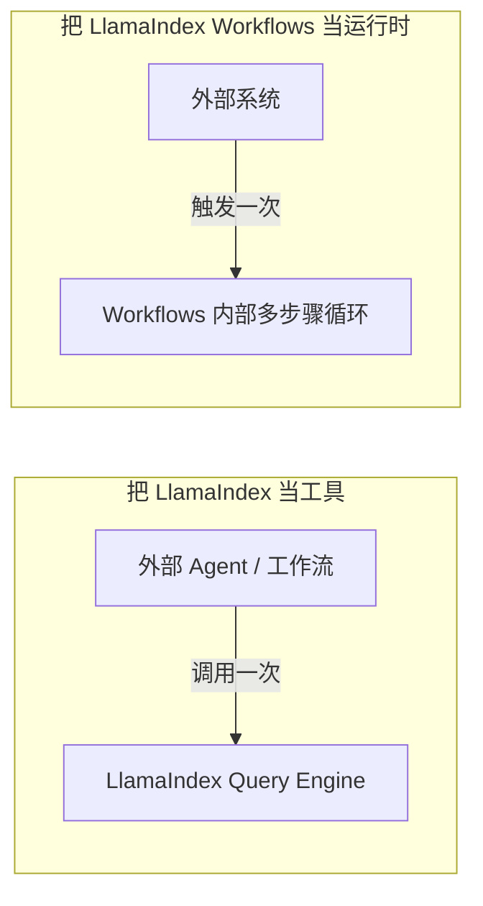

# 第十五章：LlamaIndex 的查询引擎与 Workflows 编排

## 15.1 从索引到答案：Query Engine 与 Router

第十四章讨论了「怎么把数据组织成索引」，这里继续看这些索引如何对外回答问题。每种 Index 都能生成一个 **Query Engine**，把「检索 + 组织上下文 + 调用模型生成答案」封装成统一的 `query()` 接口：

```python
query_engine = index.as_query_engine(similarity_top_k=5)
response = query_engine.query("公司差旅报销的额度上限是多少？")
```

当系统里同时存在多个索引（比如员工手册的 `VectorStoreIndex` 和财务制度的 `PropertyGraphIndex`），`RouterQueryEngine` 通过 selector 选择一个或多个 Query Engine；多选还需要汇总结果。下面画的是单选路径：



使用官方常见的 LLM/Pydantic selector 会增加模型路由开销，多选后的答案合成还可能增加调用。`description` 很重要，但路由质量也取决于模型、候选集合、问题分布和多选策略。来源节点不等于答案中每个断言都有准确引用，需要单独做引用评测。

## 15.2 Workflows：事件驱动的编排模型

当问题不再是「查一次索引就能回答」，而是「需要多步骤、可能包含反思和重试」时，LlamaIndex 用 **Workflows** 承接这部分复杂度。这里主要涉及两个抽象：

- **`Event`**：一份携带数据的信号，标志「某个步骤的输出产生了」；
- **`@step`**：一个被装饰的方法，声明它「消费哪种 Event，产出哪种 Event」，框架根据类型签名自动把步骤串联成一张隐式的执行图。

```python
from workflows import Workflow, step
from workflows.events import StartEvent, StopEvent, Event
from llama_index.core.schema import NodeWithScore

class RetrieveEvent(Event):
    query: str
    nodes: list[NodeWithScore]

class RAGWorkflow(Workflow):
    @step
    async def retrieve(self, ev: StartEvent) -> RetrieveEvent:
        nodes = await retriever.aretrieve(ev.query)
        return RetrieveEvent(query=ev.query, nodes=nodes)

    @step
    async def synthesize(self, ev: RetrieveEvent) -> StopEvent:
        answer = await synthesizer.asynthesize(query=ev.query, nodes=ev.nodes)
        return StopEvent(result=answer)

result = await RAGWorkflow(timeout=60).run(query="差旅报销上限是多少？")
```

这是异步装配片段，`retriever` 和 `synthesizer` 需由应用事先配置。当前官方独立包为 `llama-index-workflows`，导入命名空间是 `workflows`；旧代码常从 `llama_index.core.workflow` 导入，升级时要核对兼容版本。答案合成器同时需要查询和检索节点，不能只传节点列表。

步骤连接主要由 Event 类型的生产/消费关系推导，运行前能校验并可视化；`Context.send_event()` 则允许动态发送。新增消费者不等于自动把它串到旧步骤之后：若要增加 rerank，应让 retrieve 产出待重排事件、rerank 再产出合成所需事件，否则可能形成并行消费者而非预期的顺序链。

## 15.3 编排哲学对比：事件驱动 vs 状态图

[LangGraph](../01-langchain/04-langgraph/README.md) 显式声明状态通道、节点和边，但条件路由与动态发送仍在运行时决定路径。LlamaIndex Workflows 用 Event 类型表达连接，**同时提供 `Context` 和 `ctx.store` 保存共享状态**，也支持 Pydantic 类型化状态；事件驱动不等于没有状态 Schema。

| 维度 | LangGraph（状态图） | LlamaIndex Workflows（事件驱动） |
|---|---|---|
| **核心抽象** | `State` 通道 + 节点 + 边 | `Event` + `@step` + 共享 `Context` |
| **流程可见性** | 显式图及运行时路由 | 类型推导图及动态事件发送；两者都需要 Trace |
| **并行与分支** | 多出边、`Send` 与 reducer | 事件分发、worker 并发与汇合；`ctx.collect_events()` 用于手动收齐事件 |
| **持久化与恢复** | checkpointer 保存检查点，恢复语义取决于任务边界 | 序列化 Context 中的待处理事件与状态；需配置快照写入或持久化运行时 |
| **设计成本** | 状态通道、并行合并与路由 | 事件 Schema、关联 ID、汇合条件与共享状态并发更新 |

两者都需要设计并发一致性。Workflows 中多个步骤做「读取计数 → 加一 → 写回」仍会竞争，应使用 `ctx.store.edit_state()` 的原子编辑范围，并把慢速网络调用放在锁外。比较框架时，问清「并行完成如何合并、某分支失败谁取消其余工作」，比断言哪种模型天然更简单更有用。

## 15.4 互操作：把 LlamaIndex 当工具，还是当运行时

LlamaIndex 和 LangChain 的组合边界，[LangChain 生态 · 第七章](../01-langchain/03-ecosystem/07-langchain-vs-llamaindex.md) 已经从 LangChain 视角讲过一次（把 Query Engine 包装成 LangChain 的 `@tool`）。从 LlamaIndex 视角看，常见有两种落法：

1. **把 LlamaIndex 当「数据工具」**：暴露 `query_engine.query()` / `aquery()`，把顶层编排交给外部 Agent 框架。适合数据层可独立封装、外部已有编排或审批系统的项目，外部编排本身不必很轻。
2. **把 LlamaIndex Workflows 当「运行时」**：整个多步骤流程（检索 → 反思 → 重试 → 生成）都用 Workflows 编排，外部框架只在入口处调用一次 `workflow.run()`。适合「数据和编排都很重，且希望减少跨框架状态同步」的项目。



选择的关键在于中间状态由谁持有：如果多步骤的中间状态（检索结果、反思意见、重试次数）需要和外部 Agent 的记忆、审批流程共享，适合选方案一，把控制权交给外部框架；如果这些中间状态只在数据加工内部有意义，外部只关心最终答案，适合选方案二，以减少跨框架序列化成本。这也对应 [框架选型与可移植架构](../06-selection-portability/README.md) 中的「状态归属先于工具选择」。

## 15.5 常见错误

### 15.5.1 用一句模糊描述配置 `RouterQueryEngine`

候选描述都写成「回答通用问题」会失去区分信号，但不意味着输出随机。应该用有歧义、跨数据源和无匹配的问题分别测试路由，定义多选、拒答与回退策略。

### 15.5.2 把 Workflows 当成「不需要设计」的免费午餐

是否难维护不由步骤数量阈值决定。循环、动态发送与并发汇合出现后，就应记录事件关联和终止条件，避免丢事件、提前 `StopEvent` 或无限重试。

### 15.5.3 混淆「工具」和「运行时」两种互操作方式

嵌套两种方式本身可以成立，但需按业务边界明确顶层运行 ID、状态所有者、超时和取消传播；缺少这些约束时，跨框架 Trace 和重试很难对齐。

### 15.5.4 忽视 Router 本身的延迟和成本

使用 LLM selector 时要计入路由、重试及多选合成的总成本；查询模式固定时，可以在调用 Query Engine 前做规则或元数据路由，不必每次让模型选择。

### 15.5.5 把 Context 序列化当成自动可靠执行

官方 durable workflows 文档明确区分一次 `Context.to_dict()` 和持续检查点：应用必须保存快照，或使用负责持久化的运行时。恢复会重新派发待处理事件，快照时尚未完成的步骤会从头执行，语义是至少一次，不是外部操作恰好一次。

例如审批后提交报销成功、快照尚未写入就崩溃，恢复后可能再次提交。应让报销服务以业务操作 ID 去重，并记录审批版本；把 SDK 客户端、文件句柄放在资源依赖中，而不是塞进可序列化状态。进一步需要验证快照频率与重复计算成本、损坏快照回退，以及旧事件 Schema 的兼容策略。

## 15.6 本章总结

1. **Query Engine 封装查询到答案的过程**，Router 选择一个或多个引擎；描述、模型与候选覆盖共同影响路由；
2. **Workflows 用 `Event` 类型和 `@step` 方法表达编排**，执行路径由类型的生产者/消费者关系隐式推导，不需要显式声明图结构；
3. **事件驱动与状态图都需要状态和并发设计**：Workflows 有共享 Context，也能恢复运行，但需要明确检查点和副作用边界；
4. **「当工具」和「当运行时」都能互操作**，包括受控嵌套；关键是明确每层状态和恢复责任；
5. **Router 本身有额外的延迟和成本**，查询模式固定时应优先考虑规则路由，而不是默认使用 LLM 路由。

LlamaIndex 的编排层延续了它以数据为中心的设计：Query Engine 负责单次查询如何组织答案，Workflows 负责多步骤流程如何串联；两者都不要求开发者预先画出完整状态图，但流程复杂后需要额外维护隐性的事件依赖关系。

## 参考资料

- [LlamaIndex: Query Engine 概念](https://developers.llamaindex.ai/python/framework/module_guides/deploying/query_engine/)
- [LlamaIndex: Routers 与 selector](https://developers.llamaindex.ai/python/framework/module_guides/querying/router/)
- [LlamaIndex: Workflows](https://developers.llamaindex.ai/python/llamaagents/workflows/)
- [LlamaIndex: Workflows 共享状态](https://developers.llamaindex.ai/python/llamaagents/workflows/managing_state/)
- [LlamaIndex: Durable Workflows](https://developers.llamaindex.ai/python/llamaagents/workflows/durable_workflows/)
- [LlamaIndex: WorkflowServer 部署](https://developers.llamaindex.ai/python/llamaagents/workflows/deployment/)
- [LlamaIndex: BaseSynthesizer 的 query / nodes 接口](https://github.com/run-llama/llama_index/blob/main/llama-index-core/llama_index/core/response_synthesizers/base.py)
- [LangGraph 官方文档](https://docs.langchain.com/oss/python/langgraph/overview)

原文与图示：Polo Li，按 [CC BY 4.0](https://creativecommons.org/licenses/by/4.0/) 授权。
