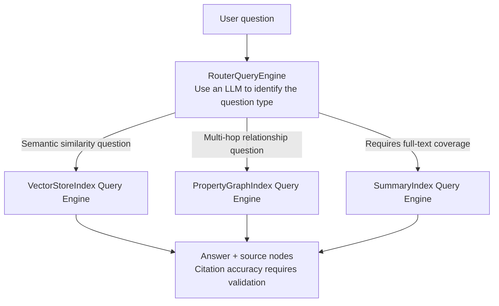
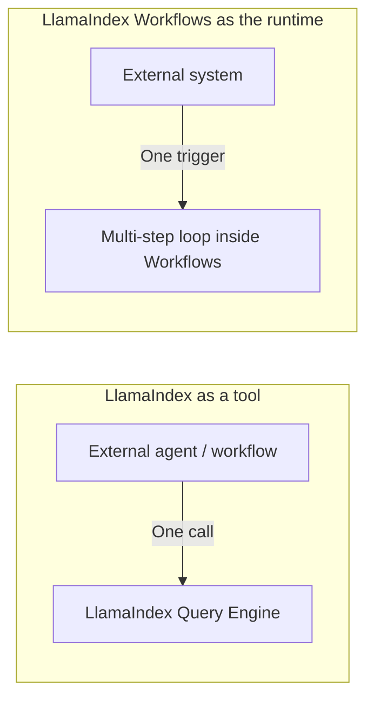

# Chapter 15: LlamaIndex Query Engines and Workflow Orchestration

## 15.1 From indexes to answers: Query Engines and Routers

Chapter 14 discussed how to organize data into indexes. Here we turn to how those indexes answer questions. Each type of Index can produce a **Query Engine**, which wraps retrieval, context assembly, and model-based answer generation behind a unified `query()` interface. The Chinese example asks for the company's travel-reimbursement limit:

```python
query_engine = index.as_query_engine(similarity_top_k=5)
response = query_engine.query("公司差旅报销的额度上限是多少？")
```

When a system has multiple indexes—for example, a `VectorStoreIndex` for the employee handbook and a `PropertyGraphIndex` for financial policies—`RouterQueryEngine` uses a selector to choose one or more Query Engines. Selecting multiple engines also requires combining their results. The diagram shows the single-selection path:



The commonly documented LLM/Pydantic selectors add model-based routing overhead; synthesizing answers after multiple selections may add further calls. `description` matters, but routing quality also depends on the model, the candidate set, the question distribution, and the multiple-selection strategy. Having source nodes does not mean every claim in the answer has an accurate citation. Citation quality needs its own evaluation.

## 15.2 Workflows: an event-driven orchestration model

When a question can no longer be answered with a single index query, but instead requires multiple steps, possibly including reflection and retries, LlamaIndex uses **Workflows** to handle that complexity. Two abstractions are central:

- **`Event`**: A data-carrying signal indicating that a step has produced an output.
- **`@step`**: A decorated method that declares which Event type it consumes and which it produces. The framework uses type signatures to connect steps into an implicit execution graph.

```python
from workflows import Workflow, step
from workflows.events import StartEvent, StopEvent, Event
from llama_index.core.schema import NodeWithScore

class RetrieveEvent(Event):
    query: str
    nodes: list[NodeWithScore]

class RAGWorkflow(Workflow):
    @step
    async def retrieve(self, ev: StartEvent) -> RetrieveEvent:
        nodes = await retriever.aretrieve(ev.query)
        return RetrieveEvent(query=ev.query, nodes=nodes)

    @step
    async def synthesize(self, ev: RetrieveEvent) -> StopEvent:
        answer = await synthesizer.asynthesize(query=ev.query, nodes=ev.nodes)
        return StopEvent(result=answer)

result = await RAGWorkflow(timeout=60).run(query="差旅报销上限是多少？")
```

This is an asynchronous assembly fragment; the application must configure `retriever` and `synthesizer` beforehand. The Chinese query again asks for the travel-reimbursement limit. The current official standalone package is `llama-index-workflows`, with the import namespace `workflows`; older code often imports from `llama_index.core.workflow`, so check compatible versions when upgrading. The response synthesizer needs both the query and the retrieved nodes, not just a list of nodes.

Connections between steps are primarily inferred from the production and consumption of Event types and can be validated and visualized before execution. `Context.send_event()` also allows dynamic dispatch. Adding a consumer does not automatically place it after an existing step: to add reranking, have retrieval produce an event awaiting reranking, then have the reranker produce the event required by synthesis. Otherwise, you may create parallel consumers rather than the intended sequential chain.

## 15.3 Comparing orchestration approaches: events versus state graphs

[LangGraph](../01-langchain/04-langgraph/README.md) explicitly declares state channels, nodes, and edges, although conditional routing and dynamic dispatch still determine the path at runtime. LlamaIndex Workflows expresses connections through Event types, **while also providing `Context` and `ctx.store` for shared state**. It supports Pydantic-typed state as well; event-driven does not mean "no state schema."

| Dimension | LangGraph: state graph | LlamaIndex Workflows: event-driven |
|---|---|---|
| **Core abstractions** | `State` channels + nodes + edges | `Event` + `@step` + shared `Context` |
| **Flow visibility** | Explicit graph and runtime routing | Type-inferred graph and dynamic event dispatch; both need traces |
| **Parallelism and branches** | Multiple outgoing edges, `Send`, and reducers | Event dispatch, worker concurrency, and joins; `ctx.collect_events()` manually gathers the required events |
| **Persistence and recovery** | A checkpointer saves checkpoints; recovery semantics depend on task boundaries | Serializes pending events and state in Context; snapshot writes or a persistent runtime must be configured |
| **Design work** | State channels, parallel merges, and routing | Event schemas, correlation IDs, join conditions, and concurrent updates to shared state |

Both require a design for consistency under concurrency. In Workflows, multiple steps performing "read the count → add one → write it back" can still race. Use the atomic editing scope provided by `ctx.store.edit_state()`, and keep slow network calls outside the lock. When comparing frameworks, asking how parallel results are merged and who cancels the remaining work if one branch fails is more useful than declaring either model inherently simpler.

## 15.4 Interoperability: LlamaIndex as a tool or as a runtime

[LangChain Ecosystem, Chapter 7](../01-langchain/03-ecosystem/07-langchain-vs-llamaindex.md) has already covered the boundary between LlamaIndex and LangChain from the LangChain side, by wrapping a Query Engine as a LangChain `@tool`. From the LlamaIndex side, two common arrangements are:

1. **LlamaIndex as a data tool**: Expose `query_engine.query()` / `aquery()` and give top-level orchestration to an external agent framework. This suits projects whose data layer can be encapsulated independently or that already have an orchestration or approval system. The external orchestration need not itself be lightweight.
2. **LlamaIndex Workflows as the runtime**: Orchestrate the entire multi-step process—retrieval → reflection → retry → generation—inside Workflows, with the external framework making a single `workflow.run()` call at the entry point. This suits projects with substantial data processing and orchestration that want to reduce cross-framework state synchronization.



The key is who owns intermediate state. If intermediate results—retrieved nodes, reflection feedback, and retry counts—must be shared with an external agent's memory or approval process, the first arrangement lets the external framework retain control. If this state matters only within data processing and the caller wants only the final answer, the second arrangement reduces cross-framework serialization costs. This is also the principle of "state ownership before tool choice" in [Framework Selection and Portable Architectures](../06-selection-portability/README.md).

## 15.5 Common mistakes

### 15.5.1 Configuring `RouterQueryEngine` with a vague description

If every candidate is described as "answers general questions," the router loses distinguishing signals, though this does not mean its output becomes random. Test routing separately with ambiguous questions, cross-source questions, and questions that match no candidate. Define policies for multiple selections, declining to answer, and fallback.

### 15.5.2 Treating Workflows as a free pass to skip design

Maintainability is not determined by a threshold on the number of steps. Once loops, dynamic dispatch, and concurrent joins appear, record event correlations and termination conditions to avoid lost events, premature `StopEvent`s, or infinite retries.

### 15.5.3 Confusing "tool" and "runtime" interoperability

Nesting the two arrangements can be valid, but business boundaries must determine the top-level run ID, state owner, timeouts, and cancellation propagation. Without these constraints, traces and retries are difficult to align across frameworks.

### 15.5.4 Ignoring the Router's own latency and cost

With an LLM selector, account for the total cost of routing, retries, and synthesis after multiple selections. For fixed query patterns, route using rules or metadata before calling the Query Engine rather than asking a model to choose every time.

### 15.5.5 Equating Context serialization with automatic reliable execution

The official durable workflows documentation explicitly distinguishes a single `Context.to_dict()` call from ongoing checkpointing: the application must save snapshots or use a runtime responsible for persistence. Recovery redispatches pending events, and a step still running when the snapshot was taken starts again from the beginning. The semantics are at-least-once, not exactly-once external operations.

For example, a reimbursement may be submitted successfully after approval, followed by a crash before the snapshot is written. Recovery may submit it again. Have the reimbursement service deduplicate requests using a business-operation ID, and record the approval version. Keep SDK clients and file handles in resource dependencies rather than serializable state. Further checks should cover snapshot frequency versus repeated computation, fallback from corrupted snapshots, and compatibility strategies for older Event schemas.

## 15.6 Chapter summary

1. **Query Engines encapsulate the path from query to answer; Routers select one or more engines.** Descriptions, the model, and candidate coverage jointly affect routing.
2. **Workflows expresses orchestration through `Event` types and `@step` methods.** Execution paths are implicitly inferred from type producer/consumer relationships, without explicitly declaring the graph structure.
3. **Event-driven systems and state graphs both require state and concurrency design.** Workflows has shared Context and can resume runs, but checkpoint and side-effect boundaries must be explicit.
4. **Both tool-level and runtime-level integration support interoperability**, including controlled nesting. The key is to define each layer's responsibility for state and recovery.
5. **The Router adds its own latency and cost.** For fixed query patterns, consider rule-based routing first rather than defaulting to LLM routing.

LlamaIndex's orchestration layer continues its data-centered design: Query Engines organize answers for individual queries, while Workflows connects multi-step processes. Neither requires developers to draw a complete state graph in advance, but complex flows still require explicit upkeep of their implicit event dependencies.

## References

- [LlamaIndex: Query Engine concepts](https://developers.llamaindex.ai/python/framework/module_guides/deploying/query_engine/)
- [LlamaIndex: Routers and selectors](https://developers.llamaindex.ai/python/framework/module_guides/querying/router/)
- [LlamaIndex: Workflows](https://developers.llamaindex.ai/python/llamaagents/workflows/)
- [LlamaIndex: Shared state in Workflows](https://developers.llamaindex.ai/python/llamaagents/workflows/managing_state/)
- [LlamaIndex: Durable Workflows](https://developers.llamaindex.ai/python/llamaagents/workflows/durable_workflows/)
- [LlamaIndex: WorkflowServer deployment](https://developers.llamaindex.ai/python/llamaagents/workflows/deployment/)
- [LlamaIndex: BaseSynthesizer query / nodes interface](https://github.com/run-llama/llama_index/blob/main/llama-index-core/llama_index/core/response_synthesizers/base.py)
- [LangGraph official documentation](https://docs.langchain.com/oss/python/langgraph/overview)
