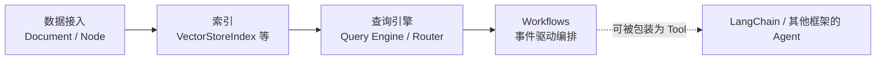

# 框架与编排 · LlamaIndex 生态

LangChain 模块把「模型与工具怎么统一调度」当成第一问题；本模块换一个第一问题：**私有数据怎么变成可以喂给模型的高质量上下文**。LlamaIndex 从数据连接、切分、索引到查询引擎和事件驱动 Workflows，构成了一条围绕「数据」而不是「工具」组织的编排链路。

## 章节

1. [第十四章：LlamaIndex 的数据与索引抽象](14-data-index-abstractions.md)
2. [第十五章：LlamaIndex 的查询引擎与 Workflows 编排](15-query-engine-workflows.md)

## 模块关系

## 阅读建议

- **先建索引再谈编排**：第十四章讲清楚数据怎么变成可检索的结构，第十五章再讲怎么用这些结构回答问题、编排成多步流程；
- **和 LangChain 对照**：两章都在正文中标注了与 `docs/frameworks/01-langchain` 对应章节的抽象差异，建议交替阅读；
- **关心状态机 vs 事件驱动的读者**：直接看第十五章 15.3 节，再跳转 [框架选型与可移植架构](../06-selection-portability/README.md) 看统一对照表。

返回 [AI 框架与编排 相关知识点](../README.md)。
