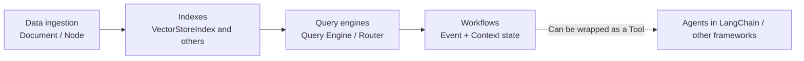

# Frameworks and Orchestration · The LlamaIndex Ecosystem

Rather than focusing primarily on unified coordination of models and tools, LlamaIndex emphasizes how private data becomes high-quality context a model can use. It connects data sources, splitting, indexing, query engines, and event-driven Workflows into a data-centered orchestration pipeline.

This is not an exclusive division of responsibilities between frameworks. The current [official Workflows documentation](https://developers.llamaindex.ai/python/llamaagents/workflows/) uses the independent `workflows` namespace and supports shared Context and typed state. Event-driven does not mean stateless, and serialization does not mean automatic recovery by default.

## Chapters

1. [Chapter 14: LlamaIndex Data and Index Abstractions](14-data-index-abstractions.md)
2. [Chapter 15: LlamaIndex Query Engines and Workflow Orchestration](15-query-engine-workflows.md)

## How the pieces fit together

## Reading suggestions

- Start with Chapter 14 to understand how data becomes a retrievable structure, then read Chapter 15 to see how those structures support answers and multi-step processes.
- To compare with LangChain, alternate between these chapters and their counterparts under `docs/frameworks/01-langchain`; both chapters point out differences in abstraction.
- If you mainly want to understand state machines versus event-driven execution, start with Section 15.3, then consult the comparison table in [Framework Selection and Portable Architectures](../06-selection-portability/README.md).
- To prepare for a technical discussion, try explaining how old nodes are removed after a document update, why a vector-store switch still requires regression testing, and how to prevent duplicate tool submissions after checkpoint recovery.

Return to [AI Frameworks and Orchestration topics](../README.md).
