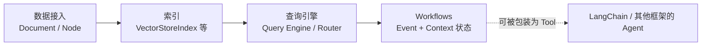

# 框架与编排 · LlamaIndex 生态

相较于把重点放在模型与工具的统一调度，LlamaIndex 更关注私有数据如何整理成模型可用的高质量上下文。它把数据连接、切分、索引、查询引擎和事件驱动 Workflows 串成一条以数据为中心的编排链路。

这不是与其他框架的排他分工。当前 [Workflows 官方文档](https://developers.llamaindex.ai/python/llamaagents/workflows/) 使用独立 `workflows` 命名空间，支持共享 Context 和类型化状态；事件驱动不等于无状态，序列化也不等于默认自动恢复。

## 章节

1. [第十四章：LlamaIndex 的数据与索引抽象](14-data-index-abstractions.zh.md)
2. [第十五章：LlamaIndex 的查询引擎与 Workflows 编排](15-query-engine-workflows.zh.md)

## 模块关系

## 阅读建议

- 建议先读第十四章，了解数据如何变成可检索结构；再读第十五章，看这些结构如何被用于回答问题和多步流程；
- 如果想和 LangChain 对照，两章正文都标注了与 `docs/frameworks/01-langchain` 对应章节的抽象差异，适合交替阅读；
- 如果主要关心状态机与事件驱动的区别，可直接看第十五章 15.3 节，再跳转 [框架选型与可移植架构](../06-selection-portability/README.zh.md) 的统一对照表。
- 准备技术讨论时，尝试解释文档更新后如何删除旧节点、为何换向量库仍需回归，以及检查点恢复后怎样防止工具重复提交。

返回 [AI 框架与编排 相关知识点](../README.zh.md)。
