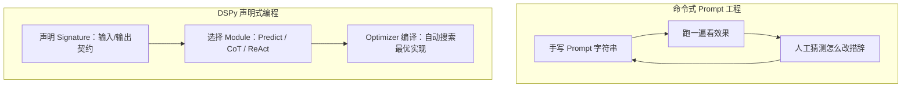

# 第十六章：DSPy 的声明式编程模型：Signature、Module 与 Program

## 16.1 命令式 Prompt 工程的天花板

[LangChain 生态](../01-langchain/README.md) 和 [LlamaIndex 生态](../02-llamaindex/README.md) 的 Prompt 本质上都是**字符串常量**：你写一段模板，塞进变量，调用模型，看输出好不好，再手工改字符串。这个循环有一个结构性问题——**Prompt 的「意图」和「具体措辞」被捆在一起**，换一个模型、换一个任务分布，之前调好的措辞可能立刻失效，而你没有系统化的方法知道该往哪个方向改。

DSPy（Declarative Self-improving Python）的出发点是把这两件事拆开：**先声明「输入是什么、输出是什么、任务目标是什么」，再让编译器决定「具体用什么措辞、要不要加示例、要不要拆成多步」**。



## 16.2 Signature：只声明契约，不声明措辞

`Signature` 是 DSPy 里最基础的声明式单元，它只描述「输入字段、输出字段、任务描述」，不包含任何具体的 Prompt 文本：

```python
import dspy

class ExtractEvent(dspy.Signature):
    """从邮件正文中抽取会议事件的关键信息。"""

    email: str = dspy.InputField()
    event_name: str = dspy.OutputField()
    date: str = dspy.OutputField(desc="ISO 8601 格式")
```

**这段代码里没有出现任何一句「你是一个擅长信息抽取的助手」之类的措辞**——`docstring` 只是任务的自然语言描述，真正发给模型的 Prompt 是由后面 16.3 节的 `Module` 在运行时动态生成的，具体格式会随编译结果变化。

> **对照 LangChain 的结构化输出**：`create_agent` 也支持用 Pydantic 模型声明输出 Schema，但那只约束「输出长什么样」；DSPy 的 Signature 同时约束输入契约和输出契约，并且这份契约会被优化器当作搜索空间的一部分，而不只是一次性的解析校验。

## 16.3 Module：把 Signature 变成可执行策略

`Signature` 只是契约，`Module` 才决定「怎么让模型完成这个契约」。DSPy 内置了几种典型策略：

| Module | 策略 | 适合场景 |
|---|---|---|
| `dspy.Predict` | 直接根据 Signature 生成一次输出 | 简单抽取、分类 |
| `dspy.ChainOfThought` | 先生成推理过程，再给出结构化输出 | 需要多步推理的问题 |
| `dspy.ReAct` | 交替生成「推理 - 行动 - 观察」，可调用工具 | 需要外部工具辅助的任务（工具契约与 [Tools 主题](../../tools/README.md) 的 Function Calling 一致） |
| `dspy.ProgramOfThought` | 生成可执行代码而不是自然语言答案 | 数值计算、结构化数据处理 |

```python
extract = dspy.ChainOfThought(ExtractEvent)
result = extract(email=inbox_message)
print(result.event_name, result.date)
```

同一个 `Signature` 换一个 `Module`，任务契约不变，但底层生成策略完全不同——**这是「关注点分离」在 DSPy 里的第一层体现**：契约和策略解耦。

## 16.4 Program：Module 的组合与状态

多个 `Module` 可以组合成一个 `Program`（在 DSPy 中体现为一个继承 `dspy.Module` 的类），组合方式和普通 Python 类完全一致：

```python
class ResearchAgent(dspy.Module):
    def __init__(self):
        super().__init__()
        self.retrieve = dspy.Retrieve(k=5)
        self.generate_answer = dspy.ChainOfThought("context, question -> answer")

    def forward(self, question):
        context = self.retrieve(question).passages
        return self.generate_answer(context=context, question=question)
```

**`forward` 里写的是普通 Python 控制流**——条件分支、循环、异常处理都可以直接用语言原生语法表达，DSPy 不要求你把控制流塞进一个专门的图 DSL。这一点和 [LangGraph](../01-langchain/04-langgraph/README.md) 形成鲜明对比：LangGraph 用显式节点和边表达控制流以换取可视化和细粒度持久化，DSPy 用普通函数调用表达控制流以换取和 Python 生态的无缝集成，但代价是**编译器只能优化它能静态发现的 `Module` 调用点，`forward` 里手写的 if/else 分支逻辑本身不在优化范围内**。

## 16.5 常见错误

### 16.5.1 把 Signature 的 docstring 当作最终 Prompt

`docstring` 只是任务描述的起点，实际发给模型的文本由 `Module` 和编译结果决定；直接在 `docstring` 里堆砌措辞技巧，既不会被编译器利用，也违背了声明式设计的初衷。

### 16.5.2 认为换个 Module 就能免费获得推理能力

`ChainOfThought` 会让模型「生成推理过程」，但推理质量仍然取决于底层模型能力和任务本身的可分解程度；把一个模型做不好的任务简单套上 `ChainOfThought`，不一定能解决准确率问题。

### 16.5.3 在 `forward` 里塞入大量不可复用的胶水逻辑

`forward` 支持任意 Python 控制流是优点，但如果把大段业务逻辑和多个模型调用硬编码在一起，会导致优化器很难定位到可复用的 `Module` 边界，间接削弱后续第十七章优化器的效果。

### 16.5.4 混淆「声明式」和「不需要写代码」

DSPy 依然需要开发者用 Python 组织 `Module`、管理数据流，声明式指的是「Prompt 措辞不需要手写」，不是「零代码」。

## 16.6 本章总结

1. **DSPy 把「任务契约」和「实现策略」拆开**：`Signature` 声明输入输出契约，`Module` 决定具体的生成策略，同一契约可以自由切换策略；
2. **`Signature` 的 docstring 只是任务描述，不是最终 Prompt**——真正的 Prompt 由 `Module` 在运行时动态生成，且会被后续的编译器优化；
3. **`Predict`、`ChainOfThought`、`ReAct`、`ProgramOfThought` 是四种典型的内置策略**，分别对应直接生成、显式推理、工具调用、代码生成四类任务形态；
4. **`Program` 用普通 Python 类和函数组合 `Module`**，控制流写法贴近原生代码，换来了和 Python 生态的无缝集成，代价是手写控制流本身不在编译器的优化范围内；
5. **这种关注点分离是第十七章「编译与优化」得以自动化的前提**——只有契约和策略解耦，优化器才能在不改变任务语义的前提下搜索更优的具体实现。

> **一句话概括：DSPy 的声明式编程不是「换一种写 Prompt 的语法糖」，而是把 Prompt 工程从「手工试错的字符串编辑」重新定义成「契约声明 + 策略选择 + 自动编译」的软件工程问题。**

## 参考资料

- [DSPy 官方文档](https://dspy.ai/)
- [DSPy: Programming——Signatures 与 Modules](https://dspy.ai/learn/programming/signatures/)
- [DSPy: Modules 概念](https://dspy.ai/learn/programming/modules/)
- [DSPy 论文：Khattab et al., "DSPy: Compiling Declarative Language Model Calls into Self-Improving Pipelines"](https://arxiv.org/abs/2310.03714)
