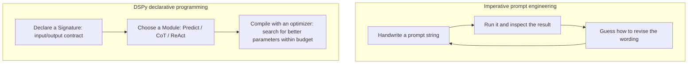

# Chapter 16: DSPy's Declarative Programming Model: Signatures, Modules, and Programs

## 16.1 The limits of imperative prompt engineering

In common uses of the [LangChain ecosystem](../01-langchain/README.md) and [LlamaIndex ecosystem](../02-llamaindex/README.md), prompts are often still **string constants**: write a template, insert variables, call the model, inspect the output, then edit the string by hand. This loop has a structural problem: **the prompt's intent is tied to its exact wording**. Change the model or task distribution, and carefully tuned wording may immediately stop working, without a systematic engineering method for deciding which adjustments to try.

DSPy (Declarative Self-improving Python) starts by separating those concerns. Declare the inputs, outputs, and task objective first, then choose modules and program structure so an optimizer can improve instructions, examples, or model weights within a specified search space. Ordinary prompt optimization does not automatically decide how many steps a business process needs; a DSPy program can also run without compilation.



## 16.2 Signature: declare fields and task instructions, not a full request template

A `Signature` describes input fields, output fields, and task instructions. Field names, `desc`, and the class docstring all affect the prompt the model receives; they are not comments unrelated to prompting:

```python
import dspy

dspy.configure(lm=dspy.LM("openai/gpt-4o-mini"))

class ExtractEvent(dspy.Signature):
    """Extract key meeting-event details from an email body."""

    email: str = dspy.InputField()
    event_name: str = dspy.OutputField()
    date: str = dspy.OutputField(desc="ISO 8601 format")
```

The example requires DSPy to be installed and credentials configured for the chosen model. It does not handwrite a complete message template: the docstring supplies initial instructions, while an Adapter assembles the signature, examples, and runtime inputs into a model request and parses the output. The optimizer can rewrite instructions or examples; the Adapter determines serialization. These are different layers.

Compared with LangChain's structured output, DSPy places more emphasis on composing multiple model calls with signatures into an optimizable program. This does not mean that an optimizer arbitrarily changes field names or types. Ordinary instruction optimization primarily changes instructions; field definitions remain an interface maintained by the developer.

## 16.3 Module: turn a signature into an executable strategy

A `Signature` is only a contract; the `Module` determines how the model is asked to fulfill it. DSPy includes several common strategies:

| Module | Strategy | Suitable use cases |
|---|---|---|
| `dspy.Predict` | Directly generates an output from the signature | Simple extraction and classification |
| `dspy.ChainOfThought` | Adds a reasoning field to the signature before producing the target fields | Problems that need explicit intermediate reasoning; this neither accesses the model's hidden reasoning nor guarantees improvement |
| `dspy.ReAct` | Selects tools, receives observations, and produces a result in a bounded loop | Tasks assisted by external tools; do not assume it is equivalent to a provider's native tool-call message protocol |
| `dspy.ProgramOfThought` | Generates and executes code, then answers using the execution result | Computations that can be formalized; requires an execution environment, resource limits, and isolation |

```python
extract = dspy.ChainOfThought(ExtractEvent)
result = extract(email=inbox_message)
print(result.event_name, result.date)
```

Changing the `Module` while keeping the same `Signature` leaves the task contract intact but changes the underlying generation strategy. **This is the first layer of separation of concerns in DSPy**: decoupling the contract from the strategy.

## 16.4 Program: module composition and state

Several modules can form a program, represented in DSPy by a class inheriting from `dspy.Module`. Composition works just as it does with ordinary Python classes:

```python
class ResearchAgent(dspy.Module):
    def __init__(self, retrieve):
        super().__init__()
        self.retrieve = retrieve
        self.generate_answer = dspy.ChainOfThought("context, question -> answer")

    def forward(self, question):
        context = self.retrieve(question)
        return self.generate_answer(context=context, question=question)
```

The injected dependency is `retrieve(question) -> list[str]`, which can connect to your own retrieval service. If you use `dspy.Retrieve`, you must also configure a retrieval backend; configuring only the LM does not make retrieval work.

`forward` uses ordinary Python control flow. Standard DSPy optimizers traverse discoverable predictors in the program and use execution traces to optimize parameters; they do not statically compile arbitrary Python. They generally do not rewrite handwritten if/else branches. Specialized code-optimization features require separate checks of their APIs, execution isolation, and test coverage. “DSPy supports optimization” does not imply that it searches over all control flow.

## 16.5 Common mistakes

### 16.5.1 Treating a signature's docstring as the final prompt

The docstring does enter the request as initial task instructions, and the optimizer may rewrite it. Make success conditions and business ambiguities clear. Do not mistake it for documentation that is never sent to the model, or fill it with wording tricks that the metric cannot validate.

### 16.5.2 Assuming a different module provides reasoning capability for free

`ChainOfThought` asks the model to generate a reasoning process, but its quality still depends on the underlying model's abilities and how decomposable the task is. Simply wrapping a task the model handles poorly in `ChainOfThought` may not solve the accuracy problem.

### 16.5.3 Filling `forward` with non-reusable glue logic

`forward` can contain ordinary business logic; length alone does not break the optimizer. Check whether the predictor to be optimized is registered as a discoverable submodule, whether execution traces call it, and whether the metric can assess its contribution. Hiding model calls inside external functions that the framework cannot trace may exclude that part from optimization.

### 16.5.4 Confusing “declarative” with “no code required”

Developers still organize modules, manage data flow, and define metrics in DSPy. Declarative programming is neither no-code nor a ban on handwritten instructions; it reduces manual coupling to complete prompt templates.

### 16.5.5 Treating compiled parameters as conversational memory

Saving a program's instructions and examples does not save a run's conversation history, retrieval cursor, or human approval state. When sharing a module on a server, do not put private user context in instance attributes. Runtime inputs, dependencies, and session storage should each serve their own purpose.

When examining program boundaries, ask: Are retrieval calls included in the end-to-end metric? Is abstention allowed when no evidence is retrieved? A parseable `date: str` does not prove that the date is valid; use an appropriate type or business validation. Then compare field accuracy, token usage, and latency between `Predict` and CoT to determine whether the additional reasoning actually helps.

## 16.6 Chapter summary

1. **DSPy separates the task contract from the implementation strategy**: a `Signature` declares the input/output contract, and a `Module` determines the generation strategy. The same contract can use different strategies.
2. **The docstring supplies initial instructions, not a complete prompt**. The Adapter assembles and parses messages; the optimizer searches parameters within its supported scope.
3. **`Predict`, `ChainOfThought`, `ReAct`, and `ProgramOfThought` are four common built-in strategies**, corresponding to direct generation, explicit reasoning, tool use, and code generation.
4. **A program composes modules using ordinary Python classes and functions**. Native control flow integrates seamlessly with the Python ecosystem, with the tradeoff that handwritten control flow itself is outside the compiler's optimization scope.
5. **This separation of concerns enables the automation discussed in Chapter 17 on compilation and optimization**. Decoupling the contract from the strategy lets the optimizer search for better implementations without changing the task's meaning.

DSPy is therefore more than another way to write prompts. It turns prompt engineering from manual string editing into a program-optimization problem: contract declaration, strategy selection, and automatic compilation.

## References

- [Official DSPy documentation](https://dspy.ai/)
- [DSPy: Class-based signatures](https://dspy.ai/getting-started/class-based-signatures/)
- [DSPy: Changing modules](https://dspy.ai/getting-started/changing-modules/)
- [DSPy paper: Khattab et al., "DSPy: Compiling Declarative Language Model Calls into Self-Improving Pipelines"](https://arxiv.org/abs/2310.03714)
