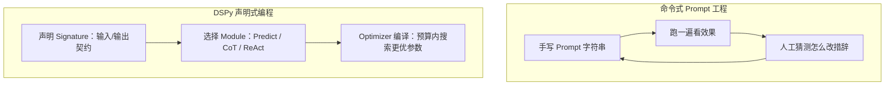

# 第十六章：DSPy 的声明式编程模型：Signature、Module 与 Program

## 16.1 命令式 Prompt 工程的天花板

[LangChain 生态](../01-langchain/README.zh.md) 和 [LlamaIndex 生态](../02-llamaindex/README.zh.md) 在常见用法里，Prompt 往往还是**字符串常量**：写一段模板，塞进变量，调用模型，看输出是否符合预期，再手工改字符串。这个循环有一个结构性问题：**Prompt 的「意图」和「具体措辞」被绑在一起**，换一个模型、换一个任务分布，之前调好的措辞可能立刻失效，而工程上也缺少系统化的方法判断该往哪个方向调整。

DSPy（Declarative Self-improving Python）的出发点是把这两件事拆开：先声明输入、输出和任务目标，再选择 Module 及程序结构，让优化器在指定搜索空间内改进指令、示例或模型权重。常规 Prompt 优化并不自动决定业务流程该拆成几步；没有编译也能运行 DSPy 程序。



## 16.2 Signature：声明字段和任务指令，而非完整请求模板

`Signature` 描述输入字段、输出字段和任务指令。字段名、`desc` 与类的 docstring 都会影响模型收到的提示，不能把它们当作与 Prompt 无关的注释：

```python
import dspy

dspy.configure(lm=dspy.LM("openai/gpt-4o-mini"))

class ExtractEvent(dspy.Signature):
    """从邮件正文中抽取会议事件的关键信息。"""

    email: str = dspy.InputField()
    event_name: str = dspy.OutputField()
    date: str = dspy.OutputField(desc="ISO 8601 格式")
```

上例需要安装 DSPy 并配置对应模型的凭据。它没有手写完整消息模板；docstring 提供初始 instructions，Adapter 将 Signature、示例和运行输入组织成模型请求并解析输出。优化器可改写指令或示例，Adapter 决定序列化方式，两者不是同一层。

对照 LangChain 的结构化输出，DSPy 更强调把多个带签名的模型调用组成可优化程序。不要据此认为优化器会任意修改字段名或类型；常规指令优化主要改 instructions，字段定义仍是开发者维护的接口。

## 16.3 Module：把 Signature 变成可执行策略

`Signature` 只是契约，`Module` 才决定「怎么让模型完成这个契约」。DSPy 内置了几种典型策略：

| Module | 策略 | 适合场景 |
|---|---|---|
| `dspy.Predict` | 直接根据 Signature 生成一次输出 | 简单抽取、分类 |
| `dspy.ChainOfThought` | 在签名中增加 reasoning 字段，再产出目标字段 | 需要显式中间推理的问题；不等于访问模型隐藏思维，也不保证提升 |
| `dspy.ReAct` | 在有界循环中选择工具、接收观察并生成结果 | 外部工具辅助任务；不应假定等同于供应商原生 tool-call 消息协议 |
| `dspy.ProgramOfThought` | 生成并执行代码，再利用执行结果回答 | 可形式化的计算；需执行环境、资源限制与隔离 |

```python
extract = dspy.ChainOfThought(ExtractEvent)
result = extract(email=inbox_message)
print(result.event_name, result.date)
```

同一个 `Signature` 换一个 `Module`，任务契约不变，但底层生成策略完全不同——**这是「关注点分离」在 DSPy 里的第一层体现**：契约和策略解耦。

## 16.4 Program：Module 的组合与状态

多个 `Module` 可以组合成一个 `Program`（在 DSPy 中体现为一个继承 `dspy.Module` 的类），组合方式和普通 Python 类完全一致：

```python
class ResearchAgent(dspy.Module):
    def __init__(self, retrieve):
        super().__init__()
        self.retrieve = retrieve
        self.generate_answer = dspy.ChainOfThought("context, question -> answer")

    def forward(self, question):
        context = self.retrieve(question)
        return self.generate_answer(context=context, question=question)
```

这里注入 `retrieve(question) -> list[str]`，可以接自己的检索服务；如果使用 `dspy.Retrieve`，还必须配置检索后端，不能只配置 LM 就假设它能检索。

`forward` 是普通 Python 控制流。常规 DSPy 优化器遍历程序中可发现的 predictors，并结合运行轨迹优化参数，不是静态编译任意 Python。通常不会改写手写 if/else；如果使用专门的代码优化能力，需要另行核对其 API、执行隔离和测试范围，不能从「DSPy 支持优化」推导出所有控制流都会被搜索。

## 16.5 常见错误

### 16.5.1 把 Signature 的 docstring 当作最终 Prompt

docstring 确实会作为初始任务指令进入请求，优化器也可能改写它。应写清成功条件和业务歧义，不要把它误认为「完全不会发送的说明」，也不要堆入无法由指标验证的措辞技巧。

### 16.5.2 认为换个 Module 就能免费获得推理能力

`ChainOfThought` 会让模型「生成推理过程」，但推理质量仍然取决于底层模型能力和任务本身的可分解程度；把一个模型做不好的任务简单套上 `ChainOfThought`，不一定能解决准确率问题。

### 16.5.3 在 `forward` 里塞入大量不可复用的胶水逻辑

`forward` 可以包含普通业务逻辑，代码长本身不会让优化器失效。需要检查的是待优化的 predictor 是否注册为可发现的子模块、是否在运行轨迹中被调用，以及指标能否评价它的贡献；把模型调用藏在框架无法追踪的外部函数里，才可能使该部分不参与优化。

### 16.5.4 混淆「声明式」和「不需要写代码」

DSPy 依然需要开发者组织 Module、管理数据流和定义指标。声明式不是零代码，也不是禁止手写指令，而是减少对完整 Prompt 模板的手工耦合。

### 16.5.5 把编译参数当作会话记忆

保存程序的指令和示例，不等于保存一次运行的对话历史、检索游标或人工审批状态。服务端共享一个 Module 时，不要把用户私有上下文写进实例属性；让运行输入、依赖和会话存储承担各自职责。

检查程序边界时可以追问：检索调用是否也被计入端到端 metric？未检索到证据时是否允许拒答？`date: str` 即使能解析，也不证明日期有效，应改用合适的类型或业务校验。再比较 `Predict` 与 CoT 的字段准确率、token 和延迟，判断多出来的 reasoning 是否真的有收益。

## 16.6 本章总结

1. **DSPy 把「任务契约」和「实现策略」拆开**：`Signature` 声明输入输出契约，`Module` 决定具体的生成策略，同一契约可以自由切换策略；
2. **docstring 是初始指令而非完整 Prompt**，Adapter 负责消息组织与解析，优化器负责其支持范围内的参数搜索；
3. **`Predict`、`ChainOfThought`、`ReAct`、`ProgramOfThought` 是四种典型的内置策略**，分别对应直接生成、显式推理、工具调用、代码生成四类任务形态；
4. **`Program` 用普通 Python 类和函数组合 `Module`**，控制流写法贴近原生代码，换来了和 Python 生态的无缝集成，代价是手写控制流本身不在编译器的优化范围内；
5. **这种关注点分离是第十七章「编译与优化」得以自动化的前提**——只有契约和策略解耦，优化器才能在不改变任务语义的前提下搜索更优的具体实现。

因此，DSPy 不是换一种 Prompt 写法，而是把 Prompt 工程从手工改字符串，转成「契约声明 + 策略选择 + 自动编译」的程序优化问题。

## 参考资料

- [DSPy 官方文档](https://dspy.ai/)
- [DSPy: Class-based signatures](https://dspy.ai/getting-started/class-based-signatures/)
- [DSPy: Changing modules](https://dspy.ai/getting-started/changing-modules/)
- [DSPy 论文：Khattab et al., "DSPy: Compiling Declarative Language Model Calls into Self-Improving Pipelines"](https://arxiv.org/abs/2310.03714)
