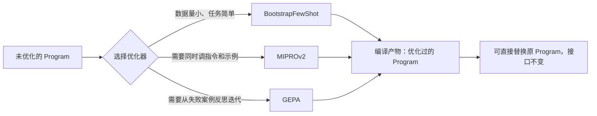

# 第十七章：DSPy 的编译器与优化器

## 17.1 从「手工调 Prompt」到「指标驱动的自动搜索」

第十六章讲的 `Signature` 和 `Module` 是可运行的基础；DSPy 的优化器在 compile 阶段利用数据和指标搜索更好的参数。Few-shot、指令和权重是不同搜索空间，只有相应优化器才会修改它们，普通 `compile()` 不等于训练模型，也不保证找到全局最优。

用抽象目标描述这个过程：给定程序参数 $\theta$、开发验证集 $D$ 和指标 $\mu$，目标是最大化下式。实际搜索受预算限制；反复参与选择的验证集不是最终独立测试集。

$$
\theta^{*} = \arg\max_{\theta} \frac{1}{|D|} \sum_{(x, y) \in D} \mu\bigl(f_\theta(x), y\bigr)
$$

这与 [评测与选型主题](../../llm/README.md) 中「能力评测指标」一章讨论的是同一套量化方法，只是在 DSPy 里它直接成为**优化目标**，而不只是事后打分工具。

## 17.2 按搜索对象选择优化器

`teleprompter` 是优化器的历史称呼。下面是常见选择，不是完整列表，也不存在固定的「Bootstrap → MIPRO → GEPA」升级顺序：

| 优化器 | 优化对象 | 核心机制 |
|---|---|---|
| `LabeledFewShot` | 已有标注示例 | 选取演示，不在编译时调用模型；适合作为低成本基线 |
| `BootstrapFewShot` | Few-shot 示例集合 | 学生或指定 teacher 运行训练样本，保留通过 metric 的轨迹，并可混合标注示例；不做指令搜索 |
| `MIPROv2` | 指令 + Few-shot 示例 | 先自举示例、生成指令候选，再用贝叶斯优化评估并选择组合；可配置零示例优化 |
| `GEPA` | 默认优化 predictor 指令 | 利用执行轨迹和文本反馈反思改写，保留在不同样本上有优势的候选并进行 Pareto 选择；不是权重训练 |
| `BootstrapFinetune` | 模型权重 | 从成功轨迹构建训练数据并微调，需要可微调 LM、训练预算与部署支持 |



这些优化器通常返回保持调用接口的程序。要使用返回值，而不是假设原对象已被原地修改。优化产物还可能含更长的示例、指令或新的模型配置，接口不变不意味着延迟和费用不变。

以下是 MIPROv2 的装配片段，假设已经配置 LM，`trainset`、`valset` 中的 `dspy.Example` 已通过 `.with_inputs("question")` 标记输入：

```python
def exact_answer(example, prediction, trace=None):
    return float(example.answer.strip() == prediction.answer.strip())

program = dspy.ChainOfThought("question -> answer")
optimizer = dspy.MIPROv2(metric=exact_answer, auto="light")
compiled = optimizer.compile(program, trainset=trainset, valset=valset)
compiled.save("optimized.json")
```

`auto` 管预算，不是自动挑优化器；MIPROv2 手动设置 `num_trials` / `num_candidates` 时应改用 `auto=None`。GEPA 的 metric 还需要兼容 `pred_name`、`pred_trace` 等参数，可以返回 `dspy.Prediction(score=..., feedback=...)`；只给标量也可用，但会失去丰富诊断反馈。GEPA 应明确设置 `reflection_lm` 或自定义 proposer，以及 `auto` / `max_metric_calls` 等预算，不能把通用三参数 metric 原封不动当成所有优化器的契约。

## 17.3 优化器与观测平台的职责差异

[LangSmith 生产质量闭环](../01-langchain/05-production/13-langsmith-production-loop.md) 覆盖 Trace、数据集和评测，不仅用于上线后，也能在开发期运行离线实验。与 DSPy 的区别不是「上线后人工」对「上线前自动」，而是观测/评测平台与程序参数优化器的职责不同。

DSPy 的评测循环发生在**编译阶段之内**，是「评测即优化」：

| 维度 | LangSmith 式可观测性 | DSPy 编译式优化 |
|---|---|---|
| **评测发生的时机** | 开发期实验和生产期监控 | 编译时反复评估，也可对程序做独立评测 |
| **谁来决定怎么改** | 平台提供证据，可接人工或自动优化流程 | 选定优化器在搜索空间内提出并选择候选 |
| **反馈闭环速度** | 取决于数据和自动化集成 | 取决于候选数、数据量、模型延迟与并发配额 |
| **可解释性** | 看 Trace、评分与实验对比 | 保留指令差异、演示、反馈和候选分数，可审计而非必然黑盒 |

**这不是互斥关系**：DSPy 优化产物也需要运行时可观测性来发现数据集未覆盖的失败模式，经过标注后再决定是否重新优化。LangSmith 还可以评测优化前后的程序，因此二者是「搜索候选」与「提供评测、运行证据」的职责分工，不是各自独占一个生命周期阶段。

## 17.4 什么时候值得引入 DSPy

编译式优化需要有代表性的输入和可信的自动反馈，不一定要求每条输入都有人工金标；执行测试、规则校验或经校准的模型评审也能提供信号。数据覆盖和指标质量比固定的「至少多少条」更关键。

| 项目特征 | 是否适合引入 DSPy |
|---|---|
| 有明确、可自动计算的评估指标（准确率、F1、结构化字段匹配等） | **适合**，指标越明确优化效果越可控 |
| 只能靠人工主观判断「答案好不好」 | **谨慎**，缺乏自动指标会让优化器退化成盲目搜索 |
| Prompt 需要频繁跨模型迁移（换供应商、换版本） | **值得试验**，对比重编译开销与人工基线；不保证必然更省 |
| 团队要求每版 Prompt 可审计 | **可以使用**，但必须保存候选、版本、数据摘要与人工批准的产物 |
| 已经有一套基于 LangChain/LlamaIndex 的生产系统 | **可以局部引入**：把某个高价值、指标明确的子任务（如信息抽取）单独用 DSPy 编译，再包装成 Tool 接入现有系统 |

## 17.5 常见错误

### 17.5.1 没有评估指标就直接上优化器

搜索方向依赖指标函数 $\mu$；如果只奖励格式合法、不判断内容，优化器可能提高指标而不改善业务质量。反复搜索会放大这种偏差，因此需要独立验收和失败类别分析。

### 17.5.2 把编译产物当成一次性的静态 Prompt 永久使用

模型更新后应先跑回归；出现分布漂移或质量退化再决定重编译。锁定模型、Adapter、DSPy 版本、程序结构与产物，才能区分「模型变了」和「优化变了」。

### 17.5.3 用训练集本身当验证集评估优化效果

`BootstrapFewShot` 之类的优化器本身就是在训练集上生成候选示例，如果验证也用同一批数据，测出来的指标会系统性偏高，看不出真实的泛化能力。

### 17.5.4 期望 DSPy 优化器解决模型能力上限问题

Prompt 搜索不能保证突破能力瓶颈；但 DSPy 也有权重优化器，不能把整个框架说成只能调措辞。先诊断是证据缺失、计算不可靠还是指标错误，再考虑检索、受限代码执行、换模型或微调。生成代码本身仍可能错，不能用 `ProgramOfThought` 代替校验与隔离。

## 17.6 优化收益如何证明

验证集参与了候选选择，继续用它报告最终收益会产生选择偏差。保留完全不参与反思和选择的测试集，按文档来源、用户或时间切分，防止同一记录的近似版本同时进入训练与测试。比较未优化程序、简单 few-shot 和优化程序，记录多次运行波动及困难类别，不只报平均分。

成本账包括学生模型执行、指令/反思模型、模型评审和工具调用。更长的 demonstrations 会在每次推理时收费，所以要同时报告编译一次的成本与线上每请求成本。搜索期间如果允许真实发送邮件或写业务库，每个候选都可能触发副作用；应使用录制数据、只读工具或测试环境。

深入追问时，应能解释：为什么某个指标提升没有换来业务收益？是否把格式合法当作事实正确？是否让模型评审偏爱更长答案？GEPA 论文的基准成绩不能直接推出你自己的任务优于强化学习；需要在相同模型、数据、预算和测试集上比较。

## 17.7 本章总结

1. **DSPy 编译可以理解为指标驱动的自动搜索**：给定 `Program`、数据集和评估指标，在预算内寻找更好的候选，不保证全局最优或测试集收益；
2. **优化器按搜索对象与反馈选择，而不是按名称升级**：自举示例、联合指令/示例搜索、反思优化和权重训练有不同成本；
3. **编译产物通常保持调用接口**，上线仍需检查模型配置、延迟、费用和回归质量；
4. **优化器与可观测性平台互补**，前者搜索候选，后者提供实验和运行证据；
5. **可信指标、代表性数据与独立测试集缺一不可**，否则优化器可能只学会迎合评分；
6. **收益要连同编译、推理和运维成本评估**，Prompt 优化不是所有质量问题的解法。

## 参考资料

- [DSPy: 选择优化器](https://dspy.ai/diving-deeper/choosing-an-optimizer/)
- [DSPy: MIPROv2 API 与三阶段机制](https://dspy.ai/api/optimizers/MIPROv2/)
- [DSPy: GEPA API 与反馈契约](https://dspy.ai/api/optimizers/GEPA/overview/)
- [DSPy: GEPA 优化教程](https://dspy.ai/getting-started/gepa-optimization/)
- [DSPy 论文：Khattab et al., "DSPy: Compiling Declarative Language Model Calls into Self-Improving Pipelines"](https://arxiv.org/abs/2310.03714)
- [GEPA 论文：Agrawal et al., "GEPA: Reflective Prompt Evolution Can Outperform Reinforcement Learning"](https://arxiv.org/abs/2507.19457)
- [LangSmith 官方文档](https://docs.smith.langchain.com/)
