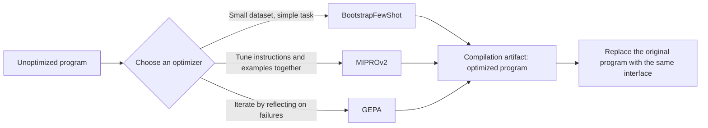

# Chapter 17: DSPy's Compiler and Optimizers

## 17.1 From manual prompt tuning to metric-driven search

The signatures and modules in Chapter 16 provide a runnable foundation. During compilation, DSPy optimizers use data and metrics to search for better parameters. Few-shot examples, instructions, and weights are different search spaces, changed only by the corresponding optimizers. An ordinary `compile()` call is not equivalent to model training and does not guarantee a global optimum.

An abstract objective captures this process: given program parameters $\theta$, a development validation set $D$, and a metric $\mu$, maximize the expression below. Actual search is budget-constrained; a validation set repeatedly used for selection is not an independent final test set.

$$
\theta^{*} = \arg\max_{\theta} \frac{1}{|D|} \sum_{(x, y) \in D} \mu\bigl(f_\theta(x), y\bigr)
$$

This is the same quantitative approach discussed in the chapter on capability evaluation metrics in the [evaluation and model selection topic](../../llm/README.md). In DSPy, however, it directly becomes the **optimization objective**, rather than merely a scoring tool used afterward.

## 17.2 Choose an optimizer by what it searches

`teleprompter` is the historical name for an optimizer. The following are common options, not an exhaustive list. There is no fixed “Bootstrap → MIPRO → GEPA” upgrade path:

| Optimizer | Optimization target | Core mechanism |
|---|---|---|
| `LabeledFewShot` | Existing labeled examples | Selects demonstrations without model calls during compilation; useful as a low-cost baseline |
| `BootstrapFewShot` | Few-shot example sets | Runs training examples through the student or a specified teacher, keeps traces that pass the metric, and can mix in labeled examples; does not search instructions |
| `MIPROv2` | Instructions + few-shot examples | Bootstraps examples and proposes instructions, then uses Bayesian optimization to evaluate and select combinations; can be configured for zero-shot optimization |
| `GEPA` | Predictor instructions by default | Reflects on execution traces and textual feedback to propose revisions, retaining candidates with advantages on different examples and using Pareto selection; not weight training |
| `BootstrapFinetune` | Model weights | Builds training data from successful traces and fine-tunes; requires a fine-tunable LM, training budget, and deployment support |



These optimizers usually return a program with the same calling interface. Use the returned value rather than assuming the original object was modified in place. The artifact may contain longer examples, longer instructions, or a new model configuration. An unchanged interface does not imply unchanged latency or cost.

The following MIPROv2 setup assumes that an LM is configured and the `dspy.Example` objects in `trainset` and `valset` have their inputs marked with `.with_inputs("question")`:

```python
def exact_answer(example, prediction, trace=None):
    return float(example.answer.strip() == prediction.answer.strip())

program = dspy.ChainOfThought("question -> answer")
optimizer = dspy.MIPROv2(metric=exact_answer, auto="light")
compiled = optimizer.compile(program, trainset=trainset, valset=valset)
compiled.save("optimized.json")
```

`auto` controls the budget; it does not choose the optimizer. When setting MIPROv2's `num_trials` / `num_candidates` manually, use `auto=None`. GEPA's metric must also accept parameters such as `pred_name` and `pred_trace`, and can return `dspy.Prediction(score=..., feedback=...)`. A scalar score also works, but loses rich diagnostic feedback. Explicitly configure GEPA's `reflection_lm` or a custom proposer and a budget such as `auto` / `max_metric_calls`. Do not assume that the same three-argument metric works unchanged with every optimizer.

## 17.3 How optimizers and observability platforms differ

The [LangSmith production quality feedback loop](../01-langchain/05-production/13-langsmith-production-loop.md) covers traces, datasets, and evaluation. It is not limited to post-release use; it can also run offline experiments during development. The distinction from DSPy is not “manual after release” versus “automatic before release.” It is the difference between an observability/evaluation platform and a program-parameter optimizer.

DSPy's evaluation loop runs **inside compilation**: evaluation drives optimization.

| Dimension | LangSmith-style observability | DSPy compilation-based optimization |
|---|---|---|
| **When evaluation occurs** | Development experiments and production monitoring | Repeated evaluation during compilation; programs can also be evaluated independently |
| **Who decides what to change** | The platform supplies evidence and can connect to manual or automated optimization | The selected optimizer proposes and selects candidates within its search space |
| **Feedback-loop speed** | Depends on data and automation integration | Depends on candidate count, dataset size, model latency, and concurrency quotas |
| **Interpretability** | Inspect traces, scores, and experiment comparisons | Retain instruction diffs, demonstrations, feedback, and candidate scores; the process can be audited and need not be a black box |

**These roles are not mutually exclusive**. DSPy artifacts still need runtime observability to discover failure modes missing from the dataset; label those failures before deciding whether to optimize again. LangSmith can also evaluate programs before and after optimization. The division of responsibilities is between searching candidates and providing evaluation/runtime evidence, not between exclusive lifecycle stages.

## 17.4 When is DSPy worth introducing?

Compilation-based optimization needs representative inputs and trustworthy automated feedback, not necessarily a human gold label for every input. Execution tests, rule checks, or calibrated model judging can also supply signals. Data coverage and metric quality matter more than a fixed minimum example count.

| Project characteristic | Is DSPy a good fit? |
|---|---|
| Clear, automatically computable metrics such as accuracy, F1, or structured-field matching | **A good fit**: clearer metrics make optimization outcomes easier to control |
| Answer quality can only be judged subjectively by people | **Use caution**: without automated metrics, optimization becomes unguided search |
| Prompts frequently move between models, providers, or versions | **Worth testing**: compare recompilation cost with a manually tuned baseline; savings are not guaranteed |
| The team needs every prompt version to be auditable | **Possible**, but retain candidates, versions, dataset summaries, and human-approved artifacts |
| A LangChain/LlamaIndex production system already exists | **Introduce it selectively**: compile a high-value subtask with clear metrics, such as information extraction, using DSPy, then wrap it as a tool in the existing system |

## 17.5 Common mistakes

### 17.5.1 Introducing an optimizer without an evaluation metric

The search direction depends on the metric function $\mu$. If it rewards valid formatting without judging content, the optimizer may improve the score without improving business quality. Repeated search amplifies this bias, so independent acceptance checks and analysis by failure category are necessary.

### 17.5.2 Keeping a compiled artifact forever as a one-off static prompt

Run regression tests after a model update, then decide whether distribution drift or quality degradation warrants recompilation. Pin the model, Adapter, DSPy version, program structure, and artifact so that a change in the model can be distinguished from a change in optimization.

### 17.5.3 Using the training set as the validation set

Optimizers such as `BootstrapFewShot` generate candidate examples from the training set. Validating on the same data systematically inflates measured performance and hides actual generalization ability.

### 17.5.4 Expecting DSPy optimizers to remove model capability limits

Prompt search cannot guarantee a breakthrough in model capability. However, DSPy also has weight optimizers, so it is wrong to describe the entire framework as only tuning wording. Diagnose whether the problem is missing evidence, unreliable computation, or an incorrect metric before considering retrieval, restricted code execution, a different model, or fine-tuning. Generated code can still be wrong; `ProgramOfThought` does not replace validation and isolation.

## 17.6 How do you demonstrate optimization gains?

Because the validation set participates in candidate selection, reporting final gains on it introduces selection bias. Keep a test set completely excluded from reflection and selection. Split by document source, user, or time to prevent near-duplicates of the same record from entering both training and testing. Compare the unoptimized program, a simple few-shot baseline, and the optimized program, recording variation across runs and difficult categories rather than only a mean score.

The cost calculation includes student-model execution, instruction/reflection models, model judging, and tool calls. Longer demonstrations add cost to every inference request, so report both the one-time compilation cost and the per-request production cost. If search can send real emails or write to business databases, every candidate may cause side effects. Use recorded data, read-only tools, or test environments instead.

For deeper follow-up questions, be ready to explain why a metric improvement did not produce business gains. Was valid formatting mistaken for factual correctness? Did the model judge prefer longer answers? Benchmark results in the GEPA paper do not establish that it will outperform reinforcement learning on your own task; compare using the same model, data, budget, and test set.

## 17.7 Chapter summary

1. **DSPy compilation can be understood as metric-driven automatic search**: given a program, dataset, and evaluation metric, search for better candidates within budget, without guarantees of a global optimum or test-set gains.
2. **Choose optimizers by search target and feedback, not as a sequence of names to upgrade through**. Bootstrapped examples, joint instruction/example search, reflective optimization, and weight training have different costs.
3. **Compiled artifacts usually keep the calling interface**, but deployment still requires checks of model configuration, latency, cost, and regression quality.
4. **Optimizers and observability platforms complement each other**: one searches candidates; the other supplies experimental and runtime evidence.
5. **Trustworthy metrics, representative data, and an independent test set are all essential**. Otherwise, the optimizer may merely learn to satisfy the scoring system.
6. **Assess gains alongside compilation, inference, and operational costs**. Prompt optimization does not solve every quality problem.

## References

- [DSPy: Choosing an optimizer](https://dspy.ai/diving-deeper/choosing-an-optimizer/)
- [DSPy: MIPROv2 API and its three-stage mechanism](https://dspy.ai/api/optimizers/MIPROv2/)
- [DSPy: GEPA API and feedback contract](https://dspy.ai/api/optimizers/GEPA/overview/)
- [DSPy: GEPA optimization tutorial](https://dspy.ai/getting-started/gepa-optimization/)
- [DSPy paper: Khattab et al., "DSPy: Compiling Declarative Language Model Calls into Self-Improving Pipelines"](https://arxiv.org/abs/2310.03714)
- [GEPA paper: Agrawal et al., "GEPA: Reflective Prompt Evolution Can Outperform Reinforcement Learning"](https://arxiv.org/abs/2507.19457)
- [Official LangSmith documentation](https://docs.smith.langchain.com/)
