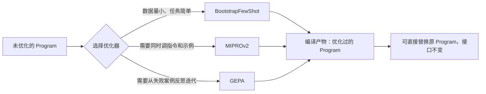

# 第十七章：DSPy 的编译器与优化器

## 17.1 从「手工调 Prompt」到「指标驱动的自动搜索」

第十六章讲的 `Signature` 和 `Module` 只是声明式编程的前半段；DSPy 的关键能力在**编译**阶段——给定一个 `Program`、一个训练/验证数据集和一个评估指标，编译器会自动搜索能让指标最优的具体实现（Few-shot 示例、Prompt 措辞，甚至更新底层模型权重），而不需要人工反复试错。

用一个不涉及具体实现细节的抽象目标来描述这个过程：给定程序参数 $\theta$（可以是 few-shot 示例集合、指令措辞、也可以是模型权重）、验证集 $D$ 和评估指标 $\mu$，编译器求解

$$
\theta^{*} = \arg\max_{\theta} \frac{1}{|D|} \sum_{(x, y) \in D} \mu\bigl(f_\theta(x), y\bigr)
$$

这与 [评测与选型主题](../../llm/README.md) 中「能力评测指标」一章讨论的是同一套量化方法，只是在 DSPy 里它直接成为**优化目标**，而不只是事后打分工具。

## 17.2 三类优化器：从少样本引导到跨模型迁移

DSPy 提供的优化器（`teleprompter`）大体分三类，复杂度和适用场景依次递进：

| 优化器 | 优化对象 | 核心机制 |
|---|---|---|
| `BootstrapFewShot` | Few-shot 示例集合 | 用当前 `Program` 自己在训练集上生成候选推理轨迹，保留通过指标校验的轨迹作为示例 |
| `MIPROv2` | 指令措辞 + Few-shot 示例 | 先用贝叶斯搜索联合优化指令与示例组合，再在验证集上评估候选组合 |
| `GEPA` | 指令措辞（基于反思的进化搜索） | 让模型对失败样本做自然语言反思，把反思结果变异为新指令，通过评估结果做进化式筛选，比传统贝叶斯搜索更依赖失败案例的语义分析 |

编译产物替换原 `Program` 时，调用方代码通常不需要修改。`compiled_program = optimizer.compile(program, trainset=trainset)` 之后，`compiled_program` 和 `program` 暴露的调用接口是一致的，优化只发生在内部的 Prompt 和示例上。

## 17.3 评测与优化的一体化：和 LangSmith 式可观测性的差异

[LangSmith 生产质量闭环](../01-langchain/05-production/13-langsmith-production-loop.md) 描述的是一种**事后回路**：先上线，采集 Trace 和生产反馈，离线组建 Dataset，人工或半自动分析后再改 Prompt，本质上是「观测 → 人工决策 → 修改」。

DSPy 的评测循环发生在**编译阶段之内**，是「评测即优化」：

| 维度 | LangSmith 式可观测性 | DSPy 编译式优化 |
|---|---|---|
| **评测发生的时机** | 上线后持续采集、离线复盘 | 编译时对训练/验证集反复评估 |
| **谁来决定怎么改** | 工程师根据 Trace 和评估结果人工调整 Prompt | 优化器根据指标自动搜索 Prompt/示例组合 |
| **反馈闭环速度** | 依赖生产流量积累和人工分析节奏 | 只要有标注数据和指标，可以在开发阶段快速迭代 |
| **可解释性** | Trace 直接可读，容易定位具体失败点 | 编译过程是搜索式黑盒，需要额外记录候选方案对比 |

**这不是互斥关系**：即使用 DSPy 编译出了一版 `Program`，生产环境依然需要 LangSmith、OpenTelemetry 之类的运行时可观测性来发现「训练集没覆盖到的失败模式」，再把这些新失败样本补回 DSPy 的训练集重新编译——两者分别覆盖「开发期离线优化」和「生产期在线监控」两个不同阶段。

## 17.4 什么时候值得引入 DSPy

编译式优化不是免费的：它要求你有**结构化的评估指标**和**一定规模的标注数据**，还要接受「优化器在搜索什么」不总是完全透明。

| 项目特征 | 是否适合引入 DSPy |
|---|---|
| 有明确、可自动计算的评估指标（准确率、F1、结构化字段匹配等） | **适合**，指标越明确优化效果越可控 |
| 只能靠人工主观判断「答案好不好」 | **谨慎**，缺乏自动指标会让优化器退化成盲目搜索 |
| Prompt 需要频繁跨模型迁移（换供应商、换版本） | **适合**，重新编译比人工重写全部 Prompt 更省成本 |
| 团队更看重「Prompt 每一个字都可解释、可审计」 | **谨慎**，编译产物的具体措辞是搜索出来的，可解释性弱于手写 Prompt |
| 已经有一套基于 LangChain/LlamaIndex 的生产系统 | **可以局部引入**：把某个高价值、指标明确的子任务（如信息抽取）单独用 DSPy 编译，再包装成 Tool 接入现有系统 |

## 17.5 常见错误

### 17.5.1 没有评估指标就直接上优化器

优化器的搜索完全依赖指标函数 $\mu$ 的质量；指标定义得粗糙（比如只判断输出格式是否合法，不判断内容是否正确），优化器会精确地把 Prompt 优化到「擅长骗过这个粗糙指标」，而不是真正解决任务。

### 17.5.2 把编译产物当成一次性的静态 Prompt 永久使用

模型供应商更新底层模型后，之前编译出的 Few-shot 示例和措辞不一定还是最优的，需要重新触发编译，而不是把编译产物当成写死的常量。

### 17.5.3 用训练集本身当验证集评估优化效果

`BootstrapFewShot` 之类的优化器本身就是在训练集上生成候选示例，如果验证也用同一批数据，测出来的指标会系统性偏高，看不出真实的泛化能力。

### 17.5.4 期望 DSPy 优化器解决模型能力上限问题

优化器只能在给定模型的能力范围内搜索更好的 Prompt 和示例组合，模型本身做不到的推理（比如复杂数值计算），换多少种 Prompt 措辞也解决不了，这类问题应该交给 `ProgramOfThought` 生成代码执行，而不是继续加大搜索预算。

## 17.6 本章总结

1. **DSPy 编译可以理解为指标驱动的自动搜索**：给定 `Program`、数据集和评估指标，优化器搜索能让指标最优的具体实现；
2. **`BootstrapFewShot`、`MIPROv2`、`GEPA` 代表复杂度递增的三类策略**：分别是自举示例、联合搜索指令与示例、基于失败反思的进化搜索；
3. **编译产物与原 `Program` 接口一致**，可以无缝替换，优化只发生在内部实现上；
4. **DSPy 的「评测即优化」和 LangSmith 式的「观测后人工决策」是两个不同阶段的能力，互补而非互斥**；
5. **引入 DSPy 的前提是有明确的评估指标和一定规模的标注数据**，缺乏这两者时优化器容易退化成盲目搜索甚至过拟合指标本身；
6. **DSPy 解决不了模型能力上限问题**，它只能在给定模型能力范围内寻找更好的 Prompt 表达方式。

## 参考资料

- [DSPy: Optimizers 概念](https://dspy.ai/learn/optimization/optimizers/)
- [DSPy: GEPA 优化教程](https://dspy.ai/getting-started/gepa-optimization/)
- [DSPy 论文：Khattab et al., "DSPy: Compiling Declarative Language Model Calls into Self-Improving Pipelines"](https://arxiv.org/abs/2310.03714)
- [GEPA 论文：Agrawal et al., "GEPA: Reflective Prompt Evolution Can Outperform Reinforcement Learning"](https://arxiv.org/abs/2507.19457)
- [LangSmith 官方文档](https://docs.smith.langchain.com/)
