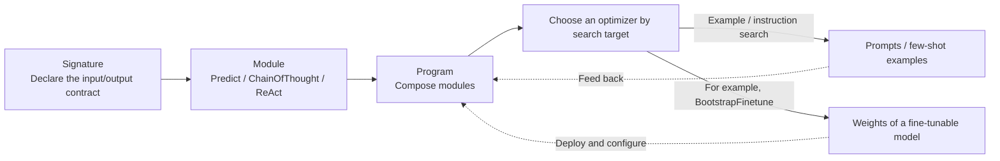

# Frameworks and Orchestration · Declarative Optimization with DSPy

DSPy treats instructions, examples, or trainable model parameters as optimization targets within a program. Signatures and modules first form a runnable program; developers then choose an optimizer, data, metrics, and a budget. This does not eliminate handwritten task instructions, program-structure design, or independent testing.

## Chapters

1. [Chapter 16: DSPy's Declarative Programming Model: Signatures, Modules, and Programs](16-declarative-programming-model.md)
2. [Chapter 17: DSPy's Compiler and Optimizers](17-compiler-and-optimizers.md)

## How the components fit together

## Reading suggestions

- Start with Chapter 16 to understand how signatures, modules, and programs separate “what to do” from “how to do it.” Then read Chapter 17 to see how compilation uses that separation to search automatically for better implementations.
- To compare with LangChain and LlamaIndex, these chapters discuss how DSPy's evaluation loop differs from LangSmith-style observability. Read [LangChain Ecosystem · Production Feedback Loops](../01-langchain/05-production/README.md) first, then return to make the comparison.
- If your main question is whether DSPy is worth adopting, go directly to Chapter 17, Section 17.4, then compare with [Framework Selection and Portable Architecture](../06-selection-portability/README.md).
- Read alongside the [official optimizer guide](https://dspy.ai/diving-deeper/choosing-an-optimizer/). Understanding why GEPA needs meaningful feedback, why a validation set cannot serve as the final test set, and whether compilation makes each inference request more expensive matters more than memorizing optimizer names.

Back to [AI Frameworks and Orchestration](../README.md).
