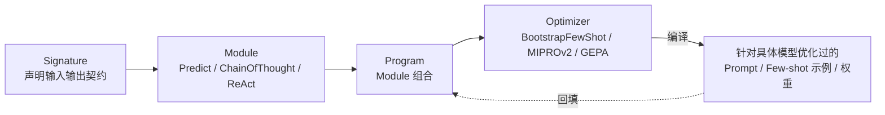

# 框架与编排 · DSPy 声明式优化

LangChain 和 LlamaIndex 都还是「写死一个 Prompt，手工调参」的编程范式：Prompt 是字符串常量，改进方式是人工试错。DSPy 换了一种编程模型——**把 Prompt 变成程序里的一个可优化对象**，用「声明式签名 + 编译器」代替手写 Prompt，用「指标驱动的优化器」代替人工调参。

## 章节

1. [第十六章：DSPy 的声明式编程模型：Signature、Module 与 Program](16-declarative-programming-model.md)
2. [第十七章：DSPy 的编译器与优化器](17-compiler-and-optimizers.md)

## 模块关系

## 阅读建议

- **先理解「声明式」再理解「编译」**：第十六章讲清楚 Signature/Module/Program 怎么把「做什么」和「怎么做」分开，第十七章再讲编译器怎么利用这种分离自动搜索最优实现；
- **和 LangChain/LlamaIndex 对照**：两章都会标注 DSPy 的评测循环与 LangSmith 式可观测性的差异，建议先读过 [LangChain 生态 · 生产闭环](../01-langchain/05-production/README.md) 再来对比；
- **只关心该不该引入 DSPy**：可直接跳到第十七章 17.4 节，再看 [框架选型与可移植架构](../06-selection-portability/README.md)。

返回 [AI 框架与编排 相关知识点](../README.md)。
